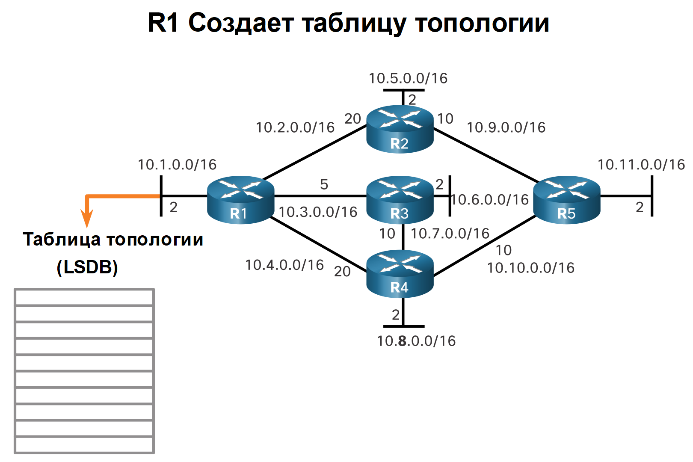
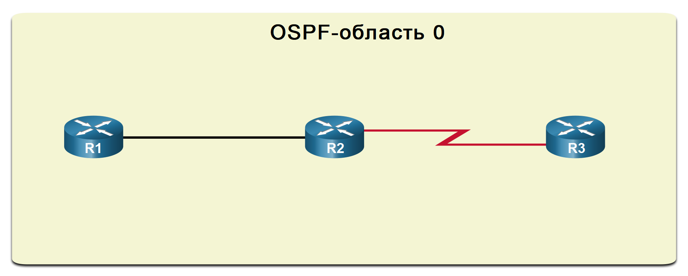
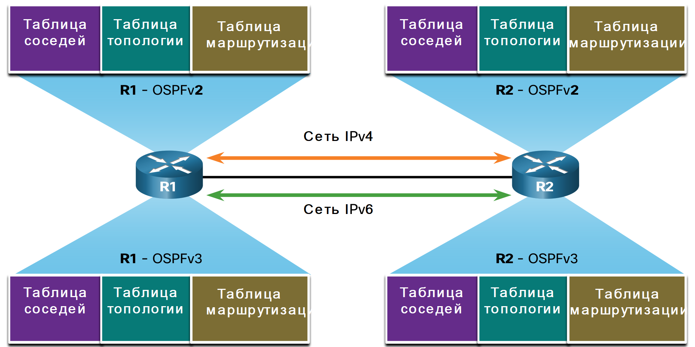

<!-- 1.1.1 -->
## Введение в OSPF

В этом разделе содержится краткий обзор OSPF (Open Shortest Path First), который включает в себя одну или несколько областей. OSPFv2 используется для сетей IPv4. OSPFv3 – для сетей IPv6. Основной целью этого модуля является обзор OSPFv2 для одной области.

**OSPF** — это протокол маршрутизации по состоянию каналов, разработанный в качестве альтернативы протоколу на базе векторов расстояния RIP, который был приемлемым на начальных этапах развития сетевых технологий и Интернета. Однако использование протоколом RIP числа переходов как единственной метрики для определения оптимального маршрута в скором времени привело к ряду трудностей. Так, возможности масштабирования больших сетей, содержащих несколько путей с различными скоростями, ограничены. Протокол OSPF имеет ряд преимуществ, обеспечивая более быстрое совмещение и возможность масштабирования в целях реализации сетей большего размера.

OSPF является бесклассовым протоколом маршрутизации, использующим концепцию разделения на области в целях масштабируемости. Администратор сети может разделить домен маршрутизации на отдельные части, которые помогают управлять трафиком обновления маршрутизации. **Канал** — это интерфейс роутера. Он также представляет собой сегмент сети, который соединяет два роутера или заглушающую сеть, такую как Ethernet LAN, которая подключена к одному роутеру. Данные о состоянии этих каналов также называются состоянием канала. Вся информация о состоянии канала включает префикс сети, длину префикса и стоимость.

В рамках данной главы рассматриваются основные конфигурации и реализации OSPF для одной области.

<!-- 1.1.2 -->
## Компоненты протокола OSPF

Все протоколы маршрутизации используют аналогичные компоненты и сообщения для обмена данными. Сообщения позволяют выстраивать структуры данных, которые впоследствии обрабатываются посредством алгоритма маршрутизации.

**Сообщения протокола маршрутизации**

Устройства третьего уровня (такие, как роутеры) применяют сообщения обмена OSPF для переноса информации о маршрутах с использованием пяти типов пакетов:

* пакет приветствия (hello);
* пакет описания базы данных;
* пакет состояния канала;
* пакет обновления состояния канала;
* пакет подтверждения состояния канала.

Эти пакеты используются для обнаружения соседних роутеров, а также для обмена данными маршрутизации для предоставления точных данных о сети.

<!-- /courses/ensa-dl/ae8cded0-34fd-11eb-ba19-f1886492e0e4/aeb2dd60-34fd-11eb-ba19-f1886492e0e4/assets/c570bd90-1c46-11ea-af56-e368b99e9723.svg -->

**Структуры данных**

Сообщения OSPF используются для создания и обслуживания трех баз данных.

* **База данных смежности** — создает таблицу соседних устройств.
* **База данных на основе состояния канала (LSDB)** — создает таблицу топологии.
* **База данных пересылки** — создает таблицу маршрутизации.

Эти таблицы содержат список соседних роутеров, между которыми выполняется обмен данными маршрутизации. Таблицы хранятся в оперативной памяти. Ниже +обратите особое внимание на команду, используемую для отображения каждой таблицы.

| Тип базы данных | Вид таблицы | Описание |
| --- | --- | --- |
| База данных смежности | Таблица соседей | <ul><li>Список всех соседних роутеров, с которыми установлен двусторонний обмен данными </li><li>Для каждого роутера существует уникальная таблица, ее можно просмотреть с помощью команды **show ip ospf neighbor** </li></ul> |
| База данных состояний каналов | Таблица топологии | <ul><li>Содержит данные обо всех роутерах в сети </li><li>Представляет топологию сети</li><li>Все роутеры в области используют идентичные базы данных состояний каналов (LSDB), которые можно просмотреть с помощью команды **show ip ospf database** </li></ul> |
| База данных пересылки | Таблица маршрутизации | <ul><li>Содержит данные о маршрутах, созданных при запуске алгоритма в базе данных состояний каналов </li><li>Таблица маршрутизации каждого роутера уникальна и содержит информацию о том, как и где отправлять пакеты другим роутерам </li><li>Маршруты можно просмотреть с помощью команды **show ip route** </li></ul> |

**Алгоритм**

Роутер формирует таблицу топологии с использованием результатов вычислений, основанных на алгоритме кратчайшего пути (SPF) – дейкстры. Алгоритм поиска кратчайшего пути основывается на данных о совокупной стоимости доступа к точке назначения.

Этот алгоритм создаёт дерево кратчайших путей SPF, размещая каждый роутер в корне дерева и рассчитывая кратчайшие пут к каждому из узлов. После чего дерево кратчайших путей SPF используется для расчёта оптимальных маршрутов. Протокол OSPF вносит их в базу данных пересылки, которая применяется для создания таблицы маршрутизации.

<!-- /courses/ensa-dl/ae8cded0-34fd-11eb-ba19-f1886492e0e4/aeb2dd60-34fd-11eb-ba19-f1886492e0e4/assets/c57180e1-1c46-11ea-af56-e368b99e9723.svg -->

<!-- 1.1.3 -->
## Принцип работы маршрутизации по состоянию канала

Для предоставления данных маршрутизации роутеры, использующие протокол OSPF, выполняют несколько этапов маршрутизации по состоянию канала для достижения состояния сходимости. На рисунке представлена топология. Каждый канал между роутерами помечен значением стоимости. В OSPF стоимость используется для определения наилучшего пути к месту назначения. Ниже приведены шаги маршрутизации состояния канала, которые выполняются роутером.

1.  Установление отношений смежности с соседними устройствами.
2.  Обмен объявлениями о состоянии каналов.
3.  Создание базы данных состояния связи.
4.  Исполнение алгоритма SPF.
5.  Выбор лучшего маршрута.

**1. Установление отношений смежности с соседними устройствами**

Роутеры с поддержкой OSPF должны обнаружить друг друга в сети, чтобы обменться данными. Роутер, использующий OSPF, отправляет пакеты приветствия из всех интерфейсов с включенным OSPF для определения всех соседних устройств в пределах этих каналов. При наличии соседнего устройства он пытается установить с ним отношение смежности.

<!-- /courses/ensa-dl/ae8cded0-34fd-11eb-ba19-f1886492e0e4/aeb2dd60-34fd-11eb-ba19-f1886492e0e4/assets/c5721d22-1c46-11ea-af56-e368b99e9723.svg -->

**2. Обмен объявлениями о состоянии каналов**

После установления соединения роутеры обмениваются объявлениями о состоянии канала (LSA). LSA содержат информацию о состоянии и стоимости каждого канала с прямым подключением. Роутеры отправляют свои LSA смежным устройствам. При получении LSA смежные устройства мгновенно отправляют свои данные соседям с прямым подключением, и так до тех пор, пока все роутеры области не получат все LSA.

<!-- /courses/ensa-dl/ae8cded0-34fd-11eb-ba19-f1886492e0e4/aeb2dd60-34fd-11eb-ba19-f1886492e0e4/assets/c572b960-1c46-11ea-af56-e368b99e9723.svg -->

**3. Создание базы данных состояния связи**

После получения данных о состоянии канала (LSA) роутеры, использующие OSPF, создают базу данных топологии. В ней в конечном итоге собирается вся информация о топологии сети в области.

<!-- /courses/ensa-dl/ae8cded0-34fd-11eb-ba19-f1886492e0e4/aeb2dd60-34fd-11eb-ba19-f1886492e0e4/assets/c5730782-1c46-11ea-af56-e368b99e9723.svg -->

**4. Исполнение алгоритма SPF**

Затем роутеры выполняют алгоритм SPF. На рисунке с помощью шестерёнок обозначено выполнение алгоритма поиска кратчайшего пути,который создаёт дерево кратчайших путей SPF.

<!-- /courses/ensa-dl/ae8cded0-34fd-11eb-ba19-f1886492e0e4/aeb2dd60-34fd-11eb-ba19-f1886492e0e4/assets/c573a3c0-1c46-11ea-af56-e368b99e9723.svg -->

**5. Выбор лучшего маршрута**

На основании данных дерева SPF предлагаются наилучшие пути для таблицы IP-маршрутизации. Маршрут добавляется в таблицу, если отсутствует источник маршрута к той же сети с меньшим административным расстоянием, например, статический маршрут. Решения по маршрутизации принимаются на основе записей в таблице.

<!-- /courses/ensa-dl/ae8cded0-34fd-11eb-ba19-f1886492e0e4/aeb2dd60-34fd-11eb-ba19-f1886492e0e4/assets/c57418f2-1c46-11ea-af56-e368b99e9723.svg -->

<!-- 1.1.4 -->
## OSPF для одной или нескольких областей

Чтобы повысить эффективность и масштабируемость, протокол OSPF поддерживает иерархическую маршрутизацию с помощью областей. **Область OSPF** представляет собой группу роутеров, использующих одинаковые данные о состоянии канала в своих базах данных состояний каналов. Протокол OSPF можно реализовать одним из двух способов:

* **OSPF для одной области** (все роутеры находятся в одной области, рекомендуется использовать область 0);
* **OSPF для нескольких областей** (протокол OSPF используется посредством нескольких областей в иерархическом порядке, которые должны быть подключены к магистральной области (область 0), прэтом роутеры, соединяющие области, называются граничными роутерами области (ABR).

Основной целью этого модуля является OSPFv2 для одной области.

**OSPF для одной области**

<!-- /courses/ensa-dl/ae8cded0-34fd-11eb-ba19-f1886492e0e4/aeb2dd60-34fd-11eb-ba19-f1886492e0e4/assets/c574b533-1c46-11ea-af56-e368b99e9723.svg -->

**OSPF для нескольких областей**

<!-- /courses/ensa-dl/ae8cded0-34fd-11eb-ba19-f1886492e0e4/aeb2dd60-34fd-11eb-ba19-f1886492e0e4/assets/c5750350-1c46-11ea-af56-e368b99e9723.svg -->

<!-- 1.1.5 -->
## OSPF для нескольких областей

При использовании протокола OSPF для нескольких областей один большой домен маршрутизации может быть разделен на меньшие области для реализации иерархической маршрутизации. При ее использовании выполняется маршрутизация между областями (межобластная), но многие из операций, потребляющих ресурсы процессора (например, повторный расчёт базы данных), выполняются в пределах одной области.

К примеру, каждый раз, когда роутер получает новые данные об изменении топологии в пределах области (включая добавление, удаление или изменение канала), он должен повторно выполнить алгоритм поиска кратчайшего пути, создать новое дерево кратчайших путей SPF и обновить таблицу маршрутизации. Алгоритм SPF требует значительных ресурсов ЦП, и время, необходимое для выполнения соответствующих расчётов, зависит от размера области.

**Примечание.** Роутеры в других областях получают сообщения, касающиеся изменений топологии, но они только обновляют таблицу маршрутизации, а не перезапускают алгоритм поиска кратчайшего пути.

При наличии слишком большого числа роутеров в одной области, базы данных о состоянии канала слишком велики, и нагрузка на ЦП, таким образом, возрастает. Поэтому распределение роутеров по областям эффективно разделяет потенциально большие базы данных на базы меньшего размера, тем самым обеспечивая возможность более эффективного управления.

Варианты проектирования иерархической топологии OSPF для нескольких областей предоставляют ряд преимуществ.

* **Меньший размер таблицы маршрутизации.** Таблицы меньше, поскольку в них меньше записей. Это связано с тем, что сетевые адреса могут быть суммированы между областями. Функция объединения маршрутов отключена по умолчанию.
* **Снижение издержек обновления состояния каналов.** Применение протокола OSPF для нескольких областей уменьшает размер областей и способствует уменьшению требований к процессорным ресурсам и памяти.
* **Снижение частоты расчетов SPF.** Влияние изменений топологии локализуется в пределах области. Таким образом, сокращается воздействие обновлений маршрутизации, так как лавинная рассылка объявлений LSA прекращается на границе области.

Например, роутер R2 представляет собой пограничный роутер области для области 51. Изменение топологии в области 51 приведет к повторному запуску алгоритма SPF всех ее роутеров, созданию нового дерева SPF и обновлению таблиц IP-маршрутизации. ABR, R2, отправляет LSA роутерам в области 0, которые в конечном итоге будут заполнены всеми маршрутами в домене маршрутизации OSPF. Этот тип LSA не приводит к повторному запуску алгоритма SPF роутеров в других областях. Им нужно только обновить свой LSDB и таблицу маршрутизации.

**Изменение канала влияет только на локальную область.**

<!-- /courses/ensa-dl/ae8cded0-34fd-11eb-ba19-f1886492e0e4/aeb2dd60-34fd-11eb-ba19-f1886492e0e4/assets/c5759f90-1c46-11ea-af56-e368b99e9723.svg -->

* Сбой канала влияет только на локальную область (область 51).
* ABR (R2) изолирует флуд LSA в области 51.
* Роутерам в областях 0 и 1 не требуется выполнение алгоритма поиска кратчайшего пути.

<!-- 1.1.6 -->
## OSPFv3

OSPFv3 представляет собой эквивалент OSPFv2 для обмена префиксами IPv6. Следует помнить, что в IPv6 сетевой адрес называется префиксом, а маска подсети – длиной префикса.

Подобно своему аналогу для IPv4, протокол OSPFv3 обменивается сведениями о маршрутизации для заполнения таблицы IPv6 удаленными префиксами.

**Примечание.** Благодаря функции семейств адресов OSPFv3 протокол OSPFv3 обеспечивает поддержку как IPv4, так и IPv6. Рассмотрение семейств адресов OSPF выходит за рамки этого учебного плана.

Протокол OSPFv2 работает на уровне сети IPv4, осуществляет обмен данными с другими равноправными узлами OSPF IPv4 и объявляет только IPv4-маршруты.

Протокол OSPFv3 предоставляет те же возможности, что и протокол OSPFv2, но при этом использует IPv6 как транспорт на уровне сети, осуществляет обмен данными с равноправными узлами OSPFv3 и объявляет IPv6-маршруты. Протокол OSPFv3 также использует алгоритм поиска кратчайшего пути SPF как инструмент определения оптимальных маршрутов посредством домена маршрутизации.

Как и другие протоколы маршрутизации IPv6, OSPFv3 получает отдельные процессы от соответствующего протокола IPv4. По сути процессы и операции являются теми же, что и в протоколе маршрутизации IPv4, но выполняются независимо. Протоколы OSPFv2 и OSPFv3 содержат отдельные таблицы смежности, таблицы топологии OSPF и таблицы IP-маршрутизации, как показано на рисунке.

Настройка протокола OSPFv3 и команды проверки аналогичны используемым в OSPFv2.

**Структуры данных протоколов OSPFv2 и OSPFv3**

<!-- /courses/ensa-dl/ae8cded0-34fd-11eb-ba19-f1886492e0e4/aeb2dd60-34fd-11eb-ba19-f1886492e0e4/assets/c57662e3-1c46-11ea-af56-e368b99e9723.svg -->

<!-- 1.1.7 -->
<!-- quiz -->

