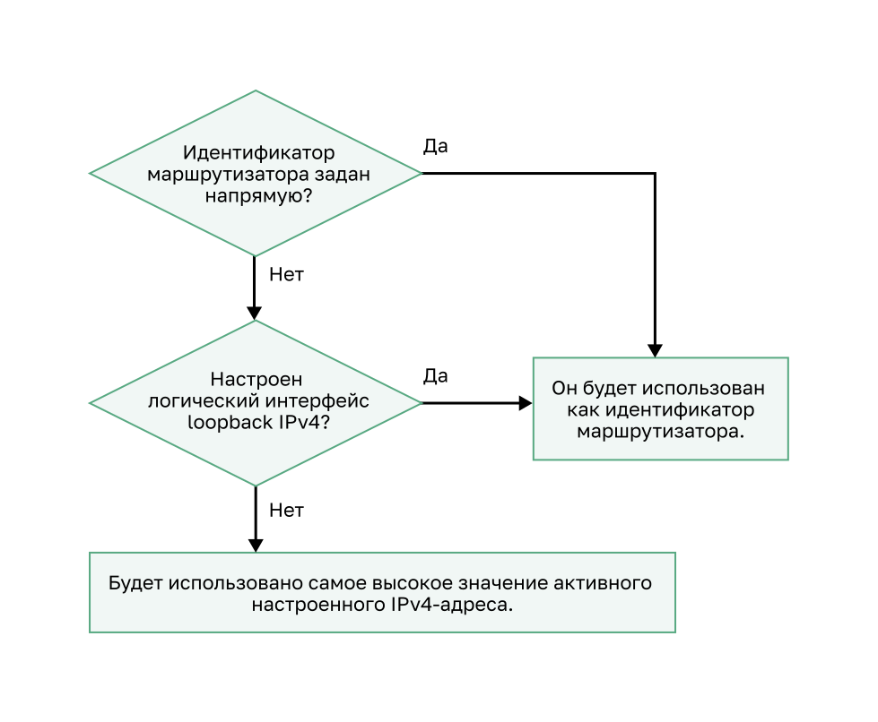

<!-- 2.1.1 -->
## Пример топологии

Для начала работы в этом разделе рассматривается основа, на которой OSPF строится весь процесс, а именно идентификатор устройства OSPF.

На этом рисунке показана топология, используемая для настройки OSPFv2 в данном модуле. Устройства в топологии имеют начальную конфигурацию, включая адреса интерфейсов. В настоящее время ни на одном из роутеров не настроена статическая или динамическая маршрутизация. Все интерфейсы на устройствах R1, R2 и R3 (за исключением интерфейса loopback на R2) находятся в пределах магистральной области OSPF. Роутер ISP используется в качестве шлюза домена маршрутизации в Интернет.

**Примечание.** В этой топологии интерфейс loopback используется для имитации канала WAN с Интернетом и локальной сети, подключенной к каждому устройству. Это позволяет дублировать топологию в демонстрационных целях на роутерах, имеющих только два интерфейса Gigabit Ethernet.


<!-- /courses/ensa-dl/ae8e6570-34fd-11eb-ba19-f1886492e0e4/aeb30478-34fd-11eb-ba19-f1886492e0e4/assets/c59869d2-1c46-11ea-af56-e368b99e9723.svg -->

<!--
Схема представляет собой стандартную топологию сети OSPFv2, используемую в этом модуле. Он состоит из трех роутеров с интерфейсами в области 0 и один из которых имеет подключение к Интернету. Устройства соединены друг с другом, чтобы сформировать треугольник. 

В левом нижнем углу находится роутер R1, который имеет три используемых интерфейса:

- Lo0 с IP-адресом .1 в сети 10.10.1.0/24; 
- G0/0/0 с IP-адресом .5 в сети 10.1.1.4/30 подключен к R2 вверху;
- G0/0/1 с IP-адресом .14 в сети 10.1.1.12/30 подключен к R3 справа. 

R2 имеет четыре используемых интерфейса: 
- G0/0/0 с IP-адресом .6 в сети 10.1.1.4/30, подключенной к R1;
- G0/0/1 с IP-адресом .9 в сети 10.1.1.8/30 подключен к R3; 
- Lo0 с адресом .1 в сети 10.10.2.0/24 отображается с подключением вверху; 
- Lo1 с IP-адресом .1 на сеть 64.100.0.0/30, которая подключена к интернет-облаку справа. 

Lo1 и облако Интернета не находятся в области 0. 

В правом нижнем углу находится R3. R3 имеет три используемых интерфейса: 
- Lo0 с IP-адресом .1 в сети 10.10.3.0/24; 
- G0/0/0 с IP-адресом .13 в сети 10.1.1.12/30, подключенной к R1; 
- G0/0/1 с IP-адресом .10 в сети 10.1.1.8/30, подключенной к R2.
-->

<!-- 2.1.2 -->
## Режим конфигурации роутера OSPF

OSPFv2 включается с помощью команды режима глобальной настройки **router ospf process-id**. Значение **process-id** представляет собой число от 1 до 65535 и выбирается сетевым администратором. Оно имеет только локальное значение, то есть оно не обязательно должно совпадать со значением на других устройствах OSPF для установления отношений смежности с такими соседними устройствами. Рекомендуется использовать один и тот же **process-id** на всех устройствах OSPF.

После ввода команды **router ospf _process-id_** роутер переходит в режим настройки, как указано знаком **R1(config-router)#**. Введите знак вопроса (**?**), чтобы просмотреть все команды, доступные в этом режиме. Список команд, показанный здесь, изменен для отображения только тех, что относятся к данному модулю.

```
R1(config)# router ospf 10
R1(config-router)# ?
  area                   OSPF area parameters
  auto-cost              Calculate OSPF interface cost according to bandwidth
  default-information    Control distribution of default information
  distance               Define an administrative distance
  exit                   Exit from routing protocol configuration mode
  log-adjacency-changes  Log changes in adjacency state
  neighbor               Specify a neighbor router
  network                Enable routing on an IP network
  no                     Negate a command or set its defaults
  passive-interface      Suppress routing updates on an interface
  redistribute           Redistribute information from another routing protocol
  router-id              router-id for this OSPF process
R1(config-router)#
```

<!-- 2.1.3 -->
## Идентификатор роутера (Router ID)

Идентификатор роутера OSPF — это 32-разрядное значение, представленное в формате адреса IPv4, которое служит уникальным обозначением устройств. Все пакеты OSPF включают идентификатор отправляющего роутера. Для включения в домен маршрутизации OSPF всем устройствам требуется идентификатор, который задаётся администратором или автоматически назначается устройствомом. Роутер с поддержкой протокола OSPF использует идентификатор в следующих целях.

* **Участие в синхронизации баз данных OSPF** — во время состояния Exchange роутер с самым высоким идентификатором будет отправлять пакеты дескриптора базы данных (DBD).
* **Участие в выборе назначенного устройства (DR)** — в среде коллективного доступа LAN роутер с наивысшим идентификатором выбирается как DR. Устройство маршрутизации со следующим значением идентификатора выбирается как BDR.

**Примечание.** Процесс выборов DR и BDR более подробно рассматривается ниже.

<!-- 2.1.4 -->
## Порядок идентификаторов роутеров по приоритету

Каким образом устройство определяет значение идентификатора? Как показано на рисунке, роутеры Cisco выводят идентификатор на основе одного из трех критериев в следующем порядке предпочтения.

1.  Идентификатор задается с помощью команды **router-id** rid, выполняемой в режиме конфигурации роутера OSPF представляет собой любое 32-разрядное число в формате адреса IPv4. Данный метод является рекомендуемым для назначения идентификатора.
2.  Если идентификатор не настроен напрямую, роутер выбирает самое высокое значение IPv4-адреса любого из настроенных интерфейсов loopback. Это второй способ назначения идентификатора.
3.  При отсутствии настроенных интерфейсов loopback, роутер выбирает самое высокое значение активного IPv4-адреса любого из своих физических интерфейсов. Данный метод не рекомендуется использовать, так как в этом случае администратору сложнее различать устройства.


<!-- /courses/ensa-dl/ae8e6570-34fd-11eb-ba19-f1886492e0e4/aeb30478-34fd-11eb-ba19-f1886492e0e4/assets/c5990612-1c46-11ea-af56-e368b99e9723.svg -->

<!-- 2.1.5 -->
## Настройка интерфейса loopback в качестве идентификатора роутера

В эталонной топологии настроены и активны только физические интерфейсы. Интерфейсы loopback не были настроены. Когда на роутере включена маршрутизация OSPF, устройства будут выбирать в качестве идентификатора следующий самый старший активный настроенный IPv4 адрес.

* R1: 10.1.1.14 (G0/0/1)
* R2: 10.1.1.9 (G0/0/1)
* R3: 10.1.1.13 (G0/0/0)

**Примечание.** OSPF не требуется включать на интерфейсе, чтобы этот интерфейс был выбран в качестве идентификатора роутера.

Вместо того, чтобы полагаться на физический интерфейс, идентификатор может быть назначен интерфейсу loopback. Как правило, адрес IPv4 для этого типа интерфейса loopback должен быть настроен с использованием 32-разрядной маски подсети (255.255.255.255). Таким образом создаётся маршрут узла. 32-битный маршрут узла не объявляется в качестве маршрута для других устройств OSPF.

В примере показано, как настроить интерфейс loopback на R1. Если идентификатор не был явно настроен или ранее не изучен, R1 будет использовать IPv4 адрес 1.1.1.1 в качестве идентификатора. Предположим, что R1 еще не узнал идентификатор роутера.

```
R1(config-if)# interface Loopback 1
R1(config-if)# ip address 1.1.1.1 255.255.255.255
R1(config-if)# end
R1# show ip protocols | include Router ID
  Router ID 1.1.1.1
R1#
```

<!-- 2.1.6 -->
## Явная конфигурация Router ID

На рисунке топология обновлена, чтобы показать идентификатор для каждого роутера:

* R1 использует router ID 1.1.1.1;
* R2 использует router ID 2.2.2.2;
* R3 использует router ID 3.3.3.3.


<!-- /courses/ensa-dl/ae8e6570-34fd-11eb-ba19-f1886492e0e4/aeb30478-34fd-11eb-ba19-f1886492e0e4/assets/c599c960-1c46-11ea-af56-e368b99e9723.svg -->

<!--
Стандартная топология сети OSPFv2, показывающая идентификатор для каждого роутера.
-->

Используйте команду режима конфигурации **router-id _rid_ router**, чтобы вручную назначить идентификатор роутера. В этом примере router ID 1.1.1.1 назначается на R1. Используйте команду **show ip protocols** для проверки идентификатора.

```
R1(config)# router ospf 10
R1(config-router)# router-id 1.1.1.1
R1(config-router)# end
*May 23 19:33:42.689: %SYS-5-CONFIG_I: Configured from console by console
R1# show ip protocols | include Router ID
Router ID 1.1.1.1
R1#
```

<!-- 2.1.7 -->
## Изменение идентификатора роутера

После того, как устройство выбирает идентификатор, активный роутер OSPF не позволяет изменять его идентификатор, пока не будет перезагружен или процесс OSPF не будет сброшен.

В примере R1 настроенный идентификатор был удален, а роутер перезагружен. Обратите внимание, что текущий идентификатор — 10.10.1.1, который является IPv4-адресом loopback 0. Роутер должен иметь идентификатор 1.1.1.1. Поэтому R1 настраивается с помощью команды **router-id 1.1.1.1**.

Теперь обратите внимание на информационное сообщение, в котором указано, что процесс OSPFv2 должен быть сброшен, или роутер — перезагружен. Это обусловлено тем, что R1 уже установил отношения смежности с другими соседними устройствами, используя идентификатор 10.10.1.1. Эти отношения смежности должны быть снова согласованы с использованием нового идентификатора 1.1.1.1. Используйте команду **clear ip ospf process** для сброса смежности. Затем можно убедиться в том, что R1 использует новый router ID с командой **show ip protocols**, с фильтром для отображения только раздела идентификатора роутера.

Перезапуск процесса OSPF является предпочтительным методом сброса идентификатора.

```
R1# show ip protocols | include Router ID
Router ID 10.10.1.1
R1# conf t
Enter configuration commands, one per line.  End with CNTL/Z.
R1(config)# router ospf 10 
R1(config-router)# router-id 1.1.1.1
% OSPF: Reload or use "clear ip ospf process" command, for this to take effect
R1(config-router)# end
R1# clear ip ospf process
Reset ALL OSPF processes? [no]: y
*Jun  6 01:09:46.975: %OSPF-5-ADJCHG: Process 10, Nbr 3.3.3.3 on GigabitEthernet0/0/1 from FULL to DOWN, Neighbor Down: Interface down or detached
*Jun  6 01:09:46.975: %OSPF-5-ADJCHG: Process 10, Nbr 2.2.2.2 on GigabitEthernet0/0/0 from FULL to DOWN, Neighbor Down: Interface down or detached
*Jun  6 01:09:46.981: %OSPF-5-ADJCHG: Process 10, Nbr 3.3.3.3 on GigabitEthernet0/0/1 from LOADING to FULL, Loading Done
*Jun  6 01:09:46.981: %OSPF-5-ADJCHG: Process 10, Nbr 2.2.2.2 on GigabitEthernet0/0/0 from LOADING to FULL, Loading Done
R1# show ip protocols | include Router ID
Router ID 1.1.1.1
R1#
```

**Примечание:** Предпочтительнее использовать команду **router-id**, но некоторые старые версии IOS не распознают команду **router-id**, поэтому на них лучше задавать идентификатор через интерфейс обратной петли.

<!-- 2.1.8 -->
<!-- syntax -->

<!-- 2.1.9 -->
<!-- quiz -->

