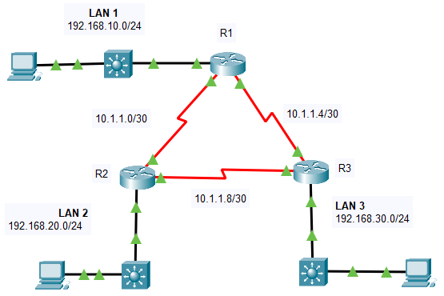

---

> **ВАЖНО**
> 
> Форма для ответов на вопросы будет доступна только при развертывании лабораторной работы 

---

## Топология



## Таблица адресации

| Устройство | Интерфейс | IP-адрес      | Маска подсети |
|------------|-----------|---------------|---------------|
| R1         | G0/0/0    | 192.168.10.1  | /24           |
| R1         | S0/1/0    | 10.1.1.1      | /30           |
| R1         | S0/1/1    | 10.1.1.5      | /30           |
| R2         | G0/0/0    | 192.168.20.1  | /24           |
| R2         | S0/1/0    | 10.1.1.2      | /30           |
| R2         | S0/1/1    | 10.1.1.9      | /30           |
| R3         | G0/0/0    | 192.168.30.1  | /24           |
| R3         | S0/1/0    | 10.1.1.10     | /30           |
| R3         | S0/1/1    | 10.1.1.6.     | /30           |
| PC1        | NIC       | 192.168.10.10 | /24           |
| PC2        | NIC       | 192.168.20.10 | /24           |
| PC3        | NIC       | 192.168.30.10 | /24           |

## Цели

Часть 1. Настройка идентификаторов маршрутизатора.

Часть 2. Настройка сетей для маршрутизации OSPF.

Часть 3. Настройка пассивных интерфейсов

Часть 4. Проверка конфигурации OSPF.

## Общие сведения

В этом задании вы активируете маршрутизацию OSPF с помощью инструкций сети и шаблонной маски, настраивая маршрутизацию OSPF на интерфейсах и используя маски с четырьмя нулями. Кроме того, вы будете настраивать явные идентификаторы маршрутизатора и пассивные интерфейсы.

## Инструкция

### Часть 1. Настройка идентификаторов маршрутизатора.

1.  Запустите процесс маршрутизации OSPF на всех трех маршрутизаторах. Используйте идентификатор процесса **10**

    ```
    Router(config)# router ospf process-id
    ```

2.  Используйте команду router-id для установки идентификаторов OSPF трех маршрутизаторов следующим образом:

    -   R1: **1.1.1.1**

    -   R2: **2.2.2.2**

    -   R3: **3.3.3.3**

    Используйте следующую команду:

    ```
    Router(config-router)# router-id rid
    ```

### Часть 2. Настройка сетей для маршрутизации OSPF

**Шаг 1. Настройка сетей для маршрутизации OSPF с помощью сетевых команд и шаблонной маски.**

Вопросы:

- ответьте на вопрос №1

- ответьте на вопрос №2

- ответьте на вопрос №3

- ответьте на вопрос №4

- ответьте на вопрос №5

1.  Настройте процесс маршрутизации на R1 с помощью операторов сети и подстановочных масок, необходимых для активации маршрутизации OSPF для всех подключенных сетей. Значения иструкций сети должны быть сетями или подсетями настроенных сетей.

    ```
    Router(config-router)# network network-address wildcard-mask area area-id
    ```

2.  Убедитесь, что OSPF настроен правильно, отображая текущую конфигурацию. Если обнаружена ошибка, удалите оператор network с помощью команды **no** и перенастройте его.

**Шаг 2. Настройте сети для маршрутизации OSPF с использованием IP-адресов интерфейса и масок с четырьмя нулевыми значениями.**

На маршрутизаторе R2 настройте OSPF с помощью сетевых команд с IP-адресами интерфейсов и масками с четырьмя нулевыми значениями. Синтаксис команды network такой же, как был использован выше.

**Шаг 3. Настройка маршрутизации OSPF на интерфейсах маршрутизатора**

На маршрутизаторе R3 настройте необходимые интерфейсы с OSPF.

- ответьте на вопрос №6

Настройте каждый интерфейс, используя синтаксис команды, показанный ниже:

```
Router(config-if)# ip ospf process-id area area-id
```

### Часть 3. Настройка пассивных интерфейсов

OSPF будет отправлять трафик протокола со всех интерфейсов , участвующих в процессе OSPF. На каналах, которые не настроены для других сетей, таких как LAN, этот ненужный трафик потребляет ресурсы. Команда passive-interface не позволит процессу OSPF отправлять ненужный трафик протокола маршрутизации из интерфейсов LAN.

- ответьте на вопрос №7

Настройте процесс OSPF на каждом из трех маршрутизаторов с помощью команды **passive-interface**.

```
Router(config-router)# passive-interface interface
```

### Часть 4. Проверка конфигурации OSPF

Используйте команды **show** для проверки конфигурации сети и пассивного интерфейса процесса OSPF на каждом маршрутизаторе.

[Скачать файл Packet Tracer для локального запуска](./assets/2.2.13-lab.pka)