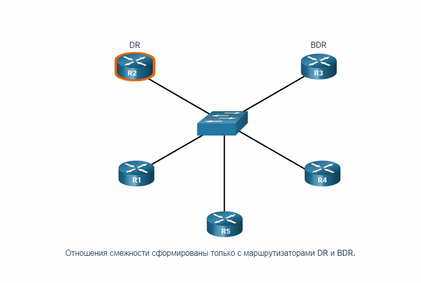

<!-- 2.3.1 -->
## Типы сетей OSPF

Другой тип сети, использующей OSPF, — это сеть OSPF с множественным доступом. Многоканальные сети OSPF уникальны тем, что одно устройство управляет распределением LSA. Роутер, выбранный для этой роли, должен быть определен администратором сети с помощью правильной настройки.

OSPF может включать дополнительные процессы в зависимости от типа сети. В предыдущей топологии использовались каналы «точка-точка» между устройствами. Однако роутеры могут быть подключены к одному и тому же коммутатору, чтобы сформировать сеть с множественным доступом, как показано на рисунке. Локальные сети Ethernet — это наиболее распространённый пример широковещательных сетей множественного доступа, где все устройства в рамках сети видят все широковещательные кадры и кадры групповой рассылки.

**Сеть OSPF множественного доступа**


<!-- /courses/ensa-dl/ae8e6570-34fd-11eb-ba19-f1886492e0e4/aeb32b82-34fd-11eb-ba19-f1886492e0e4/assets/c5a932b1-1c46-11ea-af56-e368b99e9723.svg -->

<!--
Сеть коллективного доступа OSPF, состоящая из четырех устройств, подключенных к центральному коммутатору; стрелки, представляющие широковещательные рассылки, перенаправляются каждым маршрутизатором на коммутатор; один маршрутизатор имеет соединение «точка-точка» с другим маршрутизатором в облаке Интернета
-->

<!-- 2.3.2 -->
## Выделенный маршрутизатор OSPF

Напомним, что в сетях коллективного доступа OSPF выбирает DR и BDR для управления количеством смежностей и переполнением объявлений состояния каналов (LSA). DR отвечает за сбор и распространение отправленных и полученных LSAs, использует IPv4-адрес многоадресной рассылки 224.0.0.5, который предназначен для всех роутеров OSPF.

На случай сбоя выделенного роутера (DR) также выбирается резервный назначенный роутер (BDR), который пассивно наблюдает за этим обменом и поддерживает отношения со всеми устройствами. Если DR перестает создавать пакеты приветствия (hello), то BDR самостоятельно принимает роль DR.

Остальные устройства, не являющиеся DR или BDR, станут DROTHER (роутеры, которые не являются ни DR, ни BDR). DROTHER используют адрес с несколькими доступом 224.0.0.6 (все назначенные устройства) для отправки пакетов OSPF в DR и BDR. Только DR и BDR прослушивают 224.0.0.6.

На рисунке R1, R5 и R4 являются DROTHER. Нажмите кнопку воспроизведения, чтобы увидеть анимацию R2, действующей в качестве DR. Обратите внимание, что только DR и BDR обрабатывает LSA, отправленные R1, используя IPv4 адрес 224.0.0.6 многоадресной рассылки. Затем DR отправляет LSA всем роутерам OSPF, используя адрес IPv4 для многоадресной рассылки 224.0.0.5.

**Роль выделенного роутера (DR)**



<!--
анимация, показывающая пять маршрутизаторов в одной и той же сети коллективного  доступа, подключенной к коммутатору. Соседское взаимоотношение были сформированы только между DR и BDR. DRother отправляет LSA в DR и BDR. DR отправляет объявления состояний канала ко всем остальным маршрутизаторам.
-->

<!-- 2.3.3 -->
## Топология широковещательной рассылки с множественным доступом OSPFv2

В топологии множественного доступа, показанной на рисунке, три роутера связаны между собой через общую сеть Ethernet с множественным доступом 192.168.1.0/24. Для каждого из них на интерфейсе Gigabit Ethernet 0/0/0 настраивается указанный адрес IPv4.

Поскольку устройства соединены в сети коллективного доступа, OSPF выбрал DR и BDR автоматически. В данном примере в качестве DR был выбран роутер R3, поскольку он обладает идентификатором 3.3.3.3 — самым высоким в этой сети. R2 выбран в качестве BDR, поскольку обладает наивысшим идентификатором в сети среди оставшихся устройств.


<!-- /courses/ensa-dl/ae8e6570-34fd-11eb-ba19-f1886492e0e4/aeb32b82-34fd-11eb-ba19-f1886492e0e4/assets/c5ab0771-1c46-11ea-af56-e368b99e9723.svg -->

<!--
Диаграмма представляет собой топологию коллективного доступа OSPF, используемую в нескольких разделах этого модуля и показывающую три роутера, подключенных к центральному коммутатору, которые находятся в сети 192.168.1.0/24 в области 0. Слева находится маршрутизатор R1, подключенный к коммутатору через интерфейс g0/0/0 по адресу .1. R1 имеет идентификатор маршрутизатора 1.1.1.1. R1 имеет другое подключение к сети 172.16.1.0/24 через интерфейс g0/0/1 по адресу .1. На вершине находится маршрутизатор R2, подключенный к коммутатору через интерфейс g0/0/0 по адресу .2. R2 имеет идентификатор маршрутизатора 2.2.2.2 и был выбран BDR. R2 имеет другое подключение к сети 172.16.2.0/24 через интерфейс g0/0/1 по адресу .1. Справа расположен маршрутизатор R3, подключенный к коммутатору через интерфейс g0/0/0 по адресу .3. R3 имеет идентификатор маршрутизатора 3.3.3.3 и был выбран DR. R3 имеет другое подключение к сети 172.16.3.0/24 через интерфейс g0/0/1 по адресу .1.
-->

<!-- 2.3.4 -->
## Проверка ролей маршрутизатора OSPF

Для проверки ролей роутера OSPFv2 используйте команду **show ip ospf** **interface**.

**R1 DROTHER**

Выходные данные, сгенерированные роутером R1, подтверждают, что:

1.  R1 не является ни DR, ни BDR, а является роутером DROTHER с приоритетом по умолчанию 1 (строка 7);
2.  DR — это R3 с идентификатором 3.3.3.3 по адресу IPv4 192.168.1.3, а BDR — это R2 с идентификатором 2.2.2.2 по адресу IPv4 192.168.1.2 (строки 8 и 9);
3.  R1 имеет два отношения смежности: одно с BDR, другое с DR (Строки 20-22).

```
R1# show ip ospf interface GigabitEthernet 0/0/0 
GigabitEthernet0/0/0 is up, line protocol is up 
  Internet Address 192.168.1.1/24, Area 0, Attached via Interface Enable 
  Process ID 10, Router ID 1.1.1.1, Network Type BROADCAST, Cost: 1 
  Topology-MTID Cost Disabled Shutdown Topology Name
        0 1 no no Base
  Enabled by interface config, including secondary ip addresses
  Transmit Delay is 1 sec, State DROTHER, Priority 1 Designated Router (ID) 3.3.3.3, Interface address 192.168.1.3
  Backup Designated router (ID) 2.2.2.2, Interface address 192.168.1.2 
  Timer intervals configured, Hello 10, Dead 40, Wait 40, Retransmit 5
    oob-resync timeout 40
     Hello due in 00:00:07 
  Supports Link-local Signaling (LLS)
  Cisco NSF helper support enabled
  IETF NSF helper support enabled
  Index 1/1/1, flood queue length 0
  Next 0x0(0)/0x0(0)/0x0(0)
  Last flood scan length is 0, maximum is 1 
  Last flood scan time is 0 msec, maximum is 1 msec
  Neighbor Count is 2, Adjacent neighbor count is 2 
    Adjacent with neighbor 2.2.2.2 (Backup Designated Router)
    Adjacent with neighbor 3.3.3.3 (Designated Router)
  Suppress hello for 0 neighbor(s)
R1#
```

**R2 BDR**

Выходные данные, сгенерированные R2, подтверждают, что:

1.  R2 — это BDR с приоритетом по умолчанию 1 (строка 7);
2.  DR — это R3 с идентификатором 3.3.3.3 по адресу IPv4 192.168.1.3, а BDR — это R2 с идентификатором 2.2.2.2 по адресу IPv4 192.168.1.2 (строки 8 и 9);
3.  R2 имеет два отношения смежности: одно с соседним устройством с идентификатором 1.1.1.1 (R1), а другое — с DR (Строки 20-22).

```
R2# show ip ospf interface GigabitEthernet 0/0/0 
GigabitEthernet0/0/0 is up, line protocol is up 
  Internet Address 192.168.1.2/24, Area 0, Attached via Interface Enable 
  Process ID 10, Router ID 2.2.2.2, Network Type BROADCAST, Cost: 1 
  Topology-MTID Cost Disabled Shutdown Topology Name
        0 1 no no Base
  Enabled by interface config, including secondary ip addresses
  Transmit Delay is 1 sec, State BDR, Priority 1 Designated Router (ID) 3.3.3.3, Interface address 192.168.1.3
  Backup Designated router (ID) 2.2.2.2, Interface address 192.168.1.2 
  Timer intervals configured, Hello 10, Dead 40, Wait 40, Retransmit 5
    oob-resync timeout 40
    Hello due in 0:00:01
  Supports Link-local Signaling (LLS)
  Cisco NSF helper support enabled
  IETF NSF helper support enabled
  Index 1/1, flood queue length 0
  Next 0x0(0)/0x0(0)
  Last flood scan length is 0, maximum is 1 
  Last flood scan time is 0 msec, maximum is 0 msec
  Neighbor Count is 2, Adjacent neighbor count is 2 
    Adjacent with neighbor 1.1.1.1
    Adjacent with neighbor 3.3.3.3 (Designated Router)
  Suppress hello for 0 neighbor(s)
R2#
```

**R3 DR**

Выходные данные, сгенерированные R3, подтверждают, что:

1.  R3 — это DR с приоритетом по умолчанию 1 (строка 7);
2.  DR — это R3 с идентификатором 3.3.3.3 по адресу IPv4 192.168.1.3, а BDR — это R2 с идентификатором 2.2.2.2 по адресу IPv4 192.168.1.2 (строки 8 и 9); 
3.  R3 имеет два отношения смежности: одно с соседним устройством с идентификатором 1.1.1.1 (R1), а другое с BDR (Строки 20-22).

```
R3# show ip ospf interface GigabitEthernet 0/0/0 
GigabitEthernet0/0/0 is up, line protocol is up 
  Internet Address 192.168.1.3/24, Area 0, Attached via Interface Enable 
  Process ID 10, Router ID 3.3.3.3, Network Type BROADCAST, Cost: 1 
  Topology-MTID Cost Disabled Shutdown Topology Name
        0 1 no no Base
  Enabled by interface config, including secondary ip addresses
  Transmit Delay is 1 sec, State DR, Priority 1 Designated Router (ID) 3.3.3.3, Interface address 192.168.1.3
  Backup Designated router (ID) 2.2.2.2, Interface address 192.168.1.2 
  Timer intervals configured, Hello 10, Dead 40, Wait 40, Retransmit 5
    oob-resync timeout 40
    Hello due in 0:00:06
  Supports Link-local Signaling (LLS)
  Cisco NSF helper support enabled
  IETF NSF helper support enabled
  Index 1/1/1, flood queue length 0
  Next 0x0(0)/0x0(0)/0x0(0)
  Last flood scan length is 2, maximum is 2 
  Last flood scan time is 0 msec, maximum is 0 msec
  Neighbor Count is 2, Adjacent neighbor count is 2 
    Adjacent with neighbor 1.1.1.1 
    Adjacent with neighbor 2.2.2.2 (Backup Designated Router)
  Suppress hello for 0 neighbor(s)
R3#
```

<!-- 2.3.5 -->
## Проверка отношений смежности DR/BDR

Чтобы проверить смежность OSPFv2, используйте команду **show ip ospf neighbor**, как показано в примере для R1. У соседей в сетях со множественным доступом могут быть следующие состояния:

* **FULL/DROTHER** — это DR или BDR, который полностью смежен с невыделенным устройством (не DR и не BDR). Эти два соседних устройства могут обмениваться пакетами приветствия (hello), обновлениями, запросами, ответами и подтверждениями;
* **FULL/DR** — роутер, полностью смежный с указанным соседом DR. Эти два соседних устройства могут обмениваться пакетами приветствия (hello), обновлениями, запросами, ответами и подтверждениями;
* **FULL/BDR** — роутер, полностью смежный с указанным соседом BDR. Эти два соседних устройства могут обмениваться пакетами приветствия (hello), обновлениями, запросами, ответами и подтверждениями;
* **2-WAY/DROTHER** — это невыделенный роутер (не DR и не BDR), у которого имеются отношения смежности с другим невыделенным устройством (не DR и не BDR). Эти два соседних устройства обмениваются пакетами приветствия (hello).

Нормальное состояние для роутера OSPF обычно FULL. Если он длительное время находится в другом состоянии, значит у него возникли проблемы с формированием отношений смежности. Единственное исключение из этого правила — это состояние 2-WAY, которое является нормальным в вещательной сети со множественным доступом. Однако роутеры DROTHER по-прежнему будут формировать соседские отношения смежности 2-WAY с любыми DROTHER, которые подключатся к сети. В этом случае состояние соседа отображается как 2-WAY/DROTHER.

**Смежности R1**

Выходные данные, сгенерированные R1, подтверждают, что он имеет отношения смежности с роутером:

* R2 с идентификатором 2.2.2.2, который находится в состоянии Full и выполняет роль BDR;
* R3 с идентификатором 3.3.3.3, который находится в состоянии Full и выполняет роль DR.

```
R1# show ip ospf neighbor 
Neighbor ID Pri State Dead Time Address Interface
2.2.2.2 1 FULL/BDR 00:00:31 192.168.1.2 GigabitEthernet0/0/0  
3.3.3.3 1 FULL/DR 00:00:39 192.168.1.3 GigabitEthernet0/0/0 
R1#
```

**Смежности R2**

Выходные данные, сгенерированные R2, подтверждают, что он имеет отношения смежности с роутером:

* R1 с идентификатором 1.1.1.1, который находится в состоянии Full и не выполняет роль DR или BDR;
* R3 с идентификатором 3.3.3.3, который находится в состоянии Full и выполняет роль DR.

```
R2# show ip ospf neighbor 
Neighbor ID Pri State Dead Time Address Interface
1.1.1.1 1 FULL/DROTHER 00:00:31 192.168.1.1 GigabitEthernet0/0/0
3.3.3.3 1 FULL/DR 00:00:34 192.168.1.3 GigabitEthernet0/0/0 
R2#
```

**Смежности R3**

Выходные данные, сгенерированные R3, подтверждают, что он имеет отношения смежности с роутером:

* R1 с идентификатором 1.1.1.1, который находится в состоянии Full и не выполняет роль DR или BDR.
* R2 с идентификатором 2.2.2.2, который находится в состоянии Full и выполняет роль BDR.

```
R3# show ip ospf neighbor 
Neighbor ID Pri State Dead Time Address Interface
1.1.1.1 1 FULL/DROTHER 00:00:31 192.168.1.1 GigabitEthernet0/0/0
2.2.2.2 1 FULL/BDR 00:00:31 192.168.1.2 GigabitEthernet0/0/0
R3#
```

<!-- 2.3.6 -->
## Процесс выбора DR/BDR по умолчанию

Как происходит выбор DR и BDR? Выбор ролей DR и BDR по протоколу OSPF основывается на следующих критериях в указанной очередности.

1.  Устройства в сети выбирают роутер с самым высоким приоритетом интерфейса в качестве DR. Роутер со вторым по величине приоритетом интерфейса становится BDR. Приоритет может быть представлен любым числом от 0 до 255. Если значение приоритета интерфейса равно 0, этот интерфейс не может быть выбран как DR или BDR. Приоритет по умолчанию интерфейсов, подключенных к широковещательной сети множественного доступа, равен 1. Соответственно, при отсутствии иных настроек, все устройства обладают равным приоритетом, и для выборов DR/BDR будет использоваться другой метод.
2.  Если приоритеты интерфейсов равны, то в качестве DR будет выбран роутер с наивысшим идентификатором. Устройство со вторым по величине идентификатором становится BDR.

Как вы помните, идентификатор роутера определяется одним из трех способов:

1. может быть настроен вручную;
2. если идентификаторы не настроены, то он определяется по наивысшему адресу обратной петли IPv4;
3. если интерфейсы loopback не настроены, то он определяется по наивысшему активному IPv4-адресу.

**Топология OSPFv2  в сети коллективного  доступа**


<!-- /courses/ensa-dl/ae8e6570-34fd-11eb-ba19-f1886492e0e4/aeb32b82-34fd-11eb-ba19-f1886492e0e4/assets/c5adeda0-1c46-11ea-af56-e368b99e9723.svg -->

<!--
эталонная топология OSPF с коллективными  доступом, используемая в этом модуле, как описано в 2.3.3
-->

На рисунке все Ethernet-интерфейсы роутера имеют приоритет по умолчанию 1. В результате, в соответствии с вышеупомянутыми критериями, для выбора DR и BDR используется идентификатор роутера OSPF. Роль DR принимает R3, поскольку он имеет наивысший идентификатор. R2, имеющий второй по величине идентификатор, становится BDR.

Процедура выбора DR и BDR начинается сразу после появления в сети с множественным доступом первого активного роутера с интерфейсом, где включен OSPF. Это может произойти при включении питания устройств с предварительно настроенным протоколом OSPF или при активации протокола OSPF на интерфейсе. Процедура выбора занимает всего несколько секунд. Если в сети с множественным доступом загрузились не все устройства, то роль DR может получить роутер не с самым высоким идентификатором.

Процесс выбора DR и BDR по протоколу OSPF не является вытесняющим. Если после завершения выбора DR/BDR в сети появляется новый роутер с более высоким приоритетом или идентификатором, то он не перенимает роль DR или BDR, поскольку эти роли уже назначены. Добавление нового устройства не приводит к новому процессу выбора.

<!-- 2.3.7 -->
##  Сбой  и восстановление DR

Когда какой-либо роутер выбран в качестве DR, то он сохраняет эту роль, пока не произойдет одно из следующих событий:

* сбой DR;
* сбой или остановка OSPF-процесса на DR;
* сбой или отключение интерфейса со множественным доступом на DR.

Если происходит сбой DR, то его роль автоматически перенимает BDR. Это происходит даже в том случае, если после первоначального выбора DR/BDR к сети добавляется другой роутер DROTHER с более высоким идентификатором или приоритетом. Однако когда BDR перенимает роль DR, происходит новый выбор BDR и его роль получает DROTHER с высоким идентификатором или приоритетом.

**Сбой в работе R3**

В этом случае происходит сбой текущего DR (R3). Следовательно, его роль перенимает предварительно выбранный BDR (R2). После этого выполняется выбор нового BDR. Поскольку R1 является DROTHER, он и выбирается в качестве BDR.


<!-- /courses/ensa-dl/ae8e6570-34fd-11eb-ba19-f1886492e0e4/aeb32b82-34fd-11eb-ba19-f1886492e0e4/assets/c5af4d31-1c46-11ea-af56-e368b99e9723.svg -->

<!--
эталонная топология OSPF с коллективным  доступом, как описано в 2.3.3, и влияние неудачного маршрутизатора на выбор DR/BDR; красный X появляется над R3, указывающий на сбой маршрутизатора; R2 обозначается DR, а R1 — BDR
-->

**R3 повторно объединяет сеть**

В  сценарии R3 повторно подключился к сети после того, как был недоступен в течение нескольких минут. Поскольку DR и BDR уже выбраны, R3 не получает ни одну из этих ролей и становится DROTHER.


<!-- /courses/ensa-dl/ae8e6570-34fd-11eb-ba19-f1886492e0e4/aeb32b82-34fd-11eb-ba19-f1886492e0e4/assets/c5afc260-1c46-11ea-af56-e368b99e9723.svg -->

<!--
Влияние на выбор DR и BDR в опорной топологии OSPF с коллективным доступом, как описано в 2.3.3, после сбоя R3, а затем R3 вновь присоединяется к сети; R2 остается DR, R1 остается BDR, а R3 становится DROTHER.
-->

**R4 подключается к сети**

В этом сценарии к сети добавляется новый роутер (R4) с более высоким идентификатором. DR (R2) и BDR (R1) сохраняют свои роли. R4 автоматически становится DROTHER.


<!-- /courses/ensa-dl/ae8e6570-34fd-11eb-ba19-f1886492e0e4/aeb32b82-34fd-11eb-ba19-f1886492e0e4/assets/c5b01082-1c46-11ea-af56-e368b99e9723.svg -->

<!--
Эталонная топология OSPF с коллективным  доступом, используемая в этом модуле, как описано в 2.3.3, и влияние нескольких изменений топологии.
-->

**R2 отказывает**

В этом случае R2 не успешен. BDR (R1) автоматически принимает роль DR. В результате процесса выбора R4 становится BDR, поскольку он обладает более высоким идентификатором.


<!-- /courses/ensa-dl/ae8e6570-34fd-11eb-ba19-f1886492e0e4/aeb32b82-34fd-11eb-ba19-f1886492e0e4/assets/c5b0d3d0-1c46-11ea-af56-e368b99e9723.svg -->

<!--
Эталонная топология OSPF с коллективным доступом, используемая в этом модуле, как описано в 2.3.3, и влияние нескольких изменений топологии.
-->

<!-- 2.3.8 -->
## Команда ip ospf priority

Если на всех роутерах приоритеты интерфейсов равны, то в качестве DR будет выбрано устройство с наивысшим идентификатором. Идентификатор можно настроить специально для манипуляции выбора DR/BDR. Однако этот процесс сработает лишь в том случае, если на всех роутерах существует строгий порядок настройки идентификатора. Настройка идентификатора роутера может помочь управлять этим. В крупных сетях использование данного метода может быть затруднительно.

Вместо того, чтобы полагаться на идентификатор, рекомендуется управлять выбором посредством настройки приоритетов интерфейсов. Это позволяет роутеру выполнять роль DR в одной сети, и DROTHER — в другой. Для задания приоритета интерфейса используйте команду **ip ospf priority** _value_, где значение от 0 до 255. Значение 0 не позволяет стать DR или BDR. Значение от 1 до 255 на интерфейсе повышает вероятность того, что роутер станет DR или BDR.

<!-- 2.3.9 -->
## Настройка приоритета OSPF

В топологии команда **ip ospf priority** будет использоваться для изменения DR и BDR следующим образом:

* R1 должен выполнять роль DR и будет настроен с приоритетом 255;
* R2 должен выполнять роль BDR, его приоритет останется со значением по умолчанию 1;
* R3 не должен выполнять роль DR или BDR и будет настроен с приоритетом 0.

Измените приоритет интерфейса R1 G0/0/0 с 1 на 255.

```
R1(config)# interface GigabitEthernet 0/0/0 
R1(config-if)# ip ospf priority 255 
R1(config-if)# end 
R1#
```

Измените приоритет интерфейса R3 G0/0/0 с 1 на 0.

```
R3(config)# interface GigabitEthernet 0/0/0
R3(config-if)# ip ospf priority 0
R3(config-if)# end
R3#
```

В следующем примере показано, как очистить процесс OSPF на R1. Команда **clear ip ospf process** также должна быть введена на R2 и R3 (не отображается). Обратите внимание на появившиеся сведения о состоянии OSPF.

```
R1# clear ip ospf process
Reset ALL OSPF processes? [no]: y
R1#
*Jun  5 03:47:41.563: %OSPF-5-ADJCHG: Process 10, Nbr 2.2.2.2 on GigabitEthernet0/0/0 from FULL to DOWN, Neighbor Down: Interface down or detached
*Jun  5 03:47:41.563: %OSPF-5-ADJCHG: Process 10, Nbr 3.3.3.3 on GigabitEthernet0/0/0 from FULL to DOWN, Neighbor Down: Interface down or detached
*Jun  5 03:47:41.569: %OSPF-5-ADJCHG: Process 10, Nbr 2.2.2.2 on GigabitEthernet0/0/0 from LOADING to FULL, Loading Done
*Jun  5 03:47:41.569: %OSPF-5-ADJCHG: Process 10, Nbr 3.3.3.3 on GigabitEthernet0/0/0 from LOADING to FULL, Loading Done
```

Выходные данные команды **show in ospf interface g0/0/0** на R1 подтверждают, что он является DR с приоритетом 255, и идентифицируют новые соседние смежности с R1.

```
R1# show ip ospf interface GigabitEthernet 0/0/0
GigabitEthernet0/0/0 is up, line protocol is up 
  Internet Address 192.168.1.1/24, Area 0, Attached via Interface Enable
  Process ID 10, Router ID 1.1.1.1, Network Type BROADCAST, Cost: 1
  Topology-MTID    Cost    Disabled    Shutdown      Topology Name
        0           1         no          no            Base
  Enabled by interface config, including secondary ip addresses
  Transmit Delay is 1 sec, State DR, Priority 255
  Designated Router (ID) 1.1.1.1, Interface address 192.168.1.1
  Backup Designated router (ID) 2.2.2.2, Interface address 192.168.1.2
  Timer intervals configured, Hello 10, Dead 40, Wait 40, Retransmit 5
    oob-resync timeout 40
    Hello due in 00:00:00
  Supports Link-local Signaling (LLS)
  Cisco NSF helper support enabled
  IETF NSF helper support enabled
  Index 1/1/1, flood queue length 0
  Next 0x0(0)/0x0(0)/0x0(0)
  Last flood scan length is 1, maximum is 2
  Last flood scan time is 0 msec, maximum is 1 msec
  Neighbor Count is 2, Adjacent neighbor count is 2 
    Adjacent with neighbor 2.2.2.2  (Backup Designated Router)
    Adjacent with neighbor 3.3.3.3
  Suppress hello for 0 neighbor(s)
R1#
```

<!-- 2.3.10 -->
<!-- syntax -->


