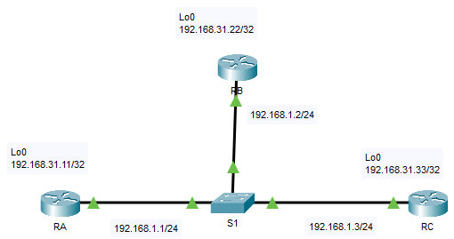

---

> **ВАЖНО**
> 
> Форма для ответов на вопросы будет доступна только при развертывании лабораторной работы 

---

## Топология



## Таблица адресации

| Устройство | Интерфейс | IP-адрес      | Маска подсети   |
|------------|-----------|---------------|-----------------|
| RA         | G0/0      | 192.168.1.1   | 255.255.255.0   |
| RA         | Lo0       | 192.168.31.11 | 255.255.255.255 |
| RB         | G0/0      | 192.168.1.2   | 255.255.255.0   |
| RB         | Lo0       | 192.168.31.22 | 255.255.255.255 |
| RC         | G0/0      | 192.168.1.3   | 255.255.255.0   |
| RC         | Lo0       | 192.168.31.33 | 255.255.255.255 |

## Задачи

Часть 1. Изучение изменения ролей DR и BDR

Часть 2. Изменение приоритета OSPF и инициирование выбора

## Сценарий

В этом упражнении вы сможете изучить роли DR и BDR, а также проследить за изменением ролей при изменениях в сети. Затем вам предстоит изменить приоритет для контроля функций и инициировать новый выбор. Наконец, нужно будет проверить, выполняют ли маршрутизаторы свои функции.

## Инструкции

### Часть 1. Изучение процесса изменения ролей DR и BDR

**Шаг 1. Дождитесь, когда все желтые индикаторы канала загорятся зеленым**

При первом открытии файла в Packet Tracer вы можете заметить, что индикаторы канала для коммутатора горят желтым цветом. Это должно продолжаться 50 секунд, пока протокол STP на коммутаторе проверяет, не является ли один из роутеров еще одним коммутатором. Либо можно нажать **Fast Forward Time (Ускорить)**, чтобы пропустить этот процесс.

**Шаг 2. Проверьте текущие состояния соседних устройств OSPF**

На каждом устройстве используйте соответствующую команду, чтобы просматривать текущие DR и BDR. Если роутер показывает FULL/DROTHER, это означает, что он не является DR или BDR.

```
RA# show ip ospf neighbor

Neighbor ID Pri State Dead Time Address Interface
192.168.31.33 2 FULL/DR 00:00:35 192.168.1.3 GigabitEthernet0/0
192.168.31.22 1 FULL/BDR 00:00:35 192.168.1.2 GigabitEthernet0/0

RB# show ip ospf neighbor

Neighbor ID Pri State Dead Time Address Interface
192.168.31.11 1 FULL/DROTHER 00:00:36 192.168.1.1 GigabitEthernet0/0
192.168.31.33 2 FULL/DR 00:00:36 192.168.1.3 GigabitEthernet0/0

RC# show ip ospf neighbor

Neighbor ID Pri State Dead Time Address Interface
192.168.31.11 1 FULL/DROTHER 00:00:39 192.168.1.1 GigabitEthernet0/0
192.168.31.22 1 FULL/BDR 00:00:38 192.168.1.2 GigabitEthernet0/0
```

Ответьте на следующие вопросы:

- вопрос №1

- вопрос №2

- вопрос №3

**Шаг 3. Включите отладку отношений смежности OSPF IP**

Вы можете отслеживать процесс выбора DR и BDR с помощью команды **debug**. На устройствах **RA** и **RB** введите следующую команду:

```
RA# debug ip ospf adj
RB# debug ip ospf adj
```

**Шаг 4. Отключите интерфейс Gigabit Ethernet 0/0 на роутере RC**

1.  Используйте команду **shutdown**, чтобы отключить связь между **RC** и коммутатором, чтобы вызвать изменение ролей.

2.  Подождите около 30 секунд, чтобы истекли таймеры простоя (dead) на **RA** и **RB**.

    - Ответьте на вопрос №4

**Шаг 5. Восстановите интерфейс Gigabit Ethernet 0/0 на RC**

1.  Снова включите канал между роутером **RC** и коммутатором.

2.  Дождитесь, когда будут выбраны новые DR и BDR.

    - Ответьте на вопрос №5

3.  Проверьте назначения DR и BDR с помощью команды **show ip ospf neighbor** на **RC**.

    ```
    RC# show ip ospf neighbor

    Neighbor ID Pri State Dead Time Address Interface
    192.168.31.22 1 FULL/DR 00:00:34 192.168.1.2 GigabitEthernet0/0
    192.168.31.11 1 FULL/BDR 00:00:34 192.168.1.1 GigabitEthernet0/0
    ```

    **Примечание.** Если команда **show ip ospf neighbor** не возвращает RB в качестве DR и RA в качестве BDR, отключите отладку RA и RB с помощью команды **undebug all** и повторите шаги 4 и 5.

**Шаг 6. Отключите интерфейс Gigabit Ethernet 0/0 на RB**

1.  Чтобы изменить роли устройств, отключите канал между **RB** и коммутатором.

2.  Подождите около 30 секунд, чтобы истекли таймеры простоя (dead) на **RA** и **RС**.

    - ОГтветьте на вопрос №6

**Шаг 7. Восстановите интерфейс Gigabit Ethernet 0/0 на RB**

1.  Снова включите канал между **RB** и коммутатором.

    - Ответьте на вопрос №7

2.  Используйте команду **show ip ospf interface** на RC.

    - Ответьте на вопрос №8

**Шаг 8. Отключите отладку**

Чтобы отключить процесс отладки, введите команду **undebug all** на **RA** и **RB**.

### Часть 2. Изменение приоритета OSPF и инициирование выбора

**Шаг 1. Настройте приоритеты OSPF на каждом роутере**

1.  Чтобы изменить DR и BDR, используйте команду **ip ospf priority** для настройки порта GigabitEthernet 0/0 каждого устройства со следующими приоритетами интерфейса OSPF:

    -   **RA**: 200;

    -   **RB**: 100;

    -   **RC**: 1 (приоритет по умолчанию).

    ```
    RA(config)# interface g0/0
    RA(config-if)# ip ospf priority 200
    ```

2.  Установите приоритет на **RB** и **RC**.

**Шаг 2. Принудительные выборы путем сброса процесса OSPF на устройствах**

Начиная с **RA**, выполните **процесс clear ip ospf** на каждом роутере, чтобы сбросить процесс OSPF.

**Шаг 3. Убедитесь, что выбор DR и BDR завершен успешно.**

Дождитесь схождения OSPF и окончания выбора DR и BDR. Это может занять несколько минут. Нажмите **Fast Forward Time (Ускорить)**, чтобы ускорить процесс.

- Ответьте на вопрос №9

**Примечание.** Если маршрутизаторы не выбирают правильные DR и BDR после установки приоритетов OSPF, попробуйте перезапустить Packet Tracer.

[Скачать файл Packet Tracer для локального запуска](./assets/2.3.11-lab.pka)
