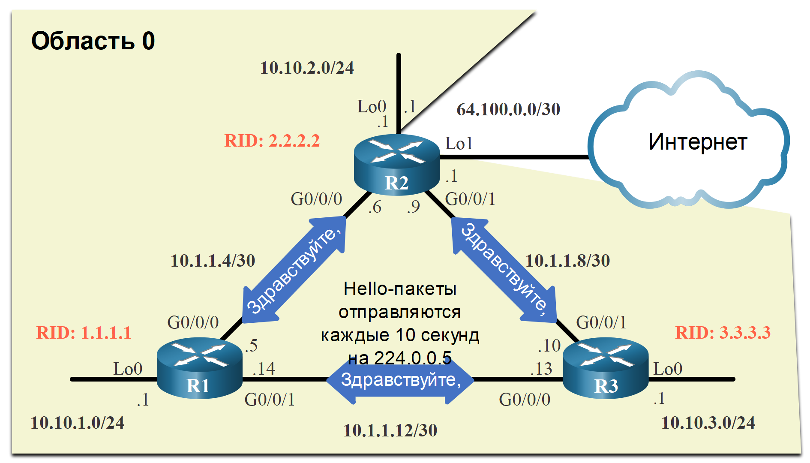

<!-- 2.4.1 -->
##  Стоимость как метрика Cisco OSPF

Следует помнить, что протокол маршрутизации использует метрику для определения оптимального пути пакета в сети. Метрика обозначает нагрузку, предполагаемую при отправке пакетов через указанный интерфейс. Протокол OSPF использует стоимость в качестве метрики. Путь с более низкой стоимостью является оптимальным.

Стоимость интерфейса обратно пропорциональна его пропускной способности. Следовательно, более высокая пропускная способность указывает на более низкую стоимость. Формула расчёта стоимости OSPF:

**Cost = reference bandwidth / interface bandwidth**

Заданная пропускная способность равна по умолчанию 10<sup>8</sup> (100000000). Таким образом, используется следующая формула расчета:

**Cost = 100,000,000 bps / interface bandwidth in bps**

Подробный расчёт стоимости см. в таблице на рисунке. Обратите внимание, что интерфейсы FastEthernet, Gigabit Ethernet и 10 GigE используют одинаковое значение стоимости, поскольку значение стоимости OSPF должно быть целым числом. Чтобы исправить эту ситуацию, можно:

- отрегулировать опорную пропускную способность с помощью команды **auto-cost reference-bandwidth** на каждом роутере OSPF;
- вручную задать значение стоимости OSPF с помощью команды **ip ospf cost** на необходимых интерфейсах.

**Значения стоимости протокола OSPF Cisco по умолчанию**


<!-- /courses/ensa-dl/ae8e6570-34fd-11eb-ba19-f1886492e0e4/aeb32b84-34fd-11eb-ba19-f1886492e0e4/assets/c5b6ee50-1c46-11ea-af56-e368b99e9723.svg -->

<!--
показан расчет стоимости Cisco OSPF по умолчанию для 10 гигабитной Ethernet, гигабитной Ethernet, быстрой Ethernet и Ethernet.
-->

<!-- 2.4.2 -->
## Настройка заданной пропускной способности

Значение стоимости должно быть целым числом. При получении в результате расчёта числа, которое меньше целого числа, протокол OSPF округляет его до ближайшего целого числа. Таким образом, стоимость OSPF, назначенная интерфейсу Gigabit Ethernet с базовой пропускной способностью по умолчанию 100 000 000 бит/с, будет равна 1, так как ближайшее целое число для 0.1 равно 0, а не 1.

**Cost = 100,000,000 bps / 1,000,000,000 = 1**

По этой причине все интерфейсы быстрее, чем Fast Ethernet, будут иметь ту же стоимость, что и интерфейс Fast Ethernet. Чтобы протокол OSPF правильно определил путь, необходимо изменить эталонную пропускную способность, задав более высокое значение с учетом сетей, содержащих каналы, скорость которых выше 100 Мбит/с.

Изменение эталонной пропускной способности фактически не влияет на ширину полосы пропускания канала. Подобное действие влияет только на расчёты при определении метрики. Чтобы отрегулировать эталонную пропускную способность, используйте команду конфигурации роутера **auto-cost reference-bandwidth** Mb/s.

```
Router(config-router)# auto-cost reference-bandwidth Mbps
```

Эту команду необходимо настроить на всех устройствах в домене OSPF. Обратите внимание, что значение выражается в Мбит/с, поэтому для корректировки затрат на Gigabit Ethernet используйте команду **auto-cost reference-bandwidth 1000**. Для 10 Gigabit Ethernet – команду **auto-cost reference-bandwidth 10000**.

Для возврата к значению заданной пропускной способности по умолчанию используйте команду **auto-cost reference-bandwidth 100**.

Какой бы метод ни использовался, важно применить конфигурацию ко всем устройствам в домене маршрутизации OSPF. В таблице показана стоимость OSPF в случае, когда значение заданной пропускной способности настроено для использования в каналах 10 Gigabit Ethernet. Значение заданной пропускной способности можно изменять каждый раз, когда обнаружены каналы, скорость которых выше Fast Ethernet (100 Мбит/с).

| Тип интерфейса | Заданная<br> пропускная способность (бит/с) |  | Значение<br> пропускной способности по умолчанию (бит/с) | Стоимость |
| --- | --- | --- | --- | --- |
| 10 Gigabit Ethernet<br>10 Gbps | 10 000 000 000 | ÷ | 10 000 000 000 | 1 |
| Gigabit Ethernet <br>1 Gbps | 10 000 000 000 | ÷ | 1 000 000 000 | 10 |
| Fast Ethernet <br>100 Mbps | 10 000 000 000 | ÷ | 100000000 | 100 |
| Ethernet <br>10 Mbps | 10 000 000 000 | ÷ | 10 000 000 | 1000 |

Используйте  команду  **show ip ospf interface g0/0/0** для проверки текущей стоимости OSPFv2, назначенной интерфейсу R1 GigabitEthernet 0/0/0. Обратите внимание, как отображается значение стоимости 1. Затем, после настройки опорной полосы, стоимость составляет 10. Это позволит масштабировать до 10 интерфейсов Gigabit Ethernet в будущем без повторной настройки опорной полосы пропускания.

**Примечание.** команда **auto-cost reference-bandwidth** должна быть настроена последовательно на всех устройствах в домене OSPF для обеспечения точного расчета маршрута.

```
R1# show ip ospf interface gigabitethernet0/0/0
GigabitEthernet0/0/0 is up, line protocol is up 
  Internet Address 10.1.1.5/30, Area 0, Attached via Interface Enable
  Process ID 10, Router ID 1.1.1.1, Network Type POINT_TO_POINT, Cost: 1
(output omitted)
R1# config t
Enter configuration commands, one per line.  End with CNTL/Z.
R1(config)# router ospf 10
R1(config-router)# auto-cost reference-bandwidth 10000
% OSPF: Reference bandwidth is changed.
        Please ensure reference bandwidth is consistent across all routers.
R1(config-router)# do show ip ospf interface gigabitethernet0/0/0
GigabitEthernet0/0 is up, line protocol is up
  Internet address is 172.16.1.1/24, Area 0
  Process ID 10, Router ID 1.1.1.1, Network Type BROADCAST, Cost: 10
  Transmit Delay is 1 sec, State DR, Priority 1
(output omitted)
```

<!-- 2.4.3 -->
## OSPF суммарная стоимость

Стоимость маршрута OSPF представляет собой накопленное значение от одного роутера до сети назначения. Если команда **auto-cost reference-bandwidth 10000** настроена на всех трех устройствах, то стоимость каналов между роутерами составляет 10. Стоимость интерфейсов loopback по умолчанию составляет 1, как показано на рисунке.


<!-- /courses/ensa-dl/ae8e6570-34fd-11eb-ba19-f1886492e0e4/aeb32b84-34fd-11eb-ba19-f1886492e0e4/assets/c5b7b1a2-1c46-11ea-af56-e368b99e9723.svg -->

<!--
стандартную топологию сети OSPFv2, описанную в 2.1.1, с добавлением стоимости каждого канала; стоимость всех каналов между роутерами — 10, а стоимость всех интерфейсов loopback — 1
-->

Таким образом, мы можем рассчитать стоимость для каждого роутера, чтобы достичь каждой сети. Например, общая стоимость R1 для достижения сети 10.10.2.0/24 равна 11. Это связано с тем, что стоимость связи с R2 равна 10, а стоимость loopback по умолчанию равна 1.  10 + 1 = 11. 

В таблице маршрутизации роутера R1 на рис. 2 показано, что метрика для доступа к сети LAN роутера R2 имеет стоимость 11.

```
R1# show ip route | include 10.10.2.0
O        10.10.2.0/24 [110/11] via 10.1.1.6, 01:05:02, GigabitEthernet0/0/0
R1# show ip route 10.10.2.0
Routing entry for 10.10.2.0/24
  Known via "ospf 10", distance 110, metric 11, type intra area
  Last update from 10.1.1.6 on GigabitEthernet0/0/0, 01:05:13 ago
  Routing Descriptor Blocks:
  * 10.1.1.6, from 2.2.2.2, 01:05:13 ago, via GigabitEthernet0/0/0
      Route metric is 11, traffic share count is 1
R1#
```

<!-- 2.4.4 -->
##  Задание стоимости OSPF вручную

Значения стоимости OSPF можно изменять, чтобы повлиять на маршрут, выбранный OSPF. Например, в текущей конфигурации R1 балансирует нагрузку на сеть 10.1.1.8/30. Он отправит некоторый трафик на R2 и на R3. Вы можете увидеть это в таблице маршрутизации.

```
R1# show ip route ospf | begin 10
      10.0.0.0/8 is variably subnetted, 9 subnets, 3 masks
O        10.1.1.8/30 [110/20] via 10.1.1.13, 00:54:50, GigabitEthernet0/0/1
                     [110/20] via 10.1.1.6, 00:55:14, GigabitEthernet0/0/0
(output omitted)
R1#
```

Администратор может захотеть, чтобы трафик проходил через R2 и использовал R3 в качестве резервного маршрута в случае, если связь между R1 и R2 падает.

Другая причина изменения стоимости заключается в том, что другие поставщики могут рассчитать OSPF другим способом. Управляя стоимостью затрат, администратор может убедиться, что расходы на маршрут, совместно распределяемые между роутерами OSPF, точно отражены в таблицах маршрутизации.

Чтобы изменить значение стоимости, сообщаемое локальным роутером OSPF другим устройствам OSPF, используйте команду конфигурации интерфейса **ip ospf cost** _value_. На рисунке нам нужно изменить стоимость интерфейсов loopback на 10 для имитации скоростей Gigabit Ethernet. Кроме того, мы изменим стоимость канала между R2 и R3 на 30, чтобы этот канал использовался как резервный канал.


<!-- /courses/ensa-dl/ae8e6570-34fd-11eb-ba19-f1886492e0e4/aeb32b84-34fd-11eb-ba19-f1886492e0e4/assets/c5b89c01-1c46-11ea-af56-e368b99e9723.svg -->

<!--
стандартную топологию сети OSPFv2, описанную в 2.1.1, с добавлением стоимости каждого канала. Все loopbak интерфейсы были сконфигурированы со стоимостью 10. Стоимость каналов R1-R2 и R2-R3 также составляет 10. Стоимость канала R1-to-R3 составляет 30.
-->

В следующем примере приведена конфигурация для R1.

```
R1(config)# interface g0/0/1
R1(config-if)# ip ospf cost 30
R1(config-if)# interface lo0
R1(config-if)# ip ospf cost 10
R1(config-if)# end
R1#
```

Предполагая, что затраты OSPF для R2 и R3 были настроены в соответствии с топологией на рисунке выше, маршруты OSPF для R1 будут иметь следующие значения стоимости. Обратите внимание, что R1 больше не балансирует нагрузку на сеть 10.1.1.8/30. Фактически все маршруты проходят через R2 по желанию администратора сети.

```
R1# show ip route ospf | begin 10
      10.0.0.0/8 is variably subnetted, 9 subnets, 3 masks
O        10.1.1.8/30 [110/20] via 10.1.1.6, 01:18:25, GigabitEthernet0/0/0
O        10.10.2.0/24 [110/20] via 10.1.1.6, 00:04:31, GigabitEthernet0/0/0
O        10.10.3.0/24 [110/30] via 10.1.1.6, 00:03:21, GigabitEthernet0/0/0
R1#
```

**Примечание.** хотя использование команды **ip ospf cost** является рекомендуемым методом для манипулирования значениями стоимости OSPF, администратор также может сделать это с помощью команды конфигурации интерфейса **bandwidth** _kbps_. Однако это будет работать только в том случае, если все роутеры являются устройствами Cisco.

<!-- 2.4.5 -->
## Тестирование аварийного переключения на резервный маршрут

Что произойдет, если связь между R1 и R2 упадет? Мы можем имитировать это путем отключения интерфейса Gigabit Ethernet 0/0/0 и проверки обновления таблицы маршрутизации для использования R3 в качестве роутера следующего перехода. Обратите внимание, что R1 теперь может достичь сети 10.1.1.4/30 через R3 со стоимостью 50.

```
R1(config)# interface g0/0/0
R1(config-if)# shutdown
*Jun  7 03:41:34.866: %OSPF-5-ADJCHG: Process 10, Nbr 2.2.2.2 on GigabitEthernet0/0/0 from FULL to DOWN, Neighbor Down: Interface down or detached
*Jun  7 03:41:36.865: %LINK-5-CHANGED: Interface GigabitEthernet0/0/0, changed state to administratively down
*Jun  7 03:41:37.865: %LINEPROTO-5-UPDOWN: Line protocol on Interface GigabitEthernet0/0/0, changed state to down
R1(config-if)# end
R1# show ip route ospf | begin 10
      10.0.0.0/8 is variably subnetted, 8 subnets, 3 masks
O        10.1.1.4/30 [110/50] via 10.1.1.13, 00:00:14, GigabitEthernet0/0/1
O        10.1.1.8/30 [110/40] via 10.1.1.13, 00:00:14, GigabitEthernet0/0/1
O        10.10.2.0/24 [110/50] via 10.1.1.13, 00:00:14, GigabitEthernet0/0/1
O        10.10.3.0/24 [110/40] via 10.1.1.13, 00:00:14, GigabitEthernet0/0/1
R1#
```

<!-- 2.4.6 -->
<!-- syntax -->

<!-- 2.4.7 -->
## Интервалы отправки пакетов приветствия

Пакеты приветствия OSPF передаются на групповой адрес 224.0.0.5 в сети IPv4 и на адрес FF02::5 в сети IPv6 (все роутеры используют OSPF) с интервалами 10 секунд, как показано на рисунке. Это значение таймера по умолчанию для сетей коллективного доступа и «точка-точка»-сетей.

**Примечание.** Пакеты приветствия не отправляются на смоделированные интерфейсы локальной сети, так как эти интерфейсы были настроены как пассивные с помощью команды конфигурации **passive-interface**.

Интервал простоя является интервалом времени в секундах, в течение которого роутер ожидает получения пакета приветствия перед тем, как объявить соседнее устройство неработающим. Если интервал простоя истекает до получения пакета приветствия, то OSPF удаляет это соседнее устройство из своей базы данных состояний каналов (LSDB). Роутер выполняет лавинную рассылку базы данных состояний каналов, содержащей данные о неработающем соседнем устройстве, из всех интерфейсов, использующих OSPF. По умолчанию в сетях коллективного доступа и сетях типа «точка-точка» в устройствах Cisco интервал простоя равен 4 интервалам, исползуемым для отправки hello-пакетов (40 секунд);

**Примечание.** В нешироковещательных сетях с коллективным доступом (NBMA) hello-интервал по умолчанию равен 30 секундам, а dead-интервал по умолчанию — 120 секундам. Сети NBMA выходят за рамки этого модуля.


<!-- /courses/ensa-dl/ae8e6570-34fd-11eb-ba19-f1886492e0e4/aeb32b84-34fd-11eb-ba19-f1886492e0e4/assets/c5bb3410-1c46-11ea-af56-e368b99e9723.svg -->

<!--
Стандартная топология сети OSPFv2, используемая в этом модуле, как описано в 2.1.1, с добавлением пакетов приветствия, обмениваемых между роутерами, отправляемыми каждые 10 секунд на 224.0.0.5.
-->

<!-- 2.4.8 -->
## Проверка интервалов приветствия (hello) и простоя (dead) в OSPF

Интервалы приветствия (hello) и простоя (dead) OSPF настраиваются для каждого интерфейса. Они должны совпадать, иначе отношения смежности не установятся. Для проверки настроенных в настоящее время интервалов на интерфейсах OSPFv2 используйте команду **show ip ospf interface**, как показано на примере. Интервалы приветствия и простоя Serial 0/0/0 по умолчанию настроены на 10 и 40 секунд соответственно.

```
R1# show ip ospf interface g0/0/0
GigabitEthernet0/0/0 is up, line protocol is up 
  Internet Address 10.1.1.5/30, Area 0, Attached via Interface Enable
  Process ID 10, Router ID 1.1.1.1, Network Type POINT_TO_POINT, Cost: 10
  Topology-MTID    Cost    Disabled    Shutdown      Topology Name
        0           10        no          no            Base
  Enabled by interface config, including secondary ip addresses
  Transmit Delay is 1 sec, State POINT_TO_POINT
  Timer intervals configured, Hello 10, Dead 40, Wait 40, Retransmit 5
    oob-resync timeout 40
    Hello due in 00:00:06
  Supports Link-local Signaling (LLS)
  Cisco NSF helper support enabled
  IETF NSF helper support enabled
  Index 1/2/2, flood queue length 0
  Next 0x0(0)/0x0(0)/0x0(0)
  Last flood scan length is 1, maximum is 1
  Last flood scan time is 0 msec, maximum is 0 msec
  Neighbor Count is 1, Adjacent neighbor count is 1 
    Adjacent with neighbor 2.2.2.2
  Suppress hello for 0 neighbor(s)
R1#
```

Чтобы увидеть отсчет времени dead-интервала от 40 секунд, используйте команду **show ip ospf neighbor**, как показано в следующем примере. По умолчанию это значение обновляется каждые 10 секунд, когда R1 получает приветствие от соседнего устройства.

```
R1# show ip ospf neighbor 
Neighbor ID     Pri   State           Dead Time   Address         Interface
3.3.3.3           0   FULL/  -        00:00:35    10.1.1.13       GigabitEthernet0/0/1
2.2.2.2           0   FULL/  -        00:00:31    10.1.1.6        GigabitEthernet0/0/0
R1#
```

<!-- 2.4.9 -->
## Изменение интервалов OSPFv2

Рекомендуется изменять таймеры OSPF, чтобы роутеры быстрее могли обнаружить сбои в сети. Это увеличивает трафик, но иногда важнее обеспечить быструю сходимость, чем экономить на трафике.

**Примечание.** Интервалы приветствия (hello) и простоя (dead) по умолчанию основаны на практических рекомендациях и могут быть изменены лишь в крайних случаях.

Интервалы приветствия (hello) и простоя (dead) OSPFv2 можно изменить вручную с помощью следующих команд режима интерфейсной настройки:

```
Router(config-if)# ip ospf hello-interval seconds
```

```
Router(config-if)# ip ospf dead-interval seconds
```

Для сброса интервалов по умолчанию, используйте команды **no ip ospf hello-interval** и **no ip ospf dead-interval**.

В примере интервал Hello для связи между R1 и R2 изменен на 5 секунд. Сразу после изменения интервала приветствия (hello) Cisco IOS автоматически приравнивает интервал простоя (dead) к четырем интервалам приветствия. Однако можно задокументировать новый интервал в конфигурации вручную, установив для него 20 секунд, как показано на рисунке.

Как видно в выделенном сообщении смежности OSPFv2, R1 и R2 теряют отношения смежности в момент истечения таймера простоя на R1. Причина в том, что R1 и R2 должны быть настроены с одинаковым интервалом приветствия. Для проверки отношений смежности используйте команду **show ip ospf neighbor** на R1, как показано на рис. 3. Обратите внимание, что единственным соседним устройством указан роутер 3.3.3.3 (R3), а R1 больше не является смежным с соседним устройством 2.2.2.2 (R2).

```
R1(config)# interface g0/0/0 
R1(config-if)# ip ospf hello-interval 5 
R1(config-if)# ip ospf dead-interval 20 
R1(config-if)# 
*Jun  7 04:56:07.571: %OSPF-5-ADJCHG: Process 10, Nbr 2.2.2.2 on GigabitEthernet0/0/0 from FULL to DOWN, Neighbor Down: Dead timer expired 
R1(config-if)# end 
R1# show ip ospf neighbor 
Neighbor ID     Pri   State           Dead Time   Address         Interface
3.3.3.3           0   FULL/  -        00:00:37    10.1.1.13       GigabitEthernet0/0/1
R1#
```

Для восстановления смежности между R1 и R2 интервал приветствия интерфейса R2 Gigabit Ethernet 0/0/0 устанавливается равным 5 секундам, как показано в следующем примере. Почти сразу IOS отображает сообщение, что смежность была установлена с состоянием FULL. Для проверки временных интервалов, сконфигурированных на интерфейсах, используйте команду **show ip ospf interface**. Обратите внимание, что время приветствия (hello) составляет 5 секунд, а время простоя (dead) было автоматически настроено на 20 секунд, вместо 40 секунд по умолчанию.

```
R2(config)# interface g0/0/0
R2(config-if)# ip ospf hello-interval 5
*Jun  7 15:08:30.211: %OSPF-5-ADJCHG: Process 10, Nbr 1.1.1.1 on GigabitEthernet0/0/0 from LOADING to FULL, Loading Done
R2(config-if)# end
R2# show ip ospf interface g0/0/0 | include Timer
  Timer intervals configured, Hello 5, Dead 20, Wait 20, Retransmit 5
R2# show ip ospf neighbor
Neighbor ID     Pri   State           Dead Time   Address         Interface
3.3.3.3           0   FULL/  -        00:00:38    10.1.1.10       GigabitEthernet0/0/1
1.1.1.1           0   FULL/  -        00:00:17    10.1.1.5        GigabitEthernet0/0/0
R2#
```

<!-- 2.4.10 -->
<!-- syntax -->

