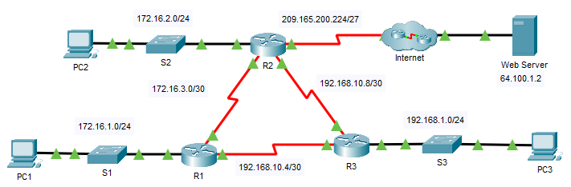

---

> **ВАЖНО**
> 
> Форма для ответов на вопросы будет доступна только при развертывании лабораторной работы 

---

## Топология



## Таблица адресации 

| Устройство | Интерфейс | IPv4-адрес      | Маска подсети   | Шлюз по умолчанию |
|------------|-----------|-----------------|-----------------|-------------------|
| R1         | G0/0      | 172.16.1.1      | 255.255.255.0   | —                 |
| R1         | S0/0/0    | 172.16.3.1      | 255.255.255.252 | —                 |
| R1         | S0/0/1    | 192.168.10.5    | 255.255.255.252 | —                 |
| R2         | G0/0      | 172.16.2.1      | 255.255.255.0   | —                 |
| R2         | S0/0/0    | 172.16.3.2      | 255.255.255.252 | —                 |
| R2         | S0/0/1    | 192.168.10.9    | 255.255.255.252 | —                 |
| R2         | S0/1/0    | 209.165.200.225 | 255.255.255.224 | —                 |
| R3         | G0/0      | 192.168.1.1     | 255.255.255.0   | —                 |
| R3         | S0/0/0    | 192.168.10.6    | 255.255.255.252 | —                 |
| R3         | S0/0/1    | 192.168.10.10   | 255.255.255.252 | —                 |
| PC1        | NIC       | 172.16.1.2      | 255.255.255.0   | 172.16.1.1        |
| PC2        | NIC       | 172.16.2.2      | 255.255.255.0   | 172.16.2.1        |
| PC3        | NIC       | 192.168.1.2     | 255.255.255.0   | 192.168.1.1       |
| Веб-сервер | NIC       | 64.100.1.2      | 255.255.255.0   | 64.100.1.1        |

## Цели

Часть 1. Изменить настройки OSPF по умолчанию.

Часть 2. Проверить связь.

## Сценарий

В этом задании OSPF уже настроен, все конечные устройства полностью подключены. Вы будете модифицировать конфигурации маршрутизации OSPF по умолчанию путем изменения таймеров приветствия (hello) и простоя (dead), а также регулировки пропускной способности канала. Затем вам нужно убедиться в восстановлении полного подключения для всех конечных устройств.

## Инструкции

### Часть 1. Изменение настроек OSPF по умолчанию

**Шаг 1. Протестируйте возможность соединения между всеми конечными устройствами**

Перед изменением настроек OSPF убедитесь, что все ПК могут успешно отправлять эхо-запросы на веб-сервер и друг другу.

**Шаг 2. Настройте таймеры приветствия (hello) и простоя (dead) между R1 и R2**

1.  Введите следующие команды на роутере **R1**:

    ```
    R1(config)# interface s0/0/0
    R1(config-if)# ip ospf hello-interval 15
    R1(config-if)# ip ospf dead-interval 60
    ```

2.  Через небольшой интервал времени произойдет сбой подключения OSPF к **R2**, как показанно в выводе устройства.

    ```
    00:02:40: %OSPF-5-ADJCHG: Process 1, Nbr 209.165.200.225 on Serial0/0/0 from FULL to DOWN, Neighbor Down: Dead timer expired

    00:02:40: %OSPF-5-ADJCHG: Process 1, Nbr 209.165.200.225 on Serial0/0/0 from FULL to DOWN, Neighbor Down: Interface down or detached
    ```

    Для поддержки отношений смежности на обеих сторонах соединения таймеры должны быть настроены одинаково. Определите интерфейс на R2, который подключен к R1. Отрегулируйте таймеры на интерфейсе R2 в соответствии с настройками на **R1**.

    По истечении короткого периода времени вы увидите сообщение о состоянии, указывающее, что смежность OSPF была восстановлена.

    ```
    00:21:52: %OSPF-5-ADJCHG: Process 1, Nbr 192.168.10.5 on Serial0/0/0 from LOADING to FULL, Loading Done
    ```

**Шаг 3. Настройте пропускную способность роутера R1**

1.  Выполните трассировку маршрута между **PC1** и веб-сервером, расположенным по адресу 64.100.1.2. Обратите внимание, что путь от **PC1** к 64.100.1.2 маршрутизируется через **R2**. OSPF предпочитает более низкую стоимость пути.

    ```
    C:\ > tracert 64.100.1.2

    Tracing route to 64.100.1.2 over a maximum of 30 hops:

    1 1 ms 0 ms 8 ms 172.16.1.1
    2 0 ms 1 ms 0 ms 172.16.3.2
    3 1 ms 9 ms 2 ms 209.165.200.226
    4 * 1 ms 0 ms 64.100.1.2

    Trace complete.
    ```

2.  Для последовательного интерфейса 0/0/0 **R1** установите пропускную способность равной 64 Кбит/с. Это изменит не фактическую скорость порта, а метрику, которую процесс OSPF будет использовать на **R1** для расчёта оптимальных маршрутов.

    ```
    R1(config-if)# bandwidth 64
    ```

3.  Выполните трассировку маршрута между **PC1** и веб-сервером, расположенным по адресу 64.100.1.2. Обратите внимание, что путь от **PC1** к 64.100.1.2 перенаправляется через роутер **R3**. OSPF предпочитает более низкую стоимость пути.

    ```
    C:\ > tracert 64.100.1.2

    Tracing route to 64.100.1.2 over a maximum of 30 hops:

    1 1 ms 0 ms 3 ms 172.16.1.1
    2 8 ms 1 ms 1 ms 192.168.10.6
    3 2 ms 0 ms 2 ms 172.16.3.2
    4 2 ms 3 ms 1 ms 209.165.200.226
    5 2 ms 11 ms 11 ms 64.100.1.2

    Trace complete.
    ```

### Часть 2. Проверка подключения

Убедитесь, что все ПК могут успешно отправлять эхо-запросы на веб-сервер и друг другу.

<!-- [Скачать файл Packet Tracer для локального запуска](./assets/2.4.11-lab.pka) -->
