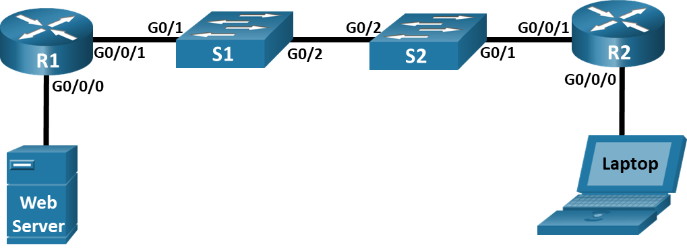

---

> **ВАЖНО**
> 
> Форма для ответов на вопросы будет доступна только при развертывании лабораторной работы 

---

## Топология



## Таблица адресации

| Устройство     | Интерфейс | IP-адрес     | Маска подсети | Шлюз по умолчанию |
|----------------|-----------|--------------|---------------|-------------------|
| **R1**         | G0/0/1    | 10.53.0.1    | 255.255.255.0 | Н/Д (недоступно)  |
| **R1**         | G0/0/0    | 172.16.1.1   | 255.255.255.0 | Н/Д (недоступно)  |
| **R2**         | G0/0/1    | 10.53.0.2    | 255.255.255.0 | Н/Д (недоступно)  |
| **R2**         | G0/0/0    | 192.168.1.1  | 255.255.255.0 | Н/Д (недоступно)  |
| **Веб-сервер** | F0        | 172.16.1.10  | 255.255.255.0 | 172.16.1.1        |
| **Laptop**     | F0        | 192.168.1.10 | 255.255.255.0 | 192.168.1.1       |

## Задачи

Часть 1. Создание сети и настройка основных параметров устройства

Часть 2. Настройка и проверка базовой работы протокола OSPFv2 для одной области

Часть 3. Оптимизация и проверка конфигурации OSPFv2 для одной области

## Общие сведения и сценарий

Вам было поручено настроить сеть небольшой компании с использованием протокола OSPFv2. R1 будет совместно использовать информацию о маршруте по умолчанию для R2. После первоначальной настройки организация попросила оптимизировать конфигурацию, чтобы уменьшить трафик протокола и гарантировать, что R1 продолжает контролировать маршрутизацию.

**Примечание**: Оборудование, необходимое для этого задания, находится на полке в стойке.

## Инструкции

### Часть 1. Создание сети и настройка основных параметров устройства

**Шаг 1. Создайте сеть согласно топологии.**

Поместите необходимые устройства на стойку и стол. Включите ПК и подключите устройства в соответствии с топологией. Чтобы выбрать правильный порт на коммутаторе, щелкните правой кнопкой мыши и выберите **Inspect Front**. При необходимости используйте инструмент «Zoom». Наведите курсор мыши на порты, чтобы увидеть номера портов. Packet Tracer оценит правильность соединения кабелей и портов.

1.  На **полке** есть несколько коммутаторов, маршрутизаторов и других устройств. Нажмите на маршрутизаторы **R1** и **R2** и коммутаторы **S1**, **S2** и перетащите в **стойку.** Нажмите на **Web-Server** и перетащите его в **стойку**. Нажмите на**Laptop** и перетащите его на стол **Table.**

2.  Включите маршрутизаторы и ноутбук.

3.  На монтажной панели **Cable Pegboard**, нажмите на медный прямой кабель **Copper Straight-Through**. Нажмите на порт **GigabitEthernet0/1** на **S1**, а затем на порт **GigabitEthernet0/0/1** на **R1** , чтобы связать их.

4.  На монтажной панели **Cable Pegboard**, щелкните медный прямой кабель **(Copper Straight-Through)**. Нажмите на порт **GigabitEthernet0/1** на **S2**, а затем на порт **GigabitEthernet0/0/1** на **R2** , чтобы связать их.

5.  На монтажной панели **Cable Pegboard**, нажмите на перекресный кабель **Copper Cross-Over**. Нажмите на порт **GigabitEthernet0/2** на **S1** , а затем на порт **GigabitEthernet0/2** на **S2**, чтобы связать их. Вы должны увидеть кабель, соединяющий два порта.

6.  На монтажной панели **Cable Pegboard**, нажмите на медный прямой кабель **(Copper Straight-Through)**. Нажмите на порт **GigabitEthernet0/0/0** на **R1**, а затем на порт **FastEthernet0** на **Web Server** , чтобы связать их.

7.  На монтажной панели **Cable Pegboard**, нажмите на медный прямой кабель **Copper Straight-Through**. Нажмите на порт **GigabitEthernet0/0/0** на **R2**, а затем на порт **FastetherNet0** на **Laptop**, чтобы связать их.

Осмотрите сетевые подключения. Изначально при подключении устройств к порту коммутатора индикаторы интерфейсов будут желтыми. Через минуту или около того индикаторы станут зелеными.

**Шаг 2. Произведите базовую настройку маршрутизаторов и коммутатора.**

1.  На монтажной панели **Cable Pegboard** на **консольный** кабель.

2.  Подключите консольный кабель между устройством и **Laptop**. Для коммутаторов перейдите в режим **Inspect Rear**, чтобы найти **консольный** порт.

3.  Назначьте имя устройству в соответствии с **топологией**.

4.  Отключите поиск DNS, чтобы предотвратить попытки маршрутизатора неверно преобразовывать введенные команды таким образом, как будто они являются именами узлов.

5.  Назначьте **class** в качестве зашифрованного пароля привилегированного режима EXEC.

6.  Назначьте **cisco** в качестве пароля консоли и включите вход в систему по паролю.

7.  Установите **cisco** в качестве пароля виртуального терминала и активируйте вход.

8.  Зашифруйте открытые пароли.

9.  Создайте баннер с предупреждением о запрете несанкционированного доступа к устройству.

10. Сохраните текущую конфигурацию в файл загрузочной конфигурации.

11. Нажмите на один конец **консольного**кабеля и перетащите его обратно на **Cable Pegboard**.

12. Повторяйте шаг 2 для каждого устройства до тех пор, пока **R2**, **S1**и **S2** также не будут настроены с базовыми параметрами.

**Шаг 3. Настройте параметры для сервера и ноутбука.**

Настройте статические IP-адреса на **Web Server** и **Laptop** в соответсвии **Таблицей Адресов**.

1.  Нажмите на **Web Server** \> **Desktop** \> **IP Configuration**. Введите адрес IPv4, маску подсети и сведения о шлюзе по умолчанию для **Web Server** в соответствии с **таблицей адресации**.

2.  Закройте или сверните окно **Web server**.

3.  Повторите предыдущие шаги, чтобы назначить сведения об адресе IPv4 для **Laptop**, как указано в **таблице адресации**.

### Часть 2. Настройка и проверка базовой работы протокола OSPFv2 для одной области

**Шаг 1. Настройте адреса интерфейса и базового OSPFv2 на каждом маршрутизаторе.**

1.  Подключите **консольный** кабель между **R1** и **Laptop**.

2.  Настройте адреса интерфейсов на каждом маршрутизаторе, как показано в **таблице адресации**.

3.  Перейдите в режим конфигурации маршрутизатора OSPF, используя идентификатор процесса 56.

4.  Настройте статический идентификатор маршрутизатора для каждого маршрутизатора (1.1.1.1 для R1, 2.2.2.2 для R2).

5.  Настройте сетевые инструкции для сети между R1 и R2, поместив ее в область Area 0.

6.  Настройте сетевую инструкцию для других сетей, подключенных к R1 и R2, и поместите их в область Area 0. Обратите внимание, что сетевая инструкция для локальной сети, подключенной к R1, не будет оцениваться, поскольку эта сеть будет удалена позже в задании.

7.  Переключите консольный кабель к **R2** и повторите подшаги с b до f для **R2**. После настройки R1 и R2 вы можете просто использовать Telnet между ними, если хотите, вместо того, чтобы перемещать консольный кабель каждый раз.

8.  Убедитесь, что OSPFv2 работает между маршрутизаторами. Выполните команду, чтобы убедиться, что R1 и R2 сформировали смежность.

    - ответьте на вопрос №1

9.  На R1 выполните команду **show ip route ospf**, чтобы убедиться, что сеть R2 G0/0/0 присутствует в таблице маршрутизации.

    ```
    O 192.168.1.0 \[110/2\] via 10.53.0.2, 00:20:26, GigabitEthernet0/0/1
    ```

10. Выберите **Laptop \> Command Prompt**, а затем запустите эхо-запрос до **Web server** на адрес 172.16.1.10. После одного или двух тайм-аутов эхо-запросдолжен быть успешным. В противном случае устраняйте неполадки физических подключений и конфигурации устройств.

### Часть 3. Оптимизация и проверка конфигурации OSPFv2 для одной области

**Шаг 1. Реализация различных оптимизаций на каждом маршрутизаторе.**

1.  На R1 настройте приоритет OSPF интерфейса G0/0/1 на 50, чтобы убедиться, что **R1** является назначенным маршрутизатором **DR**.

2.  Настройте таймеры OSPF на G0/0/1 каждого маршрутизатора для таймера приветствия, составляющего 30 секунд.

3.  На R1 удалите сетевую инструкцию OSPF для сети 172.16.1.0, а затем настройте статический маршрут по умолчанию, который использует **интерфейс G0/0/0** в качестве интерфейса выхода. Затем распространите маршрут по умолчанию в OSPF. Обратите внимание на сообщение консоли после установки маршрута по умолчанию.

4.  Измените базовую пропускную способность для маршрутизаторов. После этой настройки перезапустите OSPF с помощью команды **clear ip ospf process** . Обратите внимание на сообщение консоли после установки новой опорной полосы пропускания.

**Шаг 2. Убедитесь, что оптимизация OSPFv2 реализовалась.**

1.  Выполните команду **show ip ospf interface g0/0/1** на **R1** и убедитесь, что приоритет интерфейса установлен равным 50, а временные интервалы — Hello 30, Dead 120, а тип сети по умолчанию — Broadcast

2.  На **R1** выполните команду **show ip route ospf**, чтобы убедиться, что сеть R2 G0/0/0 присутствует в таблице маршрутизации. Обратите внимание на разницу в метрике между этим выходным и предыдущим выходным.

3.  Введите команду **show ip route ospf** на маршрутизаторе **R2**. Единственная информация о маршруте OSPF должна быть распространяемый по умолчанию маршрут R1.

4.  С **Laptop**снова выполните эхо-запрос до **Web server** . Ping должен пройти успешно.

    ```
    O 192.168.1.0/24 [110/11] via 10.53.0.2, 00:04:28, GigabitEthernet0/0/1
    O*E2 0.0.0.0/0 [110/1] via 10.53.0.1, 00:00:08, GigabitEthernet0/0/1
    ```

    - ответьте на вопрос №2

[Скачать файл Packet Tracer для локального запуска](./assets/2.7.2-lab.pka)
