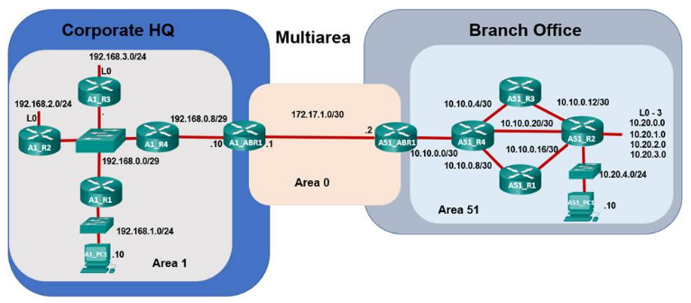

---

> **ВАЖНО**
> 
> Форма для ответов на вопросы будет доступна только при развертывании лабораторной работы 

---

## Топология



## Задачи

Часть 1: Оценка работы сети OSPF для одной области

Часть 2: Оценка работы сети OSPF для нескольких областей

Часть 3: Настройка новой области и подключение к магистральной области **Area 0** через Интернет

## Общие сведения и сценарий

**Часть 1: Начало**

Компания Casual Recording Company, базирующаяся в Сан-Паулу, Бразилия, предоставляет мини-студии звукозаписи самообслуживания по всему городу, так что любой может арендовать время и записывать свои песни самостоятельно. CRC начал с сети OSPF для одной области, расположенной в одном здании. Эта идея была очень популярна, и, как следствие, бизнес вырос, в результате чего компания расширилась и превратилась в филиал во втором здании в дальнем конце города. Они продолжали использовать OSPF с одной областью. Вы можете оценить влияние на расширение сети.

**Часть 2: Бизнес процветает**

ИТ-отдел CRC решил перейти на сеть OSPF для нескольких областей. Вы оцените влияние и выгоды, полученные от изменения, чтобы определить, было ли это правильным решением.

**Часть 3: Расширение CRC продолжается**

CRC продолжает расти и откроет новый филиал в Монтевидео, Уругвай. Вы настроите пограничный маршрутизатор области (ABR) для новой области и физически подключите сеть филиала к корпоративной сети штаб-квартиры через Интернет.

## Инструкции

## Часть 2: Оценка работы сети OSPF для нескольких областей

В этой части CRC перешел от OSPF для одной области к OSPF для некольких областей.

**Шаг 1. Ознакомьтесь с устройствами OSPF Area 1 в Corporate HQ и Branch Office.**

1.  Нажмите на **значок города** для **Сан-Паулу**, а затем щелкните **Corporate HQ**. Щелкните на **значок стойки**, представляющий **Sao Paulo HQ Wiring Closet**.

2.  Нажмите на **A1_ABR1** и затем выбирете вкладку **CLI**.

3.  Терминал должен показать, что интерфейсы G0/0 и G1/0 активны и что две смежности были установлены, как показано ниже. Если нет, дождитесь завершения процесса загрузки OSPF.

    ```
    <output omitted>
    Press RETURN to get started!


    %LINEPROTO-5-UPDOWN: Line protocol on Interface GigabitEthernet1/0, changed state to up
    %LINEPROTO-5-UPDOWN: Line protocol on Interface GigabitEthernet0/0, changed state to up
    23:00:40: %OSPF-5-ADJCHG: Process 1, Nbr 172.17.1.2 on GigabitEthernet0/0 from LOADING to FULL, Loading Done
    23:00:45: %OSPF-5-ADJCHG: Process 1, Nbr 192.168.0.9 on GigabitEthernet1/0 from LOADING to FULL, Loading Done

    A1_ABR1>
    ```

4.  Проверьте вывод команды **show ip route**. Обратите внимание, что таблица маршрутизации на маршрутизаторе A1_ABR1 короче, чем на маршрутизаторе B1_R5 в примере OPSF для одной области в части 1.

    - ответьте на вопрос №1

5.  Выполните команду **show ip ospf** на маршрутизаторе A1_ABR1.

    Вопросы:

    - ответьте на вопрос №2

    - ответьте на вопрос №3

6.  Держите окно консоли для A1_ABR1 открытым и выберите **маршрутизатор A1_R2**. Выполните команды **show ip route** и **show ip ospf** , а затем сравните вывод с выводом на A1_ABR1. Аналогичные сети должны отображаться, и количество выполнения алгоритма SPF должно быть одинаковым.

    - ответьте на вопрос №4

**Шаг 2. Изучите влияние изменений в Area 51.**

1.  Держите окна консоли открытыми для обоих маршрутизаторов **A1_ABR1** и **A1_R2**.

2.  На синей панели инструментов вверху дважды нажмите кнопку **«Назад»**, чтобы вернуться к обзору города **Сан-Паулу**. Вы также можете использовать сочетания клавиш **Alt + стрелка влево**.

3.  Нажмите на **Branch Office**и затем на иконку **rack** которая представляет собой **Sao Paulo Branch Office Wiring Closet**.

4.  Нажмите на **A51_R4** и затем выбирете вкладку **CLI**.

5.  Терминал должен показать, что все четыре интерфейса Gigabit Ethernet работают и что четыре смежности были установлены.

    ```
    <output omitted>
    Press RETURN to get started!


    %LINEPROTO-5-UPDOWN: Line protocol on Interface GigabitEthernet4/0, changed state to up
    %LINK-5-CHANGED: Interface GigabitEthernet1/0, changed state to up
    %LINEPROTO-5-UPDOWN: Line protocol on Interface GigabitEthernet1/0, changed state to up
    %LINK-5-CHANGED: Interface GigabitEthernet2/0, changed state to up
    %LINEPROTO-5-UPDOWN: Line protocol on Interface GigabitEthernet2/0, changed state to up
    %LINK-5-CHANGED: Interface GigabitEthernet3/0, changed state to up
    %LINEPROTO-5-UPDOWN: Line protocol on Interface GigabitEthernet3/0, changed state to up
    23:00:40: %OSPF-5-ADJCHG: Process 1, Nbr 1.1.1.1 on GigabitEthernet1/0 from LOADING to FULL, Loading Done
    23:00:40: %OSPF-5-ADJCHG: Process 1, Nbr 172.17.1.2 on GigabitEthernet4/0 from LOADING to FULL, Loading Done
    23:00:40: %OSPF-5-ADJCHG: Process 1, Nbr 3.3.3.3 on GigabitEthernet3/0 from LOADING to FULL, Loading Done
    23:00:45: %OSPF-5-ADJCHG: Process 1, Nbr 2.2.2.2 on GigabitEthernet2/0 from LOADING to FULL, Loading Done


    A51_R4\>
    ```

6.  Выполните команду **show ip route**. Сравните выходные данные A51_R4 с выходными данными A1_ABR1 и A1_R2. Обратите внимание, что кроме нескольких подключенных или локальных маршрутов отображаются одни и те же сети.

    - ответьте на вопрос №5

7.  Выполните команду **show ip ospf**.

    - ответьте на вопрос №6

8.  Держите окно консоли для A51_R4 открытым. Нажмите на **A51_R2**. На вкладке **Physical** отключите питание, чтобы имитировать сбой питания.

9.  Вернитесь в окно консоли для **A51_R4**. Вы должны увидеть консольное сообщение о том, что смежность с A51_R2 разорвана.

    ```
    %LINK-3-UPDOWN: Interface GigabitEthernet2/0, changed state to down
    %LINEPROTO-5-UPDOWN: Line protocol on Interface GigabitEthernet2/0, changed state to down
    23:30:33: %OSPF-5-ADJCHG: Process 1, Nbr 2.2.2.2 on GigabitEthernet2/0 from FULL to DOWN, Neighbor Down: Interface down or detached
    ```

10. Повторно введите команды **show ip route** и **show ip ospf**.

    Вопросы:

    - ответьте на вопрос №7

    - ответьте на вопрос №8

    - ответьте на вопрос №9

11. **A51_R2** Перейдите к A1_R2 и повторно выполните команды **show ip route** и **show ip ospf**.

    Вопросы:

    - ответьте на вопрос №10

    - ответьте на вопрос №11

    - ответьте на вопрос №12

    **Примечание**. Пограничный маршрутизатор Area 51, A51_ABR1 суммировал сети 10.0.0.0/8 и объявляет сводный маршрут во все остальные области. Изменения топологии в Area 51, такие как сбои питания, отключения интерфейса или изменения сети OSPF, приведут к перерасчету SPF на всех маршрутизаторах в Area 51, но НЕ вызовут пересчета SPF в Area 1.

**Шаг 3. Суммарные маршруты Area 1, которые будут отправлены в Area 51.**

1.  Выберите маршрутизатор **A51_R4** и выполните команду **show ip route**.

    Сравните выходные данные A51_R4 с выводом на A1_R4. Следует заметить, что все сети 192.168.0.0 из Area 1 отображаются внутри таблицы маршрутизации.

    Вопросы:

    - ответьте на вопрос №13

    - ответьте на вопрос №14

2.  Перейдите к **A1_ABR1**. На вкладке CLI введите следующие команды для реализации суммирования OSPF для сети 192.168.0.0 в Area 1:

    ```
    A1_ABR1(config)# router ospf 1
    A1_ABR1(config-router)# area 1 range 192.168.0.0 255.255.0.0
    A1_ABR1(config-router)# end
    ```

    **Примечание**: Суммирование маршрутов OSPF не рассматривается в рамках данного курса и экзамена CCNA.

3.  Вернитесь на экран **A51_R4** и выполните команду **show ip route**.

    - ответьте на вопрос №15

    **Примечание:** OSPF для нескольких областей обеспечивает преимущество суммирования между областями. Суммирование помогает уменьшить размер таблиц маршрутизации и уменьшает частоту лавинообразной рассылки LSA по всей системе. При суммирования изменение одной области приведет к тому, что все маршрутизаторы в этой области будут повторно выполнять SPF. Таблицы маршрутизации и пересчета SPF для маршрутизаторов в других областях не будут затронуты. Подключение к "упавшим" сетям по-прежнему будет вызывать проблему.

Вы завершили **часть 2: Оценка работы сети OSPF для нескольких областей**.

Чтобы перейти к части 3. Настройка новой области и подключение к Area 0 через Интернет, закройте этот файл Packet Tracer. Вернитесь к онлайн-курсу и откройте файл Изучение OSPF для нескольких областей - режим симуляции физического оборудования (Часть 3).

[Скачать файл Packet Tracer для локального запуска](./assets/2.7.3.2-lab.pka)