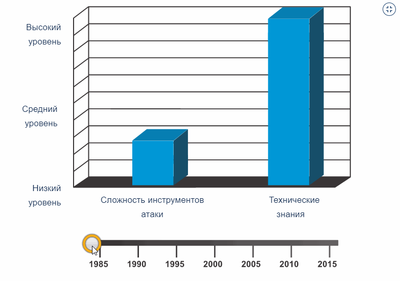

<!-- 3.3.1 -->
## Видео: Инструменты злоумышленников

Как вы узнали из предыдущей темы, существуют разные типы хакеров с различной мотивацией своих действий. В этой теме вы узнаете о некоторых инструментах, которые они используют.

Нажмите «Воспроизвести» на рисунке, чтобы просмотреть видео об инструментах злоумышленников.

<!-- 3.3.2 -->

## Знакомство с инструментами атак

Для того, чтобы использовать уязвимость, хакеру необходим соответствующий метод или инструмент. За прошлые годы инструменты атаки стали более сложными и высоко автоматизированными. Сейчас они требуют все меньше технических знаний для их реализации.

На анимации изображено соотношение сложности инструментов атаки и технических знаний с течением времени.

<!-- 3.3.3 -->
## Эволюция средств безопасности

«Белые» хакеры используют инструменты множества различных типов для проверки и обеспечения безопасности сети и данных в ней. Для проверки безопасности сети и ее систем разработано множество инструментов тестирования на проникновение в сеть. Тем не менее многие из этих инструментов могут также использоваться злоумышленниками.

Злоумышленники также создали множество инструментов для взлома. Их назначение изначально является злонамеренным. Специалисты по кибербезопасности также должны знать, как использовать эти инструменты в ходе тестирования на возможность проникновения в сеть.

В таблице представлены категории распространенных инструментов тестирования на возможность проникновения в сеть. Обратите внимание, что некоторые из указанных инструментов используются и «белыми» и «черными» хакерами. Учитывайте, что этот список не является исчерпывающим, поскольку постоянно разрабатываются новые инструменты.

| **Инструменты тестирования на возможность проникновения** | **Описание** |
| --- | --- |
| **Взломщики паролей** | рассматриваются как инструменты для восстановления пароля, с их помощью пароли можно взламывать или восстанавливать. Это достигается либо путем удаления исходного пароля после обхода шифрования данных, либо путем прямого обнаружения пароля. Взломщики паролей используют циклический подбор для взлома паролей и получения доступа к системе. В качестве примеров инструментов для взлома паролей можно привести John the Ripper, Ophcrack, L0phtCrack, THC Hydra, RainbowCrack и Medusa |
| **Средства взлома беспроводных сетей** | используются для взлома беспроводных сетей с целью выявления уязвимостей системы безопасности. Примеры инструментов взлома беспроводных сетей включают в себя Aircrack-ng, Kismet, InSSIDer, KisMAC, Firesheep и NetStumbler |
| **Инструменты сканирования и  взлома сетей** | используются для проверки сетевых устройств, серверов и хостов на наличие открытых портов TCP или UDP. Примеры инструментов сканирования: Nmap, SuperScan, Angry IP Scanner и NetScanTools |
| **Инструменты создания пакетов** | используются для проверки и тестирования отказоустойчивости межсетевого экрана с помощью специально подготовленных поддельных пакетов. Примеры таких инструментов: Hping, Scapy, Socat, Yersinia, Netcat, Nping и Nemesis |
| **Анализаторы пакетов** | используются для сбора и анализа пакетов в традиционных проводных и беспроводных локальных сетях Ethernet. Примерами являются Wireshark, Tcpdump, Ettercap, Dsniff, EtherApe, Paros, Fiddler, Ratproxy и SSLstrip |
| **Детекторы руткитов** | инструменты проверки целостности каталогов и файлов, используемые «белыми» хакерами для выявления установленных руткитов. Примерами таких инструментов являются AIDE, Netfilter и PF: OpenBSD Packet Filter. PF: пакетный фильтр OpenBSD |
| **Фаззеры для поиска уязвимостей** | инструменты, используемые хакерами при поиске уязвимостей безопасности компьютерной системы. Примеры фаззеров: Skipfish, Wapiti и W3af |
| **Инструменты технической экспертизы** | используются «белыми» хакерами для выявления следов улик в конкретной компьютерной системе. Примерами таких инструментов являются include Sleuth Kit, Helix, Maltego и Encase |
| **Отладчики** | используются «черными» хакерами для декомпиляции двоичных файлов при программировании эксплойтов. Они также используются «белыми» хакерами при анализе вредоносного ПО. К числу инструментов отладки относятся GDB, WinDbg, IDA Pro и Immunity Debugger |
| **Хакерские операционные системы** | специально разработанные операционные системы с предварительно загруженными инструментами и технологиями, предназначенными для взлома. Примерами хакерских операционных систем являются Kali Linux, Knoppix, BackBox Linux |
| **Средства шифрования** | с помощью алгоритмических схем кодируют данные для предотвращения несанкционированного доступа к зашифрованным данным. Примеры таких инструментов включают VeraCrypt, CipherShed, OpenSSH, OpenSSL, Tor, OpenVPN и Stunnel |
| **Средства эксплуатации уязвимостей** | определяют, является ли удаленный хост уязвимым к атакам на систему безопасности. Примерами средств эксплуатации уязвимостей являются Metasploit, Metasploit, Core Impact, Sqlmap, Social Engineer Toolkit и Netsparker |
| **Сканеры уязвимостей** | сканируют сети или системы для определения открытых портов. Они также могут использоваться для сканирования известных уязвимостей и сканирования виртуальных машин, устройств BYOD и баз данных клиентов. Примеры таких инструментов – Nipper, Secunia PSI, Core Impact, Nessus v6, SAINT и Open VAS |

**Примечание**. Многие из этих инструментов работают на основе UNIX или Linux, поэтому специалисту по безопасности необходимо хорошее знание UNIX и Linux.

<!-- 3.3.4 -->
## Типы атак

Злоумышленники могут использовать упомянутые ранее инструменты или их сочетания для создания различных атак. В таблице показаны распространенные типы атак. Однако этот список не является исчерпывающим, поскольку постоянно обнаруживаются новые способы для атак на сети.

| **Тип атаки** | **Описание** |
| --- | --- |
| **Подслушивание** | происходит, когда злоумышленник захватывает и прослушивает сетевой трафик, такая атака иначе называется анализом трафика или снупингом |
| **Атака с изменением данных** | если злоумышленники захватили корпоративный трафик, они могут изменить данные в пакете без ведома отправителя или получателя |
| **Атака с подменой IP-адреса** | злоумышленник создает IP-пакет, который выглядит как пакет, исходящий от допустимого адреса в корпоративной сети |
| **Атаки на основе пароля** | если хакер обнаруживает действительную учетную запись пользователя, он получает такие же права, как и настоящий пользователь. Используя учетную запись, он может получить список других пользователей и сведения о сети, а также изменить конфигурацию сервера и сети, модифицировать, перенаправлять или удалять данные |
| **Отказ в обслуживании (DoS-атака)** | DoS-атака лишает возможности нормально использовать компьютер или сеть законных пользователей. DoS-атака может насыщать компьютер или всю сеть трафиком, пока не произойдет отключение из-за перегрузки. DoS-атака также может блокировать трафик, что приводит к потере доступа авторизованных пользователей к сетевым ресурсам |
| **Атака с перехватом** | в ходе этой атаки через посредника злоумышленник внедряется между источником и получателем. После этого он может активно отслеживать, перехватывать и контролировать обмен данными прозрачным образом |
| **Атака с подбором ключа** | если хакер получает секретный ключ, этот ключ называется раскрытым и позволяет получить доступ к защищенному обмену данными, при этом отправитель и получатель не подозревают об атаке |
| **Атака с перехватом пакетов** | анализатор трафика – это приложение или устройство, которое может выполнять чтение, мониторинг и захват данных, передаваемых по сети, а также чтение сетевых пакетов. Если пакеты не зашифрованы, анализатор трафика позволяет видеть все данные, находящиеся внутри пакета |

<!-- 3.3.5 -->
<!-- quiz -->

