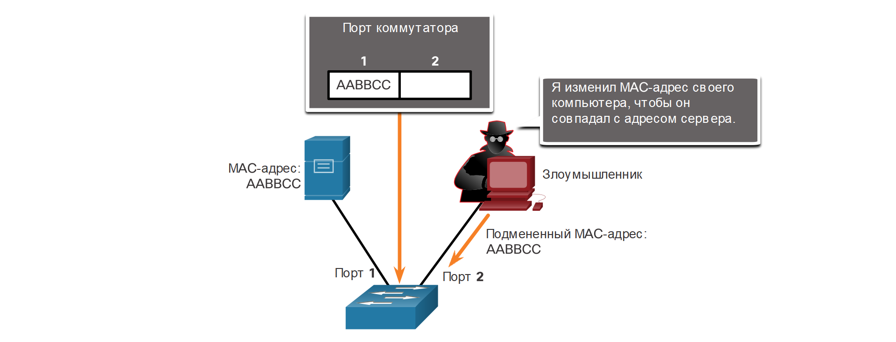
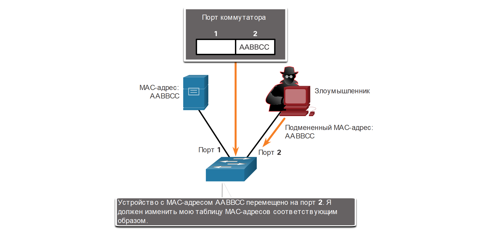

<!-- 3.6.1 -->
## Видео: обычные атаки IP и ICMP

На самом деле существует гораздо больше типов атак, чем те, которые мы обсуждали ранее. В этой теме мы рассмотрим те, что специально направлены на уязвимости IP.

Просмотрите видео об обычных атаках IP и ICMP.

<!-- 3.6.2 -->
## IPv4 и IPv6

IP не проверяет, действительно ли указанный в пакете IP-адрес источника поступил из этого источника. Поэтому злоумышленники могут отправлять пакеты, используя поддельный IP-адрес источника. Кроме того, при выполнении своих атак злоумышленники могут изменять и другие поля в заголовке IP. Поэтому аналитикам по вопросам безопасности важно понимать суть различных полей в заголовках IPv4 и IPv6.

В таблице приведены некоторые наиболее распространенные атаки, связанные с IP.

| **Методы IP-атак** | **Описание** |
| --- | --- |
| **Атаки на основе ICMP**  | злоумышленники используют пакеты эхо-запросов (ping) ICMP для обнаружения подсетей и хостов в защищенной сети, чтобы создавать лавинные DoS-атаки, а также изменять таблицы маршрутизации хоста |
| **Атаки по методу умножения и отражения** | хакеры пытаются лишить законных пользователей доступа к информации или службам |
| **Атаки с подменой адреса** | субъекты угрозы подменяют IP-адрес источника в IP-пакете для выполнения открытой подмены или подмены вслепую |
| **Атака через посредника (MITM)**  | киберпреступники внедряются между источником и назначением для прозрачного мониторинга, захвата и контроля обмена данными. Они могут прослушивать, проверяя собранные пакеты, или изменять пакеты и пересылать по первоначальному целевому адресу |
| **Перехват сеанса**  | злоумышленники получают доступ к физической сети, а затем используют атаку через посредника для перехвата сеанса |

<!-- 3.6.3 -->
## Атаки на основе ICMP

Злоумышленники используют ICMP для разведывательных атак и сканирования в сети. Они могут запустить атаку для сбора информации, чтобы определить топологию сети, узнать, какие хосты активны (доступны), определить операционную систему хоста (создание цифрового отпечатка ОС), а также состояние межсетевого экрана. Хакеры также используют ICMP для DoS-атак.

**Примечание.** ICMP для IPv4 (ICMPv4) и ICMP для IPv6 (ICMPv6) подвергаются атакам аналогичных типов.

В сетях должна применяться строгая фильтрация на основе списков контроля доступа (ACL) ICMP на границе сети, чтобы избежать зондирования ICMP из Интернета. Аналитики по безопасности должны быть в состоянии обнаружить атаки, связанные с ICMP, просматривая захваченный трафик и файлы журналов. В крупных сетях устройства обеспечения безопасности, например, межсетевые экраны и системы обнаружения вторжений (IDS), должны обнаруживать такие атаки и выдавать предупреждения для аналитиков по безопасности.

В таблице представлены сообщения ICMP, которыми обычно интересуются киберпреступники. 

| **ICMP сообщения, которые используют злоумышленники** | **Описание** |
| --- | --- |
| **Эхо-запрос и эхо-ответ ICMP**  | используются для выполнения проверки хостов и DoS-атак |
| **Сообщение ICMP о недостижимости**  | необходимы для выполнения разведывательных атак и сканирования сети |
| **Ответ ICMP с маской**  | требуются для составления карты внутренней IP-сети |
| **Перенаправления ICMP**  | позволяют спровоцировать целевой хост на отправку всего трафика через взломанное устройство и провести атаку через посредника (MITM) |
| **Обнаружение роутера ICMP**  | используется для вставки фиктивных записей маршрута в таблицу маршрутизации целевого хоста |

<!-- 3.6.4 -->
## Видео: Атаки по методу лавинообразного умножения и отражения, спуфинг-атаки

Просмотрите видео об атаках по методу лавинообразного умножения и отражения, спуфинг-атаках.

<!-- 3.6.5 -->
## Атаки по методу умножения и отражения

Хакеры часто используют методы лавинообразного умножения данных и отражения для создания DoS-атак. На рисунке показано использование такого метода, называемого Smurf-атакой, для перегрузки целевого хоста.

<!-- /courses/ensa-dl/ae8e8c80-34fd-11eb-ba19-f1886492e0e4/aeb3eed4-34fd-11eb-ba19-f1886492e0e4/assets/c5e04840-1c46-11ea-af56-e368b99e9723.svg -->

1.  **Лавинообразное умножение данных** – злоумышленник пересылает сообщения эхо-запроса ICMP большому числу хостов. Эти сообщения содержат исходный IP-адрес жертвы.
2.  **Отражение** – все эти хосты отвечают на поддельный IP-адрес жертвы и перегружают его.

**Примечание.** В настоящее время используются более новые формы атак по методу умножения и отражения, например, атаки на основе DNS и атаки по NTP с умножением данных.

Киберпреступники также используют атаки с исчерпанием ресурсов. Эти атаки могут перегрузить ресурсы целевого хоста и вызвать его сбой, или загрузить ресурсы сети и существенно повлиять на ее работу.

<!-- 3.6.6 -->
## Атаки с подменой адреса

Атаки с подменой IP-адреса происходят, когда злоумышленник создает пакеты с ложной информацией об IP-адресе источника, чтобы скрыть личность отправителя или выдать себя за легитимного пользователя. Хакер может получить доступ к данным, которые недоступны другими способами, или обойти конфигурации системы безопасности. Подмена адресов обычно применяется в рамках других атак, например в smurf-атаках.

Атаки с подменой могут быть с открытыми или слепыми.

* **Открытая подмена** – киберпреступник может видеть трафик, который передается между хостом и целевым объектом. Открытая подмена используется им для изучения пакета ответа от целевой жертвы. Целью открытой подмены может быть определение состояния межсетевого экрана, прогнозирование порядкового номера, а также перехват авторизованного сеанса.

* **Подмена вслепую** – хакер может видеть трафик, который передается между хостом и целевым объектом. Подмена вслепую используется в DoS-атаках.

Атаки с подменой MAC-адресов используются, когда у злоумышленника есть доступ к внутренней сети. Он изменяет MAC-адрес своего хоста в соответствии с другим известным MAC-адресом целевого хоста, как показано на рисунке. Затем атакующий хост отправляет по сети кадр с только что заданным MAC-адресом. Когда коммутатор получает кадр, он проверяет MAC-адрес источника.

**Киберпреступник подделывает MAC-адрес сервера**

<!-- /courses/ensa-dl/ae8e8c80-34fd-11eb-ba19-f1886492e0e4/aeb3eed4-34fd-11eb-ba19-f1886492e0e4/assets/c5e0bd70-1c46-11ea-af56-e368b99e9723.svg -->

Коммутатор перезаписывает текущую запись в таблице CAM и назначает MAC-адрес новому порту, как показано на рисунке. Затем он пересылает кадры, предназначенные для целевого хоста, на атакующий хост.

**Коммутатор изменяет таблицу CAM, включая в нее подмененный адрес**

<!-- /courses/ensa-dl/ae8e8c80-34fd-11eb-ba19-f1886492e0e4/aeb3eed4-34fd-11eb-ba19-f1886492e0e4/assets/c5e159b0-1c46-11ea-af56-e368b99e9723.svg -->

Еще одним примером подмены является подмена приложения или службы. Злоумышленник может подключить мошеннический сервер DHCP, чтобы для создания условия MITM.

<!-- 3.6.7 -->
<!-- quiz -->

