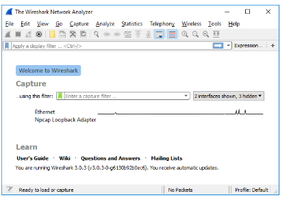
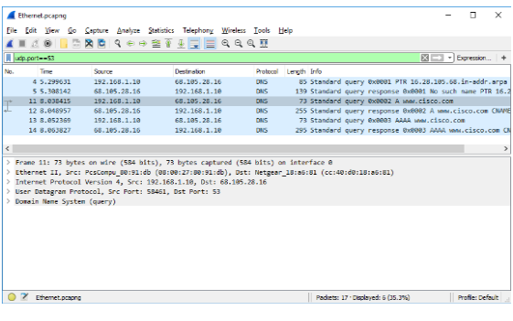
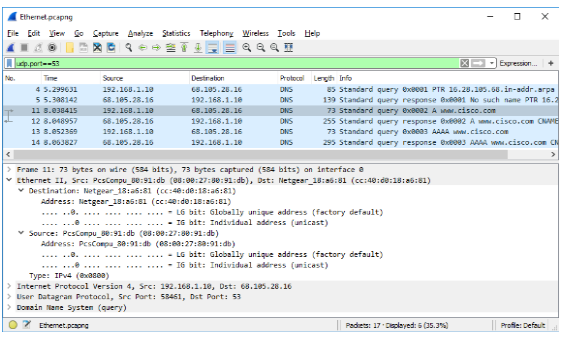
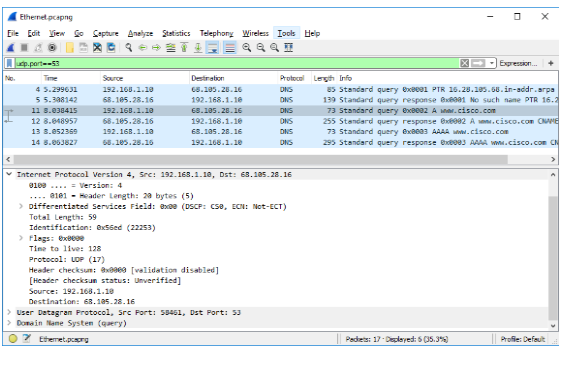
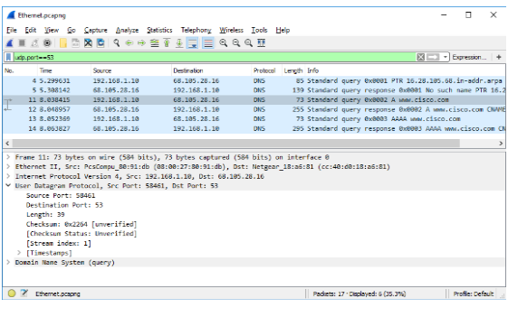
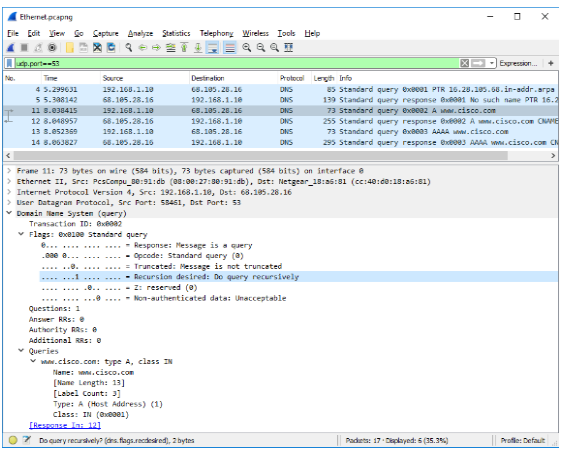
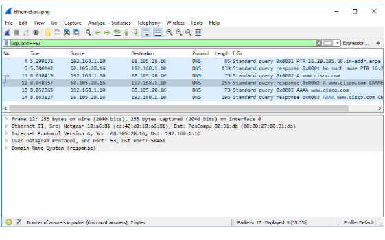
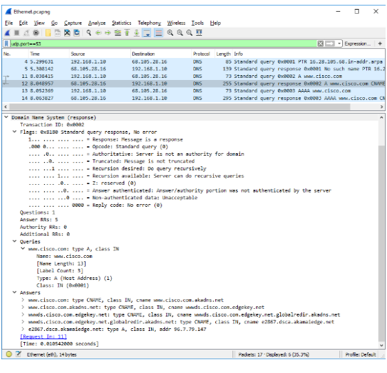

## Задачи

**Часть 1. Перехват трафика DNS**

**Часть 2. Изучение трафика DNS-запроса**

**Часть 3. Изучение трафика DNS-ответа**

## Общие сведения и сценарий

**Wireshark** — средство перехвата и анализа пакетов с открытым исходным кодом. Wireshark дает подробную информацию о стеке сетевых протоколов. Wireshark позволяет фильтровать трафик для поиска и устранения неполадок сети, изучения проблем безопасности и анализа сетевых протоколов. Wireshark позволяет просматривать сведения о пакетах, поэтому злоумышленник может использовать программу как разведывательное средство.
В этой лабораторной работе вы установите программу Wireshark в системе Windows для фильтрации пакетов DNS и просмотра информации как о пакетах запросов, так и ответов DNS.

## Необходимые ресурсы

* 1 ПК с Windows, доступом в Интернет и установленной программой Wireshark

## Инструкции

**Шаг 1. Перехват трафика DNS**

1. Откройте Wireshark и начните захват данных программой Wireshark, дважды щелкнув по сетевому интерфейсу с трафиком.



2. В командной строке введите ipconfig /flushdns и нажмите Enter (Ввод), чтобы очистить кеш DNS.

```
C:\Users\Student> ipconfig /flushdns 

Настройка IP для Windows

Успешно сброшен кэш DNS клиента.
```

3. Введите nslookup в ответ на приглашение войти в интерактивный режим.
4. Введите доменное имя веб-сайта. В данном примере используется доменное имя [www.cisco.com](http://www.cisco.com). В командной строке введите www.cisco.com.

```
C:\Users\Student> nslookup 
Сервер по умолчанию: неизвестно
Address: 68.105.28.16 
>www.cisco.com
Сервер: неизвестно
Address: 68.105.28.16
Не заслуживающий доверия ответ:
Name: e2867.dsca.akamaiedge.net 
Addresses: 2001:578:28:68d::b33 
          2001:578:28:685::b33 
          96.7.79.147 
Псевдонимы: www.cisco.com
          www.cisco.com.akadns.net
          wwwds.cisco.com.edgekey.net
          wwwds.cisco.com.edgekey.net.globalredir.akadns.net

```

5. После завершения введите  exit, чтобы выйти из интерактивного режима nslookup. Закройте командную строку.
6. Щелкните **Stop capturing packets** (Остановить перехват пакетов), чтобы остановить захват данных программой Wireshark.

**Шаг 2. Изучение трафика DNS-запроса**

1. Наблюдайте за трафиком, захваченным в области списка пакетов Wireshark. Введите **udp.port == 53** в поле фильтра и нажмите стрелку (или кнопку Enter) для показа только пакетов DNS.
2. Выберите пакет DNS с маркировкой **Standard query 0x0002 A www.cisco.com** (Стандартный запрос 0x0002 A www.cisco.com).

    В области сведений о пакетах обратите внимание, что этот пакет имеет следующие сведения: Ethernet II, протокол IPv4, протокол UDP и систему доменных имен (запрос).



3. Разверните **Ethernet II** для просмотра сведений. Наблюдайте за полями источника и назначения.



Вопрос:

   - ответьте на вопрос №1  

1. Раскройте Internet Protocol Version 4 (Протокол IPv4). Наблюдайте за IPv4-адресами источника и назначения.



Вопрос:

   - ответьте на вопрос №2

1. Раскройте User Datagram Protocol (Протокол UDP). Наблюдайте за портами источника и назначения.



Вопрос:

   - ответьте на вопрос №3

1. Откройте командную строку и введите arp –a и ipconfig /all для записи MAC- и IP-адресов компьютера.

```
C:\Users\Student> arp -a 
Interface: 192.168.1.10 --- 0x4 
  Internet Address Physical Address Type
  192.168.1.1 cc-40-d0-18-a6-81 dynamic 
  192.168.1.122 b0-a7-37-46-70-bb dynamic 
  192.168.1.255 ff-ff-ff-ff-ff-ff static
  224.0.0.22 01-00-5e-00-00-16 static
  224.0.0.252 01-00-5e-00-00-fc static
  239.255.255.250 01-00-5e-7f-ff-fa static
  255.255.255.255 ff-ff-ff-ff-ff-ff static 
C:\Users\Studuent> ipconfig /all 
Настройка IP для Windows
   Host Name . . . . . . . . . . . . : DESKTOP 
   Основной DNS-суффикс. . . . . . . :
   Node Type . . . . . . . . . . . . : Гибрид
   Включена IP-маршрутизация. . . . . . . . : Нет
   Включен WINS-прокси. . . . . . . . : Нет
Ethernet adapter Ethernet: 
   Connection-specific DNS Suffix . :
   Description . . . . . . . . . . . : Intel(R) PRO/1000 MT Desktop Adapter 
   Physical Address. . . . . . . . . : 08-00-27-80-91-DB 
   DHCP Enabled. . . . . . . . . . . : Да
   Автонастройка включена . . . . : Да
   Link-local IPv6-адрес. . . . . : fe80::d829:6d18:e229:a705%4(Preferred) 
   IPv4 Address. . . . . . . . . . . : 192.168.1.10(Preferred) 
   Subnet Mask . . . . . . . . . . . : 255.255.255.0
   Аренда получена. . . . . . . . . . : Tuesday, August 20, 2019 5:39:51 PM 
   Аренда истекает . . . . . . . . . . : Wednesday, August 21, 2019 5:39:50 PM 
   Default Gateway . . . . . . . . . : 192.168.1.1
   DHCP-сервер . . . . . . . . . . . : 192.168.1.1
   DHCPv6 IAID . . . . . . . . . . . : 50855975 
   DHCPv6 Client DUID. . . . . . . . : 00-01-00-01-24-21-BA-64-08-00-27-80-91-DB 
   DNS-серверы . . . . . . . . . . . : 68.105.28.16 
                                       68.105.29.16 
   NetBios через TCP/IP. . . . . . . . : Включен
```

Вопрос:

   - ответьте на вопрос №4

1. Разверните **Domain Name System (query)** (Система доменных имен (запрос)) в области сведений о пакетах. Затем разверните **Flags** (Флаги) и **Queries** (Запросы).

    Изучите результаты. Флаг настроен для рекурсивного формирования запросов для IP-адреса на сайте www.cisco.com.



**Шаг 3. Изучение трафика DNS-ответа**

1. Выберите соответствующий пакет DNS-ответа с маркировкой **Standard query 0x000# A www.cisco.com** (Стандартный запрос 0x0002 A www.cisco.com).



Вопросы:

   - ответьте на вопрос №5

1. Разверните **Domain Name System (response)** (Система доменных имен (ответ). Затем разверните **Flags** (Флаги), **Queries** (Запросы) и **Answers** (Ответы). Изучите результаты.



Вопрос:

   - ответьте на вопрос №6

1. Наблюдайте за записями **CNAME** и **A** в сведениях об ответах.

Вопрос:

   - ответьте на вопрос №7

## Вопрос для повторения

1. ответьте на вопрос №8

2. ответьте на вопрос №9
