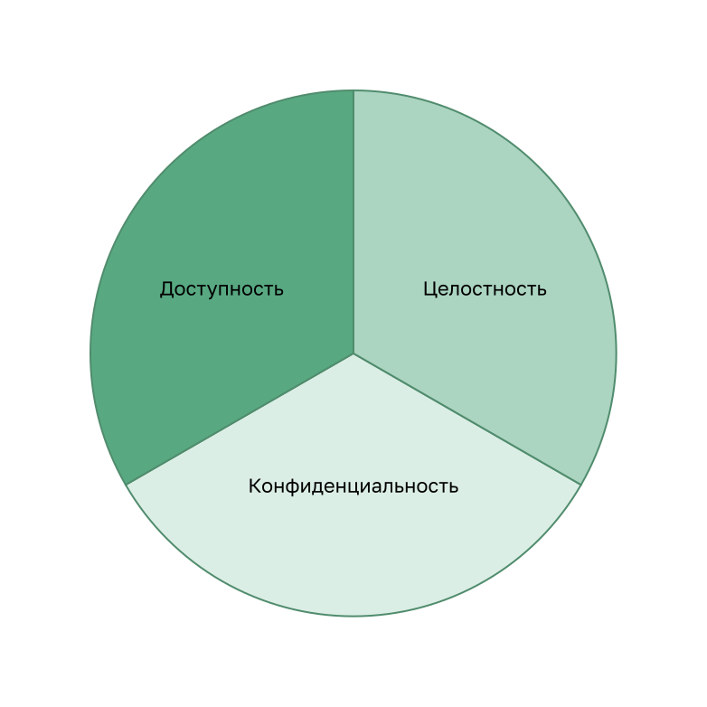
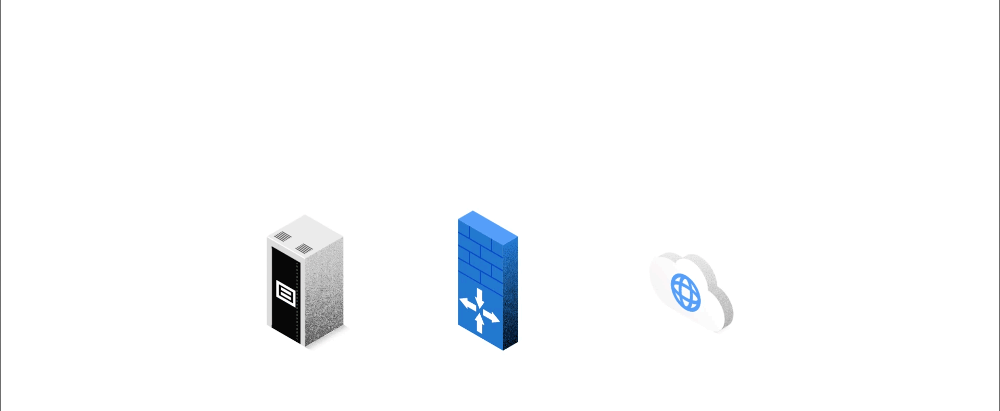

<!-- 3.9.1 -->
## Конфиденциальность, целостность и доступность

На самом деле список сетевых атак очень большой. Но существует множество практических рекомендаций по обеспечению сетевой безопасности, о которых вы узнаете в этой главе.

Информационная безопасность занимается защитой информации и информационных систем от несанкционированного доступа, использования, раскрытия, повреждения, изменения или уничтожения.

Большинство организаций придерживается триады КЦД, состоящей из трех компонентов информационной безопасности.

* **Конфиденциальность** — только авторизованные лица, объекты или процессы могут получить доступ к конфиденциальной информации. Для шифрования и дешифрования данных может потребоваться использование алгоритмов криптографического шифрования, таких как AES.
* **Целостность** — защита данных от несанкционированного изменения, требующая использование криптографических алгоритмов хеширования, таких как SHA.
* **Доступность** — авторизованные пользователи должны иметь непрерывный доступ к важным ресурсам и данным. Это требует внедрения резервных сервисов, шлюзов и каналов связи.

**Триада информационной безопасности CIA**

<!-- /courses/ensa-dl/ae8e8c80-34fd-11eb-ba19-f1886492e0e4/aeb3eeda-34fd-11eb-ba19-f1886492e0e4/assets/c5f13833-1c46-11ea-af56-e368b99e9723.svg -->

<!--
The figure shows the C I A Triad consisting of Confidentiality, Integrity, and Availability.
-->

<!-- 3.9.2 -->
## Углубленный подход к защите

Для безопасного обмена данными через общедоступные и частные сети в первую очередь необходимо обеспечить защиту устройств, включая роутеры, коммутаторы, серверы и хосты. Организации используют углубленный подход к защите сети — уровневый подход. Он предполагает совместную работу сетевых устройств и сервисов. Рассмотрим сеть на рисунке.

**Защита от сетевых атак**

<!-- /courses/ensa-dl/ae8e8c80-34fd-11eb-ba19-f1886492e0e4/aeb3eeda-34fd-11eb-ba19-f1886492e0e4/assets/c5f1d473-1c46-11ea-af56-e368b99e9723.svg -->

Для защиты пользователей и активов организации от угроз TCP/IP реализовано несколько устройств и служб безопасности.

* **VPN** — роутер используется для предоставления защищенных сервисов VPN с корпоративными сайтами и поддержки удаленного доступа для удаленных пользователей, использующих защищенные зашифрованные туннели.
* **ASA Firewall** — выделенное устройство предоставляет сервисы межсетевого экрана с сохранением состояния. Это гарантирует, что внутренний трафик может выходить и возвращаться, но внешний трафик не может инициировать соединения с внутренними узлами.
* **IPS** — система предотвращения вторжений (IPS) отслеживает входящий и исходящий трафик на наличие вредоносных программ, сигнатур сетевых атак и многого другого. Если он распознает угрозу, то может немедленно остановить ее.
* **ESA/WSA** — устройство защиты электронной почты (ESA) фильтрует спам и подозрительные электронные письма. Устройство веб-безопасности трафика фильтрует известные и подозрительные сайты с интернет-вредоносным ПО.
* **AAA Server** — этот сервер содержит защищенную базу данных о том, кто авторизован для доступа и управления сетевыми устройствами. Сетевые устройства аутентифицируют административных пользователей, используя эту базу данных.

<!--
Диаграмма изображает сетевую топология кампуса и углубленный подход к ее защите. Вверху слева находится Интернет-облако, ниже к нему подключен VPN роутер на границе сети кампуса. Он подключен справа к межсетевому экрану ASA, который имеет соединение ниже с коммутатором 2 уровня. К этому коммутатору подключены сервер DHCP, сервер электронной почты, веб-сервер и ESA/WSA. К межсетевому экрану справа также подключен IPS, который подключается к коммутатору 3-го уровня справа. Коммутатор 3-го уровня подключается к серверу ААА, еще одному коммутатору 3-го уровня и двум коммутаторам 2-го уровня. Под коммутаторами уровня 2 находятся несколько хостов.
-->

Все сетевые устройства, включая роутер и коммутаторы, защищены, что означает, что они не дадут хакерам получить доступ к устройствам и вмешаться в их работу.

Далее необходимо обеспечить защиту данных, пересылаемых по различным каналам. К ним может относиться внутренний трафик, но более важной задачей является защита данных, которые передаются за пределами организации филиалам, удаленным сотрудникам и партнерам.

<!-- 3.9.3 -->
## Межсетевые экраны

Межсетевой экран — система или группа систем, реализующая политику управления доступом между сетями. Нажмите кнопку «воспроизвести» на рисунке, чтобы посмотреть, как работает межсетевой экран.

**Работа межсетевого экрана**

<!--
Анимация показывает брандмауэр между глобусом, представляющим Интернет, и сервером, представляющим внутреннюю сеть. Глобус пытается отправить трафик во внутреннюю сеть. Показаны правила, разрешающие и запрещающие трафик. Разрешенный трафик — это трафик с любого внешнего адреса на веб-сервер, трафик на сервер F T P, трафик на сервер S M T P и трафик на внутренний сервер I M A P. Запрещенный трафик — это весь входящий трафик с сетевой адресацией, соответствующей внутренним зарегистрированным адресам ввода-вывода, весь входящий трафик на сервер с внешних адресов, весь входящий трафик эхо-запросов ввода-вывода, все входящие запросы M S Active Directory, весь входящий трафик на запросы сервера M S S Q L и все Локальные трансляции в домене M.
-->

Все межсетевые экраны обладают некоторыми общими свойствами:

* устойчивы к сетевым атакам;
* представляют собой единственную транзитную точку между внутренними корпоративными сетями и внешними сетями, так как весь трафик проходит через него;
* применяют политики управления доступом.

Преимущества использования межсетевого экрана в сети:

* предотвращение доступа неавторизованных пользователей к конфиденциальным хостам, ресурсам и приложениям;
* санация потока протокола для предотвращения использования уязвимостей протокола;
* блокирование вредоносных данных от серверов и клиентов;
* снижение сложности управления безопасностью за счет распределения большинства функций контроля доступа к сети по нескольким межсетевым экранам, имеющимся в сети.

Ограничения межсетевых экранов:

* неправильно настроенный межсетевой экран может привести к серьезным последствиям для сети, например стать единой точкой отказа;
* через них ненадежно передаются данные из многих приложений;
* пользователи могут по собственной инициативе искать пути обхода межсетевого экрана для получения заблокированного материала, что подвергает сеть риску потенциальных атак;
* может снижаться производительность сети;
* неавторизованный трафик может туннелироваться или маскироваться под трафик, которому разрешено проходить через межсетевой экран.

<!-- 3.9.4 -->
## IPS

Для защиты от быстрых и развивающихся атак вам могут потребоваться экономически эффективные системы их обнаружения и предотвращения, такие как системы обнаружения вторжений (IDS) или более масштабные системы предотвращения вторжений (IPS). В сетевой архитектуре эти решения применяются в точках входа и выхода сети.

Технологии IDS и IPS имеют несколько общих характеристик, как показано на рисунке. Они реализуются в сети посредством сенсоров. Сенсорами IDS или IPS могут быть разные устройства:

* роутер, на который установлено программное обеспечение IPS Cisco IOS;
* специализированное устройство, выполняющее функции IDS или IPS;
* сетевой модуль, установленный в многофункциональном устройстве обеспечения безопасности (ASA), коммутаторе или роутере.

**Действие системы предотвращения вторжений (IPS)**

<!-- /courses/ensa-dl/ae8e8c80-34fd-11eb-ba19-f1886492e0e4/aeb3eeda-34fd-11eb-ba19-f1886492e0e4/assets/c5f41e63-1c46-11ea-af56-e368b99e9723.svg -->

На рисунке показано, как IPS управляет запрещенным трафиком.

1.  Киберпреступник посылает пакет, предназначенный целевому хосту.
2.  IPS перехватывает трафик и оценивает его относительно угроз и сконфигурированных политик.
3.  IPS пересылает сообщения журнала на консоль управления.
4.  IPS отбрасывает пакет.

<!--
НА рисунке показана сетевая топология с IPS, которая отбрасывает пакет. Показан целевой хост в нижней части схемы, подключенный к роутеру. Также к нему подключен хост консоли управления. Этот роутер подключен к вышестоящему IPS-сенсору, который  в свою очередь подключен к другому вышестоящему устройству. Верхний роутер подсоединен к Интернет-облаку. Хост злоумышленника также подсоединен к облаку. Хакер посылает трафик, который проходит через облако и IPS-сенсор. Затем IPS пересылает трафик на консоль управления, в результате того, что IPS отбросил пакет.
-->

Для выявления шаблонов в сетевом трафике в технологиях IDS и IPS используют сигнатуры. Сигнатура — это набор правил, с помощью которого технология IDS или IPS выявляет вредоносные действия. Сигнатуры можно использовать для выявления серьезных нарушений безопасности, обнаружения типичных сетевых атак и для сбора информации. Технологии IDS и IPS могут обнаруживать атомарные шаблоны сигнатур (один пакет) или составные шаблоны сигнатур (несколько пакетов).

<!-- 3.9.5 -->
## Устройство управления безопасностью контента

Устройства защиты контента включают детальный контроль над электронной почтой и просмотром веб-страниц для пользователей организации.

**Email Security Appliance (ESA)**

ESA — устройство, предназначенное для мониторинга SMTP-протокола. Оно постоянно обновляется, используя информационные каналы в режиме реального времени от группы Talos Cisco, которая обнаруживает и сопоставляет угрозы, используя всемирную систему мониторинга баз данных. Эти данные об угрозах извлекаются устройствами Cisco ESA каждые три-пять минут.

На рисунке злоумышленник посылает фишинговое электронное письмо.

<!-- /courses/ensa-dl/ae8e8c80-34fd-11eb-ba19-f1886492e0e4/aeb3eeda-34fd-11eb-ba19-f1886492e0e4/assets/c5f4baa1-1c46-11ea-af56-e368b99e9723.svg -->

1.  Хакер отправляет фишинговую атаку на важный хост в сети.
2.  Межсетевой экран пересылает всю электронную почту в ESA.
3.  ESA анализирует электронную почту, регистрирует ее, и отбрасывает ее.

<!--
Киберпреступник посылает электронное письмо через интернет к межсетевому экрану в сети, подсоединенному к ESA. Коммутатор подсоединен к хосту, содержащему конфиденциальные данные компании. Межсетевой экран пересылает сообщение к ESA, которое отбрасывает его. Фишинговое письмо не было получено хостом, содержащим конфиденциальную информацию.
-->

**Web Security Appliance (WSA)**

Устройство защиты веб-трафика (Web Security Appliance — WSA) — технология нейтрализации веб-угроз. Вместе они позволяют решить задачи, связанные с защитой и контролем веб-трафика. WSA предоставляет защиту от вредоносного ПО, мониторинг и контроль функционирования приложений, а также средства управления политиками допустимого использования, создания отчетов.

WSA обеспечивает полный контроль над доступом пользователей к сети Интернет. Некоторые функции и приложения, такие как чат, обмен сообщениями, видео и аудио, могут быть разрешены, ограничены по времени и полосе пропускания или заблокированы в соответствии с требованиями организации. WSA может выполнять внесение в черный список URL-адресов, фильтрацию URL-адресов, сканирование на наличие вредоносных программ, категоризацию URL-адресов, фильтрацию веб-приложений, а также шифрование и дешифрование веб-трафика.

На рисунке внутренний корпоративный сотрудник попытаться подключиться к помещенному в черный список сайту.

<!-- /courses/ensa-dl/ae8e8c80-34fd-11eb-ba19-f1886492e0e4/aeb3eeda-34fd-11eb-ba19-f1886492e0e4/assets/c5f508c1-1c46-11ea-af56-e368b99e9723.svg -->

1.  Пользователь пытается подключиться к веб-сайту.
2.  Межсетевой экран направляет запрос веб-сайта в WSA.
3.  WSA оценивает URL-адрес и определяет, что это известный черный список сайтов. WSA отбрасывает пакет и отправляет сообщение об отказе в доступе пользователю.

<!--
Пользователь внутренней сети имеет смартфон с беспроводным соединением к точке доступа, соединенной с межсетевым экраном, который подключен к Интернету. Также межсетевой экран соединен с WSA. Пользователь запрашивает соединение с сайтом в черном списке. Запрос пересылается к межсетевому экрану, затем пересылается к WSA и затем отклоняется. Запрос не покидает границы внутренней сети.
-->

<!-- 3.9.6 -->
<!-- quiz -->

