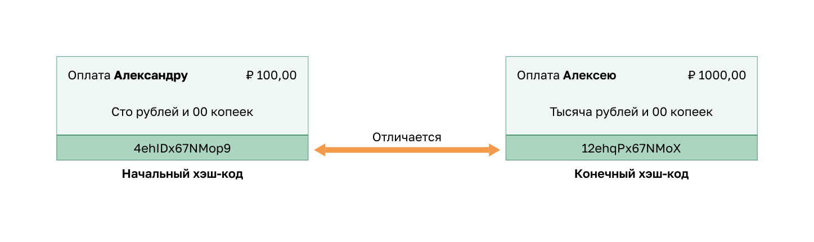
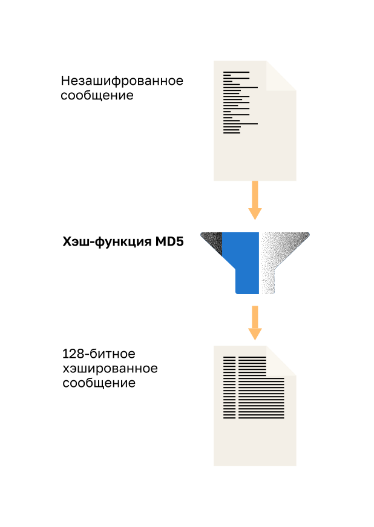
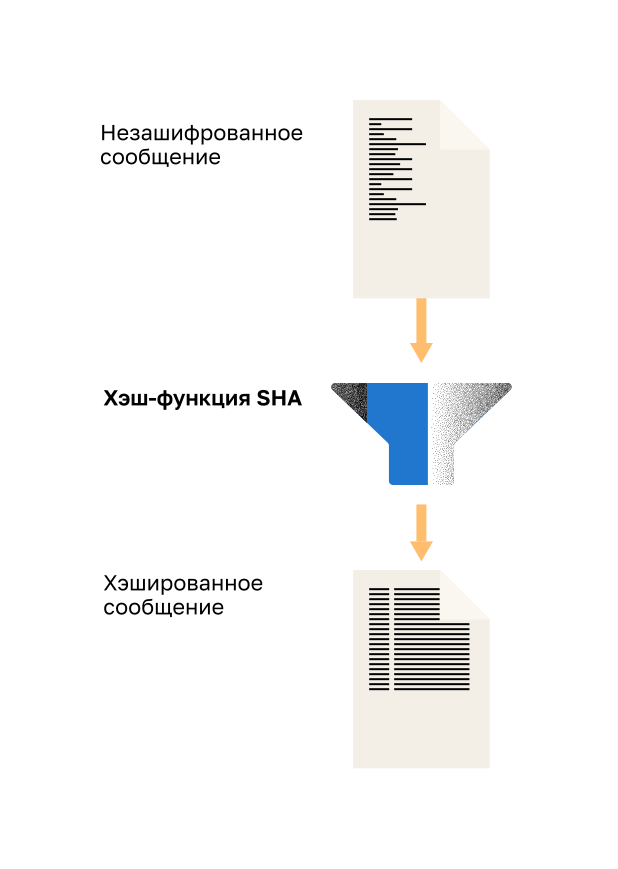
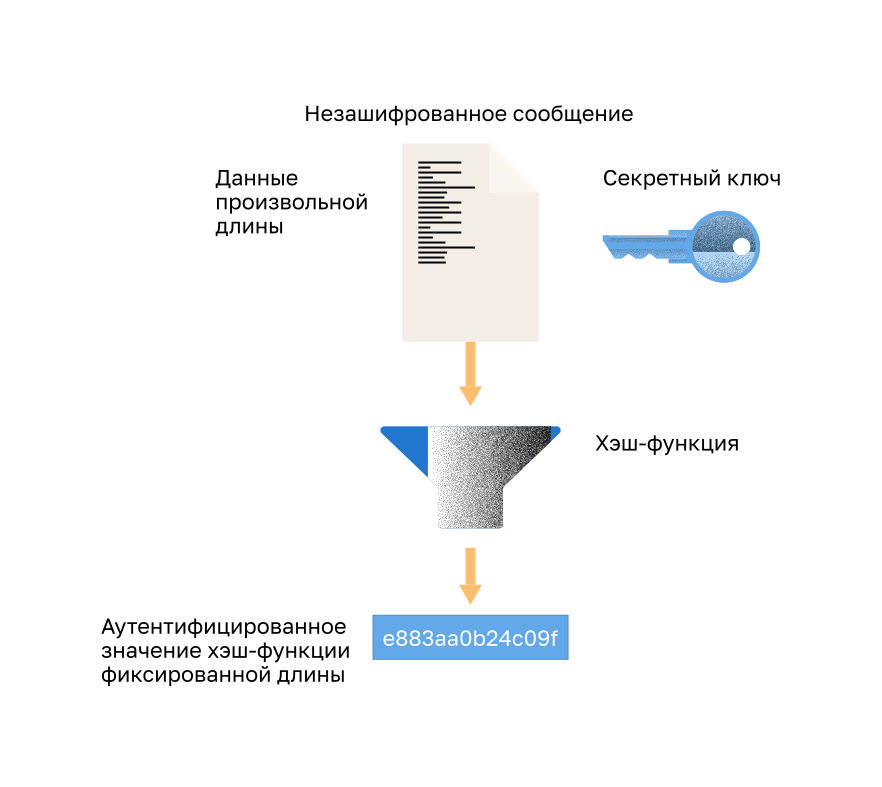
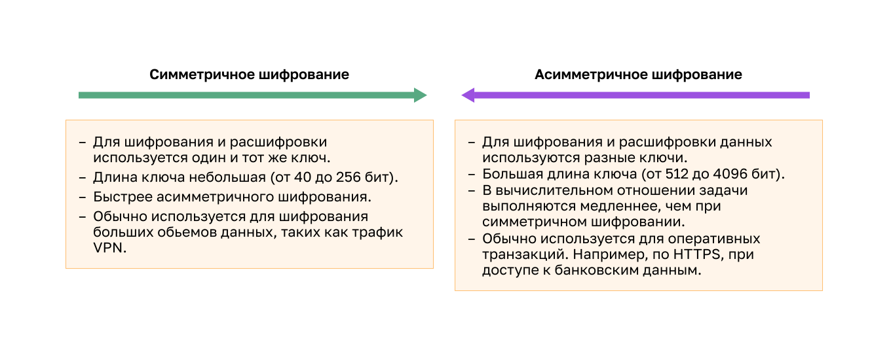
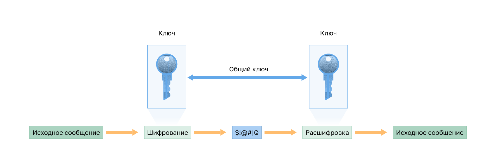
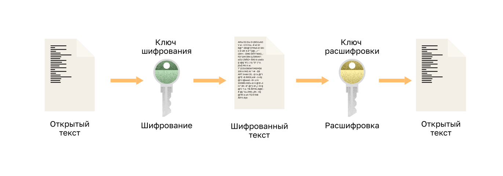
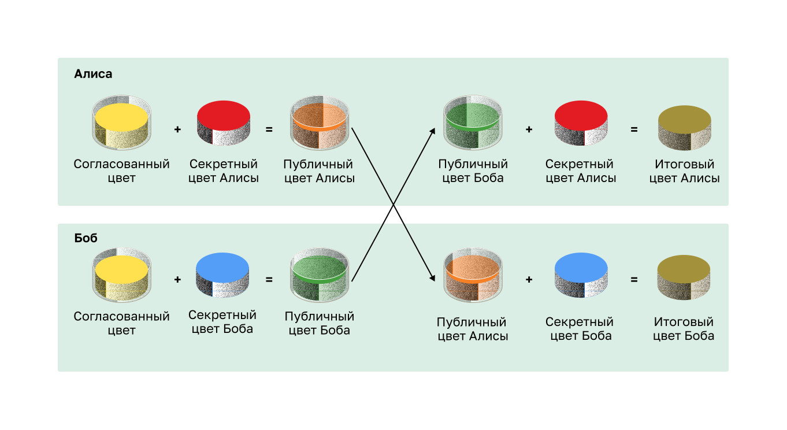

<!-- 3.10.1 -->
## Видео: Криптография

В предыдущей теме криптография упоминалась как часть триады КЦД. В этой главе мы погрузимся глубже в типы криптографии и как они используются для безопасности сети.

Просмотрите видео о криптографии.

<!-- 3.10.2 -->
## Защита коммуникаций

Организации должны обеспечивать безопасность данных, проходящих через каналы передачи информации. К данным может относиться внутренний трафик, но более важной задачей является защита данных, которые передаются за пределами организации филиалам, удаленным сотрудникам и партнерам.

Существует четыре элемента защищенной связи.

* **Целостность данных** — гарантирует, что данное сообщение не было изменено. Любые изменения в передаваемых данных будут обнаружены. Целостность обеспечивается с помощью алгоритмов хеширования Message Digest 5 (MD5) или Secure Hash Algorithm (SHA).
* **Аутентификация источника** — подтверждает, что сообщение не является поддельным и действительно поступает с заявленного адреса. Многие современные сети обеспечивают аутентификацию с помощью протоколов, таких как код аутентификации сообщений на основе хеша (HMAC).
* **Конфиденциальность данных** — обеспечивает возможность прочитать сообщение только авторизованным пользователяем. Если сообщение будет перехвачено, его невозможно будет расшифровать за разумное время. Конфиденциальность данных реализуется с помощью алгоритмов симметричного и асимметричного шифрования.
* **Невозможность отказа от данных** — отправитель не может отказаться от отправленного сообщения или опровергнуть его достоверность. При реализации невозможности отказа используется тот факт, что только у отправителя есть уникальные характеристики или подпись, указывающие, как следует обрабатывать данное сообщение.

Криптографию можно использовать практически везде, где имеет место передача данных. На самом деле сегодня очевидна тенденция к тому, что шифроваться будут все передаваемые данные.

<!-- 3.10.3 -->
## Целостность данных

Хеш-функции используются для обеспечения целостности сообщений. Они гарантируют, что данные не были изменены ни случайно, ни преднамеренно.

На рисунке отправитель переводит 100 долл. США Алексу.

<!-- /courses/ensa-dl/ae8e8c80-34fd-11eb-ba19-f1886492e0e4/aeb415e0-34fd-11eb-ba19-f1886492e0e4/assets/c5f92773-1c46-11ea-af56-e368b99e9723.svg -->

Отправитель хочет гарантировать, что сообщение не будет изменено на пути к получателю, для этого:

1.  отправляющее устройство использует алгоритм хеширования и рассчитывает хеш-сумму сообщения фиксированной длины 4ehiDx67NMop9;
2.  хеш-сумма вкладывается в сообщение и отправляется получателю в виде простого текста;
3.  принимающее устройство удаляет хеш-сумму из сообщения и вводит сообщение в тот же алгоритм хеширования. Если вычисленная хеш-сумма совпадает с хеш-суммой, прикрепленной к сообщению, значит, сообщение не было изменено во время передачи. Если хеш-суммы не равны, как показано на рисунке, целостность сообщения находится под сомнением.

<!--
На рисунке показаны вычисления хэша сообщения, в которых начальный и конечный хэши различны. Посылаемое сообщение гласит: «Заплати Алексу $100.00.» Полученное сообщение: «Заплати Джереми $1000.00.» Начальный хеш 4ehlDx67NMop9, а полученный — 12ehqPx67NMoX.
-->

<!-- 3.10.4 -->
## Хеш-функция

Есть три самые известные хеш-функции.

**MD5 с 128-разрядной хеш-суммой**

MD5 — это односторонняя хеш-функция, которая генерирует 128-битное хешированное сообщение, как показано на рисунке. MD5 считается устаревшим алгоритмом, который следует использовать только в отсутствии лучших вариантов. Вместо этого используйте SHA-2.

<!-- /courses/ensa-dl/ae8e8c80-34fd-11eb-ba19-f1886492e0e4/aeb415e0-34fd-11eb-ba19-f1886492e0e4/assets/c5f9c3b0-1c46-11ea-af56-e368b99e9723.svg -->

На рисунке текстовое сообщение передается через хеш-функцию MD5. В результате получаем 128-битное хешированное сообщение.

**Алгоритм хеширования SHA**

SHA-1 — алгоритм с функциями хеширования, очень похожими на MD5, как показано на рисунке. Существует несколько версий этого алгоритма. SHA-1 создает сообщение с 160-разрядным хешем и работает несколько медленнее, чем MD5. Изъяны SHA-1 хорошо известны, этот алгоритм уже не используется. Используйте SHA-2, когда это возможно.

<!-- /courses/ensa-dl/ae8e8c80-34fd-11eb-ba19-f1886492e0e4/aeb415e0-34fd-11eb-ba19-f1886492e0e4/assets/c5fa11d0-1c46-11ea-af56-e368b99e9723.svg -->

На рисунке текстовое сообщение передается через хеш-функцию SHA. В результате получаем хешированное сообщение.

**SHA-2**

Включает функции SHA-224 (224 бита), SHA-256 (256 бит), SHA-384 (384 бита) и SHA-512 (512 бит). SHA-256, SHA-384 и SHA-512 ― это алгоритмы следующего поколения, которые рекомендуется использовать всегда, когда это возможно.

Хеширование позволяет выявить случайные изменения, но не защищает от намеренного изменения данных. Результат хеширования не содержит информации, по которой можно было бы однозначно определить отправителя. Соответственно, любой, кто имеет доступ к соответствующей хеш-функции, может рассчитать с ее помощью корректную хеш-сумму для любых данных.

Например, хакер сможет перехватывать передаваемые по сети сообщения, подменять их, пересчитывать хеш-сумму и прикреплять эту сумму к новому (поддельному) сообщению. Принимающее устройство проверяет только ту хеш-сумму, которая непосредственно приложена к сообщению.

Таким образом, метод хеширования уязвим к атаке через посредника и не защищает передаваемые данные. Для обеспечения целостности данных и аутентификации источника нужны дополнительные средства.

<!-- 3.10.5 -->
## Аутентификация источника

Для того, чтобы добавить аутентификацию в обеспечение целостности, используется код аутентификации сообщений на основе хеша (HMAC). В HMAC используется дополнительный секретный ключ, который принимает хэш-функция.

**Алгоритм хеширования HMAC**

Как показано на рисунке, в вычислении механизма HMAC используется криптографический алгоритм, объединяющий криптографическую хеш-функцию с секретным ключом. Хеш-функции являются основным элементом механизма защиты HMAC.

Секретный ключ известен только отправителю и получателю, при этом результат хеш-функции зависит как от входных данных, так и от секретного ключа. Таким образом, вычислить верную хеш-сумму HMAC может только обладатель секретного ключа. Это свойство позволяет исключить атаку через посредника и аутентифицировать источник данных.

Если две стороны используют общий секретный ключ и аутентификация выполняется с помощью функций HMAC, правильно сформированная хеш-сумма HMAC-сообщения, полученного одной стороной, указывает, что источником сообщения была другая сторона. Это возможно, когда у другой стороны есть этот секретный ключ.

<!-- /courses/ensa-dl/ae8e8c80-34fd-11eb-ba19-f1886492e0e4/aeb415e0-34fd-11eb-ba19-f1886492e0e4/assets/2cd6995f-68d2-436f-b1db-8678c62106de.svg -->

<!--
The figure shows the h m a c hashing algorithm
-->

**Создание значения HMAC**

Как показано на рисунке, передающее устройство подает данные (в частности, информацию о выплате 100 долл. США для сотрудника Terry Smith и секретный ключ) на вход алгоритма хеширования и рассчитывает хеш-сумму HMAC фиксированной длины. Затем эта аутентифицированная хеш-сумма вкладывается в сообщение и отправляется получателю.

<!-- /courses/ensa-dl/ae8e8c80-34fd-11eb-ba19-f1886492e0e4/aeb415e0-34fd-11eb-ba19-f1886492e0e4/assets/c5fb9872-1c46-11ea-af56-e368b99e9723.svg -->

<!--
The figure shows creating the h m a c value
-->

**Проверка значения HMAC**

На рисунке принимающее устройство отделяет хеш-сумму от сообщения и подает обычный текст сообщения в сочетании с секретным ключом на вход той же функции хеширования. Если хеш-сумма, вычисленная принимающим устройством, равна отправленной хеш-сумме, то сообщение не было изменено. При этом определяется подлинность источника сообщения, поскольку только этому отправителю известен общий секретный ключ. Подлинность сообщения доказана с помощью функции HMAC.

<!-- /courses/ensa-dl/ae8e8c80-34fd-11eb-ba19-f1886492e0e4/aeb415e0-34fd-11eb-ba19-f1886492e0e4/assets/c5fc0da2-1c46-11ea-af56-e368b99e9723.svg -->

<!--
The figure shows verifying the h m a c value
-->

**Пример использования HMAC**

На рисунке показано, как функции HMAC используются на маршрутизаторах, которые настроены на использование аутентификации маршрутизации с помощью алгоритма выбора кратчайшего пути (OSPF).

Устройство R1 отправляет обновление состояния канала (LSU) для маршрута к сети 10.2.0.0/16:

1.  R1 рассчитывает хеш-сумму, используя сообщение LSU и секретный ключ;
2.  полученная хеш-сумма отправляется R2 в сообщении LSU;
3.  R2 рассчитывает хеш-сумму, используя сообщение LSU и свой секретный ключ. R2 принимает обновление, если значения хеш-сумм совпадают. Если коды HMAC не совпадают, R2 отклоняет обновления.

<!-- /courses/ensa-dl/ae8e8c80-34fd-11eb-ba19-f1886492e0e4/aeb415e0-34fd-11eb-ba19-f1886492e0e4/assets/c5fc82d1-1c46-11ea-af56-e368b99e9723.svg -->

<!--
The figure shows a Cisco router h m a c example.
-->

<!-- 3.10.6 -->
## Конфиденциальность данных

Для обеспечения конфиденциальности данных существует два класса шифрования, которые отличаются способом использования ключей.

Симметричные алгоритмы шифрования, такие как (DES), 3DES и Advanced Encryption Standard (AES) основаны на предположении, что каждой стороне обмена данными известен предварительно согласованный общий ключ. Конфиденциальность данных может также обеспечиваться асимметричными алгоритмами, например алгоритмами Ривеста, Шамира и Адлемана (RSA, Rivest, Shamir, Adleman) и инфраструктурой открытых ключей (PKI, public key infrastructure).

На рисунке показаны некоторые различия между этими алгоритмами шифрования.

<!-- /courses/ensa-dl/ae8e8c80-34fd-11eb-ba19-f1886492e0e4/aeb415e0-34fd-11eb-ba19-f1886492e0e4/assets/c5fde260-1c46-11ea-af56-e368b99e9723.svg -->

<!--
Рисунок показывает различия между симметричным и асимметричным шифрованием. 

Особенности симметричного шифрования: использование одного и того же ключа для шифрования и дешифрования данных; длина ключа короткая (40 бит — 256 бит); быстрее, чем асимметричное шифрование; обычно используется для шифрования больших объемов данных, таких как трафик VPN. 
Осооенности асимметричного шифрования: использование различных ключей для шифрования и дешифрования данных; длина ключа большая (512 бит — 4096 бит); вычислительная обработка, медленнее, чем при симметричном шифровании; обычно используется для быстрых транзакций данных, таких как HTTPS, при доступе к вашим банковским данным.
-->

<!-- 3.10.7 -->
## Симметричное шифрование

При симметричном алгоритме шифрования и расшифровки данных применяется один и тот же общий ключ шифрования. Общий ключ, также называемый секретным ключом, известен отправителю и получателю до отправки любых зашифрованных сообщений.

Для того чтобы проиллюстрировать работу алгоритма симметричного шифрования, рассмотрим пример. Алиса и Боб живут в разных местах и хотят обмениваться друг с другом секретными сообщениями по почте. В этом примере Алиса хочет отправить секретное сообщение Бобу.

Как показано на рисунке, у Алисы и Боба есть одинаковые ключи от одного замка. Обмен ключами произошел до отправки секретных сообщений. Алиса пишет секретное письмо, кладет его в коробку и запирает на замок с помощью своего ключа. Затем она отправляет коробку Бобу. Письмо надежно скрыто внутри, пока коробка идет по почте. Когда Боб получает коробку, он открывает замок своим ключом и достает письмо. Боб может воспользоваться этой же коробкой с замком, чтобы отправить секретный ответ Алисе.

**Пример симметричного шифрования**

<!-- /courses/ensa-dl/ae8e8c80-34fd-11eb-ba19-f1886492e0e4/aeb415e0-34fd-11eb-ba19-f1886492e0e4/assets/c5fe7ea1-1c46-11ea-af56-e368b99e9723.svg -->

<!--
The figure shows the symmetric encryption analogy described in the text.
-->

В настоящее время алгоритмы симметричного шифрования обычно используются для трафика VPN. Это связано с тем, что симметричные алгоритмы меньше загружают ЦП, чем асимметричные. При использовании VPN шифрование и расшифровка данных выполняются быстро. В алгоритмах симметричного шифрования, как и в любом другом типе шифрования, чем длиннее ключ, тем больше времени займет раскрытие этого ключа. Большинство ключей шифрования имеют длину от 112 до 256 бит. Для того чтобы гарантировать надежность шифрования, следует использовать ключ длиной не менее 128 бит. Чтобы обеспечить более безопасную связь, используйте более длинный ключ.

В таблице приведены общеизвестные алгоритмы симметричного шифрования.

| **Симметричные алгоритмы шифрования** | **Описание** |
| --- | --- |
| **Стандарт шифрования данных (DES)** | старый алгоритм, который можно использовать в режиме поточного шифрования. Обычно он применяет блочный режим с 64-битными блоками. Потоковый шифр обрабатывает один байт или один бит за раз |
| **3DES Тройной DES** | более новая версия алгоритма DES, в которой процесс DES повторяется трижды. Базовый алгоритм хорошо проявлял себя в полевых условиях более 35 лет. Считается очень надежным, если реализован с использованием ключей с очень коротким сроком службы |
| **Алгоритм блочного шифрования AES AES** | популярный и рекомендованный алгоритм, более надежен и эффективен по сравнению с 3DES. Предлагает девять комбинаций ключа и длины блока, используя переменную длину ключа, 128-, 192- или 256-битный ключ для шифрования блоков данных длиной 128, 192 или 256 бит |
| **Алгоритм SEAL (Software-Optimized Encryption Algorithm) SEAL** | быстрый, альтернативный DES, 3DES и AES. Использует 160-битный ключ шифрования, который оказывает меньшее влияние на производительность ЦП по сравнению с другими программными алгоритмами |
| **Шифры Rivest (RC) (RC) набор алгоритмов** | разработан Роном Ривестом. Существует несколько разновидностей, но чаще всего используется RC4. RC4 — поточный шифр, используемый для обеспечения безопасности веб-трафика в протоколах SSL и TLS |

<!-- 3.10.8 -->
## Асимметричное шифрование

Алгоритмы асимметричного шифрования, также называемые алгоритмами шифрования с общим ключом, разработаны таким образом, чтобы ключ, который используется для шифрования, отличался от ключа, который используется для расшифровки, как показано на рисунке. Невозможно в разумные сроки на основе ключа шифрования вычислить ключ расшифровки и наоборот.

Алгоритмы асимметричного шифрования используют общий ключ и частный ключ. Оба можно использовать в процессе шифрования, но для расшифровки потребуется дополнительный парный ключ. Этот процесс обратимый, так как для расшифровки данных, зашифрованных общим ключом, требуется частный ключ. Данный процесс позволяет с помощью асимметричных алгоритмов обеспечить конфиденциальность, аутентификацию и целостность.

**Пример асимметричного шифрования**

<!-- /courses/ensa-dl/ae8e8c80-34fd-11eb-ba19-f1886492e0e4/aeb415e0-34fd-11eb-ba19-f1886492e0e4/assets/c5ff1ae0-1c46-11ea-af56-e368b99e9723.svg -->

<!--
The figure shows an example of asymmetric encryption where the encryption key is different than the decryption key.
-->

Так как ни у одной из сторон нет общего секретного ключа, необходимо использовать ключи очень большой длины. В асимметричном шифровании используются ключи длиной от 512 до 4096 бит. Ключи длиной 1024 бита и более считаются надежными, ключи меньшей длины — ненадежными.

Примеры протоколов, в которых используются алгоритмы с асимметричным ключом:

* **Internet Key Exchange (IKE)** — основной компонент сетей VPN, использующих протокол IPsec;
* **Secure Socket Layer (SSL)** — в настоящее время реализуется как TLS стандарта IETF;
* **Secure Shell (SSH)** — обеспечивает безопасное, удаленное подключение к сетевым устройствам;
* **Pretty Good Privacy (PGP)** — программа, обеспечивающая криптографическую конфиденциальность и аутентификацию для повышения безопасности электронной почты.

Асимметричные алгоритмы работают значительно медленнее по сравнению с симметричными. Их работа основана на вычислительных задачах, например на расчете факториалов или дискретных логарифмов очень больших чисел.

Из-за низкой скорости асимметричные алгоритмы обычно используются в механизмах шифрования небольших объемов данных, например цифровых подписей и обмена ключами. Тем не менее управление ключами асимметричных алгоритмов, как правило, проще по сравнению с симметричными, поскольку обычно один из двух ключей шифрования и расшифровки может быть общедоступным.

В таблице приведены общеизвестные алгоритмы симметричного шифрования.

| **Алгоритм асимметричного шифрования** | **Длина ключа** | **Описание** |
| --- | --- | --- |
| **Алгоритм Диффи — Хеллмана DH** | 512, 1024, 2048, 3072, 4096 | позволяет двум сторонам согласовать ключ, который они могут использовать для шифрования отправляемых друг другу сообщений. Безопасность этого алгоритма зависит от предположения, что число легко поднять до определенной степени, но сложно вычислить, какая мощность была использована, учитывая число и результат |
| **Стандарт DSS (Digital Signature Standard) и Алгоритм DSA (Digital Signature Algorithm)** | 512–1024 | описывает DSA как алгоритм для цифровых подписей. DSA ― это алгоритм с общим ключом, основанный на схеме получения цифровой подписи ElGamal. Скорость создания сигнатур аналогична RSA, но в 10–40 раз ниже проверки |
| **Алгоритмы шифрования Ривеста, Шамира и Адлемана RSA** | от 512 до 2048 | предназначен для криптографии с открытым ключом, которая основана на нынешней сложности факторизации очень больших чисел. Первый известный алгоритм, подходящий как для подписи, так и для шифрования. Широко используется в протоколах электронной торговли и считается безопасным с учетом достаточно длинных ключей и использования современных реализаций |
| **Алгоритм Эль-Гамаля** | 512–1024 | алгоритм шифрования с асимметричным ключом для криптографии с открытым ключом, который основывается на согласовании ключей Диффи-Хеллмана. Недостаток системы ElGamal заключается в том, что зашифрованное сообщение становится очень большим, примерно в два раза больше исходного сообщения. в связи с чем используется только для небольших сообщений, таких как секретные ключи |
| **Методы с использованием эллиптических кривых** | 160 | криптография с эллиптической кривой может использоваться для адаптации многих криптографических алгоритмов, таких как Диффи-Хеллман или Эль-Гамаль. Основное преимущество криптографии на эллиптических кривых состоит в том, что ключи могут быть намного меньше |

<!-- 3.10.9 -->
## Алгоритм Диффи — Хеллмана

**Алгоритм Диффи — Хеллмана (DH)** — это математический асимметричный алгоритм, который позволяет двум компьютерам создать одинаковый общий секретный ключ без предварительного взаимодействия. Отправитель и получатель в действительности никогда не обмениваются этим новым общим ключом. Однако поскольку он известен обеим сторонам, то может быть использован алгоритмом для шифрования трафика между двумя системами.

Стандартные примеры использования алгоритма DH:

* обмен данными по сети VPN на основе IPsec;
* шифрование данных в Интернете с помощью протокола SSL или TLS;
* обмен данными по протоколу SSH.

Рисунок иллюстрирует работу алгоритма Диффи — Хеллмана.

<!-- /courses/ensa-dl/ae8e8c80-34fd-11eb-ba19-f1886492e0e4/aeb415e0-34fd-11eb-ba19-f1886492e0e4/assets/c5ffde30-1c46-11ea-af56-e368b99e9723.svg -->

<!--
На рисунке показано, как работает алгоритм Диффи-Хеллмана с использованием цветов. Предположим, Алиса и Боб договорились начать с 50 миллилитров (50 мл) желтой краски. Алиса добавляет 50 мл красной краски к желтой, чтобы получилось 100 мл оранжевой краски. Боб смешивает свои 50 мл желтой краски с 50 мл синей краски, чтобы получить 100 мл зеленой краски. Алиса посылает Бобу свои 100 мл краски оранжевого цвета, а Боб посылает Алисе свои 100 мл краски зеленого цвета. Затем Алиса продолжает добавлять еще 50 мл своей красной краски к 100 мл зеленой краски Боба, чтобы получить 150 мл коричневой краски. Боб смешивает еще 50 мл синей краски со 100 мл оранжевой краски Алисы, чтобы получить 150 мл точно такой же коричневой краски, которую создала Алиса.
-->

Вместо сложных длинных чисел на рисунке используются цвета, чтобы упростить представление процесса согласования ключей Диффи — Хеллмана. Обмен ключами DH начинается с того, что Алиса и Боб согласуют произвольный общий цвет, который не нужно хранить в секрете. В нашем примере это желтый цвет.

Далее Алиса и Боб выбирают свой секретный цвет. Алиса выбрала красный, а Боб ― синий. Они не должны сообщать эти цвета никому. Секретный цвет представляет выбранный секретный частный ключ каждой стороны.

Алиса и Боб теперь смешивают общий цвет (желтый) со своим соответствующим секретным цветом, создавая частный цвет. Таким образом, Алиса смешает свой желтый цвет с красным и получит частный оранжевый цвет. Боб смешает желтый и синий и получит частный зеленый цвет.

Алиса отправляет Бобу свой частный цвет (оранжевый), а Боб отправляет Алисе свой частный цвет (зеленый).

Алиса и Боб смешивают полученный ими цвет с собственным, исходным секретным цветом (красным для Алисы и синим для Боба). В результате получается окончательный коричневый цвет смеси, такой как окончательный цвет смеси у партнера. Коричневый цвет представляет итоговый общий секретный ключ Алисы и Боба.

Безопасность алгоритма DH основана на том факте, что в своих расчетах он использует невероятно большие числа. Например, 1024-разрядное число DH примерно равно 309-значному десятичному числу. Учитывая, что миллиард состоит из 10 цифр (1 000 000 000), легко себе представить сложность работы не с одним, а с несколькими десятичными числами, состоящими из 309 цифр.

К сожалению, системы с асимметричными ключами работают слишком медленно и не могут применяться для шифрования больших объемов данных. Именно поэтому стандартной практикой является шифрование большого объема трафика с помощью симметричного алгоритма, например 3DES или AES, и применение алгоритма Диффи — Хеллмана для создания ключей, которые будут использоваться алгоритмом шифрования.

<!-- 3.10.10 -->
<!-- quiz -->

