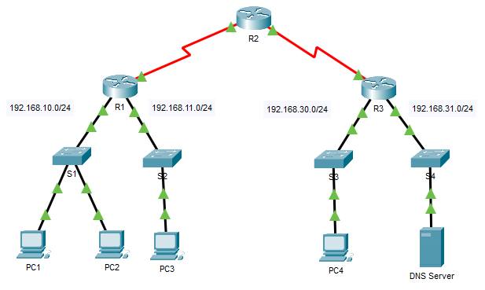

---

> **ВАЖНО**
> 
> Форма для ответов на вопросы будет доступна только при развертывании лабораторной работы. 

---

## Топология



## Задачи

Часть 1. Проверить локальное подключение и выполнить тестирование работы списка контроля доступа

Часть 2. Удалить список контроля доступа и проверить подключение

## Общие сведения

В рамках этого задания вы получите представление о том, как можно использовать список контроля доступа (ACL) для запрещения эхо-запросов, отправленных на узлы удаленных сетей. После удаления ACL-списка из конфигурации, эхо-запросы будут успешными.

## Таблица адресации

| Устройство | Интерфейс | IP-адрес / префикс |
|------------|-----------|--------------------|
| R1         | G0/0      | 192.168.10.1/24    |
| R1         | G0/1      | 192.168.11.1/24    |
| R1         | S0/0/0    | 10.1.1.1/30        |
| R2         | S0/0/0    | 10.10.1.2/30       |
| R2         | S0/0/1    | 10.10.1.5/30       |
| R3         | G0/0      | 192.168.30.1/24    |
| R3         | G0/1      | 192.168.31.1/24    |
| R3         | S0/0/1    | 10.10.1.6/24       |
| PC1        | NIC       | 192.168.10.10/24   |
| PC2        | NIC       | 192.168.10.11/24   |
| PC3        | NIC       | 192.168.11.10/24   |
| PC4        | NIC       | 192.168.30.12/24   |
| DNS Server | NIC       | 192.168.31.12/24   |

## Инструкции

### Часть 1. Проверка локального подключения и тестирование списка контроля доступа

**Шаг 1. Отправьте эхо-запросы по локальной сети, чтобы проверить подключение**

1.  Из командной строки узла **PC1** отправьте эхо-запрос на **PC2**.

2.  Из командной строки узла **PC1** отправьте эхо-запрос на **PC3**.

    - Ответьте на вопрос №1

**Шаг 2. Отправьте эхо-запросы в удаленные сети, чтобы протестировать работу ACL-списка**

1.  Из командной строки узла **PC1** отправьте эхо-запрос на **PC4**.

2.  Из командной строки узла **PC1** отправьте эхо-запрос на **DNS-сервер**.

    - Ответьте на вопрос №2

### Часть 2. Удаление ACL-списка и повторное тестирование

**Шаг 1. Используйте команды show, чтобы проверить конфигурацию ACL-списка**

1.  Перейдите к интерфейсу командной строки R1. Используйте команды **show run** и **show access-lists**, чтобы просмотреть текущие ACL-списки. Для быстрого просмотра текущих ACL-списков используйте команду **show access-lists**. Введите команду **show access-lists**, после которой нажмите ПРОБЕЛ и поставьте вопросительный знак (?), чтобы просмотреть доступные параметры:

    ```
    R1# show access-lists ?
      <1-199> ACL number
      Имя ACL-списка СЛОВО
      <cr>
    ```

    Если вы знаете номер или имя ACL-списка, то можете дополнительно отфильтровать выходные данные команды **show**. Однако на **R1** применен только один ACL-список, поэтому будет достаточно команды **show access-lists**.

    ```
    R1#show access-lists
    Standard IP access list 11
        10 deny 192.168.10.0 0.0.0.255
        20 permit any
    ```

    Первая строка ACL блокирует любые пакеты, которые исходят из сети **192.168.10.0/24**, включающей в себя эхо-сигналы протокола управления сообщениями Интернета (ICMP) (запросы ping). Вторая строка списка контроля доступа разрешает прохождение через роутер всего остального трафика по протоколу **IP** от **любого** источника.

2.  Для того чтобы список контроля доступа влиял на работу устройства, он должен быть применен к интерфейсу в определенном направлении. В этом сценарии список контроля доступа используется для фильтрации исходящего трафика на интерфейсе. Поэтому весь трафик, покидающий указанный интерфейс на **R1**, будет проверяться на соответствие списку ACL 11.

    Несмотря на возможность просмотра сведений об IP с помощью команды **show ip interface**, в некоторых случаях эффективнее использовать команду **show run**. Чтобы получить полный список интерфейсов, к которым может применяться ACL, и список всех настроенных списков ACL, используйте следующую команду:

    ```
    R1# show run | include interface|access
    interface GigabitEthernet0/0
    interface GigabitEthernet0/1
    interface Serial0/0/0
     ip access-group 11 out
    interface Serial0/0/1
    interface Vlan1
    access-list 11 deny 192.168.10.0 0.0.0.255
    access-list 11 permit any
    ```

    Второй символ канала '\|» создает условие OR, соответствующее интерфейсу 'OR 'access'. Важно, чтобы в условие OR не включались пробелы. Используйте одну или обе команды для поиска сведений о ACL.

    - Ответьте на вопрос №3

**Шаг 2. Удаление списка доступа 11 из конфигурации**

ACL-списки можно удалить из конфигурации, применив команду **no access list** \[*номер ACL-списка*\]. Команда **no access-list** при использовании без аргументов удаляет все списки ACL, настроенные на роутере. Команда **no access-list** \[*номер ACL-списка*\] удаляет только указанный список контроля доступа. Удаление списка ACL с устройства не приводит к удалению списка ACL из интерфейса. Команда, применяющая ACL к интерфейсу, должна быть удалена отдельно.

1.  Для интерфейса Serial0/0/0 удалите список контроля доступа 11, который был ранее применен к интерфейсу в качестве **исходящего** фильтра.

    ```
    R1(config)# interface s0/0/0
    R1(config-if)# no ip access-group 11 out
    ```

2.  В режиме глобальной конфигурации удалите ACL-список, применив следующую команду:

    ```
    R1(config)# no access-list 11
    ```

3.  Убедитесь, что теперь эхо-запросы с компьютера **PC1** успешно достигают **DNS-сервера** и **PC4**.

<!-- [Скачать файл Packet Tracer для локального запуска](./assets/4.1.4-lab.pka) -->
