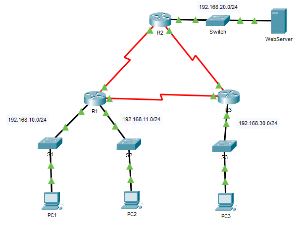

## Топология



## Таблица адресации

| Устройство | Интерфейс | IP-адрес       | Маска подсети   | Шлюз по умолчанию |
|------------|-----------|----------------|-----------------|-------------------|
| R1         | G0/0      | 192.168.10.1   | 255.255.255.0   | —                 |
| R1         | G0/1      | 192.168.11.1   | 255.255.255.0   | —                 |
| R1         | S0/0/0    | 10.1.1.1       | 255.255.255.252 | —                 |
| R1         | S0/0/1    | 10.3.3.1       | 255.255.255.252 | —                 |
| R2         | G0/0      | 192.168.20.1   | 255.255.255.0   | —                 |
| R2         | S0/0/0    | 10.1.1.2       | 255.255.255.252 | —                 |
| R2         | S0/0/1    | 10.2.2.1       | 255.255.255.252 | —                 |
| R3         | G0/0      | 192.168.30.1   | 255.255.255.0   | —                 |
| R3         | S0/0/0    | 10.3.3.2       | 255.255.255.252 | —                 |
| R3         | S0/0/1    | 10.2.2.2       | 255.255.255.252 | —                 |
| PC1        | NIC       | 192.168.10.10  | 255.255.255.0   | 192.168.10.1      |
| PC2        | NIC       | 192.168.11.10  | 255.255.255.0   | 192.168.11.1      |
| PC3        | NIC       | 192.168.30.10  | 255.255.255.0   | 192.168.30.1      |
| WebServer  | NIC       | 192.168.20.254 | 255.255.255.0   | 192.168.20.1      |

## Задачи

Часть 1. Планирование реализации списка контроля доступа

Часть 2. Настройка, применение и проверка стандартных списков контроля доступа

## Общие сведения/сценарий

Стандартные списки контроля доступа (ACL-списки) являются скриптами конфигурации маршрутизатора, которые разрешают или запрещают маршрутизатору пропускать пакеты, исходя из адреса источника. Данное интерактивное задание фокусируется на определении критериев фильтрации, конфигурации стандартных ACL-списков, применении их на интерфейсах маршрутизатора и проверке и тестировании реализации ACL-списка.. Маршрутизаторы уже настроены, в том числе установлены IP-адреса и настроена маршрутизация на базе усовершенствованного протокола внутренней маршрутизации между шлюзами (EIGRP).

## Инструкции

### Часть 1. Планирование реализации списка контроля доступа

**Шаг 1. Изучите текущую конфигурацию сети.**

Перед применением каких-либо ACL-списков к сети важно убедиться в наличии полного подключения. Убедитесь в том, что обеспечено полное подключение сети, выбрав ПК и отправив с него эхо-запросы на другие устройства в этой сети. Эхо-запросы на каждое устройство должны быть успешными.

**Шаг 2. Исследуйте правила сетевой безопасности и разработайте план реализации ACL-списка.**

1.  На маршрутизаторе **R2** реализованы следующие правила сетевой безопасности:

    -   Для сети 192.168.11.0/24 запрещен доступ к **веб-серверу** в сети 192.168.20.0/24.

    -   Другие виды доступа разрешены.

    Чтобы ограничить доступ из сети 192.168.11.0/24 к **веб-серверу** в сети 192.168.20.254 без нарушения передачи остального трафика, на маршрутизаторе **R2** следует создать и применить ACL-список. Список доступа должен быть размещен на исходящем интерфейсе по направлению к **веб-серверу**. Чтобы разрешить весь прочий трафик, на маршрутизаторе **R2** необходимо создать второе правило.

2.  На маршрутизаторе **R3** реализованы следующие правила сетевой безопасности:

    -   Сети 192.168.10.0/24 запрещено обмениваться данными с сетью 192.168.30.0/24.

    -   Другие виды доступа разрешены.

    Чтобы ограничить доступ из сети 192.168.10.0/24 к сети 192.168.30/24 без нарушения передачи остального трафика, на маршрутизаторе **R3** следует создать и применить ACL-список. Список контроля доступа должен быть размещен на исходящем интерфейсе по направлению к **PC3**. Чтобы разрешить остальной трафик, на маршрутизаторе **R3** следует создать второе правило.

### Часть 2. Настройка, применение и проверка стандартных списков контроля доступа

**Шаг 1. Настройте и примените нумерованный стандартный ACL-список на маршрутизаторе R2.**

1.  Создайте ACL-список с номером **1** на маршрутизаторе **R2**, установив запрет доступа к сети 192.168.20.0/24 от сети 192.168.11.0/24.

    ```
    R2(config)# access-list 1 deny 192.168.11.0 0.0.0.255
    ```

2.  По умолчанию список контроля доступа отклоняет весь трафик, не соответствующий какому-либо правилу. Чтобы разрешить другой трафик, задайте следующее правило:

    ```
    R2(config)# access-list 1 permit any
    ```

3.  Перед применением списка доступа к интерфейсу для фильтрации трафика рекомендуется просмотреть содержимое списка доступа, чтобы убедиться, что он будет фильтровать трафик должным образом.

    ```
    R2# show access-lists
    Standard IP access list 1
        10 deny 192.168.11.0 0.0.0.255
        20 permit any
    ```

4.  Чтобы ACL-список осуществлял фильтрацию трафика, он должен быть применен на каком-либо маршрутизаторе. Примените ACL-список, разместив его для исходящего трафика интерфейса Gigabit Ethernet 0/0. Примечание. В реальной операционной сети не рекомендуется применять непроверенный список доступа к активному интерфейсу.

    ```
    R2(config)# interface GigabitEthernet0/0
    R2(config-if)# ip access-group 1 out
    ```

**Шаг 2. Настройте и примените нумерованный стандартный ACL-список на маршрутизаторе R3.**

1.  Создайте ACL-список под номером **1** на маршрутизаторе **R3**, установив запрет доступа к сети 192.168.30.0/24 от сети узла **PC1** (192.168.10.0/24).

    ```
    R3(config)# access-list 1 deny 192.168.10.0 0.0.0.255
    ```

2.  По умолчанию список контроля доступа отклоняет весь трафик, не соответствующий какому-либо правилу. Чтобы пропустить весь остальной трафик, создайте второе правило для списка ACL1.

    ```
    R3(config)# access-list 1 permit any
    ```

3.  Убедитесь, что список доступа настроен правильно.

    ```
    R3# show access-lists
    Standard IP access list 1
        10 deny 192.168.10.0 0.0.0.255
        20 permit any
    ```

4.  Примените ACL-список, разместив его для исходящего трафика интерфейса Gigabit Ethernet 0/0.

    ```
    R3(config)# interface GigabitEthernet0/0
    R3(config-if)# ip access-group 1 out
    ```

**Шаг 3. Проверьте конфигурацию и работоспособность списка ACL.**

1.  Введите команду **show run** или **show ip interface gigabitethernet 0/0**, чтобы проверить размещения ACL-списков.

2.  После размещения двух ACL-списков сетевой трафик фильтруется в соответствии с правилами, описанными в части 1. Для проверки реализаций ACL-списков используйте следующие тесты:

    -   Эхо-запрос от 192.168.10.10 к 192.168.11.10 прошел успешно.

    -   Эхо-запрос от 192.168.10.10 к 192.168.20.254 прошел успешно.

    -   Сбой эхо-запроса от 192.168.11.10 к 192.168.20.254.

    -   Сбой эхо-запроса от 192.168.10.10 к 192.168.30.10.

    -   Эхо-запрос от 192.168.11.10 к 192.168.30.10 прошел успешно.

    -   Эхо-запрос от 192.168.30.10 к 192.168.20.254 прошел успешно.

3.  Повторите команду **show access-lists** на маршрутизаторах **R2** и **R3** . Вы должны увидеть выходные данные, указывающие количество пакетов, совпадающих с каждой строкой списка доступа. Примечание. Количество совпадений, отображаемых для маршрутизаторов, может отличаться в зависимости от количества отправленных и полученных сообщений.

    ```
    R2# show access-lists
    Standard IP access list 1
        10 deny 192.168.11.0 0.0.0.255 (4 match(es))
        20 permit any (8 match(es))

    R3# show access-lists
    Standard IP access list 1
        10 deny 192.168.10.0 0.0.0.255 (4 match(es))
        20 permit any (8 match(es))
    ```

[Скачать файл Packet Tracer для локального запуска](./assets/5.1.8-lab.pka)
