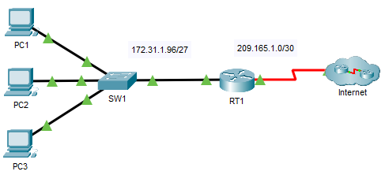

---

> **ВАЖНО**
> 
> Форма для ответов на вопросы будет доступна только при развертывании лабораторной работы 

---

## Топология



## Таблица адресации

| Устройство | Интерфейс | IP-адрес       | Маска подсети   | Шлюз по умолчанию |
|------------|-----------|----------------|-----------------|-------------------|
| RT1        | G0/0      | 172.31.1.126   | 255.255.255.224 | —                 |
| RT1        | S0/0/0    | 209.165.1.2    | 255.255.255.252 | —                 |
| PC1        | NIC       | 172.31.1.101   | 255.255.255.224 | 172.31.1.126      |
| PC2        | NIC       | 172.31.1.102   | 255.255.255.224 | 172.31.1.126      |
| PC3        | NIC       | 172.31.1.103   | 255.255.255.224 | 172.31.1.126      |
| Server1    | NIC       | 64.101.255.254 |                 |                   |
| Server2    | NIC       | 64.103.255.254 |                 |                   |

## Задачи

Часть 1. Настройка именованного расширенного списка контроля доступа

Часть 2. Применение и проверка расширенного списка контроля доступа

## Общие сведения/сценарий

В этом сценарии определенным устройствам в локальной сети разрешен доступ к различным сервисам на серверах в Интернете.

## Инструкции

### Часть 1. Настройка именованного расширенного списка контроля доступа

Используйте один именованный список контроля доступа для реализации следующей политики.

-   Запретите доступ по протоколам HTTP и HTTPS с **PC1** на серверы **Server1** и **Server2.** Серверы находятся в облаке, и известны только их IP-адреса.

-   Запретите доступ по FTP от **PC2** к **Server1** и **Server2**.

-   Запретите доступ по ICMP к **Server1** и **Server2** от узла **PC3**.

**Примечание.** Для правильной оценки вы должны настроить записи списка контроля доступа в порядке, указанном ниже.

**Шаг 1. Запретите хосту PC1 доступ к сервисам HTTP и HTTPS на серверах Server1 и Server2.**

1.  Создайте расширенный именованный список контроля доступа по протоколу IP, который запретит узлу **PC1** доступ к сервисам HTTP и HTTPS серверов **Server1** и **Server2**. Требуется четыре оператора управления доступом.

    - ответьте на вопрос №1

2.  Запишите выражение, запрещающее доступ от **PC1** к **Server1**, только для HTTP (порт 80). Обратитесь к таблице адресов для получения IP-адреса **PC1** и **Server1**.

    ```
    RT1(config-ext-nacl)# deny tcp host 172.31.1.101 host 64.101.255.254 eq 80
    ```

3.  Запишите выражение, запрещающее доступ от **PC1** to **Server1**, только для HTTPS (порт 443).

    ```
    RT1(config-ext-nacl)# deny tcp host 172.31.1.101 host 64.101.255.254 eq 443
    ```

4.  Запишите выражение, запрещающее доступ от **PC1** к **Server2**, только для HTTP. Обратитесь к таблице адресов для получения IP-адреса **Server 2.**

    ```
    RT1(config-ext-nacl)# deny tcp host 172.31.1.101 host 64.103.255.254 eq 80
    ```

5.  Запишите выражение, запрещающее доступ от **PC1** к **Server2**, только для HTTPS.

    ```
    RT1(config-ext-nacl)# deny tcp host 172.31.1.101 host 64.103.255.254 eq 443
    ```

**Шаг 2. Запретите хосту PC2 доступ к сервисам FTP на серверах Server1 и Server2.**

Обратитесь к таблице адресов для получения IP-адреса **PC2**.

1.  Запишите выражение, запрещающее доступ от **PC2** к **Server1**, только для FTP (порт 21).

    ```
    RT1(config-ext-nacl)# deny tcp host 172.31.1.102 host 64.101.255.254 eq 21
    ```

2.  Запишите выражение, запрещающее доступ от **PC2** к **Server2**, только для FTP (порт 21).

    ```
    RT1(config-ext-nacl)# deny tcp host 172.31.1.102 host 64.103.255.254 eq 21
    ```

**Шаг 3. Запретите узлу PC3 получать ответы на ping-запросы к Server1 и Server2.**

Обратитесь к таблице адресов для получения IP-адреса **PC3.**

1.  Создайте правило, запрещающее доступ по ICMP от **PC3** к **Server1**.

    ```
    RT1(config-ext-nacl)# deny icmp host 172.31.1.103 host 64.101.255.254
    ```

2.  Создайте правило, запрещающее доступ по ICMP от **PC3** к **Server2**.

    ```
    RT1(config-ext-nacl)# deny icmp host 172.31.1.103 host 64.103.255.254
    ```

**Шаг 4. Разрешите весь остальной трафик.**

По умолчанию список контроля доступа запрещает весь трафик, не соответствующий ни одному правилу в списке. Введите команду, разрешающую весь трафик, который не соответствует ни одному из настроенных инструкций списка доступа.

**Шаг 5. Проверьте конфигурацию списка доступа перед применением его к интерфейсу.**

Перед применением списка доступа необходимопроверить конфигурацию, чтобы убедиться в отсутствии опечаток и правильностиинструкций. Чтобы просмотреть текущую конфигурацию спискадоступа, используйте команду **show access-lists** или **show running-config** .

```
RT1# show access-lists
Extended IP access list ACL
    10 deny tcp host 172.31.1.101 host 64.101.255.254 eq www
    20 deny tcp host 172.31.1.101 host 64.101.255.254 eq 443
    30 deny tcp host 172.31.1.101 host 64.103.255.254 eq www
    40 deny tcp host 172.31.1.101 host 64.103.255.254 eq 443
    50 deny tcp host 172.31.1.102 host 64.101.255.254 eq ftp
    60 deny tcp host 172.31.1.102 host 64.103.255.254 eq ftp
    70 deny icmp host 172.31.1.103 host 64.101.255.254
    80 deny icmp host 172.31.1.103 host 64.103.255.254
    90 permit ip any any

RT1# show running-config | begin access-list
ip access-list extended ACL
    deny tcp host 172.31.1.101 host 64.101.255.254 eq www
    deny tcp host 172.31.1.101 host 64.101.255.254 eq 443
    deny tcp host 172.31.1.101 host 64.103.255.254 eq www
    deny tcp host 172.31.1.101 host 64.103.255.254 eq 443
    deny tcp host 172.31.1.102 host 64.101.255.254 eq ftp
    deny tcp host 172.31.1.102 host 64.103.255.254 eq ftp
    deny icmp host 172.31.1.103 host 64.101.255.254
    deny icmp host 172.31.1.103 host 64.103.255.254
    permit ip any any
```

**Примечание.** Разница между выходными данными команды **show access-lists** и выходными данными команды **show running-config** заключается в том, что команда **show access-lists**включает порядковые номера, назначенные команде инструкции конфигурации. Этипорядковые номера позволяют редактировать, удалять и вставлять отдельные строки в конфигурации спискадоступа. Последовательные номера также определяют порядок обработкиотдельных операторов управления доступом, начиная с наименьшего порядкового номера.

### Часть 2. Применение и проверка расширенного списка контроля доступа

Трафик, подлежащий фильтрации, поступает из сети 172.31.1.96/27 и предназначен для удаленных сетей. Подходящее размещение списка контроля доступа также зависит от взаимосвязей трафика в отношении **RT1**. Как правило, расширенные списки доступа должны быть размещены на интерфейсе, ближайшем к источнику трафика.

**Шаг 1. Примените список контроля доступа на соответствующем интерфейсе и в правильном направлении.**

**Примечание.** В реальной операционной сети непроверенный список ACL никогда не должен применяться к активному интерфейсу. Это не является хорошей практикой и может нарушить работу сети.

- ответьте на вопрос №2

Войдите в режим настройки интерфейса и примените ACL-список.

**Шаг 2. Протестируйте доступ для каждого ПК.**

1.  Получите доступ к веб-сайтам **Server1** и **Server2** используя веб-браузер на **PC1.** Используйте протоколы HTTP и HTTPS. Используйте команду **showaccess-lists**, чтобы просмотреть, какой оператор списка доступаразрешен или запрещен трафик. В выходных данных команды **show access-lists** отображается количество пакетов, совпадающих с каждым оператором с момента последнего очищения счетчиков или перезагрузки маршрутизатора.

    Примечание. Чтобы очистить счетчики в списке доступа, используйте команду clear access-list counters.

    ```
    RT1#show ip access-lists
    Extended IP access list ACL
        10 deny tcp host 172.31.1.101 host 64.101.255.254 eq www (12 match(es))
        20 deny tcp host 172.31.1.101 host 64.101.255.254 eq 443 (12 match(es))
        30 deny tcp host 172.31.1.101 host 64.103.255.254 eq www
        40 deny tcp host 172.31.1.101 host 64.103.255.254 eq 443
        50 deny tcp host 172.31.1.102 host 64.101.255.254 eq ftp
        60 deny tcp host 172.31.1.102 host 64.103.255.254 eq ftp
        70 deny icmp host 172.31.1.103 host 64.101.255.254
        80 deny icmp host 172.31.1.103 host 64.103.255.254
        90 permit ip any any
    ```

2.  Войдите в сервис FTP серверов **Server1** и **Server2** с помощью узла **PC1**. Имя пользователя и пароль — **cisco**.

3.  От узла **PC1** отправьте ping-запросы на серверы **Server1** и **Server2**.

4.  Повторите шаги 2.1–2.3 для узлов **PC2** и **PC3**, чтобы проверить правильную работу списка контроля доступа.

[Скачать файл Packet Tracer для локального запуска](./assets/5.4.13-lab.pka)
