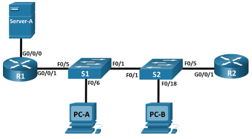

## Топология

## Таблица адресации

| Устройство   | Интерфейс   | IP-адрес   | Маска подсети  | Шлюз по умолчанию |
|--------------|-------------|------------|----------------|-------------------|
| **R1**       | G0/0/1      | —          | —              | —                 |
| **R1**       | G0/0/1.20   | 10.20.0.1  | 255.255.255.0  | —                 |
| **R1**       | G0/0/1.30   | 10.30.0.1  | 255.255.255.0  | —                 |
| **R1**       | G0/0/1.40   | 10.40.0.1  | 255.255.255.0  | —                 |
| **R1**       | G0/0/1.1000 | —          | —              | —                 |
| **R1**       | G0/0/0      | 172.16.1.1 | 255.255.255.0  | —                 |
| **R2**       | G0/0/1      | 10.20.0.4  | 255.255.255.0  | —                 |
| **S1**       | VLAN 20     | 10.20.0.2  | 255.255.255.0  | 10.20.0.1         |
| **S2**       | VLAN 20     | 10.20.0.3  | 255.255.255.0  | 10.20.0.1         |
| **PC-A**     | NIC         | 10.30.0.10 | 255.255.255.0  | 10.30.0.1         |
| **PC-B**     | NIC         | 10.40.0.10 | 255.255.255.0  | 10.40.0.1         |
| **Server-A** | NIC         | 172.16.1.2 | 255.255.255.0  | 172.16.1.1        |

## Таблица VLAN

| VLAN    | Имя                | Назначенный интерфейс                                                |
|---------|--------------------|----------------------------------------------------------------------|
| 20      | **Management**     | S2: F0/5                                                             |
| 30      | **Operations**     | S1: F0/6                                                             |
| 40      | **Sales**          | S2: F0/18                                                            |
|  999 |  **ParkingLot** | S1: F0/2-4, F0/7-24, G0/1-2 S2: F0/2-4, F0/6-17, F0/19-24, G0/1-2 |
| 1000    | **Native**         | —                                                                    |

## Задачи

Часть 1. Создание сети и настройка основных параметров устройства

Часть 2. Настройка сетей VLAN на коммутаторе

Часть 3. Настройка магистральных каналов

Часть 4. Настройка маршрутизации

Часть 5. Настройка удаленного доступа

Часть 6. Проверка связи

Часть 7. Настройка и проверка списков расширенного контроля доступа

## Общие сведения и сценарий

В этом задании в режиме симуляции физического оборудования (PTPM) вам было поручено настроить списки управления доступом (ACL) в сети небольшой компании. ACL являются одним из самых простых и прямых средств управления трафиком уровня 3. R1 будет размещать интернет-соединение и делиться информацией о маршруте по умолчанию c R2. После завершения первоначальной настройки у компании есть некоторые особые требования к безопасности трафика, за выполнение которых вы будете нести ответственность.

**Примечание**: В этом задании было набрано более 100 баллов. Таким образом Packet Tracer будет отображать количество баллов в режиме реального времени вместо процентного балла.

## Инструкции

### Часть 1. Создание сети и настройка основных параметров устройства

**Шаг 1. Создайте сеть согласно топологии.**

1.  Подключите устройства в соответствии с топологией и подсоедините соответствующие кабели. Используйте консольный кабель для подключения **PC** к каждому коммутатору или маршрутизатору при их настройке. Чтобы получить доступ к коммутатору или маршрутизатору, необходимо подключить консольный кабель между PC и устройством, которое вы хотите настроить. Мы рекомендуем подключить **PC-A** к **R1** и **PC-B** к **R2**.

2.  Затем при настройке коммутаторов подключите **PC-A** к **S1** и **PC-B** к **S2**. После подключения консольного кабеля выберите **PC \> Desktop tab** \> **Terminal** и нажмите кнопку « **ОК»**, чтобы открыть командную строку.

При замене консольного кабеля на новое устройство, например между маршрутизатором и коммутатором, легче нажать на конец консольного кабеля и перетащить его обратно на панель для кабелей, чем пытаться подключить кабель напрямую к другому устройству. После подключения консольного кабеля к другому устройству необходимо закрыть и снова открыть окно **терминала**, чтобы установить новое подключение.

**Шаг 2. Произведите базовую настройку маршрутизаторов.**

1.  Назначьте маршрутизатору имя устройства.

2.  Отключите поиск DNS, чтобы предотвратить попытки маршрутизатора неверно преобразовывать введенные команды таким образом, как будто они являются именами узлов.

3.  Назначьте **class** в качестве зашифрованного пароля привилегированного режима EXEC.

4.  Назначьте **cisco** в качестве пароля консоли и включите вход в систему по паролю.

5.  Установите **cisco** в качестве пароля vty. Вы включите вход (login) позже в этом задании.

6.  Зашифруйте открытые пароли.

7.  Создайте баннер с предупреждением о запрете несанкционированного доступа к устройству.

8.  Сохраните текущую конфигурацию в файл загрузочной конфигурации.

**Шаг 3. Настройте базовые параметры каждого коммутатора.**

1.  Присвойте коммутатору имя устройства.

2.  Отключите поиск DNS, чтобы предотвратить попытки маршрутизатора неверно преобразовывать введенные команды таким образом, как будто они являются именами узлов.

3.  Назначьте **class** в качестве зашифрованного пароля привилегированного режима EXEC.

4.  Назначьте **cisco** в качестве пароля консоли и включите вход в систему по паролю.

5.  Установите **cisco** в качестве пароля vty. Вы включите вход (login) позже в этом задании.

6.  Зашифруйте открытые пароли.

7.  Создайте баннер с предупреждением о запрете несанкционированного доступа к устройству.

8.  Сохраните текущую конфигурацию в файл загрузочной конфигурации.

### Часть 2. Настройка сетей VLAN на коммутаторах.

**Шаг 1. Создайте сети VLAN на коммутаторах.**

1.  Создайте необходимые VLAN и назовите их на каждом коммутаторе из приведенной выше таблицы.

2.  Настройте интерфейс управления и шлюз по умолчанию на каждом коммутаторе, используя информацию об IP-адресе в таблице адресации.

3.  Назначьте все неиспользуемые порты коммутатора во VLAN Parking Lot. Настройте их в статический режима доступа и административно деактивируйте их.

    **Примечание**: Команда **interface range** помогает выполнить эту задачу с помощью минимального количества команд, если это необходимо.

**Шаг 2. Назначьте сети VLAN соответствующим интерфейсам коммутатора.**

1.  Назначьте используемые порты соответствующей VLAN (указанной в таблице VLAN выше) и настройте их в режим статического доступа.

2.  Выполните команду **show vlan brief**, чтобы убедиться, что сети VLAN назначены правильным интерфейсам.

### Часть 3. ·Настройте транки (магистральные каналы).

**Шаг 1. Вручную настройте магистральный интерфейс F0/1.**

1.  Измените режим порта коммутатора на интерфейсе F0/1, чтобы принудительно создать магистральную связь. Не забудьте сделать это на обоих коммутаторах.

2.  В рамках конфигурации транка установите для native vlan значение 1000 на обоих коммутаторах. Вы можете временно видеть сообщения об ошибках, пока два интерфейса настроены для разных native VLAN.

3.  В качестве другой части конфигурации транка укажите, что VLAN 10, 20, 30 и 1000 разрешены в транке.

4.  Выполните команду **show interfaces trunk** для проверки портов магистрали, собственной VLAN и разрешенных VLAN через магистраль.

**Шаг 2. Вручную настройте магистральный интерфейс F0/5 на коммутаторе S1.**

1.  Настройте интерфейс S1 F0/5 с теми же параметрами транка, что и F0/1. Это магистральное соединение до R1.

2.  Сохраните текущую конфигурацию в файл загрузочной конфигурации.

### Часть 4. Настройте маршрутизацию.

**Шаг 1. Настройка маршрутизации между сетями VLAN на R1.**

1.  Активируйте интерфейс G0/0/1 на маршрутизаторе.

2.  Настройте подинтерфейсы для каждой VLAN, как указано в таблице IP-адресации. Все подинтерфейсы используют инкапсуляцию 802.1Q. Убедитесь, что подинтерфейс для собственной VLAN не имеет назначенного IP-адреса. Включите описание для каждого подинтерфейса.

3.  Настройте интерфейс G0/0/1 на R1 с адресацией из таблицы адресации.

4.  С помощью команды **show ip interface brief** проверьте конфигурацию подынтерфейса.

**Шаг 2. Настройка интерфейса R2 g0/0/1 с использованием адреса из таблицы и маршрута по умолчанию с адресом следующего перехода 10.20.0.1**

### Часть 5. Настройте удаленный доступ

**Шаг 1. Настройте все сетевые устройства для базовой поддержки SSH.**

1.  Создайте локального пользователя с именем пользователя **SSHadmin** и зашифрованным паролем **$cisco123!**

2.  Используйте **ccna-lab.com** в качестве доменного имени.

3.  Генерируйте криптоключи с помощью 1024 битного модуля.

4.  Настройте первые пять линий VTY на каждом устройстве, чтобы поддерживать только SSH-соединения и с локальной аутентификацией.

### Часть 6. Проверка подключения

**Шаг 1. Настройте узлы ПК.**

Адреса ПК можно посмотреть в таблице адресации.

**Шаг 2. Выполните следующие тесты. Эхозапрос должен пройти успешно.**

**Примечание.** Если вы нажмете кнопку **Check Results**, вы увидите, что пять выделенных **Connectivity Tests** отображаются как неправильные. Это связано с тем, что вы еще не реализовали списки ACL. После реализации списков ACL эти пять выделенных **Connectivity Tests** должны успешно завершиться неудачей.

| От       | Протокол | Назначение | Результат |
|----------|----------|------------|-----------|
| **PC-A** | Ping     | 10.40.0.10 | Успех     |
| **PC-A** | Ping     | 10.20.0.1  | Успех     |
| **PC-B** | Ping     | 10.30.0.10 | Успех     |
| **PC-B** | Ping     | 10.20.0.1  | Успех     |
| **PC-B** | Ping     | 172.16.1.1 | Успех     |
| **PC-B** | HTTPS    | 172.16.1.2 | Успех     |
| **PC-A** | HTTPS    | 172.16.1.2 | Успех     |
| **PC-B** | SSH      | 10.20.0.4  | Успех     |
| **PC-B** | SSH      | 172.16.1.1 | Успех     |

### Часть 7. Настройка и проверка списков расширенного контроля доступа

При проверке базового подключения компания требует реализации следующих политик безопасности:

**Политика 1**: Сеть **Sales** не может использовать SSH в сети **Management** (но в другие сети SSH разрешен).

**Политика 2**: Сеть **Sales** не имеет доступа к server -A с помощью любого веб-протокола (HTTP/HTTPS). Весь остальной веб-трафик должен быть разрешен.

**Политика 3**: Сеть **Sales** не может отправлять эхо-запросы ICMP в сети **Operations** или **Management**. Разрешены эхо-запросы ICMP к другим адресатам.

**Политика 4**: Cеть **Operations** не может отправлять ICMP эхозапросы в сеть **Sales**. Разрешены эхо-запросы ICMP к другим адресатам.

**Шаг 1. Разработка и применение расширенных списков доступа, которые будут соответствовать требованиям политики безопасности.**

**Шаг 2. Убедитесь, что политики безопасности применяются расширенными списками доступа.**

Выполните следующие тесты. Ожидаемые результаты показаны в таблице:

**Примечание.** Нажмите кнопку **Check Results**, чтобы заставить Packet Tracer снова запустить все **Connectivity Tests**.

| От       | Протокол | Назначение | Результат |
|----------|----------|------------|-----------|
| **PC-A** | Ping     | 10.40.0.10 | Сбой      |
| **PC-A** | Ping     | 10.20.0.1  | Успех     |
| **PC-B** | Ping     | 10.30.0.10 | Сбой      |
| **PC-B** | Ping     | 10.20.0.1  | Сбой      |
| **PC-B** | Ping     | 172.16.1.1 | Успех     |
| **PC-B** | HTTPS    | 172.16.1.2 | Сбой      |
| **PC-A** | HTTPS    | 172.16.1.2 | Успех     |
| **PC-B** | SSH      | 10.20.0.4  | Сбой      |
| **PC-B** | SSH      | 172.16.1.1 | Успех     |

[Скачать файл Packet Tracer для локального запуска](./assets/5.5.2-lab.pka)