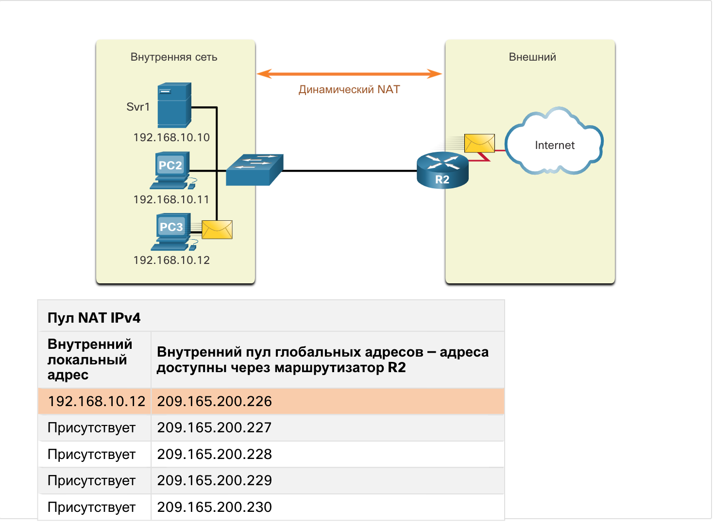
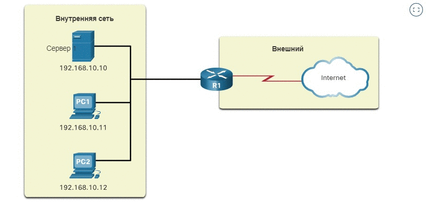

<!-- 6.2.1 -->
## Статическое преобразование NAT

Теперь, когда вы узнали о NAT и о его работе, в этом разделе будут рассмотрены другие версии NAT.

Статический NAT использует сопоставление локальных и глобальных адресов по схеме «один в один». Эти соответствия задаются администратором сети и остаются неизменными.

На рисунке для маршрутизатора R2 настроены статические соответствия для внутренних локальных адресов Сервера 1, ПК 2 и ПК 3. Когда эти устройства отправляют трафик в Интернет, их внутренние локальные адреса преобразуются в заданные внутренние глобальные адреса. Для внешних сетей эти устройства используют публичные IPv4-адреса.

<!-- /courses/ensa-dl/ae8e8c86-34fd-11eb-ba19-f1886492e0e4/aeb48b12-34fd-11eb-ba19-f1886492e0e4/assets/c632fc20-1c46-11ea-af56-e368b99e9723.svg -->

<!--
На рисунке изображен статический перевод NAT. Внутренняя сеть с адресом сервера (SRV1) 192.168.10.10, ПК (PC2) с адресом 192.168.10.11 и ПК (PC3) с адресом 192.168.10.12. Внутренняя сеть подключена к коммутатору, а коммутатор подключается к маршрутизатору R2. R2 подключается к Интернету с помощью ПК (PC4), подключенного к Интернету. Сеанс SSH подключения к внутреннему сетевому серверу SRV1 отображается с IP-адресом 209.165.200.226. Статическая таблица NAT содержит два столбца Внутренний локальный адрес и Внутренний глобальный адрес - Адреса, доступные через R2. Внутренние локальные адреса отображаются следующим образом: 192.168.10.10 - 209.165.200.226, 192.168.10.11 - 209.165.200.227, а 192.168.10.12 - 209.165.200.228.
-->

Метод статического преобразования особенно полезен для веб-серверов или устройств, которые должны иметь постоянный адрес, доступный из Интернета — например, для веб-сервера компании. Статический NAT также подходит для устройств, которые должны быть доступны авторизованному персоналу, работающему вне офиса, но при этом оставаться закрытыми для общего доступа через Интернет. Например, сетевой администратор с ПК4 может использовать SSH для получения доступа к внутреннему глобальному адресу Svr1 (209.165.200.226). Маршрутизатор R2 преобразует этот внутренний глобальный адрес во внутренний локальный адрес192.168.10.10 and подключает сеанс  к Svr1.

Для статического NAT требуется достаточное количество публичных адресов, доступных для общего количества одновременных сеансов пользователей.

<!-- 6.2.2 -->
## Динамическое преобразование NAT

При динамическом преобразовании NAT используется пул публичных адресов, которые назначаются в порядке очереди («первым пришел — первым обслужили»). Когда внутреннее устройство запрашивает доступ к внешней сети, динамическое преобразование NAT назначает доступный публичный IPv4-адрес из пула.

На рисунке ПК 3 получает доступ к Интернету, используя первый доступный адрес в пуле динамического NAT. Другие адреса по-прежнему доступны для использования. Как и для статического NAT, для динамического NAT требуется достаточное количество публичных адресов, способное обеспечить общее количество одновременных сеансов пользователей.

<!-- /courses/ensa-dl/ae8e8c86-34fd-11eb-ba19-f1886492e0e4/aeb48b12-34fd-11eb-ba19-f1886492e0e4/assets/c6337150-1c46-11ea-af56-e368b99e9723.svg -->

<!--
На рисунке изображен динамическое преобразование NAT.  Внутренняя сеть с адресом сервера (SRV1) 192.168.10.10, ПК (PC2) с адресом 192.168.10.11 и ПК (PC3) с адресом 192.168.10.12. Внутренняя сеть подключена к коммутатору, а коммутатор подключается к маршрутизатору R2. Пул Nat IPv4 имеет два столбца «Внутренний локальный адрес» и «Внутренний глобальный пул адресов» - Адреса, доступные через R2. 192.168.10.12 сопоставляется с 209.165.200.226. Но адреса 209.165.200.227 - 209.165.200.230 доступны.
-->

<!-- 6.2.3 -->
## Преобразование адресов портов

Преобразование адреса и номера порта (PAT), также называемое NAT с перегрузкой, сопоставляет множество частных IPv4-адресов одному или нескольким публичным IPv4-адресам. Так работает большинство домашних маршрутизаторов. Интернет-провайдер назначает один адрес маршрутизатору, при этом еще несколько домашних устройств могут одновременно получать доступ к Интернету. Это наиболее распространенная форма NAT как для дома, так и для предприятия.

С помощью данного метода множество адресов могут быть сопоставлены с одним или несколькими адресами, поскольку каждый частный адрес также отслеживается по номеру порта. Когда устройство запускает сеанс TCP/IP, создается значение исходного порта TCP или UDP либо специально назначенный идентификатор запроса для ICMP для определения этого сеанса уникальным образом. Если маршрутизатор NAT получает пакет от клиента, он использует свой номер порта источника, чтобы уникальным образом определить конкретное преобразование NAT.

PAT гарантирует, что устройства будут использовать разные номера портов TCP для каждого сеанса взаимодействия с сервером в Интернете. При возвращении ответа от сервера номер порта источника, который становится номером порта назначения при обратной передаче, определяет, какому устройству маршрутизатор перешлет соответствующие пакеты. Процесс PAT также проверяет, были ли запрошены входящие пакеты, таким образом повышая степень безопасности сеанса.

Нажмите кнопку Play (Воспроизведение) на рисунке, чтобы просмотреть анимацию, иллюстрирующую процесс PAT. Для того чтобы различать преобразования, механизм PAT добавляет уникальные номера портов источника к внутреннему глобальному адресу.

<!--
Рисунок представляет собой анимацию, изображающую процесс преобразования адресов порта. Анимация показывает: Внутренняя сеть из двух ПК PC1 по адресу 192.168.10.10 и PC2 по адресу 192.168.10.11, подключенных к маршрутизатору R2, который подключен к Интернету. На внешнем подключении к Интернету R2 у вас есть два сервера Svr1 по адресу 209.165.201.1 и Srvr2 по адресу 209.165.202.129. Анимация показывает PC1 с адресом источника (SA) 192.168.10. 10:1555 и адресом назначения (DA) 209.165.201. 1:80. PC2 имеет SA 192.168.10. 11:1331 и DA 209.165.202. 129:80. По мере отправки пакетов с ПК через R2 создается таблица NAT. Четыре столбца составляют таблицу NAT: Внутренний локальный IP-адрес, Внутренний глобальный IP-адрес, Внешний локальный IP-адрес и Внешний глобальный IP-адрес. PC1 имеет внутренний локальный IP-адрес 192.168.10. 10:1555 сопоставлен с внутренним глобальным адресом 209.165.200. 226:155. Внешний локальный IP-адрес — это адрес назначения 209.165.201. 1:80, сопоставленный с 209.165.201. 1:80. PC2 имеет внутренний локальный IP-адрес 192.168.10. 11:1331 сопоставлен с внутренним глобальным IP-адресом 209.165.200. 226:1331. Адрес назначения PC2s — внешний глобальный IP-адрес 209.165.202. 129:80 сопоставлен с внешним глобальным IP-адресом 209.165.202. 129:80
-->

Поскольку маршрутизатор R2 обрабатывает каждый пакет, он использует номер порта (в рассматриваемом примере 1331 и 1555) для идентификации устройства, с которого поступил пакет. Адрес источника (SA) — это внутренний локальный адрес с добавленным назначенным номером порта TCP/UDP. Адрес назначения (DA) — это внешний глобальный адрес с добавленным номером порта требуемого сервиса. В данном примере порт службы равен 80, т. е. порту для протокола HTTP.

Для адреса источника маршрутизатор R2 преобразует внутренний локальный адрес во внутренний глобальный адрес с добавленным номером порта. Адрес назначения не меняется, но теперь он считается внешним глобальным IPv4-адресом. Когда веб-сервер отвечает, путь повторяется, только в обратном порядке.

<!-- 6.2.4 -->
## Следующий доступный порт

В предыдущем примере номера портов клиента, 1331 и 1555, не изменялись на маршрутизаторе с поддержкой NAT. Данная ситуация не очень вероятна, поскольку велика вероятность того, что эти номера портов уже используются для других активных сеансов.

Преобразование PAT пытается сохранить оригинальный порт источника. В том случае, если первоначальный порт источника уже используется, PAT назначает первый доступный номер порта, начиная с наименьшего в соответствующей группе портов: 0-511, 512-1,023, or 1,024-65,535. Если доступных портов больше нет, а в пуле адресов есть несколько внешних адресов, PAT переходит к следующему адресу, пытаясь выделить первоначальный порт источника. Данный процесс продолжается до тех пор, пока не исчерпаются как доступные порты, так и внешние IPv4-адреса.

Нажмите Воспроизведение на рисунке для просмотра анимации о принципах работы PAT. В рассматриваемом примере в процессе преобразования PAT второму адресу узла назначается следующий доступный порт (1445).

<!--
Рисунок представляет собой анимацию, в которой изображен следующий доступный порт. Внутренняя сеть с адресом сервера (SRV1) 192.168.10.10, ПК (PC1) с адресом 192.168.10.11 и PC2 с адресом 192.168.10.12. Маршрутизатор (R1) соединяет внутреннюю сеть с внешним подключением к Интернету. В анимации узлы выбирают один и тот же номер порта — 1444. Это допустимо для внутреннего адреса, поскольку хостам назначаются уникальные частные IPv4-адреса. Но на маршрутизаторе с поддержкой NAT номера портов необходимо изменить. В противном случае пакеты от двух различных узлов выходили бы из R2 с одинаковым адресом источника. В данном примере предположим, что первые 420 портов в диапазоне 1,024 - 65,535 уже используются. То есть следующий доступный номер порта — 1445.
-->

В анимации узлы выбирают один и тот же номер порта — 1444. Это допустимо для внутреннего адреса, поскольку хостам назначаются уникальные частные IPv4-адреса. Но на маршрутизаторе с поддержкой NAT номера портов необходимо изменить. В противном случае пакеты от двух различных узлов выходили бы из R2 с одинаковым адресом источника. В данном примере предположим, что первые 420 портов в диапазоне 1,024 - 65,535 уже используются. То есть следующий доступный номер порта — 1445.

Когда пакеты возвращаются из вне сети, если номер исходного порта был ранее изменен маршрутизатором с включенной поддержкой NAT, номер порта назначения теперь будет изменен обратно на исходный номер порта маршрутизатором с включенной поддержкой NAT.

<!-- 6.2.5 -->
##  Сравнение NAT и PAT 

В таблице приводится сводная информация о различиях между NAT и PAT.

| NAT | PAT |
| --- | --- |
| Сопоставление локальных и глобальных адресов по схеме «один к одному» | Один внутренний глобальный адрес может быть сопоставлен со многими внутренними локальными адресами. |
| В процессе преобразования использует только адреса IPv4. | Использует IPv4 адреса и номера портов источника TCP или UDP в процессе преобразования. |
| Для каждого внутреннего узла требуется уникальный внутренний адрес доступа к внешней сети. | Один уникальный внутренний глобальный адрес может быть разделен между многими внутренними хостами для доступа к внешней сети. |

**NAT**

На рисунке показан простой пример таблицы NAT. В этом примере четыре узла во внутренней сети взаимодействуют с внешней сетью. В левом столбце перечислены адреса в глобальном пуле адресов, которые используются NAT для преобразования внутреннего локального адреса каждого узла. Обратите внимание на отношение «один-к-одному» внутренних глобальных адресов к внутренним локальным адресам для каждого из четырех узлов, обращающихся к внешней сети. При использовании NAT внутренний глобальный адрес необходим для каждого узла, который должен подключиться к внешней сети.

**Примечание:** NAT пересылает входящие возвратные пакеты на исходный внутренний узел путем ссылки на таблицу и перевода внутреннего глобального адреса обратно на соответствующий внутренний локальный адрес узла.

| **Внутренний глобальный адрес** | **Внутренний локальный адрес** |
| --- | --- |
| 209.165.200.226 | 192.168.10.10 |
| 209.165.200.227 | 192.168.10.11 |
| 209.165.200.228 | 192.168.10.12 |
| 209.165.200.229 | 192.168.10.13 |

**PAT**

В то время как NAT изменяет только адреса IPv4, PAT изменяет адрес IPv4 и номер порта. При использовании PAT обычно задействуется только один или небольшое количество публично представленных IPv4-адресов. В примере таблицы NAT показан один внутренний глобальный адрес, используемый для преобразования внутренних локальных адресов четырех внутренних узлов. PAT использует номер порта уровня 4 для отслеживания разговоров четырех узлов.

| **Внутренний глобальный адрес** | **Внутренний локальный адрес** |
| --- | --- |
| 209.165.200.226:2031 | 192.168.10.10:2031 |
| 209.165.200.226:1506 | 192.168.10.11:1506 |
| 209.165.200.226:1131 | 192.168.10.12:1131 |
| 209.165.200.226:1718 | 192.168.10.13:1718 |

<!-- 6.2.6 -->
## Пакеты без сегмента 4 уровня

Что же происходит с пакетами IPv4, передающими данные, не являющиеся сегментом TCP или UDP? Данные пакеты не содержат номера порта уровня 4. PAT преобразует большинство основных протоколов, передаваемых с помощью IPv4 и не использующих TCP или UDP в качестве протокола транспортного уровня. Самым распространенным среди таких протоколов является протокол ICMPv4. Процесс преобразования PAT обрабатывает каждый из этих протоколов по-разному. Например, сообщения запросов ICMPv4, эхо-запросы и эхо-ответы содержат идентификатор запроса (Query ID). ICMPv4 использует идентификатор запроса (Query ID), чтобы сопоставить эхо-запрос с соответствующим эхо-ответом. Идентификатор запроса увеличивается с каждым отправленным эхо-запросом. PAT использует идентификатор запроса вместо номера порта уровня 4.

**Примечание:** Другие сообщения ICMPv4 не используют идентификатор запроса (Query ID). Эти сообщения и другие протоколы, не использующие номера портов TCP и UDP, могут отличаться друг от друга и не рассматриваются в рамках материала настоящего учебного курса.

