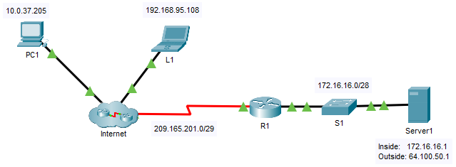

---

> **ВАЖНО**
> 
> Форма для ответов на вопросы будет доступна только при развертывании лабораторной работы 

---

## Топология



## Задачи

Часть 1. Проверка доступа без использования NAT

Часть 2. Настройка статического NAT

Часть 3. Проверка доступа с использованием NAT

## Сценарий

В сетях, настроенных по протоколу IPv4, для клиентов и серверов используется частная адресация. Перед выходом из сети в Интернет пакеты с частной адресацией должны быть преобразованы в пакеты с публичной адресацией. Серверам, доступным извне сети компании, обычно назначают как публичный, так и частный статические IP-адреса. В рамках задания необходимо настроить статический NAT таким образом, чтобы внешние устройства могли получать доступ к внутреннему серверу по публичному адресу.

## Инструкции

### Часть 1. Проверка доступа без использования NAT

**Шаг 1. Попытайтесь подключиться к серверу Сервер 1 в режиме симуляции.**

1.  Перейдите в режим моделирования.

2.  С **PC1** или **L1** попытайтесь, используя браузер, подключиться к веб-странице сервера **Server1** по адресу 172.16.16.1. Продолжайте нажимать кнопку **Capture Forward** , обратите внимание, что пакеты никогда не покидают интернет-облако. Попытки должны завершиться неудачей.

3.  Перейдите в режим **моделирования**.

4.  С **PC1** выполните эхо-запрос интерфейса **R1** S0/0/0 (209.165.201.2). Выполнение команды ping должно быть успешным.

**Шаг 2. Просмотрите таблицы маршрутизации и текущую настройку маршрутизатора R1.**

1.  Просмотрите текущую конфигурацию маршрутизатора **R1**. Обратите внимание на отсутствие команд, относящихся к NAT. Простой способ подтвердить это - выполнить следующую команду:

    ```
    R1# show run | include nat
    ```

2.  Убедитесь, что таблица маршрутизации не содержит записей, относящихся к сетевым IP-адресам для **PC1** и **L1**.

3.  Убедитесь, что NAT не используется маршрутизатором **R1**.

    ```
    R1# show ip nat translations
    ```

### Часть 2. Настройка статического NAT

**Шаг 1. Настройка команд статического NAT.**

См. топологию. Создайте статическое преобразование NAT для сопоставления внутреннего адреса **Сервер 1** его внешнему адресу.

```
R1(config)# ip nat inside source static 172.16.16.1 64.100.50.1
```

**Шаг 2. Настройте интерфейсы.**

1.  Настройте интерфейс **G0/0** в качестве внутреннего интерфейса.

    ```
    R1(config)# interface g0/0
    R1(config-if)# ip nat inside
    ```

2.  Настройте интерфейс s0/0/0 в качестве внешнего интерфейса.

### Часть 3. Проверка доступа с использованием NAT

**Шаг 1. Проверьте связь с веб-страницей сервера Server1.**

1.  Откройте командную строку на **PC1** или **L1**, попытайтесь отправить эхо-запрос, используя публичный адрес сервера **Server1**. Эхо-запросы должны быть успешными.

2.  Убедитесь, что и **PC1**, и **L1** теперь могут осуществить доступ к веб-странице сервера **Server1**.

**Шаг 2. Просмотрите преобразования NAT.**

Для проверки настройки статического преобразования NAT используйте следующие команды на **R1**::

```
show running-config
show ip nat translations
show ip nat statistics
```

[Скачать файл Packet Tracer для локального запуска](./assets/6.4.5-lab.pka)
