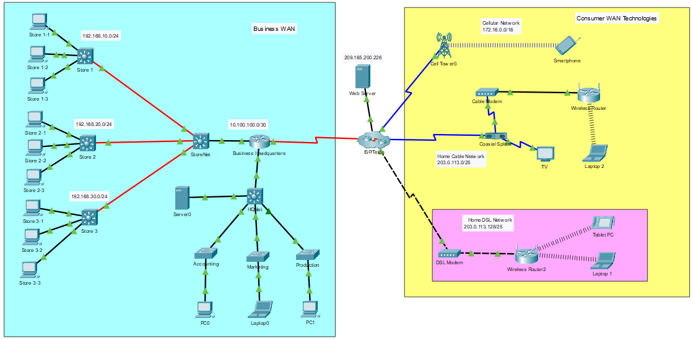

---

> **ВАЖНО**
> 
> Форма для ответов на вопросы будет доступна только при развертывании лабораторной работы 

---

## Топология

## Задачи

В этом действии вы будете исследовать различные типы WAN, изучая топологию, использующую различные технологии подключения.

-   Опишите различные параметры подключения к глобальной сети.

## Общие сведения и сценарий

Вы изучите технологии WAN, которые используются для подключения бизнес-пользователей и домашних пользователей к службам передачи данных.

**Примечание**. В этой задании нет подсчета очков.

## Инструкции

### Часть 1. Изучение технологии WAN для домашних и мобильных устройств

**Шаг 1. Изучите технологии WAN для пользователей**

На этом этапе вы изучите три технологии WAN для пользователей и домашние сети.

1.  Посмотрите на две домашние сети.

    - Ответьте на вопрос №1

2.  Проверьте подключения, используемые в топологии сети, выбрав значок Подключения (стрелка ввиде оранжевой молнии) в меню устройств PT. Наведите курсор на значки мультимедиа, чтобы отобразить их имена в белом поле в нижней части окна PT.

    - Ответьте на вопрос №2

3.  Щелкните DSL-модем и откройте вкладку Physical.

    Ответьте на следующие вопросы:

    - вопрос №3

    - вопрос №4

    - вопрос №5

4.  Посмотрите на порты кабельного модема.

    Ответьте на следующие вопросы:

    - вопрос №6

    - вопрос №7

5.  Посмотри на смартфон.

    - Ответьте на вопрос №8

**Шаг 2. Ознакомьтесь с бизнес-WAN**

На этом этапе вы будете исследовать бизнес WAN. Бизнес является розничным магазином шин. Он имеет локальную штаб-квартиру, где происходит большинство бизнес-функций, и три магазина, которые подключены к бизнес-глобальной сети.

1.  Посмотрите на меню «Подключения».

    - Ответьте на вопрос №9

2.  Откройте физическое представление для коммутатора StoreNet.

    Ответьте на следующие вопросы:

    - вопрос №10

    - вопрос №11

    - вопрос №12

### Часть 2. Изучение возможностей подключения

- Ответьте на вопрос №13

[Скачать файл Packet Tracer для локального запуска](./assets/7.6.1-lab.pka)
