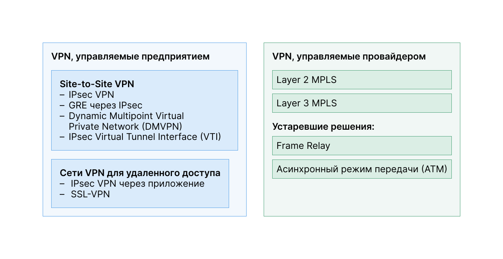

<!-- 8.1.1 -->
## Виртуальные частные сети

Чтобы защитить сетевой трафик между сайтами и пользователями, организации создают сквозные подключения к частной сети с помощью VPN. Ее называют виртуальной: информация в ней находится в пределах частной сети, но фактически эта информация передается по общедоступной. **VPN** — частная, потому что трафик в ней шифруется для сохранения конфиденциальности данных при их передаче через общедоступную сеть.

Основной сайт предприятия управляет различными типами VPN, показанными на рисунке. Туннель позволяет удаленным сайтам и пользователям получить безопасный доступ к сетевым ресурсам основного сайта.

<!-- /courses/ensa-dl/ae8e8c8a-34fd-11eb-ba19-f1886492e0e4/aeb59c80-34fd-11eb-ba19-f1886492e0e4/assets/c666b650-1c46-11ea-af56-e368b99e9723.svg -->

* Межсетевой экран Cisco Adaptive Security Appliance (ASA) помогает организациям предоставлять безопасные высокопроизводительные подключения, включая VPN и постоянный доступ для удаленных филиалов и мобильных пользователей.
* SOHO (small office/home office) — место, где маршрутизатор может обеспечить VPN подключение к основному корпоративному сайту.
* Решение Cisco AnyConnect — это программное обеспечение, которое удаленные работники могут использовать для установления клиентского VPN-соединения с основным сайтом.

<!--
Основной сайт предприятия управляет различными типами VPN, показанными на рисунке. На главном сайте показан межсетевой экран Cisco ASA, подключенный к корпоративной сети. Он соединяется через Интернет с маршрутизатором Cisco для бизнес-партнеров, межсетевым экраном Cisco ASA для региональных офисов, маршрутизатором Cisco для SOHO и с мобильным работником, удаленно подключающемуся через Cisco AnyConnect.
-->

Первые сети VPN представляли собой обычные IP-туннели, в которых аутентификация или шифрование данных не выполнялись. Например, Generic Routing Encapsulation (GRE) — протокол туннелирования, разработанный Cisco, не включает службы шифрования. Он используется для инкапсуляции трафика IPv4 и IPv6 в туннеле IP для создания виртуального канала точка-точка.

<!-- 8.1.2 -->
## Преимущество сети VPN

Современные VPN теперь защищают сетевой трафик между сайтами с помощью функций шифрования, таких как Internet Protocol Security (IPsec) и Secure Sockets Layer (SSL).

Основные преимущества VPN

| **Преимущество** | **Описание** |
| --- | --- |
| **Сокращение затрат** | Благодаря экономически эффективным, высокоскоростным технологиям организации с помощью сетей VPN дешевле подключаются к сети и одновременно повышают пропускную способность удаленных подключений |
| **Безопасность** | VPN обеспечивают максимальный уровень безопасности благодаря сложным протоколам шифрования и аутентификации, которые защищают данные от несанкционированного доступа |
| **Масштабируемость** | Благодаря сетям VPN организациям стало проще добавлять новых пользователей, не усложнения существующую инфраструктуру |
| **Совместимость** | VPN можно реализовать с использованием каналов WAN различного типа, включая все популярные широкополосные технологии. Удаленные сотрудники могут использовать возможности таких высокоскоростных подключений для безопасного доступа к корпоративным сетям |

<!-- 8.1.3 -->
## Site-to-Site VPN и VPN для удаленного доступа

VPN обычно развертываются в одной из следующих конфигураций: site-to-site или удаленный доступ.

**Site-to-site VPN**

Site-to-site VPN создается, когда устройства, также называемые VPN-шлюзами, на обеих сторонах подключения заранее знают конфигурацию VPN. Трафик шифруется только между этими устройствами. Внутренние узлы не знают о существовании VPN.

<!-- /courses/ensa-dl/ae8e8c8a-34fd-11eb-ba19-f1886492e0e4/aeb59c80-34fd-11eb-ba19-f1886492e0e4/assets/c667a0b0-1c46-11ea-af56-e368b99e9723.svg -->

<!--
На рисунке показано VPN-соединение типа site-to-site. Клиентский ноутбук подключается к сетевому шлюзу VPN, показанному как маршрутизатор. Шлюз VPN подключен через Интернет, который изображен как облако, к другому шлюзу VPN, показанному как межсетевой экран ASA.
-->

**Сеть VPN удаленного доступа**

VPN с удаленным доступом динамически создается для безопасного соединения между клиентом и оконечным устройством VPN. Например, SSL VPN с удаленным доступом используют при онлайн-проверке банковской информации.

<!-- /courses/ensa-dl/ae8e8c8a-34fd-11eb-ba19-f1886492e0e4/aeb59c80-34fd-11eb-ba19-f1886492e0e4/assets/c66815e0-1c46-11ea-af56-e368b99e9723.svg -->

<!-- 8.1.4 -->
## VPN для крупных компаний и операторов связи

Захитить корпоративный трафик моно многими вариантами. Они различаются в зависимости от того, кто управляет VPN.

VPN можно управлять и развертывать как: 

* **VPN для крупных компаний** — распространенное решение для защиты корпоративного трафика через Интернет. Предприятие создаёт и управляет VPN типа site-to-site и удаленный доступ с использованием IPsec и SSL VPN;
* **VPN операторов связи** — провайдеры создают VPN-сервисы и управляют ими. Провайдер создает безопасные каналы между сайтами предприятия с помощью многопротокольной коммутации по меткам (MPLS) на уровне 2 или 3. Multiprotocol Label Switching (MPLS) — технология маршрутизации, которую провайдер использует для создания виртуальных путей между сайтами. Она эффективно разделяет трафик от разных клиентов. Старые решения включают в себя Frame Relay и режим асинхронной передачи (ATM) VPN.

На рисунке перечислены различные типы развертываний VPN под управлением предприятия и сервис-провайдера, которые более подробно разберем в этом модуле.

<!-- /courses/ensa-dl/ae8e8c8a-34fd-11eb-ba19-f1886492e0e4/aeb59c80-34fd-11eb-ba19-f1886492e0e4/assets/c6688b12-1c46-11ea-af56-e368b99e9723.svg -->

<!--
В двух столбцах перечислены различные типы развертываний VPN, управляемых предприятием и сервис-провайдером. В столбце VPN, управляемые предприятием, VPN типа Site-to-site это: IPsec VPN, GRE over IPsec, Cisco Dynamic Multipoint Virtual Private Network (DMVPN), и IPsec Virtual Tunnel Interface (VTI). VPN для удаленного доступа: клиентское VPN-соединение IPsec и Бесклиентное SSL-соединение. В столбце VPN-сервисы, управляемые провайдером, указаны MPLS уровня 2 и 3, а устаревшими решениями являются Frame Relay и режим асинхронной передачи (ATM).
-->

<!-- 8.1.5 -->
<!-- quiz -->

