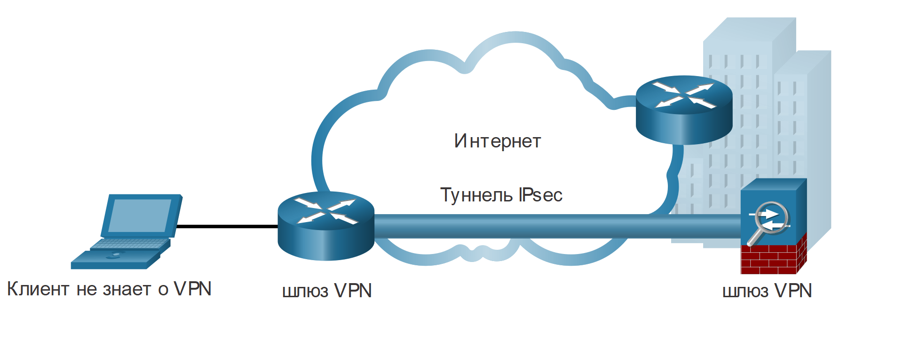

<!-- 8.2.1 -->
## Сети VPN удаленного доступа

В предыдущей теме вы узнали об основах VPN технологии. Здесь вы узнаете подробнее о типах таких соединений.

VPN стали логичным решением для удаленного доступа по многим причинам. Как показано на рисунке, они позволяют удаленным и мобильным пользователям безопасно подключаться к предприятию, создавая зашифрованный туннель. Дистанционные пользователи могут безопасно копировать доступ к корпоративной сети безопасности, включая электронную почту и сетевые приложения. VPN для удаленного доступа также при необходимости дает подрядчикам и партнерам ограниченный доступ к определенным серверам, веб-страницам или файлам. Пользователи могут повышать эффективность бизнеса без ущерба для безопасности сети.

Обычно пользователи динамически включают сети VPN для удаленного доступа, когда это необходимо. Их можно создать с использованием IPsec или SSL. Как показано на рисунке, удаленный пользователь должен инициировать VPN-подключение.

Удаленный пользователь может инициировать VPN-подключение удаленного доступа двумя способами: бесклиентное VPN и клиентское VPN.

<!-- /courses/ensa-dl/ae8e8c8a-34fd-11eb-ba19-f1886492e0e4/aeb59c82-34fd-11eb-ba19-f1886492e0e4/assets/c66a5fd1-1c46-11ea-af56-e368b99e9723.svg -->

* **Бесклиентное VPN-соединение** — защищено с помощью SSL-соединения через браузер. В основном этот протокол защщает HTTP-трафик (HTTPS) и почтовые протоколы (IMAP и POP3). Например, для HTTPS устанавливается SSL-соединение, а затем по нему происходит обмен данными HTTP.
* **Клиентское VPN-соединение** — программное обеспечение VPN-клиента, такое как Cisco AnyConnect Secure Mobility Client, нужно установить на удаленном конечном устройстве. С его помощью пользователи должны инициировать VPN-соединение, а затем пройти аутентификацию на целевом VPN-шлюзе. После аутентификации удаленные пользователи получают доступ к корпоративным файлам и приложениям. Программное обеспечение клиента шифрует трафик с использованием IPsec или SSL и передает его через Интернет на целевой VPN-шлюз.

<!--
На рисунке показаны два способа, с помощью которых удаленный пользователь может инициировать VPN-подключение удаленного доступа: бесклиентное и клиентское VPN. Ноутбук одного пользователя подключен к Центральному офису через туннель SSL VPN через Интернет с помощью пользовательского веб-браузера. Второй ноутбук подключен к Центральному офису через Интернет с помощью Cisco AnyConnect Secure Mobility Client.
-->

<!-- 8.2.2 -->
## SSL VPN

Когда клиент договаривается о соединении SSL VPN со шлюзом, он фактически соединяется, используя Transport Layer Security (TLS). **TLS** — более новая версия SSL, иногда она обозначается как SSL/TLS. Оба термина часто используются взаимозаменяемо.

SSL использует инфраструктуру открытых ключей и цифровые сертификаты для аутентификации партнеров. Технологии IPsec и SSL VPN делают возможным доступ практически к любому сетевому приложению или ресурсу. Но если безопасность является проблемой, IPsec — лучший выбор. Если первоочередные задачи — поддержка и простота развёртывания, следует иметь в виду протокол SSL. Метод создания сети VPN выбирают с учетом требований к доступу пользователей, а также процедур IT в организации. В таблице сравниваются развертывания удаленного доступа IPsec и SSL.

| Функция | Протокол IPsec | SSL |
| --- | --- | --- |
| **Поддержка приложений** | **Обширная** — все IP-приложения поддерживаются. | **Ограниченная** — поддерживает только веб-приложения и обмен файлами. |
| **Сила аутентификации** | **Сильная** — использует двустороннюю аутентификацию с общими ключами или цифровыми сертификатами. | **Умеренная** — Использует одностороннюю или двустороннюю аутентификацию. |
| **Сила шифрования** | **Сильная** — использует длину ключа от 56 до 256 бит. | **От умеренного до сильного** — длина ключа от 40 бит до 256 бит. |
| **Сложность подключения** | **Средняя** — требуется предварительно установленный VPN-клиент на хосте. | **Низкий** — требуется только веб-браузер на хосте. |
| **Варианты подключения** | **Ограниченный** — подключаться могут только определенные устройства с определенными конфигурациями. | **Обширный** — подключиться может любое устройство с веб-браузером. |

Важно понимать, что IPsec и SSL VPN — не взаимоисключающие. Обе технологии решают разные проблемы, и организация может использовать IPsec, SSL или и то, и другое, в зависимости от потребностей своих сотрудников.

<!-- 8.2.3 -->
## Site-to-Site IPSec VPN

Site-to-site VPN используют для подключения сетей через другую недоверенную сеть, такую как Интернет. В site-to-site VPN конечные хосты отправляют и получают обычный незашифрованный трафик TCP/IP через оконечное устройство VPN. Оконечное устройство VPN обычно называется шлюзом VPN. Оно может быть роутером или межсетевым экраном. Например, как показано на рисунке, **Cisco Adaptive Security Appliance** (ASA) — это автономный межсетевой экран, который объединяет в пределах одного образа программного обеспечения функции межсетевого экрана, концентратора VPN, а также системы предотвращения вторжений в один образ программного обеспечения.

<!-- /courses/ensa-dl/ae8e8c8a-34fd-11eb-ba19-f1886492e0e4/aeb59c82-34fd-11eb-ba19-f1886492e0e4/assets/c66bbf60-1c46-11ea-af56-e368b99e9723.svg -->

<!--
На рисунке показано соединение VPN типа site-to-site с использованием туннеля IPsec. Клиентский ноутбук подключается к сетевому шлюзу VPN, показанному как маршрутизатор. Шлюз VPN подключен через Интернет, который изображен как облако, к другому, показанному как межсетевой экран ASA. Соединение между двумя VPN-шлюзами использует IPsec для защиты VPN-туннеля.
-->

Шлюз инкапсулирует и шифрует исходящий трафик, затем передает его через VPN-туннель по Интернету в равноправный соседний шлюз на стороне приема. При получении данных соседний удаляет заголовки, расшифровывает содержимое и передает пакет в узел назначения по своей частной сети.

Site-to-site VPN обычно создается и защищается с использованием IPsec.

<!-- 8.2.4 -->
## GRE через IPSec

**Универсальная инкапсуляция маршрутизации** (Generic Routing Encapsulation, GRE) — это незащищенный протокол создания туннелей для VPN типа site-to-site. Он может инкапсулировать различные протоколы сетевого уровня, поддерживает многоадресный и широковещательный трафик, который может быть необходим, если организации нужны протоколы маршрутизации для работы через VPN. Однако GRE по умолчанию не поддерживает шифрование, и поэтому не обеспечивает безопасный VPN-туннель.

Стандартный IPsec VPN (не GRE) может создавать безопасные туннели только для одноадресного трафика. Поэтому протоколы маршрутизации не будут обмениваться информацией о маршрутизации через IPsec VPN.

Чтобы решить эту проблему, мы можем инкапсулировать трафик протокола маршрутизации с использованием пакета GRE, а затем инкапсулировать пакет GRE в пакет IPsec для безопасной пересылки на VPN-шлюз назначения.

Для описания инкапсуляции GRE через туннель IPsec используют термины «протокол-пассажир», «несущий протокол» и «транспортный протокол».

<!-- /courses/ensa-dl/ae8e8c8a-34fd-11eb-ba19-f1886492e0e4/aeb59c82-34fd-11eb-ba19-f1886492e0e4/assets/c66c3493-1c46-11ea-af56-e368b99e9723.svg -->

* **протокол-пассажир** – оригинальный пакет, который должен быть инкапсулирован GRE. Это может быть пакет IPv4 или IPv6, обновление маршрутизации и многое другое;
* **несущий протокол** – GRE, который инкапсулирует исходный пассажирский пакет;
* **транспортный протокол** – фактически будет использоваться для пересылки пакета. Это может быть IPv4 или IPv6.

<!--
На рисунке показана инкапсуляция GRE через туннель IPsec. В пакете IPSec есть 5 полей: IP, GRE, IP, TCP и Data. IP — это транспортный протокол. GRE — это несущий протокол. IP, TCP и данные — протокол-пассажир.
-->

Например, на рисунке, отображающем топологию, Branch и HQ хотели бы обмениваться информацией о маршрутизации OSPF через IPsec VPN. Однако IPsec не поддерживает многоадресный трафик. Поэтому через него GRE используют для поддержки трафика протокола маршрутизации через IPsec VPN. В частности, пакеты OSPF (то есть протокол-пассажир) будут инкапсулированы GRE (то есть несущим протоколом) и впоследствии инкапсулированы в VPN-туннель IPsec.

<!-- /courses/ensa-dl/ae8e8c8a-34fd-11eb-ba19-f1886492e0e4/aeb59c82-34fd-11eb-ba19-f1886492e0e4/assets/c66cf7e0-1c46-11ea-af56-e368b99e9723.svg -->

<!--
На рисунке показана топология, маршрутизаторы филиала и HQ обмениваются информацией о маршрутизации OSPF через IPsec VPN. Коммутатор подключается к роутеру филиала, который в свою очередь подключен к роутеру HQ через Интернет с использованием туннеля IPsec VPN GRE. HQ соединен с коммутатором, который подключен к серверу электронной почты.
-->

Снимок экрана Wireshark на рисунке отображает пакет Hello OSPF, отправленный с использованием GRE через IPsec. В этом примере исходный многоадресный пакет Hello OSPF (пассажирский протокол) был инкапсулирован в заголовок GRE (несущий протокол), который впоследствии инкапсулируется другим IP-заголовком (транспортным протоколом). Тогда он будет пересылается через туннель IPsec.

<!-- /courses/ensa-dl/ae8e8c8a-34fd-11eb-ba19-f1886492e0e4/aeb59c82-34fd-11eb-ba19-f1886492e0e4/assets/c66d9420-1c46-11ea-af56-e368b99e9723.svg -->

<!--
На рисунке показан снимок экрана Wireshark пакета Hello OSPF, отправленного с использованием GRE через IPSec. Транспортная часть выходных данных обведена прямоугольником и показывает Internet Protocol Version 4. Источник: 192.168.12.1. Назначение: 192.168.23.3. Часть несущего протокола в выходных данных обведена прямоугольником и показывает общую инкапсуляцию маршрутизации, флаг и версию и тип протокола, IP. Протокольная часть выходных данных обведена прямоугольником и показывает IPv4. Источник: 192.168.13.1. Назначение: 224.0.0.5 и указывается Open Shortest Path First (OSPF).
-->

<!-- 8.2.5 -->
## Динамическая многоточечная VPN-сеть (DMVPN)

Site-to-site IPSec VPN и GRE через IPSec подходят для использования, когда для безопасного соединения существует всего несколько сайтов. Однако их недостаточно, когда предприятие добавляет больше сайтов. Это связано с тем, что для каждого из них требуются статические конфигурации центрального сайта или всех других.

**Динамическая многоточечная VPN-сеть** (DMVPN) — программное решение Cisco, которое обеспечивает удобство, оперативность и масштабируемость при создании большого количества VPN. DMVPN также обеспечивает безопасную передачу через общедоступные сети (Интернет) с помощью протокола IPsec.

DMVPN упрощает настройку VPN-туннеля и предоставляет гибкую возможность подключения центрального сайта к филиалам. Он использует конфигурацию «звезда», чтобы установить полносвязанную топологию. Филиалы устанавливают безопасные туннели до ее центра.

**Туннели DMVPN типа «звезда»**

<!-- /courses/ensa-dl/ae8e8c8a-34fd-11eb-ba19-f1886492e0e4/aeb59c82-34fd-11eb-ba19-f1886492e0e4/assets/c66de243-1c46-11ea-af56-e368b99e9723.svg -->

Каждый сайт конфигурируется с использованием технологии Multipoint Generic Routing Encapsulation (mGRE). Туннельный интерфейс mGRE позволяет одному GRE интерфейсу поддерживать несколько динамических IPsec туннелей. Следовательно, когда нужно установить новое безопасное соединение с центральным роутером, будет использоваться та же конфигурация для создания туннеля.

В филиалы вся информация поступает от центрального роутера. Как показано на рисунке, они могут использовать эту информацию для установления прямых VPN туннелей.

**Туннели DMVPN типа «звезда» и «луч-луч»**

<!-- /courses/ensa-dl/ae8e8c8a-34fd-11eb-ba19-f1886492e0e4/aeb59c82-34fd-11eb-ba19-f1886492e0e4/assets/c66e3060-1c46-11ea-af56-e368b99e9723.svg -->

<!--
На рисунке представлены туннели DMVPN в топологии «звезда» с туннелями «луч-луч». Центральный роутер имеет три канала связи до Филиала А, Филиала В и Филиала С. Где пунктирная линия показывает соединения одного филиала с другими.  
-->

<!-- 8.2.6 -->
## Интерфейс виртуальных туннелей IPsec

Как и DMVPN, интерфейс виртуального туннеля IPsec (VTI) упрощает настройку, необходимую для поддержки нескольких сайтов и удаленного доступа. Конфигурации VTI применяются к виртуальному интерфейсу вместо статического сопоставления сеансов IPsec с физическим интерфейсом.

IPsec VTI способен отправлять и получать как одноадресный, так и многоадресный зашифрованный трафик. Поэтому протоколы маршрутизации поддерживаются автоматически без необходимости настройки туннелей GRE.

IPsec VTI может быть настроен между сайтами или в топологии hub-and-spoke.

<!-- /courses/ensa-dl/ae8e8c8a-34fd-11eb-ba19-f1886492e0e4/aeb59c82-34fd-11eb-ba19-f1886492e0e4/assets/c66e7e80-1c46-11ea-af56-e368b99e9723.svg -->

<!--
На рисунке показано, как интерфейс виртуального туннеля IPSec (VTI) упрощает процесс настройки, необходимый для поддержки нескольких сайтов и удаленного доступа. Трафик поступает в интерфейс роутера от коммутатора, пакеты направляются на VTI, VTI шифрует и пересылает зашифрованный пакет на физический интерфейс выхода.
-->

<!-- 8.2.7 -->
## MPLS VPN уровня провайдера

Традиционные решения WAN для провайдеров, такие как выделенные линии, Frame Relay и соединения ATM, изначально были безопасными в своей конструкции. Сегодня провайдеры используют MPLS в своей сети ядра. Трафик передается через магистраль с использованием меток, которые раньше распределялись между основными роутерами. Как и в случае устаревших WAN-соединений, трафик защищен, потому что клиенты поставщика услуг не могут видеть трафик друг друга.

MPLS может предоставлять клиентам управляемые решения VPN, следовательно, защита трафика между сайтами — обязанность поставщика услуг. Провайдеры поддерживают два типа решений MPLS VPN:

* **уровень 3 MPLS VPN** — провайдер участвует в маршрутизации клиентов, устанавливая пиринг между роутерами клиента и провайдера, затем маршруты клиента перераспределяются поставщиком услуг через сеть MPLS в удаленные сети;
* **уровень 2 MPLS VPN** — провайдер не участвует в маршрутизации клиента, вместо этого он разворачивает службу виртуальной частной локальной сети (VPLS) для эмуляции сегмента локальной сети Ethernet с множественным доступом по сети MPLS. Роутеры клиента фактически принадлежат к одной и той же сети.

На рисунке показан сервис-провайдер, который предлагает MPLS VPN уровня 2 и уровня 3.

<!-- /courses/ensa-dl/ae8e8c8a-34fd-11eb-ba19-f1886492e0e4/aeb59c82-34fd-11eb-ba19-f1886492e0e4/assets/c66ecca2-1c46-11ea-af56-e368b99e9723.svg -->

<!-- 8.2.8 -->
<!-- quiz -->

