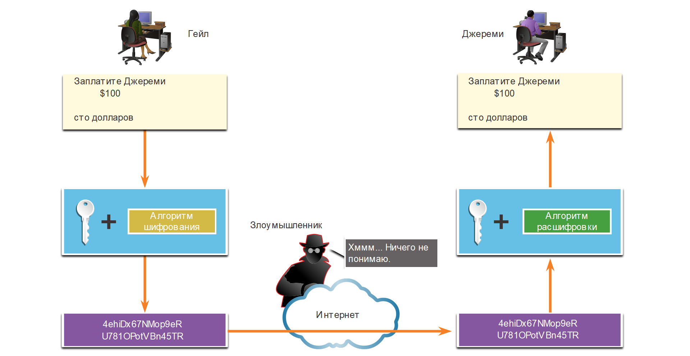
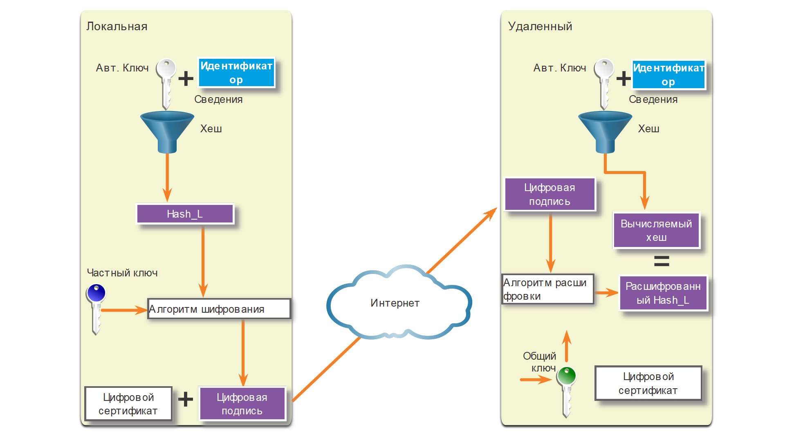

<!-- 8.3.1 -->
## Видео: Концепции IPSec

В предыдущей теме вы узнали о типах VPN. Важно понимать, как с ними работает IPsec.

Нажмите «Воспроизвести» на рисунке, чтобы посмотреть видео об IPSec.

<!-- 8.3.2 -->
## IPSec технологии

IPsec — это стандарт IETF (RFC 2401-2412), который определяет, как можно защитить VPN в IP-сетях. Этот протокол защищает и аутентифицирует IP-пакеты между источником и адресатом. IPsec может защитить трафик от уровня 4 до уровня 7.

Благодаря своей структуре IPsec выполняет основные функции обеспечения безопасности:

* **конфиденциальность** — IPsec использует алгоритмы шифрования и не дает злоумышленникам прочитать содержимое пакета;
* **целостность** — IPsec использует алгоритмы хеширования, чтобы гарантировать, что пакеты не изменятся между источником и адресатом;
* **аутентификация источника** — IPsec использует протокол Internet Key Exchange (IKE) источника и получателя. Методы аутентификации включают использование общих ключей (паролей), цифровых сертификатов или RSA;
* **Диффи-Хеллман** — безопасный обмен ключами, обычно с использованием различных групп алгоритма DH.

Чтобы обеспечить безопасную связь, протокол IPsec не привязывается ни к каким специальным правилам. С такой гибкой структурой он легко интегрирует новые технологии безопасности без обновления существующих стандартов. Доступные технологии соответствуют их конкретной функции. Открытые слоты, показанные на рисунке, могут быть заполнены любым из вариантов, доступных для этой функции IPsec, чтобы создать уникальную ассоциацию безопасности (SA).

<!-- /courses/ensa-dl/ae8e8c8a-34fd-11eb-ba19-f1886492e0e4/aeb59c84-34fd-11eb-ba19-f1886492e0e4/assets/c6711693-1c46-11ea-af56-e368b99e9723.svg -->

<!--
На рисунке изображены параметры для структуры IPsec. Существует пять функций: протокол IPsec, конфиденциальность, целостность, аутентификация и Диффи-Хеллман. Каждая функция имеет доступные параметры. Варианты протокола IPsec: AH, ESP или ESP+AH. Параметры конфиденциальности: DES, 3DES, AES или SEAL. Варианты целостности: MD5 или SHA. Варианты аутентификации: PSK или RSA. Варианты Диффи-Хеллмана: DH1, DH2, DH5 и т. д.
-->

Функции безопасности перечислены в таблице.

| Функция IPSec | Описание |
| --- | --- |
| **Протокол IPsec** | Выбор протокола IPsec включает в себя Authentication Header (AH) или Encapsulation Security Protocol (ESP). AH аутентифицирует пакеты уровня 3. ESP их шифрует. **Примечание:** ESP+AH редко используется, так как эта комбинация не будет успешно проходить через устройство NAT. |
| **Конфиденциальность** | Шифрование обеспечивает конфиденциальность пакета уровня 3. Варианты включают в себя Data Encryption Standard (DES), Triple DES (3DES), Advanced Encryption Standard (AES), или Software-Optimized Encryption Algorithm (SEAL). Доступна опция без шифрования. |
| **Целостность** | Гарантирует, что данные поступают в пункт назначения без изменений с использованием алгоритма хеширования, такого как Message Digest 5 (MD5) или Secure Hash Algorithm (SHA). |
| **Аутентификация** | IPsec использует Internet Key Exchange (IKE) для аутентифкации пользовательских устройств которые могут независимо устанавливать связь. У IKE несколько типов аутентификации: логин и пароль, одноразовый пароль, биометрические данные, предустановленные ключи (PSK) и цифровые сертификаты с использованием алгоритма RSA. |
| **Алгоритм Диффи-Хеллмана** | IPSec использует алгоритм DH для предоставления метода обмена публичного ключа между двумя участниками для установления общего секретного ключа. Существует несколько групп на выбор: DH14, 15, 16 и DH19, 20, 21 и 24. DH1, 2 и 5 сейчас не рекомендуются к использованию. |

Рисунок показывает пример SA для двух различных реализаций. Это основа для IPsec. При установлении VPN-соединения одноранговые узлы должны совместно использовать одну и ту же SA для согласования параметров обмена ключами, установления общего ключа, аутентификации друг друга и согласования параметров шифрования. Обратите внимание, что в Примере 1 не используется шифрование.

**Примеры ассоциации безопасности IPsec**

<!-- /courses/ensa-dl/ae8e8c8a-34fd-11eb-ba19-f1886492e0e4/aeb59c84-34fd-11eb-ba19-f1886492e0e4/assets/c6722803-1c46-11ea-af56-e368b99e9723.svg -->

<!--
Рисунок показывает пример SA для двух различных реализаций. В первом примере есть AH для протокола IPSec, ничего не выбрано для конфиденциальности, MD5 для целостности, PSK для аутентификации и DH16 для Диффи-Хеллмана. Во втором примере есть ESP для протокола IPsec, AES, выбранный для конфиденциальности, SHA для целостности, RSA для аутентификации и DH24 для Диффи-Хеллмана.
-->

<!-- 8.3.3 -->
## Инкапсуляция протокола IPSec

Выбор инкапсуляции протокола IPsec — основа фреймворка. IPsec инкапсулирует пакеты с использованием Authentication Header (AH) или Encapsulation Security Protocol (ESP).

Выбор AH или ESP определяет, какие другие блоки будут доступны. Нажмите на каждый протокол IPsec на рисунке, чтобы узнать дополнительную информацию.

<!-- /courses/ensa-dl/ae8e8c8a-34fd-11eb-ba19-f1886492e0e4/aeb59c84-34fd-11eb-ba19-f1886492e0e4/assets/c672eb52-1c46-11ea-af56-e368b99e9723.svg -->

* AH уместен, когда конфиденциальность не требуется или не разрешается. Он обеспечивает аутентификацию и целостность данных, но не их конфиденциальность. Весь текст транспортируется в незашифрованном виде;
* ESP обеспечивает аутентификацию для внутреннего IP-пакета и заголовка ESP, а также конфиденциальность с помощью шифрования IP-пакета. Аутентификация обеспечивает проверку подлинности источника данных и их целостность. Хотя процедуры шифрования и аутентификации в ESP необязательные, необходимо выбрать минимум одну из них.

<!--
На рисунке изображены параметры для структуры IPsec. Существует пять функций: протокол IPsec, конфиденциальность, целостность, аутентификация и Диффи-Хеллман. Каждая функция имеет доступные параметры. Варианты протокола IPsec: AH, ESP или ESP + AH. Параметры конфиденциальности: DES, 3DES, AES или SEAL. Варианты целостности: MD5 или SHA. Варианты аутентификации: PSK или RSA. Варианты Диффи-Хеллмана: DH1, DH2, DH5 и т. д.
-->

<!-- 8.3.4 -->
## Конфиденциальность

Конфиденциальность достигается путем шифрования данных, как показано на рисунке. Степень конфиденциальности зависит от алгоритма шифрования и длины используемого в нем  ключа. При попытке взлома грубой атакой, количество возможных попыток зависит от длины ключа. Время обработки зависит от мощности атакующего компьютера. Чем короче ключ, тем проще его взломать. Относительно мощный компьютер будет расшифровывать 64-битный ключ около года. Для 128-битного понадобится приблизительно 10 квинтиллионов лет.

<!-- /courses/ensa-dl/ae8e8c8a-34fd-11eb-ba19-f1886492e0e4/aeb59c84-34fd-11eb-ba19-f1886492e0e4/assets/c6738793-1c46-11ea-af56-e368b99e9723.svg -->

<!--
На рисунке Гейл отправляет Джереми сто долларов через Интернет и шифрующую/дешифрующую передачу. Используя длину ключа и алгоритм шифрования, передача зашифровывается, в результате чего сто долларов превращаются в 4ehiDx67NMop9eRU781OPotVBn45TR. Зашифрованные данные отправляются через Интернет. Злоумышленник, перехватывающий денные, не может прочитать данные. Когда они приходят на компьютер Джереми, данные расшифровываются, что приводит к получению сто долларов от Гейла.
-->

Все алгоритмы шифрования, выделенные на рисунке, представляют собой криптосистемы с симметричным ключом.

<!-- /courses/ensa-dl/ae8e8c8a-34fd-11eb-ba19-f1886492e0e4/aeb59c84-34fd-11eb-ba19-f1886492e0e4/assets/c673d5b2-1c46-11ea-af56-e368b99e9723.svg -->

* DES использует 56-битный ключ;
* 3DES — вариант DES. Он использует три независимых 56-битных ключа шифрования на 64-битный блок, что обеспечивает более надежную защиту по сравнению с DES;
* AES безопаснее чем DES и вычислительно эффективнее чем 3DES. Он предлагает три длины ключа: 128, 192 и 256 бит.
* SEAL — потоковый шифр, который непрерывно шифрует данные, а не блоки. SEAL использует 160-битный ключ.

<!--
На рисунке показана разная длина ключа и сила различных алгоритмов шифрования, в том числе DES, 3DES, AES или SEAL. Длина ключа для DES — 56 бит, это наименее безопасный алгоритм шифрования. 3DES — второй наименее безопасный алгоритм шифрования, его длина ключа составляет 3 раза по 56 бит. AES более безопасен, его длина ключа 128, 192 и 256 битов. Другой более безопасный вариант — SEAL, он имеет длину ключа 160 бит. 
-->

<!-- 8.3.5 -->
## Целостность

Целостность означает, что принятые данные точно совпадают с отправленными. Теоретически, данные можно перехватить и изменить. Например, на рисунке показано, что чек на сумму 100 долларов выписан Алексу. Этот чек перехватил злоумышленник, поменял имя на Джереми и сумму на 1000 долларов, чтобы украсть деньги. Если качество подделки в окажется высоким, попытка может оказаться успешной.

<!-- /courses/ensa-dl/ae8e8c8a-34fd-11eb-ba19-f1886492e0e4/aeb59c84-34fd-11eb-ba19-f1886492e0e4/assets/c6755c50-1c46-11ea-af56-e368b99e9723.svg -->

<!--
На рисунке денежная сумма и данные изменяются, что приводит к различным результатам хэширования. Начальная сумма у Алекса была 4ehiDx67NMop9. Ее перехватили, а имя изменили на Джереми, в результате чего хеш стал 12ehqPx67NMoX. Начальный и конечный хеш различаются.
-->

Так как данных сети VPN передаются по публичному Интернету, нужен специальный метод обеспечения целостности данных, который сохранит передаваемый контент. Hashed Message Authentication Code (HMAC) – это алгоритм обеспечения целостности данных с помощью хеш-значения. На рисунке представлены два наиболее распространенных алгоритма HMAC. Нажмите на каждый алгоритм, чтобы получить дополнительные сведения.

**Примечание:** Сегодня корпорация Cisco считает алгоритм SHA-1 устаревшим и рекомендует применять для обеспечения целостности, по крайней мере, алгоритм SHA-256. 

<!-- /courses/ensa-dl/ae8e8c8a-34fd-11eb-ba19-f1886492e0e4/aeb59c84-34fd-11eb-ba19-f1886492e0e4/assets/c675d181-1c46-11ea-af56-e368b99e9723.svg -->

* Message-Digest 5 (MD5) использует 128-битный общий секретный ключ. Он объединяется с сообщением произвольной длины. Они обрабатываются алгоритмом хеширования HMAC-MD5. В результате создаётся 128-битный хеш-код;
* Secure Hash Algorithm (SHA) использует 160-битный секретный ключ. Он объединяется с сообщением переменной длины. Они обрабатываются алгоритмом HMAC-SHA-1. В результате создаётся 160-битный хеш-код.

<!--
На рисунке показаны различные алгоритмы хеширования и их длина ключа. Алгоритмы: MD5 и SHA. Наименее безопасный — MD5 с 128-битным ключом. SHA с длиной ключа 160 бит безопаснее.
-->

<!-- 8.3.6 -->
## Аутентификация

При ведении бизнеса с удаленными партнерами важно знать, с кем вы общаетесь по телефону, электронной почте или факсу. Это же справедливо и для сетей VPN. Устройство на другом конце туннеля необходимо сначала аутентифицировать, только после этого коммуникационный тракт можно считать безопасным. На рисунке показаны два метода.

<!-- /courses/ensa-dl/ae8e8c8a-34fd-11eb-ba19-f1886492e0e4/aeb59c84-34fd-11eb-ba19-f1886492e0e4/assets/c676bbe0-1c46-11ea-af56-e368b99e9723.svg -->

* Значение общего секретного ключа (PSK) вводится в каждый узел вручную. PSK объединяется с другой информацией для формирования ключа аутентификации. PSK легко настраиваются вручную, но они плохо масштабируются, потому что каждый узел IPsec должен быть настроен с PSK каждого другого узла, с которым он связывается;
* Аутентификация Rivest, Shamir и Adleman (RSA) использует цифровые сертификаты для аутентификации партнеров. Локальное устройство создаёт хеш-код и шифрует его с помощью своего закрытого ключа. Зашифрованный хеш прикрепляется к сообщению и пересылается на удаленный конец и действует как подпись. На удалённой стороне зашифрованный хеш-код расшифровывается с помощью открытого ключа локальной стороны. Если он совпадает с расчётным значением, значит подпись подлинная. Каждый узел должен подтвердить подлинность противоположного, прежде чем туннель будет считаться безопасным.

<!--
На рисунке показаны различные параметры аутентификации. Варианты: PSK как наименее безопасный и RSA как более безопасный.
-->

На рисунке показан пример аутентификации PSK. На локальном устройстве он и идентификационная информация отправляются с помощью алгоритма хеширования, чтобы сформировать хеш для локального узла (Hash\_L). Односторонняя аутентификация устанавливается путем отправки Hash\_L на удаленное устройство. Если оно может независимо создать один и тот же хеш, локальное устройство проходит проверку подлинности. Когда устройствоего  аутентифицирует, процесс начинается в обратном направлении, и все шаги повторяются с удаленного устройства на локальное.
  
**Аутентификаця PSK**

<!-- /courses/ensa-dl/ae8e8c8a-34fd-11eb-ba19-f1886492e0e4/aeb59c84-34fd-11eb-ba19-f1886492e0e4/assets/c677cd50-1c46-11ea-af56-e368b99e9723.svg -->

<!--
На рисунке показан пример аутентификации PSA. На локальном устройстве ключ аутентификации и идентификационная информация отправляются через алгоритм хеширования, чтобы сформировать хеш. Хеш отправляется на удаленное устройство. Удаленное устройство независимо создает и вычисляет один и тот же хеш, чтобы сравнить полученный и вычисленный хеш. Хеши совпадают, и локальное устройство проходит проверку подлинности.
-->

На рисунке показан пример аутентификации PSA. На локальном устройстве ключ аутентификации и идентификационная информация отправляются с помощью алгоритма хеширования, чтобы сформировать хеш для локального узла (Hash\_L). Затем Hash\_L шифруется с использованием личного ключа шифрования локального устройства. Это создает цифровую подпись. Она и цифровой сертификат пересылаются на удаленное устройство. Открытый ключ шифрования для расшифровки подписи включен в цифровой сертификат. Удаленное устройство проверяет цифровую подпись, расшифровывая ее с помощью открытого ключа шифрования. В результате получается Hash\_L. Затем удаленное устройство самостоятельно создает Hash\_L из сохраненной информации. Если вычисленный Hash\_L равен расшифрованному, локальное устройство аутентифицируется. Когда удаленное устройство аутентифицирует локальное, все шаги повторяются в обратном направлении.

**Аутентификация RSA**

<!-- /courses/ensa-dl/ae8e8c8a-34fd-11eb-ba19-f1886492e0e4/aeb59c84-34fd-11eb-ba19-f1886492e0e4/assets/c6784281-1c46-11ea-af56-e368b99e9723.svg -->

<!--
На рисунке показан пример аутентификации PSK. На локальном устройстве ключ аутентификации и идентификационная информация отправляются через алгоритм хеширования, чтобы сформировать хеш. Он в свою очередь шифруется с помощью закрытого ключа локального устройства, что приводит к цифровой подписи. Цифровые сертификат и подпись отправляются на удаленное устройство. Оно расшифровывает цифровую подпись с помощью открытого ключа локального устройства, в результате чего получается хеш. Затем устройство независимо создает и вычисляет один и тот же хеш, чтобы сравнить полученный и вычисленный хеш. Хеши совпадают, и локальное устройство проходит проверку подлинности.
-->

<!-- 8.3.7 -->
## Безопасный обмен ключами с Диффи-Хеллманом

Алгоритмы шифрования требуют симметричного общего секретного ключа для выполнения шифрования и дешифрования. Каким образом зашифровывающее и расшифровывающее устройства могут получить информацию об общем секретном ключе? Самый простой метод обмена открытми ключами — Диффи-Хеллман (DH), как показано на рисунке.

<!-- /courses/ensa-dl/ae8e8c8a-34fd-11eb-ba19-f1886492e0e4/aeb59c84-34fd-11eb-ba19-f1886492e0e4/assets/c678b7b3-1c46-11ea-af56-e368b99e9723.svg -->

<!--
На рисунке показаны различные варианты Диффи-Хеллмана. Варианты Диффи-Хеллмана идут от наименее защищенного к наиболее безопасному: начиная с наименее безопасного DH1, далее DH2, DH5, DH14, DH15, DH16, DH19, DH20, DH21 и к самому надежному DH24.
-->

DH предоставляет возможность двум партнерам установить общий секретный ключ, который знают только они, даже если они обмениваются данными по небезопасному каналу. Варианты обмена ключами DH указаны как группы DH:

* группы DH 1, 2 и 5 больше не должны использоваться, они поддерживают размер ключа 768 бит, 1024 бит и 1536 бит соответственно;
* группы DH 14, 15 и 16 используют ключи больших размеров с 2048 битами, 3072 битами и 4096 битами соответственно и рекомендуются для использования до 2030 года;
* группы DH 19, 20, 21 и 24 с соответствующими размерами ключей 256 бит, 384 бит, 521 бит и 2048 бит поддерживают криптографию с эллиптической кривой (ECC), которая сокращает время для генерации ключей. DH группа 24 является предпочтительным шифрованием следующего поколения.

Выбранная вами группа DH должна быть достаточно сильной или иметь достаточно битов для защиты ключей IPsec во время согласования. Например, группа DH 1 достаточно сильна, чтобы поддерживать шифрование DES и 3DES, но не AES. Например, если в алгоритмах шифрования или аутентификации используется 128-битный ключ, используйте группу 14, 19, 20 или 24. Однако, если в алгоритмах шифрования или аутентификации используется 256-битный ключ или выше, используйте группу 21 или 24.

<!-- 8.3.8 -->
## Видео: Транспортный и туннельный режим IPSec

Нажмите «Воспроизвести» на рисунке, чтобы посмотреть видео о транспортном и туннельном режиме IPSec.

<!-- 8.3.9 -->
<!-- quiz -->

