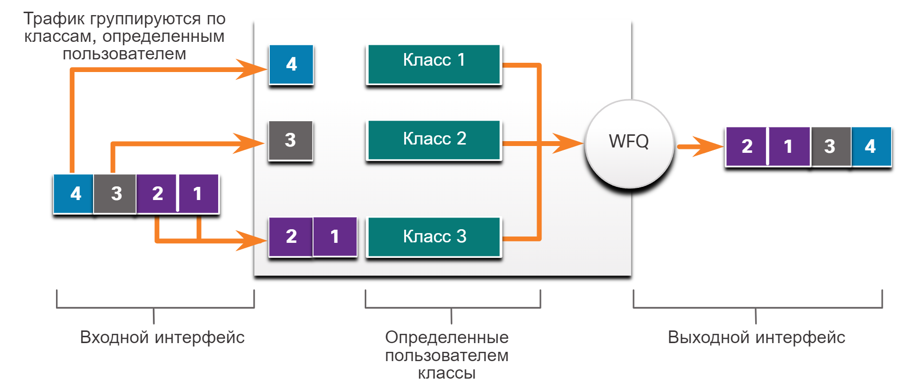

<!-- 9.3.1 -->
## Обучающее видео. Алгоритмы QoS

Нажмите кнопку «Воспроизведение», чтобы узнать о различных типах алгоритмов для организации очередей качества обслуживания.

<!-- 9.3.2 -->
## Общие сведения об организации очереди

Предыдущая тема касалась характеристик трафика. В этом разделе описаны алгоритмы очередей, используемые для реализации QoS. Политика качества обслуживания, реализованная сетевым администратором, становится активной при возникновении затора в канале связи. Организация очереди — средство управления затором, которое может выполнять буферизацию, приоритизацию и при необходимости изменяет порядок пакетов перед их передачей адресату.

Доступен ряд алгоритмов организации очередей. В рамках этого курса мы сосредоточимся на следующих:

* «первым пришел — первым ушел» (first-in, first-out, FIFO);
* взвешенная организация очередей (WFQ);
* взвешенная организация очередей на основе классов (CBWFQ);
* организация очередей с малой задержкой (LLQ).

<!-- 9.3.3 -->
## «Первым пришел — первым ушел»

Самый простой алгоритм организации очередей — это FIFO, также известный как FCFS («первым пришел — первым обработан», first-come, first-served), который предусматривает буферизацию и пересылку пакетов в порядке поступления.

В FIFO нет концепции приоритета или классов трафика. Есть только одна очередь — все пакеты обрабатываются одинаково. Пакеты отправляются из интерфейса в порядке их поступления, как показано на рисунке. Обратите внимание: хотя один трафик более важен или более чувствителен к задержкам, данные отправляются в том порядке, в котором они получены.

Когда используется FIFO, важный или чувствительный к задержкам трафик может отбрасываться при возникновении затора в интерфейсе коммутатора или маршрутизатора. При отсутствии других стратегий организации очереди все интерфейсы, кроме последовательных интерфейсов на E1 (2,048 Мбит/с) и ниже, используют FIFO по умолчанию. (Последовательные интерфейсы на E1 и ниже используют по умолчанию алгоритм WFQ.)

FIFO — самый быстрый способ организовать очереди. Он эффективен для крупных каналов связи с небольшими задержками и минимальными заторами. Если затор в канале связи небольшой, FIFO может быть единственным механизмом организации очереди, который нужно использовать.

**Пример организации очереди FIFO**

<!-- /courses/ensa-dl/ae8eb390-34fd-11eb-ba19-f1886492e0e4/aeb5c390-34fd-11eb-ba19-f1886492e0e4/assets/c686e880-1c46-11ea-af56-e368b99e9723.svg -->

<!--
На рисунке показан пример очередей First In First Out (FIFO). На входной интерфейс поступает четыре различных типа трафика. Есть только одна очередь&nbsp;— все пакеты обрабатываются одинаково. Они пересылаются из интерфейса исходящего в том же порядке, в каком они получены.
-->

<!-- 9.3.4 -->
## Взвешенная организация очередей (WFQ)

WFQ — автоматизированный метод планирования, который обеспечивает справедливое выделение полосы пропускания всему сетевому трафику. WFQ не позволяет настраивать параметры классификации. Он применяет приоритеты или вес для классификации трафика и разделения его на сеансы или потоки как показано на рисунке.

**Пример взвешенной организации очередей**

<!-- /courses/ensa-dl/ae8eb390-34fd-11eb-ba19-f1886492e0e4/aeb5c390-34fd-11eb-ba19-f1886492e0e4/assets/c68736a2-1c46-11ea-af56-e368b99e9723.svg -->

<!--
На рисунке показан пример взвешенной организации очередей. На входной интерфейс поступает четыре различных типа трафика, организованного на основе их классификации: высокий, средний, нормальный или низкий. Они пересылаются из исходящего интерфейса в порядке их классификации. Более высокий трафик уходит в первую очередь, затем средний, нормальный и, наконец, низкий.
-->

Затем WFQ определяет величину полосы пропускания, которая допустима для каждого потока относительно других. Потоковый алгоритм, используемый WFQ, одновременно планирует интерактивный трафик в начале очереди, чтобы снизить время отклика. Затем он справедливо распределяет оставшуюся полосу пропускания среди потоков с высокой полосой пропускания. WFQ позволяет обрабатывать интерактивный трафик малого объема, например в сеансах Telnet и голосовой связи, и назначать более высокий приоритет для трафика с большим объемом, например для сеансов FTP. Когда одновременно выполняется передача нескольких потоков файлов, операции по передаче получают сопоставимую полосу пропускания.

WFQ классифицирует трафик, разделяя его на различные потоки с учетом адресации заголовков пакетов, включая такие характеристики, как IP-адреса источника и назначения, MAC-адреса, номера портов, протокол и значение типа обслуживания (Type of Service, ToS). Значение ToS в IP-заголовке может использоваться для классификации трафика.

Потоки с низкой пропускной способностью, составляющие большую часть трафика, получают предпочтительное обслуживание, что позволяет своевременно передавать всю нагрузку. Потоки большого объема разделяют оставшуюся полосу пропускания пропорционально между собой.

**Ограничения**

WFQ не поддерживается с туннелированием и шифрованием, поскольку эти функции изменяют информацию о содержимом пакета, которая необходима WFQ для классификации.

Хотя WFQ автоматически адаптируется к изменяющемуся состоянию сетевого трафика, этот механизм не контролирует распределение полосы пропускания с точностью, которую предлагает CBWFQ.

<!-- 9.3.5 -->
## Взвешенная организация очередей на основе классов (CBWFQ)

Алгоритм CBWFQ обладает более широкими возможностями, чем стандартный алгоритм WFQ, за счет поддержки определенных пользователем классов трафика. Используя CBWFQ, вы выбираете критерии соответствия, в том числе протоколы, ACL-списки и входные интерфейсы. Совокупность пакетов, соответствующих критериям для определенного класса, образует трафик. Для каждого класса выделяется очередь FIFO, и трафик распределяется в соответствующую очередь, как показано на рисунке.

Если класс определен с учетом критериев соответствия, ему можно назначить характеристики. Для этого ему назначают полосу пропускания, вес и максимальное ограничение пакета. Полоса пропускания, назначенная классу, гарантированно предоставляется классу во время затора.

Чтобы характеризовать класс, для него также указывается ограничение очереди, то есть максимальное число пакетов, которое может накопиться в очереди для класса. Пакеты подпадают под ограничения полосы пропускания и очереди, которые характеризуют класс.

**Пример CBWFQ**

<!-- /courses/ensa-dl/ae8eb390-34fd-11eb-ba19-f1886492e0e4/aeb5c390-34fd-11eb-ba19-f1886492e0e4/assets/c687abd3-1c46-11ea-af56-e368b99e9723.svg -->

<!--
На рисунке показан пример взвешенной организации очередей на основе классов (CBWFQ). На входной интерфейс поступает четыре различных типа трафика. Трафик группируются по классам, определенным пользователем. Затем он пересылается из исходящего интерфейса на основе определенных пользователем классов. В примере показаны пакеты с меткой 1, 2, 3 и 4, входящие в устройство. Пакет 4 определяется как входящий в класс 1, пакет 3 — как класс 2, а пакеты 1 и 2 — как класс 3. Пакеты организованы на основе их класса, 1 — самый высокий, а 3 — самый низкий. Порядок отправки пакетов из исходящего интерфейса: 4, 3, 1 и 2.
-->

Когда очередь достигает заданного ей ограничения, дополнительные пакеты в классе приводят к отбрасыванию — либо с конца, либо согласно настроенной политике. В первом случае маршрутизатор просто отклоняет любой пакет, который поступает в конец очереди, если ресурсы для хранения полностью заняты. Таким образом механизм организации очереди реагирует по умолчанию на затор. Отбрасывание с конца приводит к одинаковой обработке всего трафика, независимо от класса обслуживания.

<!-- 9.3.6 -->
## Организация очередей с малой задержкой (LLQ)

Функция LLQ определяет строгий порядок формирования очередей по приоритетам (PQ) для CBWFQ. PQ позволяет отправлять чувствительные к задержке данные, например голос, перед пакетами в других очередях. LLQ обеспечивает формирование очередей по приоритетам для CBWFQ, уменьшая джиттер в сеансах голосовой связи, как показано на рисунке.

Без LLQ механизм CBWFQ обеспечивает WFQ на основе определенных классов без строгой очереди по приоритетам, доступной для трафика в реальном времени. Вес для пакета, принадлежащего определенному классу, вычисляется по полосе пропускания, назначенной классу при его конфигурировании. Таким образом, полоса пропускания, назначенная пакетам, определяет порядок их отправки. Все обслуживаются справедливо с учетом веса, ни одному классу пакетов не назначают строгий приоритет. Эта схема создает проблемы для голосового трафика, который исключительно чувствителен к задержкам, особенно к непостоянным. Это приводит к перебоям при передаче и возникновению джиттера в голосовой связи.

LLQ позволяет в первую очередь (до обработки пакетов в других очередях) отправлять чувствительные к задержкам данные, что обеспечивает предпочтительную обработку относительно остального трафика. Хотя ставить в очередь по приоритетам можно разные типы трафика в реальном времени, компания Cisco рекомендует направлять в нее только трафик голосовых данных.

**Пример LLQ**

<!-- /courses/ensa-dl/ae8eb390-34fd-11eb-ba19-f1886492e0e4/aeb5c390-34fd-11eb-ba19-f1886492e0e4/assets/c6886f22-1c46-11ea-af56-e368b99e9723.svg -->

<!--
На рисунке показан пример организации очереди с малой задержкой (LLQ). На входной интерфейс получено шесть пакетов. Пакеты имеют надписи 1, 2, 3, V (голосовая связь), 4 и V (голосовая связь). Трафик группируется в очередь приоритетов и классы CBWFQ, определяемые пользователем. Голосовые пакеты определяются в очереди приоритетов. Пакет 4 определяется как входящие в класс 1, пакет 3 — как класс 2, а пакеты 1 и 2 — как класс 3. Порядок отправки пакетов из исходящего интерфейса: V (Voice), V (Voice), 4, 3, 1 и 2.
-->

<!-- 9.3.7 -->
<!-- quiz -->

