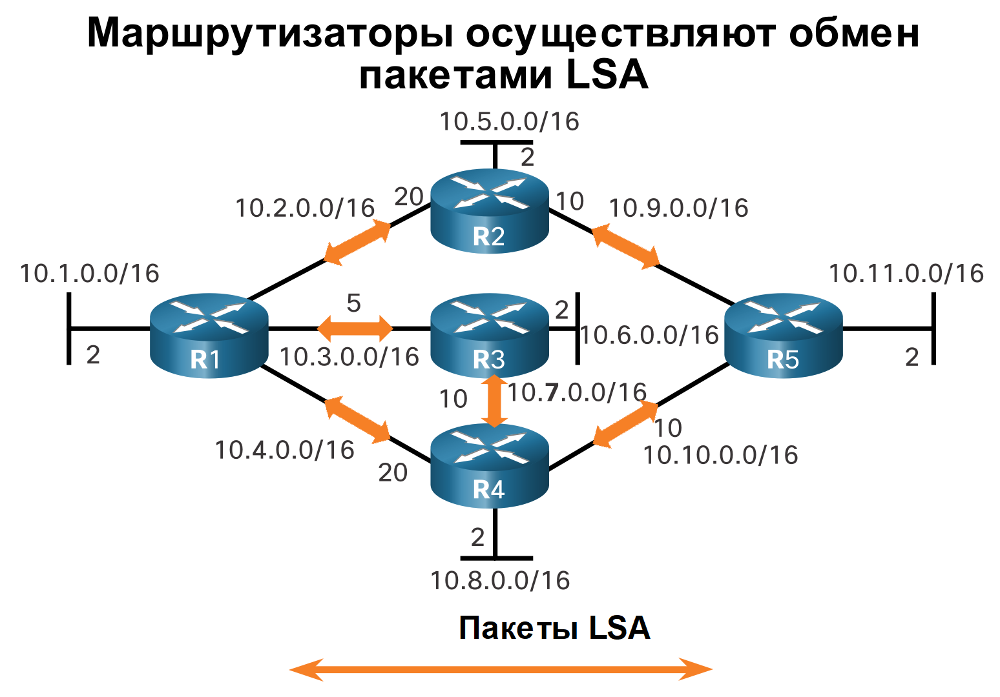
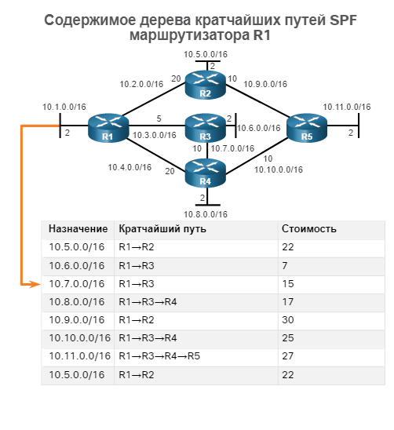
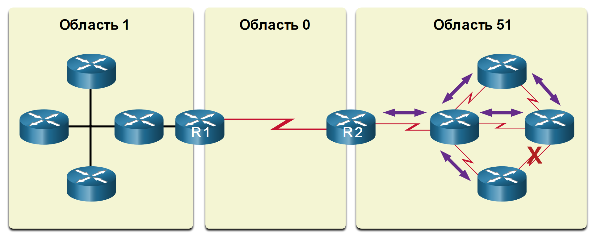

<!-- 1.1.1 -->
## Введение в OSPF
В этом разделе содержится краткий обзор OSPF (Open Shortest Path First), который включает в себя одну и несколько областей. OSPFv2 используется для сетей IPv4. OSPFv3 используется для сетей IPv6. Основной целью всего этого модуля является OSPFv2 для одной области.

OSPF — протокол маршрутизации по состоянию каналов, который был разработан в качестве альтернативы протоколу маршрутизации на базе векторов расстояния RIP. Протокол RIP был приемлемым протоколом маршрутизации на начальных этапах развития сетевых технологий и Интернета. Однако использование протоколом RIP числа переходов как единственной метрики для определения оптимального маршрута в скором времени привело к ряду трудностей. При использовании этого метода возможности масштабирования больших сетей, содержащих несколько путей с различными скоростями, ограничены. Протокол OSPF имеет ряд значительных преимуществ в сравнении с протоколом RIP, обеспечивая более быструю сходимость и возможность масштабирования в целях реализации сетей большего размера.

Протокол OSPF является бесклассовым протоколом маршрутизации, использующим концепцию разделения на области в целях масштабируемости. Администратор сети может разделить домен маршрутизации на отдельные области, которые помогают управлять трафиком обновления маршрутизации. Канал — это интерфейс маршрутизатора. Канал также представляет собой сегмент сети, который соединяет два маршрутизатора или заглушающую сеть, такую как Ethernet LAN, которая подключена к одному маршрутизатору. Данные о состоянии этих каналов также называются состоянием канала. Вся информация о состоянии канала включает префикс сети, длину префикса и стоимость.

В рамках данной главы рассматриваются основные конфигурации и реализации OSPF для одной области.

<!-- 1.1.2 -->
## Компоненты протокола OSPF
Все протоколы маршрутизации используют аналогичные компоненты. Все протоколы используют сообщения протокола маршрутизации для обмена данными маршрутизации. Сообщения позволяют выстраивать структуры данных, которые впоследствии обрабатываются посредством алгоритма маршрутизации.

**Маршрутизация сообщений протокола**

Устройства 3-го уровня (такие, как маршрутизаторы) применяют сообщения обмена OSPF для переноса информации о маршрутах с использованием пяти типов пакетов. Как показано на рисунке, к таким пакетам относятся:
- пакет приветствия (hello);
- пакет описания базы данных;
- пакет состояния канала;
- пакет обновления состояния канала;
- пакет подтверждения состояния канала.

Эти пакеты используются для обнаружения соседних маршрутизаторов, а также для обмена данными маршрутизации в целях предоставления точных данных о сети.

<!-- /courses/ensa-dl/ae8cded0-34fd-11eb-ba19-f1886492e0e4/aeb2dd60-34fd-11eb-ba19-f1886492e0e4/assets/c570bd90-1c46-11ea-af56-e368b99e9723.svg -->
<!--
Изображение показывает два маршрутизатора, взаимодействующих друг с другом. Маршрутизаторы, использующие OSPF, обмениваются сообщениями с использованием пяти типов пакетов: пакет приветствия, пакет описания базы данных, пакет запроса состояния связи, пакет обновления состояния связи и пакет подтверждения состояния связи.
-->

**Структуры даных**

Сообщения OSPF используются для создания и обслуживания трех баз данных OSPF:
- **База данных смежности** — создает таблицу соседних устройств.
- **База данных на основе состояния канала (LSDB)** — создает таблицу топологии.
- **База данных пересылки** — создает таблицу маршрутизации.

Эти таблицы содержат список соседних маршрутизаторов, между которыми выполняется обмен данными маршрутизации. Таблицы хранятся и хранятся в оперативной памяти. В следующей таблице обратите особое внимание на команду, используемую для отображения каждой таблицы.

| База данных | Таблица | Описание |
| --- | --- | --- |
| База данных смежности | Таблица соседей | <ul><li>Список всех соседних маршрутизаторов, с которыми установлен двусторонний обмен данными.</li><li>Для каждого маршрутизатора существует уникальная таблица.</li><li>Ее можно просмотреть с помощью команды **show ip ospf neighbor**.</li></ul> |
| База данных состояний каналов | Таблица топологии | <ul><li>Содержит данные обо всех маршрутизаторах в сети.</li><li>Эта база данных представляет топологию сети.</li><li>Все маршрутизаторы в области используют идентичные базы данных состояний каналов (LSDB).</li><li>Базу данных можно просмотреть с помощью команды **show ip ospf database**.</li></ul> |
| База данных пересылки | Таблица маршрутизации | <ul><li>Содержит данные о маршрутах, созданных при запуске алгоритма в базе данных состояний каналов.</li><li>Таблица маршрутизации каждого маршрутизатора уникальна и содержит информацию о том, как и где отправлять пакеты другим маршрутизаторам.</li><li>Маршруты можно просмотреть с помощью команды **show ip route**.</li></ul> |

**Алгоритм**

Маршрутизатор формирует таблицу топологии с использованием результатов вычислений, основанных на алгоритме кратчайшего пути (SPF) Дейкстры. Алгоритм поиска кратчайшего пути основывается на данных о совокупной стоимости доступа к точке назначения.

Алгоритм поиска кратчайшего пути создаёт дерево кратчайших путей SPF путём размещения каждого маршрутизатора в корне дерева и расчёта кратчайших путей к каждому из узлов. После этого дерево кратчайших путей SPF используется для расчёта оптимальных маршрутов. Протокол OSPF вносит оптимальные маршруты в базу данных пересылки, которая применяется для создания таблицы маршрутизации.

<!-- /courses/ensa-dl/ae8cded0-34fd-11eb-ba19-f1886492e0e4/aeb2dd60-34fd-11eb-ba19-f1886492e0e4/assets/c57180e1-1c46-11ea-af56-e368b99e9723.svg -->

<!--
Алгоритм поиска кратчайшего пути создаёт дерево кратчайших путей SPF путём размещения каждого маршрутизатора в корне дерева и расчёта кратчайших путей к каждому из узлов. После этого дерево кратчайших путей SPF используется для расчёта оптимальных маршрутов.
-->

<!-- 1.1.3 -->
## Принцип работы маршрутизации по состоянию канала
Для предоставления данных маршрутизации маршрутизаторы, использующие протокол OSPF, выполняют следующие общие этапы маршрутизации по состоянию канала для достижения состояния сходимости: На рисунке приведена топология. Каждый канал между маршрутизаторами помечен значением стоимости. В OSPF стоимость используется для определения наилучшего пути к месту назначения. Ниже приведены шаги маршрутизации состояния канала, которые выполняются маршрутизатором:
1. Установление отношений смежности с соседними устройствами
2. Обмен объявлениями о состоянии каналов
3. Создание базы данных состояния связи
4. Исполнение алгоритма SPF
5. Выберите лучший маршрут

**1. Установление отношений смежности с соседними устройствами**

Маршрутизаторы с поддержкой OSPF должны выполнить обнаружение друг друга в сети, чтобы обмениваться данными. Маршрутизатор, использующий OSPF, отправляет пакеты приветствия из всех интерфейсов с включенным OSPF для определения всех соседних устройств в пределах этих каналов. При наличии соседнего устройства маршрутизатор, использующий OSPF, пытается установить с ним отношения смежности.

<!-- /courses/ensa-dl/ae8cded0-34fd-11eb-ba19-f1886492e0e4/aeb2dd60-34fd-11eb-ba19-f1886492e0e4/assets/c5721d22-1c46-11ea-af56-e368b99e9723.svg -->

<!--
Схема пяти маршрутизаторов, соединенных между собой и обмениваемых пакетами приветствия для установления смежности соседей.
-->

**2. Обмен объявлениями о состоянии каналов**

После установления отношений смежности маршрутизаторы выполняют обмен объявлениями о состоянии канала (LSA). LSA содержат информацию о состоянии и стоимости каждого канала с прямым подключением. Маршрутизаторы отправляют свои LSA смежным устройствам. При получении LSA смежные устройства мгновенно отправляют свои LSA соседям с прямым подключением, и так до тех пор, пока все маршрутизаторы области не получат все LSA.

После установления соседства маршрутизаторы обмениваются объявлениями о состоянии каналов. LSA содержат информацию о состоянии и стоимости каждого канала с прямым подключением. Маршрутизаторы флудят своими LSAs всем смежным соседям, которые затем флудят до своих соседей и так далее.

**3. Создание базы данных состояния связи**

После получения объявлений о состоянии канала (LSA) маршрутизаторы, использующие OSPF, создают базу данных топологии на базе полученных пакетов. В этой базе данных в конечном итоге собирается вся информация о топологии сети в области.

<!-- /courses/ensa-dl/ae8cded0-34fd-11eb-ba19-f1886492e0e4/aeb2dd60-34fd-11eb-ba19-f1886492e0e4/assets/c5730782-1c46-11ea-af56-e368b99e9723.svg -->

<!--
На диаграмме показано, что после получения всех LSA от соседей маршрутизатор R1 создает свою базу данных состояния канала LSDB, также известную как таблица топологии.
-->

**4. Исполнение алгоритма SPF**

Затем маршрутизаторы выполняют алгоритм SPF. На рисунке с помощью шестерёнок обозначено выполнение алгоритма поиска кратчайшего пути. Алгоритм поиска кратчайшего пути создаёт дерево кратчайших путей SPF.

<!-- /courses/ensa-dl/ae8cded0-34fd-11eb-ba19-f1886492e0e4/aeb2dd60-34fd-11eb-ba19-f1886492e0e4/assets/c573a3c0-1c46-11ea-af56-e368b99e9723.svg -->

<!--
Схема показывает маршрутизатор R1, создающий дерево SPF, запустив алгоритм SPF с информацией о стоимости канала в его LSDB. 
-->

**5. Выбор лучшего маршрута**

На основании данных дерева SPF предлагаются наилучшие пути для таблицы IP-маршрутизации. Маршрут добавляется в таблицу маршрутизации, если отсутствует источник маршрута к той же сети с меньшим административным расстоянием, например статический маршрут. Решения по маршрутизации принимаются на основе записей в таблице маршрутизации.

<!-- /courses/ensa-dl/ae8cded0-34fd-11eb-ba19-f1886492e0e4/aeb2dd60-34fd-11eb-ba19-f1886492e0e4/assets/c57418f2-1c46-11ea-af56-e368b99e9723.svg -->

<!--
На диаграмме показано, что маршрутизатор R1 поместил лучшие маршруты для каждой из сетей в свою таблицу маршрутизации.
-->

<!-- 1.1.4 -->
## OSPF для одной области и OSPF для нескольких областей
Чтобы повысить эффективность и масштабируемость OSPF, протокол OSPF поддерживает иерархическую маршрутизацию с помощью областей. Область OSPF представляет собой группу маршрутизаторов, использующих одинаковые данные о состоянии канала в своих базах данных состояний каналов. Протокол OSPF можно реализовать одним из двух способов:
- **OSPF для одной области** - все маршрутизаторы находятся в одной области. Рекомендуется использовать область 0.
- **OSPF для нескольких областей** - протокол OSPF используется посредством нескольких областей в иерархическом порядке. Все области должны быть подключены к магистральной области (область 0). Маршрутизаторы, соединяющие области, называются граничными маршрутизаторами области (ABR).

Основной целью всего этого модуля является OSPFv2 для одной области.

**OSPF для одной области**

<!-- /courses/ensa-dl/ae8cded0-34fd-11eb-ba19-f1886492e0e4/aeb2dd60-34fd-11eb-ba19-f1886492e0e4/assets/c574b533-1c46-11ea-af56-e368b99e9723.svg -->

<!--
На изображении показаны три взаимосвязанных маршрутизатора в области 0, реализация OSPF для одной области.
-->

**OSPF для нескольких областей**

<!-- /courses/ensa-dl/ae8cded0-34fd-11eb-ba19-f1886492e0e4/aeb2dd60-34fd-11eb-ba19-f1886492e0e4/assets/c5750350-1c46-11ea-af56-e368b99e9723.svg -->

<!--
На снимке показаны 10 взаимосвязанных маршрутизаторов, формирующих  OSPF для нескольких областей с номерами  1, 0 и 51. Маршрутизатор R1 представляет собой ABR между областью 1 и областью 0. Маршрутизатор R2 — это ABR между областью 0 и областью 51.
-->

<!-- 1.1.5 -->
## OSPF для нескольких областей
При использовании протокола OSPF для нескольких областей один большой домен маршрутизации может быть разделен на меньшие области для реализации иерархической маршрутизации. При использовании иерархической маршрутизации выполняется маршрутизация между областями (межобластная маршрутизация), но многие из операций маршрутизации, потребляющих ресурсы процессора (например, повторный расчёт базы данных), выполняются в пределах одной области.

К примеру, каждый раз, когда маршрутизатор получает новые данные об изменении топологии в пределах области (включая добавление, удаление или изменение канала), маршрутизатор должен повторно выполнить алгоритм поиска кратчайшего пути, создать новое дерево кратчайших путей SPF и обновить таблицу маршрутизации. Алгоритм SPF требует значительных ресурсов ЦП, и время, необходимое для выполнения соответствующих расчётов, зависит от размера области.

**Примечание**: маршрутизаторы в других областях получают сообщения, касающиеся изменений топологии, но эти маршрутизаторы только обновляют таблицу маршрутизации, а не перезапускают алгоритм поиска кратчайшего пути.

При наличии слишком большого числа маршрутизаторов в одной области, базы данных о состоянии канала имеют слишком большой размер, и нагрузка на ЦП, таким образом, увеличивается. Поэтому распределение маршрутизаторов по областям эффективно разделяет потенциально большие базы данных на базы данных меньшего размера, тем самым обеспечивая возможность более эффективного управления.

Варианты проектирования иерархической топологии OSPF для нескольких областей предоставляют следующие преимущества:
- **Меньший размер таблицы маршрутизации** - таблицы меньше, поскольку в таблице маршрутизации меньше записей. Это связано с тем, что сетевые адреса могут быть суммированы между областями. Функция объединения маршрутов отключена по умолчанию.
- **Снижение издержек обновления состояния каналов** - применение протокола OSPF для нескольких областей уменьшает размер областей и способствует уменьшению требований к процессорным ресурсам и памяти.
- **Снижение частоты расчетов SPF** - влияние изменений топологии локализуется в пределах области. Таким образом, сокращается воздействие обновлений маршрутизации, так как лавинная рассылка объявлений LSA прекращается на границе области.

Например, маршрутизатор R2 представляет собой пограничный маршрутизатор области для области 51. Изменение топологии в области 51 приведет к повторному запуску алгоритма SPF всех маршрутизаторов области 51, созданию нового дерева SPF и обновлению таблиц IP-маршрутизации. ABR, R2, отправляет LSA маршрутизаторам в области 0, которые в конечном итоге будут заполнены всеми маршрутами в домене маршрутизации OSPF. Этот тип LSA не приводит к повторному запуску алгоритма SPF маршрутизаторов в других областях. Им нужно только обновить свой LSDB и таблицу маршрутизации.

**Изменение канала влияет только на локальную область**

<!-- /courses/ensa-dl/ae8cded0-34fd-11eb-ba19-f1886492e0e4/aeb2dd60-34fd-11eb-ba19-f1886492e0e4/assets/c5759f90-1c46-11ea-af56-e368b99e9723.svg -->

- Сбой канала влияет только на локальную область (область 51).
- ABR (R2) изолирует флуд LSA в области 51 .
- Маршрутизаторам в областях 0 и 1 не требуется выполнение алгоритма поиска кратчайшего пути.

<!-- 1.1.6 -->
## OSPFv3
OSPFv3 представляет собой эквивалент OSPFv2 для обмена префиксами IPv6. Следует помнить, что в IPv6 сетевой адрес называется префиксом, а маска подсети - длиной префикса.

Подобно своему аналогу для IPv4, протокол OSPFv3 обменивается сведениями о маршрутизации для заполнения таблицы маршрутизации IPv6 удаленными префиксами.

**Примечание**: благодаря функции семейств адресов OSPFv3 протокол OSPFv3 обеспечивает поддержку как IPv4, так и IPv6. Рассмотрение семейств адресов OSPF выходит за рамки этого учебного плана.

Протокол OSPFv2 работает на уровне сети IPv4, осуществляет обмен данными с другими равноправными узлами OSPF IPv4 и объявляет только IPv4-маршруты.

Протокол OSPFv3 предоставляет те же возможности, что и протокол OSPFv2, но при этом использует IPv6 как транспорт на уровне сети, осуществляет обмен данными с равноправными узлами OSPFv3 и объявляет маршруты IPv6. Протокол OSPFv3 также использует алгоритм поиска кратчайшего пути SPF как инструмент определения оптимальных маршрутов посредством домена маршрутизации.

Как и все остальные протоколы маршрутизации IPv6, протокол OSPFv3 получает отдельные процессы от соответствующего протокола IPv4. По сути, процессы и операции являются теми же, что и в протоколе маршрутизации IPv4, однако выполняются независимо. Протоколы OSPFv2 и OSPFv3 содержат отдельные таблицы смежности, таблицы топологии OSPF и таблицы IP-маршрутизации, как показано на рисунке.

Настройка протокола OSPFv3 и команды проверки аналогичны используемым в протоколе OSPFv2.

**Структуры данных протоколов OSPFv2 и OSPFv3**

<!-- /courses/ensa-dl/ae8cded0-34fd-11eb-ba19-f1886492e0e4/aeb2dd60-34fd-11eb-ba19-f1886492e0e4/assets/c57662e3-1c46-11ea-af56-e368b99e9723.svg -->

<!--
показывает два маршрутизатора, выполняющих одновременно несколько процессов OSPF. Один для OSPFv2 и другой для OSPFv3 для IPv6. Каждый процесс OSPF будет иметь собственную таблицу соседей, таблицу топологии и таблицу маршрутизации
-->

<!-- 1.1.7 Проверьте ваше понимание темы - Функции и характеристики OSPF - test-->
