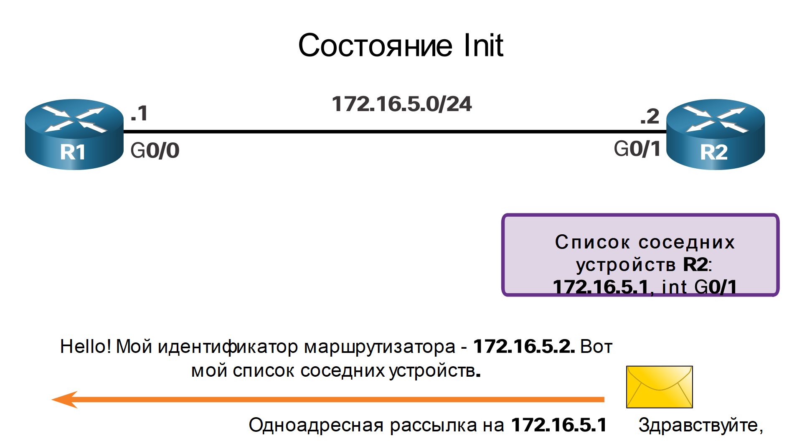
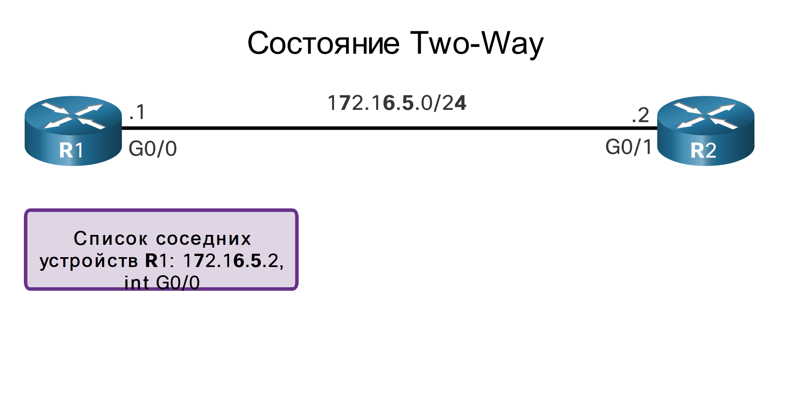

<!-- 1.3.1 -->
## Видео - Принципы работы OSPF

Нажмите Воспроизвести на рисунке, чтобы просмотреть видео о работе OSPF.

<!-- 1.3.2 -->
## Рабочие состояния OSPF

Теперь, когда вы знаете о пакетах состояния канала OSPF, в этом разделе объясняется, как они работают с маршрутизаторами с поддержкой OSPF. При первом подключении маршрутизатора OSPF к сети он пытается:

* установить отношения смежности с соседними узлами;
* осуществить обмен данными маршрутизации;
* рассчитать оптимальные маршруты;
* достичь состояния сходимости.

Протокол OSPF проходит несколько состояний в процессе достижения сходимости:

| Состояние | Описание |
| --- | --- |
| **Состояние Down** | <ul><li>Не получено ни одного пакета приветствия = Down.</li><li>Маршрутизатор отправляет пакеты приветствия.</li><li>Переход в состояние Init.</li></ul> |
| **Состояние Init** | <ul><li>Пакеты приветствия принимаются от соседних устройств.</li><li>Они содержат идентификатор отправляющего маршрутизатора.</li><li>Переход в состояние Two-Way</li></ul> |
| **Состояние Two-Way** | <ul><li>В этом состоянии связь между двумя маршрутизаторами двунаправленная.</li><li>На многоканальных каналах маршрутизаторы выбирают DR и BDR.</li><li>Переход в состояние ExStart.</li></ul> |
| **Состояние ExStart** | <ul><li>В сетях «точка-точка» два маршрутизатора определяют, какой маршрутизатор будет инициировать обмен пакетами DBD, и определяют исходный номер последовательности пакетов DBD. |
| **Состояние Exchange** | <ul><li>Маршрутизаторы обмениваются пакетами DBD (описание базы данных).</li><li>Если требуется дополнительная информация, выполняется переход в состояние Loading. В ином случае выполняется переход в состояние Full.</li></ul> |
| **Состояние Loading** | <ul><li>LSR (запрос состояния канала) и LSU (пакет обновления состояния канала) используются для получения дополнительной информации о маршруте.</li><li>Маршруты обрабатываются посредством алгоритма поиска кратчайшего пути.</li><li>Переход в состояние Full.</li></ul> |
| **Состояние Full** | <ul><li>База данных состояния канала маршрутизатора полностью синхронизирована. |

<!-- 1.3.3 -->
## Установление отношений смежности с соседними устройствами

Если на интерфейсе активирован протокол OSPF, маршрутизатор должен определить наличие другого соседнего устройства OSPF в канале. Для этого маршрутизатор отправляет пакет приветствия, содержащий идентификатор маршрутизатора, из всех интерфейсов с поддержкой OSPF. Пакет Hello отправляется на зарезервированный адрес IPv4 многоадресной рассылки всех маршрутизаторов OSPF 224.0.0.5. Только маршрутизаторы OSPFv2 будут обрабатывать эти пакеты. Идентификатор маршрутизатора OSPF используется процессом OSPF для уникальной идентификации каждого маршрутизатора в области OSPF. Идентификатор маршрутизатора — 32-битовое число, отформатированное как IP-адрес и назначенное для уникальной идентификации маршрутизатора среди одноранговых устройств OSPF.

Если соседний маршрутизатор, на котором активирован протокол OSPF, получает пакет приветствия с идентификатором маршрутизатора, который не включён в список его соседних устройств, принимающий маршрутизатор пытается установить с инициирующим маршрутизатором отношения смежности.

**1. Из состояния Down в состояние Init**

Если OSPFv2 включен, включенный интерфейс гигабитного Ethernet 0/0 переходит из состояния останова в состояние инициализации. Маршрутизатор R1 начинает отправлять пакеты приветствия из всех интерфейсов с поддержкой OSPF в целях обнаружения соседних устройств OSPF, с которыми следует установить отношения смежности.

<!-- /courses/ensa-dl/ae8cded0-34fd-11eb-ba19-f1886492e0e4/aeb30472-34fd-11eb-ba19-f1886492e0e4/assets/c5892790-1c46-11ea-af56-e368b99e9723.svg -->

<!--
Схема показывает, что маршрутизатор R1 переключается с состояния OSPFv2 Down на состояние Init и многоадресная передача пакета Hello на R2.
-->

**2. Состояние Init**

Маршрутизатор R2 принимает пакет приветствия от маршрутизатора R1 и добавляет идентификатор маршрутизатора R1 в свой список соседних устройств. После этого маршрутизатор R2 отправляет пакет приветствия на маршрутизатор R1. Пакет содержит идентификатор маршрутизатора R2 и маршрутизатора R1 в своём списке соседних устройств на том же интерфейсе.

<!-- /courses/ensa-dl/ae8cded0-34fd-11eb-ba19-f1886492e0e4/aeb30472-34fd-11eb-ba19-f1886492e0e4/assets/c5899cc1-1c46-11ea-af56-e368b99e9723.svg -->

<!--
На диаграмме показано, что R2 добавляет R1 в список соседей и отправляет пакет Hello с его списком соседей в R1. 
-->

**3. Состояние Two-Way**

Маршрутизатор R1 принимает пакет приветствия и добавляет идентификатор маршрутизатора R2 в свой список соседних устройств OSPF. Он также видит свой собственный идентификатор маршрутизатора в пакете приветствия от соседних устройств. Когда маршрутизатор принимает пакет приветствия, содержащий его идентификатор в списке соседних устройств, он переходит из состояния Init в состояние Two-Way.

Действие, выполняемое в состоянии Two-Way, определяется типом взаимодействия между смежными маршрутизаторами:

* Если два смежных соседних устройства взаимодействуют посредством канала типа «точка-точка», они немедленно переходят из состояния Two-Way в фазу синхронизации базы данных.
* Если маршрутизаторы взаимодействуют посредством общей сети Ethernet, необходимо выбрать выделенный маршрутизатор (DR) и резервный выделенный маршрутизатор (BDR).

<!-- /courses/ensa-dl/ae8cded0-34fd-11eb-ba19-f1886492e0e4/aeb30472-34fd-11eb-ba19-f1886492e0e4/assets/c589eae2-1c46-11ea-af56-e368b99e9723.svg -->

<!--
Диаграмма показывает переход R1 из состояния инициализации в  состояние Two-Way, когда он получает пакет приветствия с собственным идентификатором маршрутизатора, указанным в качестве соседа. 
-->

**4. Выбор выделенного маршрутизатора (DR) и резервного выделенного маршрутизатора (BDR)**

Поскольку маршрутизаторы R1 и R2 взаимодействуют посредством сети Ethernet, выбираются выделенный маршрутизатор (DR) и резервный выделенный маршрутизатор (BDR). Как показано на рисунке, маршрутизатор R2 становится выделенным маршрутизатором (DR), а маршрутизатор R1 - резервным выделенным маршрутизатором (BDR). Этот процесс выполняется только в сетях множественного доступа (например, сетях LAN стандарта Ethernet).

В целях обновления данных маршрутизации выполняется непрерывный обмен пакетами приветствия.

<!-- /courses/ensa-dl/ae8cded0-34fd-11eb-ba19-f1886492e0e4/aeb30472-34fd-11eb-ba19-f1886492e0e4/assets/c58a8721-1c46-11ea-af56-e368b99e9723.svg -->

<!--
Диаграмма показывает, что, поскольку R1 и R2 подключены через Ethernet, они должны выполнить выбор DR и BDR, и поскольку оба они имеют один и тот же номер приоритета по умолчанию, но R2 имеет более высокий идентификатор маршрутизатора, он выбирается DR. 
-->

<!-- 1.3.4 -->
## Синхронизация баз данных OSPF

После выхода из состояния Two-Way маршрутизаторы переходят в состояние синхронизации базы данных. Пакет приветствия используется для установления отношений смежности с соседними устройствами, в то время как остальные четыре типа пакетов OSPF используются в процессе обмена и синхронизации баз данных состояний каналов. Это трехэтапный процесс, который выглядит следующим образом:

1.  Определите первый маршрутизатор
2.  Обмен DBD
3.  Отправление LSR

**1. Определите первый маршрутизатор**

В состоянии ExStart два маршрутизатора принимают решение, какой из них будет передавать пакеты DBD первым. Маршрутизатор с более высоким идентификатором маршрутизатора становится первым, передающим пакеты DBD в состоянии Exchange. На рисунке  у маршрутизатора R2 идентификатор маршрутизатора больше, и он передает свои пакеты DBD первым.

<!-- /courses/ensa-dl/ae8cded0-34fd-11eb-ba19-f1886492e0e4/aeb30472-34fd-11eb-ba19-f1886492e0e4/assets/c58b4a70-1c46-11ea-af56-e368b99e9723.svg -->

<!--
Диаграмма показывает, что после двухстороннего состояния ExStart решает, какой маршрутизатор отправляет первый пакет DBD, определяя, какой маршрутизатор имеет более высокий идентификатор маршрутизатора. 
-->

**2. Обмен DBD**

В состоянии Exchange два маршрутизатора обмениваются одним или несколькими пакетами DBD. Пакет DBD включает информацию о заголовке записи LSA, которая отображается в базе данных состояний каналов маршрутизатора. Записи могут содержать данные о канале или о сети. Каждый заголовок записи LSA содержит данные о типе состояния канала, адресе объявляющего маршрутизатора, стоимости канала и порядковом номере. Маршрутизатор использует порядковый номер для определения актуальности полученных данных о состоянии канала.

На рисунке маршрутизатор R2 передаёт пакет DBD маршрутизатору R1. Когда маршрутизатор R1 получает пакет DBD, он выполняет следующие действия:

1.  Маршрутизатор подтверждает получение пакета DBD посредством пакета LSAck.
2.  Затем маршрутизатор R1 отправляет пакеты DBD маршрутизатору R2.
3.  Маршрутизатор R2 отправляет подтверждение маршрутизатору R1.

<!-- /courses/ensa-dl/ae8cded0-34fd-11eb-ba19-f1886492e0e4/aeb30472-34fd-11eb-ba19-f1886492e0e4/assets/c58b9891-1c46-11ea-af56-e368b99e9723.svg -->

<!--
На диаграмме показано, что в состоянии Exchange каждый маршрутизатор отправляет LSA с информацией LSDB в пакетах DBD. 
-->

**3. Отправление LSR**

Маршрутизатор R1 сравнивает полученные данные с данными, которые содержатся в его собственной базе данных состояний каналов. Если пакет DBD содержит более актуальную запись о состоянии канала, маршрутизатор переходит в состояние Loading.

Например, на рисунке  маршрутизатор R1 отправляет пакет LSR с данными о сети 172.16.6.0 на маршрутизатор R2. Маршрутизатор R2 отправляет отклик, содержащий полные данные о сети 172.16.6.0, в пакете LSU. Опять же, когда маршрутизатор R1 принимает пакет LSU, он в ответ отправляет пакет LSAck. Маршрутизатор R1 затем добавляет новые записи о состоянии канала в свою базу данных состояний каналов.

После того как на все пакеты LSR для данного маршрутизатора отправлен отклик, смежные маршрутизаторы считаются синхронизированными и переведёнными в состояние Full. Обновления (LSUs) отправляются только соседям в следующих условиях:

* когда обнаруживается изменение (инкрементные обновления);
* по истечении 30 минут.

<!-- /courses/ensa-dl/ae8cded0-34fd-11eb-ba19-f1886492e0e4/aeb30472-34fd-11eb-ba19-f1886492e0e4/assets/c58be6b2-1c46-11ea-af56-e368b99e9723.svg -->

<!--
Диаграмма показывает, что если полученные пакеты DBD содержат более актуальную информацию, то маршрутизатор переходит в состояние загрузки и запрашивает дополнительную информацию с помощью пакетов LSR. После того, как все LSR были разрешены с LSUs и LSAcks, маршрутизатор переходит в полное состояние.
-->

<!-- 1.3.5 -->
## Необходимость DR

Для чего необходимо выбрать выделенный и резервный выделенный маршрутизаторы?

В сетях множественного доступа протокола OSPF может столкнуться с двумя проблемами, связанными с лавинной рассылкой пакетов LSA.

* **Установление большого количества отношений смежности**  — сети Ethernet потенциально могут обеспечивать взаимодействие между множеством маршрутизаторов OSPF посредством общего канала. Установление отношений смежности с каждым маршрутизатором не требуется и является нежелательным. Подобное приводит к возникновению чрезмерного количества пакетов LSA, которыми маршрутизаторы обмениваются в пределах одной сети.
* **Избыточная лавинная рассылка пакетов LSA**  — маршрутизаторы с маршрутизацией по состоянию канала выполняют лавинную рассылку своих пакетов LSA при каждой инициализации протокола OSPF или в случае изменения топологии. Подобная лавинная рассылка может стать избыточной.

Для того чтобы понять проблему, связанную с чрезмерным числом отношений смежности, необходимо выучить следующую формулу:

Для любого количества маршрутизаторов (обозначенных как _n_) в сети с множественным доступом, есть смежности _n (n — 1)/2_.

Например,  показана упрощённая топология из пяти маршрутизаторов, подключенных к одной сети Ethernet множественного доступа. Без механизма, позволяющего сократить число отношений смежности, такие маршрутизаторы в совокупности образуют 10 отношений смежности:

**5 (5 – 1) / 2 = 10**

Может показаться, что это не так много, однако по мере добавления маршрутизаторов в сеть число отношений смежности существенно возрастает. Например, сеть с несколькими доступом с 20 маршрутизаторами создаст 190 смежностей.

**Создание отношений смежности со всеми соседними устройствами**

<!-- /courses/ensa-dl/ae8cded0-34fd-11eb-ba19-f1886492e0e4/aeb30472-34fd-11eb-ba19-f1886492e0e4/assets/c58c5be3-1c46-11ea-af56-e368b99e9723.svg -->

* Число смежности n (n – 1) / 2
* n = количество маршрутизаторов
* Example: 5 (5 - 1)/2 = 10 смежностей

<!--
Диаграмма показывает, что 10 смежностей требуется, когда 5 маршрутизаторов соединены между собой одним и тем же коммутатором
-->

<!-- 1.3.6 -->
##  Флуд LSA с помощью DR

Резкое увеличение числа маршрутизаторов также значительно увеличивает количество LSA, которыми обмениваются маршрутизаторы. Этот флуд  LSA значительно влияет на работу OSPF.

**Лавинная рассылка пакетов LSA**

Чтобы понять проблему, связанную с избыточной лавинной рассылкой пакетов LSA, просмотрите анимацию на рисунке. В анимации маршрутизатор R2 отправляет пакет LSA. Это событие запускает отправку пакетов LSA всеми остальными маршрутизаторами. В анимации не показаны требуемые подтверждения, которые отправляются для каждого полученного пакета LSA. Если бы все маршрутизаторы в сети множественного доступа должны были выполнять лавинную рассылку и подтверждать каждый полученный пакет LSA от всех остальных маршрутизаторов в пределах одной сети множественного доступа, сетевой трафик стал бы довольно хаотичным.

<!--
Анимация показывает подавляющее количество трафика, когда маршрутизаторы OSPF изначально заливают свои LSA.
-->

**Пакеты LSA и маршрутизатор DR**

Проблема управления большим количеством отношений смежности и лавинной рассылки пакетов LSA в сети с множественным доступом решается за счёт выделенного маршрутизатора (DR). В сетях множественного доступа протокол OSPF назначает выделенный маршрутизатор (DR) как точку сбора и распространения отправленных и принятых пакетов LSA. На случай сбоя выделенного маршрутизатора (DR) также выбирается резервный назначенный маршрутизатор (BDR). Все остальные маршрутизаторы приобретают статус маршрутизаторов DROthers. Маршрутизатор DROTHER — это маршрутизатор, который не является маршрутизатором DR или BDR.

**Примечание**: Маршрутизатор DR используется только для рассылки LSA. Для перенаправления всех прочих пакетов этот маршрутизатор по-прежнему будет использовать соседний маршрутизатор, указанный в таблице маршрутизации.

Просмотрите анимацию, чтобы узнать о роли маршрутизатора DR.

<!--
Анимация показывает роль DR как сборщика и распространителя LSA в сети с множественным доступом.
-->

<!-- 1.3.7 -->
<!-- quiz -->

