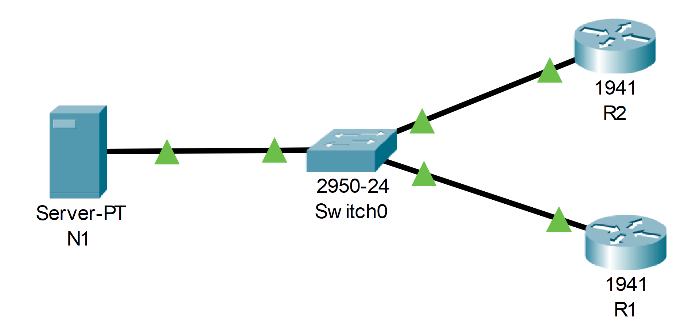

---

> **ВАЖНО**
> 
> Форма для ответов на вопросы будет доступна только при развертывании лабораторной работы 

---

## Топология



## Таблица адресации

| Устройство | Интерфейс | IP-адрес        | Маска подсети |
|------------|-----------|-----------------|---------------|
| N1         | NIC       | 209.165.200.225 | 255.255.255.0 |
| R1         | G0/0      | 209.165.200.226 | 255.255.255.0 |
| R2         | G0/0      | 209.165.200.227 | 255.255.255.0 |

## Цели

В этом упражнении вам предстоит настроить протокол NTP на узлах R1 и R2 для синхронизации времени.

## Общие сведения/сценарий

Протокол сетевого времени (NTP) синхронизирует время между распределенными серверами времени и клиентами. Довольно во многих приложениях нужно синхронизировать время, однако в этой лабораторной работе рассматриваются взаимосвязанные события, указанные в системном журнале, и другие связанные со временем события на нескольких сетевых устройствах. В качестве транспортного протокола NTP использует протокол UDP. Все операции обмена данными по протоколу NTP выполняются по времени в формате UTC.

Сервер NTP обычно получает данные о времени из достоверного источника, такого как атомные часы, к которым подключен сервер. После этого сервер распределяет полученные данные о времени по сети. NTP чрезвычайно эффективен. Для синхронизации двух устройств с точностью до миллисекунды друг от друга требуется не более одного пакета в минуту.

## Инструкции

### Шаг 1. Сервер NTP

1.  В этой топологии сервер N1 уже настроен в качестве NTP-сервера. Проверьте его конфигурацию в разделе **Services** (Службы) \> **NTP**.

2.  С помощью утилиты ping проверьте связь маршрутизатора R1 с сервером N1 (209.165.200.225). Ping должен пройти успешно.

3.  С помощью утилиты ping повторите проверку связи сервера N1 с маршрутизатором R2.

### Шаг 2. Настройка NTP-клиентов

Устройства Cisco можно настроить, чтобы они обращались к NTP-серверу для синхронизации своих часов. Это важно для согласования времени на всех устройствах. Настройте R1 и R2 в качестве NTP-клиентов для синхронизации их часов. Маршрутизаторы R1 и R2 будут использовать сервер N1 в качестве NTP-сервера.

1.  Проверьте текущие настройки NTP и часов, как показано ниже:

    ```
    R1# show ntp status
    %NTP is not enabled.
    R1# show clock detail
    *0:1:53.745 UTC Mon Mar 1 1993
    Источник времени — аппаратный календарь
    ```

2.  Настройте R1 и R2 в качестве клиентов NTP. Выполните команду **ntp server**, чтобы указать NTP-сервер, как показано ниже:

    ```
    R1# conf t
    R1(config)# ntp server 209.165.200.225
    ```

3.  Повторите эту конфигурацию на **R2**.

### Шаг 3. Проверка параметров NTP

1.  Снова проверьте время на R1 и R2, чтобы убедиться в том, что они синхронизированы:

    ```
    R1# show clock detail
    12:7:18.451 UTC Sat Oct 12 2019
    Time source is NTP
    ```

    **Примечание.** При выполнении этой операции на физических маршрутизаторах следует подождать несколько минут, пока часы на R1 и R2 синхронизируются. С Packet Tracer вы можете использовать кнопку Fast Forward Time для ускорения синхронизации.

    Выполните ту же команду на **R2**.

    - ответьте на вопрос №1

2.  Проверьте состояние NTP и связи NTP с помощью следующих команд.

    ```
    R1# show ntp status
    Clock is synchronized, stratum 2, reference is 209.165.200.225
    <Output omitted>

    R1# show ntp associations

    address ref clock st when poll reach delay offset disp
    *~209.165.200.225127.127.1.1 1 11 32 377 9.00 4.00 0.24
     * sys.peer, # selected, + candidate, - outlyer, x falseticker, ~ configured
    ```

[Скачать файл Packet Tracer для локального запуска](./assets/10.3.4-lab.pka)
