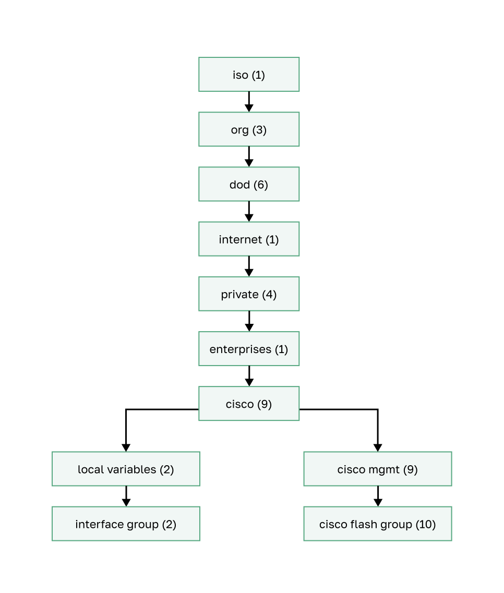
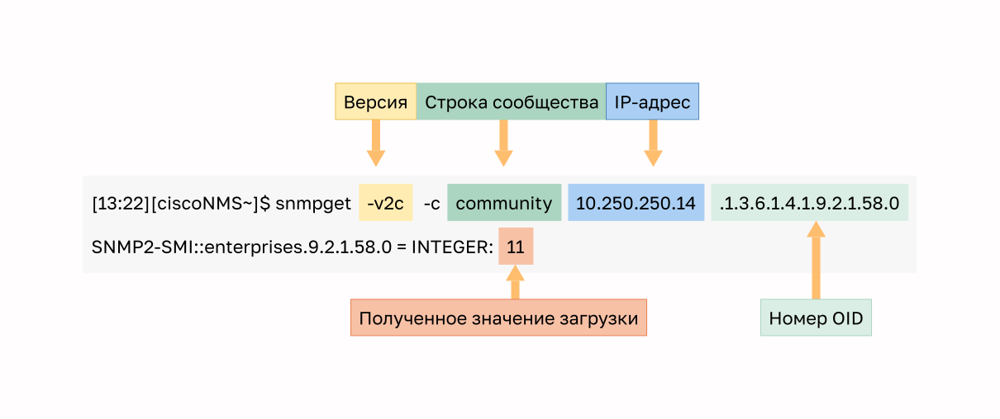

<!-- 10.4.1 -->
## Знакомство с SNMP

Теперь, когда сеть сопоставлена и все компоненты используют одни и те же часы, пришло время взглянуть, как ей можно управлять с помощью SNMP.

Протокол SNMP разработали, чтобы управлять узлами (серверами, рабочими станциями, маршрутизаторами, коммутаторами и устройствами информационной безопасности) в сети IP. С его помощью администраторы могут следить за производительностью сети, находить и устранять проблемы, а также планировать ее рост.

SNMP — протокол уровня приложений, предоставляющий формат сообщения для обмена данными между диспетчерами и агентами. Система SNMP состоит из трех элементов:

* диспетчер SNMP;
* агенты SNMP (управляемый узел);
* информационная база управления (MIB).

Для настройки SNMP на сетевом устройстве сначала необходимо указать отношения между диспетчером и агентом.

Диспетчер SNMP — часть системы управления сетями (network management system — NMS). Он запускает ПО для управления SNMP. Как показано на рисунке, диспетчер может собирать данные от агента с помощью запроса get и изменять его настройки с помощью запроса set. Кроме того, агенты SNMP могут пересылать информацию непосредственно в диспетчер сети, используя ловушки (пакеты trap).

<!-- /courses/ensa-dl/ae8eb392-34fd-11eb-ba19-f1886492e0e4/aeb5eaa4-34fd-11eb-ba19-f1886492e0e4/assets/c6b12cd2-1c46-11ea-af56-e368b99e9723.svg -->

Агент SNMP и база данных MIB размещены на клиентских устройствах. Сетевые устройства, которыми необходимо управлять, оборудованы программным модулем агента. В базах MIB хранятся данные об устройствах и их функционировании. Они должны быть доступны для прошедших аутентификацию удаленных пользователей. Агент SNMP отвечает за предоставление доступа к локальной базе данных MIB.

SNMP определяет способ обмена информацией между приложениями управления сетями и агентами. Диспетчер опрашивает агенты и запрашивает в MIB информацию о них через порт UDP 161. Агенты SNMP отправляют все ловушки в диспетчер на порт UDP 162.

<!-- 10.4.2 -->
## Принцип работы SNMP

Агенты SNMP собирают и сохраняют информацию об устройстве, на котором размещены, и его работе. Они хранят эти сведения локально в базе MIB. Затем диспетчер SNMP использует агент для доступа к хранящимся там сведениям.

Основные запросы диспетчера SNMP — get и set. С помощью get система управления сетью NMS отправляет на устройство запрос о получении данных. Запросом set сиситема изменяет настройки в устройстве агента. Запрос set также может инициировать определенные действия, например, перезагрузить маршрутизатор, отправить или получить конфигурационный файл. Диспетчер SNMP использует запросы get и set для выполнения операций, описанных в таблице.

| **Операция** | **Описание** |
| --- | --- |
| `get-request` | Получает значение из определенной переменной. |
| `get-next-request` | Получает значение из переменной в таблице. Диспетчер SNMP не обязательно должен знать точное имя переменной. Чтобы найти её в таблице, выполняется последовательный поиск. |
| `get-bulk-request` | Получает большие блоки данных, например несколько строк в таблице, что обычно требует передачи многочисленных небольших блоков данных. (Работает только с SNMPv2 или более поздней версией.) |
| `get-response` | Отвечает на запросы **get-request, get-next-request** и **set-request** , отправляемые системой NMS. |
| `set-request` | Сохраняет значение в определенной переменной. |

Агент SNMP отвечает на запросы диспетчера следующим образом.

* **Получение переменной MIB.**  Ответ агента на запрос GetRequest-PDU от диспетчера сети. Агент получает значение переменной MIB и передает его диспетчеру сети.
* **Изменение переменной MIB.**  Ответ агента на запрос SetRequest-PDU от диспетчера сети. Агент изменяет значение переменной MIB на значение, указанное диспетчером сети. Ответ агента SNMP на запрос set включает новые параметры в устройстве.

На рисунке показано использование запроса SNMP GetRequest для определения того, находится ли интерфейс G0/0/0 в состоянии up/up.

<!-- /courses/ensa-dl/ae8eb392-34fd-11eb-ba19-f1886492e0e4/aeb5eaa4-34fd-11eb-ba19-f1886492e0e4/assets/c6b23e42-1c46-11ea-af56-e368b99e9723.svg -->

<!-- 10.4.3 -->
## Ловушки агента SNMP

NMS периодически опрашивает агентов SNMP, размещенных на управляемых устройствах с помощью запроса get. Система запрашивает данные на устройстве. С помощью этого приложение для управления сетями собирает информацию для мониторинга транспортной нагрузки и проверяет настройки управляемых устройств. Данные можно просмотреть в графическом интерфейсе пользователя в системе NMS. Можно рассчитывать средние, минимумы или максимумы. Можно создать графическое представление данных или установить пороговые значения, при превышении которых будут отправляться соответствующие уведомления. Например, система NMS может контролировать использование центрального процессора маршрутизатора Cisco. Диспетчер SNMP осуществляет периодическую выборку значений и представляет эту информацию в графическом виде, чтобы сетевой администратор мог использовать ее для расчета базовых показателей, создания отчетов или просмотра информации в режиме реального времени.

У периодического опроса SNMP есть недостатки. Во-первых, задержка между временем обнаружения события и временем отправки соответствующего уведомления (путем опроса) системой NMS. Во-вторых, компромисс между частотой опроса и использованием пропускной способности.

Чтобы смягчить воздействие этих недостатков, агенты SNMP могут создавать и отправлять ловушки, сообщая системе NMS о некоторых событиях немедленно. Ловушки — это незапрашиваемые сообщения, предупреждающие диспетчера SNMP о каком-либо условии или событии в сети. Примеры условий ловушек: неправильная аутентификация пользователей, перезапуски, изменение состояния канала (на активное или неактивное), отслеживание MAC-адресов, закрытие подключения TCP, потеря подключения к соседнему узлу или другие важные события. С уведомлениями, направленными на ловушки, можно реже использовать ресурсы сети и агентов, без необходимости в некоторых запросах на опрос SNMP.

На рисунке показано использование ловушки SNMP для уведомления сетевого администратора о сбое интерфейса G0/0/0. Программное обеспечение NMS может отправлять текстовые сообщения, отображать всплывающие окно или включать красный значок маршрутизатора в графическом интерфейсе пользователя NMS.

<!-- /courses/ensa-dl/ae8eb392-34fd-11eb-ba19-f1886492e0e4/aeb5eaa4-34fd-11eb-ba19-f1886492e0e4/assets/c6b2b370-1c46-11ea-af56-e368b99e9723.svg -->

Обмен всеми сообщениями SNMP проиллюстрирован на рисунке.

<!-- /courses/ensa-dl/ae8eb392-34fd-11eb-ba19-f1886492e0e4/aeb5eaa4-34fd-11eb-ba19-f1886492e0e4/assets/c6b2da83-1c46-11ea-af56-e368b99e9723.svg -->

<!-- 10.4.4 -->
## Версии SNMP

Версии SNMP:

* **SNMPv1** \— простой протокол управления сетями, полноценный стандарт Интернета, описанный в документе RFC 1157;
* **SNMPv2c** \— описан в документах RFC с 1901 по 1908, использует административную структуру на основе строк сообщества;
* **SNMPv3** \— совместимый протокол на основе стандартов, изначально определенный в документах RFC 2273–2275. Обеспечивает безопасный доступ к устройствам путем аутентификации и шифрования пакетов по сети. Включает в себя функции безопасности: целостность сообщений для защиты пакетов от искажения при пересылке, аутентификация для подтверждения достоверности источника сообщения и шифрование, чтобы содержимое сообщения не прочитал несанкционированный источник.

Во всех версиях используются диспетчеры SNMP, агенты SNMP и база MIB. ПО Cisco IOS поддерживает все три версии. Версия 1 — устаревшее решение, редко используется в современных сетях, поэтому этот курс ориентирован на версии 2c и 3.

В SNMPv1 и SNMPv2c используется модель безопасности на основе сообществ (community). Сообщество менеджеров, которые могут получить доступ к MIB агента, определяется строкой сообщества.

В отличие от SNMPv1, версия SNMPv2c предусматривает механизм массового извлечения записей и даёт станциям управления более подробную информацию об ошибках. Механизм массового извлечения получает таблицы и большие объемы информации, сводя к минимуму затраты времени на двустороннее согласование. Усовершенствованная обработка ошибок в SNMPv2c предусматривает расширенные коды ошибок для различных условий. Эти условия обозначаются одним кодом ошибки в SNMPv1. Коды возврата по ошибке в SNMPv2c включают тип ошибки.

**Примечание:** SNMPv1 и SNMPv2c включают минимальный набор средств обеспечения безопасности. В частности, SNMPv1 и SNMPv2c не обеспечивают ни аутентификацию источника сообщения, ни шифрование. Наиболее обновленное описание версии SNMPv3 содержится в серии документов RFC 3410—3415. В эту версию протокола добавлены методы обеспечения безопасной передачи наиболее важных данных между управляемыми устройствами.

SNMPv3 предусматривает как модели безопасности, так и уровни безопасности. Модель безопасности — это стратегия аутентификации, настроенная для пользователя и группу, в которой данный пользователь находится. Уровень безопасности характеризует допустимую степень безопасности в модели. Сочетание уровня и модели безопасности определяет, какой механизм будет использоваться при обработке пакета SNMP. Доступные модели — SNMPv1, SNMPv2c и SNMPv3.

В таблице перечислены характеристики различных сочетаний уровней и моделей обеспечения безопасности.

**SNMPv1**

|||
| --- | --- |
| **Уровень** | noAuthNoPriv |
| **Аутентификация** | Строка сообщества |
| **Шифрование** | Нет |
| **Результат** | Использует проверку совпадения строк сообщества для проверки подлинности. |

**SNMPv2c**

|||
| --- | --- |
| **Уровень** | noAuthNoPriv |
| **Аутентификация** | Строка сообщества |
| **Шифрование** | Нет |
| **Результат** | Использует проверку совпадения строк сообщества для проверки подлинности. |

**SNMPv3 noAuthNoPriv**

|||
| --- | --- |
| **Уровень** | noAuthNoPriv |
| **Аутентификация** | Имя пользователя |
| **Шифрование** | Нет |
| **Результат** | Использует проверку совпадения имени пользователя для проверки подлинности (улучшение по сравнению с SNMPv2c). |

**SNMPv3 authNoPriv**

|||
| --- | --- |
| **Уровень** | authNoPriv |
| **Аутентификация** | Message Digest 5 (MD5) или Secure Hash Algorithm (SHA) |
| **Шифрование** | Нет |
| **Результат** | Обеспечивает аутентификацию на основе алгоритмов HMAC-MD5 или HMAC-SHA. |

**SNMPv3 authPriv**

|||
| --- | --- |
| **Уровень** | authPriv (требуется образ ПО с поддержкой криптографии) |
| **Аутентификация** | MD5 или SHA |
| **Шифрование** | Стандарт шифрования данных (DES) или расширенный стандарт шифрования (AES) |
| **Результат** | Обеспечивает аутентификацию на основе алгоритмов HMAC-MD5 или HMAC-SHA. Позволяет задавать модель обеспечения безопасности на основе пользователей (User-based Security Model — USM) с помощью алгоритмов шифрования:<ul><li>56-битовое шифрование DES в дополнение к аутентификации на основе стандарта CBC-DES (DES-56);</li><li>3DES с 168-битным шифрованием;</li><li>симметричный алгоритм блочного шифрования (AES) с 128-, 192- или 256-битным ключом.</li></ul> |

Сетевой администратор должен настроить агент, чтобы использовать версию SNMP, поддерживаемую станцией управления. Поскольку агент может взаимодействовать с несколькими диспетчерами SNMP, можно настраивать программное обеспечение для поддержки связи с помощью SNMPv1, SNMPv2c или SNMPv3.

<!-- 10.4.5 -->
<!-- quiz -->

<!-- 10.4.6 -->
## Строки сообщества

Чтобы SNMP функционировал, системе NMS нужен доступ к MIB. Проверить подлинность запросов на доступ необходимо с использованием аутентификации.

В версиях SNMPv1 и SNMPv2c для контроля доступа к MIB используется модель строки сообщества (community string). Они представляют собой незашифрованный пароль. Строки сообщества SNMP производят аутентификацию доступа к объектам MIB.

Типы строк сообщества:

* **только чтение (Read-only — ro)** — предоставляет доступ к переменным MIB, но не позволяет их менять (организации используют SNMPv2c в этом режиме, поскольку версия 2c предоставляет минимальную безопасность);
* **чтение и запись (Read-write — rw)** — предоставляет доступ для чтения и записи ко всем объектам в MIB.

Чтобы просмотреть или настроить переменные MIB, пользователь должен указать тип соответствующей строки сообщества — для чтения или для записи.

Нажмите кнопку «Воспроизведение», чтобы просмотреть анимацию о том, как SNMP работает со строкой сообщества.

**Примечание:** Незашифрованные пароли не считаются механизмом безопасности. Это связано с их уязвимостью для атак с подслушиванием типа «человек-посередине», в которых пароли выясняются путем сбора пакетов.

<!-- 10.4.7 -->
## Идентификатор объекта MIB

Переменные в MIB организованы иерархически. Они позволяют программному обеспечению наблюдать за сетевым устройством и контролировать его. Фактически MIB определяет каждую переменную в качестве идентификатора объекта (OID). OID — уникальные управляемые идентификаторы в иерархии MIB. MIB организует OID на основе стандартов RFC, формируя иерархию OID, которая обычно представляется в виде дерева.

Дерево базы MIB для любого устройства включает несколько ветвей с переменными, общими для многих сетевых устройств, и несколько ветвей с уникальными переменными конкретного устройства или поставщика.

Некоторые общедоступные переменные определены в документах RFC. Большинство устройств используют эти переменные MIB. Кроме того, поставщики сетевого оборудования, такие как Cisco, могут определять собственные частные ветви дерева, чтобы добавить новые переменные для использования только на их устройствах.

На рисунке показаны части структуры MIB, определенные Cisco. Обратите внимание, что OID может быть определен с помощью слов или чисел, что помогает найти определенную переменную в дереве. OID, принадлежащие Cisco, пронумерованы следующим образом: .iso (1).org (3).dod (6).internet (1).private (4).enterprises (1).cisco (9). Таким образом, OID — 1.3.6.1.4.1.9.

<!-- /courses/ensa-dl/ae8eb392-34fd-11eb-ba19-f1886492e0e4/aeb5eaa4-34fd-11eb-ba19-f1886492e0e4/assets/c6b57290-1c46-11ea-af56-e368b99e9723.svg -->

<!-- 10.4.8 -->
## Сценарий опроса SNMP

SNMP могут использовать опрашивающие устройства для наблюдения за использованием ЦП в течение определенного времени. Статистика ЦП собирается в системе NMS и представляется в виде графика. Это создает базовый уровень для работы сетевого администратора. На основании этой оценки устанавливаются пороговые значения. Когда уровень использования ЦП превышает это значение, отправляются соответствующие уведомления. На рисунке показаны статистические выборки использования ЦП маршрутизатора в течение 5 минут, которые фиксировались несколько недель.

<!-- /courses/ensa-dl/ae8eb392-34fd-11eb-ba19-f1886492e0e4/aeb5eaa4-34fd-11eb-ba19-f1886492e0e4/assets/c6b5c0b2-1c46-11ea-af56-e368b99e9723.svg -->

Данные извлекаются с помощью служебной программы snmpget и передаются в систему NMS. С помощью утилиты snmpget можно вручную извлекать данные в реальном времени или запустить отчет NMS. Этот отчет даст вам время, за которое можно использовать данные для получения среднего значения. Служебная программа snmpget требует настройки версии SNMP, правильного сообщества, IP-адреса сетевого устройства, которому направляется запрос, и номера OID. На рисунке показано использование бесплатной служебной программы snmpget, которая дает простой способ получить информацию из базы MIB.

<!-- /courses/ensa-dl/ae8eb392-34fd-11eb-ba19-f1886492e0e4/aeb5eaa4-34fd-11eb-ba19-f1886492e0e4/assets/c6b635e0-1c46-11ea-af56-e368b99e9723.svg -->

Команда запуска утилиты snmpget возможна с несколькими параметрами:

* \-v2c — версия SNMP;
* \-c community — пароль SNMP, который называется строкой сообщества;
* 10.250.250.14 — IP-адрес отслеживаемого устройства.
* 1.3.6.1.4.1.9.2.1.58.0 — OID переменной MIB.

Последняя строка содержит ответ. В выходных данных показана сокращенная версия переменной MIB. Затем он отображает фактическое значение в расположении MIB. В этом случае 5-минутное экспоненциальное среднее процентного отношения загрузки ЦП составляет 11%.

<!-- 10.4.9 -->
## SNMP Object Navigator

Эта служебная программа дает некоторое представление о базовых механизмах работы SNMP. Однако работа с длинными именами переменных MIB, такими как 1.3.6.1.4.1.9.2.1.58.0, может стать проблемой для обычного пользователя. Чаще всего персонал, обслуживающий сеть, использует решение для управления сетями с простым и удобным графическим интерфейсом пользователя, причем все имена переменных MIB прозрачны для пользователя.

Cisco SNMP Navigator на веб-сайте http://www.cisco.com позволяет сетевому администратору изучить подробности о конкретном OID. На рисунке показан пример использования навигатора для исследования информации OID **whyReload** объекта.

<!-- 10.4.10 
## Исследовательская работа: Изучение ПО для мониторинга сети

В этой лабораторной работе вы выполните следующие задачи.

* Часть 1: Проверка знаний по мониторингу сетей
* Часть 2: Изучение инструментов мониторинга сети
* Часть 3: Выберите средство мониторинга сети

[Изучение ПО для мониторинга сети (lab)](./assets/10.4.10-lab---research-network-monitoring-software_ru-RU.pdf)

-->