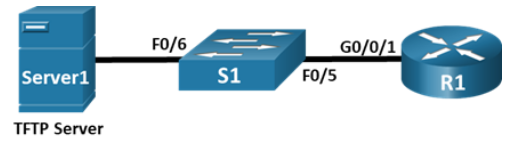

---

> **ВАЖНО**
> 
> Форма для ответов на вопросы будет доступна только при развертывании лабораторной работы 

---

## Топология



## Таблица адресации

| Устройство  | Интерфейс | IP-адрес     | Маска подсети | Шлюз по умолчанию |
|-------------|-----------|--------------|---------------|-------------------|
| **R1**      | G0/0/1    | 192.168.1.1  | 255.255.255.0 | —                 |
| **S1**      | VLAN 1    | 192.168.1.11 | 255.255.255.0 | 192.168.1.1       |
| **Server1** | F0        | 192.168.1.3  | 255.255.255.0 | 192.168.1.1       |

## Цели

Часть 1. Создание сети и настройка основных параметров устройства

Часть 2. Использование TFTP для резервного копирования и восстановления текущей конфигурации коммутатора

Часть 3. Использование TFTP для резервного копирования и восстановления текущей конфигурации маршрутизатора

Часть 4. Резервное копирование и восстановление текущих конфигураций с помощью флеш-памяти маршрутизатора

## Общие сведения и сценарий

Сетевые устройства Cisco регулярно обновляются или меняют конфигурацию по разным причинам. Необходимо периодически создавать резервные копии последних конфигураций устройств и вести журнал изменений параметров. В производственных сетях для резервного копирования файлов конфигурации и образов IOS часто используется сервер TFTP. Это централизованный и безопасный способ хранения резервных копий файлов и их восстановления в случае необходимости. Используя централизованный сервер TFTP, можно создавать резервные копии файлов для различных устройств Cisco.

Помимо сервера TFTP, большинство современных маршрутизаторов Cisco могут создавать резервные копии и восстанавливать файлы локально с карты памяти CompactFlash (CF) или USB-накопителя. CF — это съемный модуль памяти, заменивший внутреннюю флеш-память ограниченного объема, которая использовалась в предыдущих моделях маршрутизаторов. Образ IOS находится на карте памяти. Маршрутизатор использует его для загрузки системы. Резервные копии можно хранить на картах флеш-памяти большего объема илм на съемном USB-накопителе.

В ходе этой лабораторной работы в режиме симуляции физического оборудования вам нужно будет сохранить резервную копию текущей конфигурации устройства Cisco на сервер TFTP или флеш-память, используя программное обеспечение сервера TFTP. Вы также создадите резервную копию текущей конфигурации на Flash.

### Часть 1. Создание сети и настройка основных параметров устройства

В части 1 вы построите кабельную топологию сети и настроите основные параметры, такие как IP-адреса интерфейсов для R1, S1 и Server1.

**Примечание**: Доступны два компьютера, позволяющие установить консольное подключение: от одного ПК к маршрутизатору, а от другого ПК — к коммутатору. Так вам не придется менять кабели во время выполнения задания.

**Шаг 1. Создайте сеть.**

Подключите сетевые кабели к устройствам в соответствии с топологией. Подключите консольный кабель от **PC1** к **R1**. Подключите консольный кабель от **PC2** к **S1**.

**Шаг 2. Настройте основные параметры маршрутизатора на вкладке CLI.**

1.  Откройте терминал до R1 с PC1. Выберите **PC1** \> Вкладка **Desktop** \> **Terminal** и нажмите кнопку **ОК**.

2.  Назначьте маршрутизатору имя устройства.

3.  Отключите поиск DNS, чтобы маршрутизатор не пытался неверно преобразовывать введенные команды, будто это имена узлов.

4.  Назначьте **class** зашифрованным паролем привилегированного режима EXEC.

5.  Назначьте **cisco** паролем консоли и включите вход в систему по паролю.

6.  Установите **cisco** паролем виртуального терминала и активируйте вход.

7.  Зашифруйте открытые пароли.

8.  Создайте баннер, который покажет всем, кто обращается к устройству, сообщение **Authorized Users Only**.

9.  Настройте IP-адреса на интерфейсах, указанных в **таблице адресации**.

10. Сохраните текущую конфигурацию в файл загрузочной конфигурации.

    **Примечание**. Вопросительный знак (**?**) позволяет открыть справку с правильной последовательностью параметров, необходимых для выполнения этой команды.

**Шаг 3. Используйте вкладку CLI на коммутаторе для настройки его основных параметров.**

1.  Откройте терминал до S1 из PC2. Выберите **PC2** \> Вкладка **Desktop** \> **Terminal** и нажмите кнопку **ОК**.

2.  Присвойте коммутатору имя устройства.

3.  Отключите поиск DNS, чтобы маршрутизатор не пытался неверно преобразовывать введенные команды, будто это имена узлов.

4.  Назначьте **class** зашифрованным паролем привилегированного режима EXEC.

5.  Назначьте **cisco** паролем консоли и включите вход в систему по паролю.

6.  Установите **cisco** паролем виртуального терминала и активируйте вход.

7.  Зашифруйте открытые пароли.

8.  Отключите неиспользуемые интерфейсы.

9.  Настройте подинтерфейсы для каждой VLAN, как указано в таблице IP-адресации.

10. Сохраните текущую конфигурацию в файл загрузочной конфигурации.

    **Примечание**. Вопросительный знак (**?**) позволяет открыть справку с правильной последовательностью параметров, необходимых для выполнения этой команды.

**Шаг 4. На вкладке Desktop настройте сведения об IP-адресации для Server1 и проверьте подключение к S1 и R1.**

1.  Проверка связи от **Server1** до **S1**.

2.  Проверка связи от **Server1** до **R1**.

    Если команды ping завершились неудачно и связь установить не удалось, исправьте ошибки в основных настройках устройства.

### Часть 2. Использование TFTP для резервного копирования и восстановления текущей конфигурации коммутатора

В этой части выполняется резервное копирование на TFTP-сервер и восстановление конфигурации S1 с него.

**Шаг 1. Запустите серверное приложение TFTP на сервере Server1.**

На вкладке Services сервера **Server1**включите приложение TFTP.

Приложение TFTP использует транспортный UDP-протокол уровня 4, который инкапсулируется в IP-пакет. Для передачи файлов по TFTP необходимы подключения 1-го и 2-го уровней (в данном случае Ethernet), а также подключение 3-го уровня (IP) между клиентом и сервером. В топологии локальной сети, представленной в лабораторной работе, в качестве протокола 1 и 2 уровня используется только Ethernet. Передача данных может быть выполнена и по WAN-соединениям, которые используют другие физические каналы 1-го уровня и протоколы 2-го уровня. Передача данных по TFTP возможна, если между клиентом и сервером есть связь по IP. Это можно проверить командами **ping**. Если они завершились неудачно и связь не установилась, исправьте ошибки в основных настройках устройства.

Примечание. Существует распространенное заблуждение, что файл можно передать по TFTP с помощью консольного подключения. Это не так, поскольку оно не использует IP-адрес. Клиентское устройство (маршрутизатор или коммутатор) с консольным подключением позволяет инициировать передачу данных по TFTP, но для успешной передачи файлов между клиентом и сервером должно быть установлено подключение по IP.

**Шаг 2. Изучите применение команды copy на устройстве Cisco.**

1.  Через консоль зайдите в коммутатор **S1** и введите в окне командной строки привилегированного режима EXEC команду **copy ?**, что позволит получить параметры для источника (или исходного местоположения), а также другие доступные параметры копирования. Источником можно указать **flash: или flash0:**. Если указать просто имя файла, по умолчанию будет подразумеваться **flash0:**. Также в качестве источника можно выбрать **running-config**.

    ```
    S1# copy ?
    flash: Copy from flash: file system
    ftp: Copy from ftp: file system
    running-config Copy from current system configuration
    scp: Copy from scp: file system
    startup-config Copy from startup configuration
    tftp: Copy from tftp: file system
    S1# copy
    ```

2.  Выбрав местонахождение файла источника, введите символ **?**, чтобы отобразить параметры для места назначения. В этом примере файловая система **flash:** для коммутатора **S1** является файловой системой источника.

    ```
    S1# copy flash: ?
    ftp: Copy to ftp: file system
    running-config Update (merge with) current system configuration
    scp: Copy to scp: file system
    startup-config Copy to startup configuration
    tftp: Copy to tftp: file system
    S1# copy flash:
    ```

**Шаг 3. Передайте файл текущей конфигурации с коммутатора S1 на сервер TFTP на компьютере PC-A.**

1.  На коммутаторе **S1** перейдите в привилегированный режим EXEC и введите команду **copy running-config tftp**. Укажите адрес удаленного узла TFTP-сервера 192.168.1.3. Нажмите клавишу **Enter (Ввод)**, чтобы принять имя файла назначения по умолчанию (**s1-confg**), или укажите желаемое. Восклицательные знаки (**!!**) указывают на выполнение и успешное завершение передачи данных.

    ```
    S1# copy running-config tftp:
    Address or name of remote host []? 192.168.1.3
    Destination filename [S1-confg]?

    Writing running-config...!!
    [OK - 1549 bytes]

    785 bytes copied in 0 secs
    S1#
    ```

2.  Проверьте каталог в приложении TFTP на сервере **Server1** , чтобы убедиться, что файл передан успешно. Выберите **Server1** \> вкладка **Services** \> **TFTP**. Вы должны увидеть файл **S1-Confg** в верхней части списка **File**.

**Шаг 4. Измените текущую конфигурацию коммутатора и скопируйте запущенный файл с сервера TFTP на коммутатор.**

1.  На **S1** создайте баннер с предупреждением о запрете несанкционированного доступа к устройству.

2.  На коммутаторе **S1** перейдите в привилегированный режим EXEC и введите команду **copy tftp running-config**. Укажите адрес удаленного узла TFTP-сервера 192.168.1.3. Введите имя файла: **S1-confg.txt**. Восклицательный знак (!) указывает на выполнение и успешное завершение передачи данных.

    ```
    S1# copy tftp: running-config
    Address or name of remote host []? 192.168.1.3
    Source filename []? S1-confg
    Destination filename [running-config]?

    Accessing tftp://192.168.1.3/S1-confg...
    Loading S1-confg from 192.168.1.3: !
    [OK - 1525 bytes]

    1525 bytes copied in 0 secs
    S1#
    %SYS-5-CONFIG_I: Configured from console by console

    S1#
    ```

3.  Введите команду **show running-config**, чтобы просмотреть файл текущей конфигурации.

    ```
    S1# show running-config
    <output omitted>
    interface Vlan1
    ip address 192.168.1.11 255.255.255.0
    !
    ip default-gateway 192.168.1.1
    !
    banner motd ^CAuthorized Users Only! ^C
    !
    !
    !
    line con 0
    password 7 0822455D0A16
    login
    !
    <output omitted>
    S1#
    ```

    **Примечание**: Обратите внимание, что команда **banner motd** добавляется после копирования запущенной конфигурации на сервер TFTP. Он все еще присутствует после того, как запущенную конфигурацию скопировали обратно.

    Если вы не удалите загрузочную конфигурацию, процедура объединит рабочую конфигурацию TFTP-сервера с текущей конфигурацией в коммутаторе или маршрутизаторе. Если в файл внесли изменения, в копию TFTP добавятся соответствующие команды. В качестве альтернативы, если та же команда выполняется, она обновляет соответствующую команду в текущей рабочей конфигурации коммутатора или маршрутизатора.

### Часть 3. Использование TFTP для резервного копирования и восстановления текущей конфигурации маршрутизатора

Процедуру резервного копирования и восстановления, приведенную в части 2, можно использовать и для маршрутизатора. В части 3 описывается этот процесс.

**Шаг 1. Перенесите текущую конфигурацию с R1 на сервер TFTP.**

1.  Откройте программу **Terminal** на **PC1** для **R1**.

2.  На маршрутизаторе **R1** перейдите в привилегированный режим EXEC и введите команду **copy running-config tftp**. Укажите адрес удаленного узла TFTP-сервера, 192.168.1.3, и примите имя файла **R1-config** как имя по умолчанию.

3.  Убедитесь, что файл передан на сервер TFTP.

**Шаг 2. Восстановите файл текущей конфигурации на маршрутизаторе.**

**Примечание:** Если вы хотите полностью заменить текущий файл конфигурации файлом с TFTP-сервера, удалите файл с маршрутизатора и перезагрузите устройство. Затем настройте адрес интерфейса G0/0/0 для установки IP-подключения между TFTP-сервером и маршрутизатором.

1.  Удалите файл загрузочной конфигурации на маршрутизаторе.

2.  Перезагрузите маршрутизатор.

    **Примечание**: Процент завершения будет временно ниже, пока вы не восстановите конфигурацию.

3.  Настройте интерфейс маршрутизатора **G0/0/1**, указав IP-адрес 192.168.1.1. Подождите, пока протокол связующего дерева (STP) не сойдется на **S1**.

4.  Проверьте подключение между маршрутизатором и **Server1**. Перед восстановлением подключения может потребоваться несколько раз выполнить эхо-запрос.

5.  Введите команду **copy**, чтобы передать файл конфигурации **R1-config** с TFTP-сервера на маршрутизатор. В качестве места назначения укажите **running-config**.

6.  Убедитесь, что файл текущей конфигурации на маршрутизаторе обновлен. Запрос маршрутизатора должен быть изменен обратно на **R1#**, и процент завершения должен отражать, что вся ваша конфигурация восстановлена.

### Часть 4. Резервное копирование и восстановление текущих конфигураций с помощью флеш-памяти маршрутизатора

У маршрутизаторов Cisco текущего поколения нет внутренней флэш-памяти. В этих устройствах используются карты памяти CompactFlash (CF). Это увеличивает ее объем и позволяет устанавливать обновления, не открывая корпус маршрутизатора. На CF могут храниться не только необходимые файлы, но и другие, например, копия текущей конфигурации.

Примечание. Если подключение карты памяти к маршрутизатору невозможно, его собственной флеш-памяти для сохранения резервной копии файла текущей конфигурации может не хватить. Тем не менее, прочтите инструкции и ознакомьтесь с командами.

**Шаг 1. Отобразите файловые системы маршрутизатора.**

Команда **show file systems** отображает доступные файловые системы маршрутизатора. Файловая система **flash0:** используется на маршрутизаторе по умолчанию, на что указывает символ звездочки (\*) в начале строки. Она также может обозначаться именем **flash:**. Общий размер **flash0:** составляет примерно 3 ГБ, из них доступно около 2,5 ГБ. Сейчас единственные доступные файловые системы — **flash0:** и **nvram:**.

**Примечание**: Вам необходимо не менее 1 МБ (1 048 576 байт) свободного пространства. Чтобы определить размер флеш-памяти и ее доступный объем, в окне командной строки привилегированного режима EXEC введите команду **show flash** или **dir flash:**.

    ```
    R1# show file systems
    File Systems:

    Size(b) Free(b) Type Flags Prefixes
    * 3249049600 2761893177 flash rw flash:
    29688 23590 nvram rw nvram:
    ```

- ответьте на вопрос №1

**Шаг 2. Скопируйте файл текущей конфигурации маршрутизатора во флеш-память.**

Для этого введите команду **copy** в окно командной строки привилегированного режима EXEC. В этом примере файл копируется в систему **flash0:**, поскольку, как было показано выше, здесь доступен только один флеш-накопитель, и эта система используется по умолчанию. В качестве имени файла резервной копии текущей конфигурации используется **R1-running-config-backup**.

**Примечание**. Необходимо помнить, что в системе IOS имена файлов чувствительны к регистру.

1.  Скопируйте файл текущей конфигурации во флеш-память.

    ```
    R1# copy running-config flash:
    Destination filename [running-config]? R1-running-config-backup
    Building configuration...
    [OK]
    R1#
    ```

2.  Введите команду **dir**, чтобы проверить, скопирован ли файл текущей конфигурации во флеш-память.

    ```
    R1# dir flash:
    Directory of flash:/

    6 -rw- 732 <no date> R1-running-config-backup
    3 -rw- 486899872 <no date> isr4300-universalk9.03.16.05.S.155-3.S5-ext.SPA.bin
    2 -rw- 28282 <no date> sigdef-category.xml
    1 -rw- 227537 <no date> sigdef-default.xml

    3249049600 bytes total (2761893177 bytes free)
    ```

3.  Введите команду **more**, чтобы посмотреть файл текущей конфигурации во флеш-памяти. Просмотрите выходные данные файла и найдите раздел **Interface** (Интерфейс). Обратите внимание, что для интерфейса GigabitEthernet0/1 команда **no shutdown** не указывается. Этот интерфейс отключен, если файл используется для обновления текущей конфигурации на маршрутизаторе.

    ```
    R1# more flash:R1-running-config-backup
    <output omitted>
    interface GigabitEthernet0/1
    ip address 192.168.1.1 255.255.255.0
    duplex auto
    speed auto
    <output omitted>
    ```

**Шаг 3. Удалите загрузочную конфигурацию и перезагрузите маршрутизатор.**

1.  Удалите файл загрузочной конфигурации на маршрутизаторе.

2.  Перезагрузите маршрутизатор.

    **Примечание**: Процент завершения будет временно ниже, пока вы не восстановите конфигурацию.

3.  Убедитесь, что на маршрутизаторе используется исходная конфигурация по умолчанию.

**Шаг 4. Восстановите файл текущей конфигурации из флеш-памяти.**

1.  Скопируйте сохраненный файл текущей конфигурации из флеш-памяти для обновления файла текущей конфигурации.

    ```
    Router# copy flash: running-config
    Source filename []? R1-running-config-backup
    Destination filename [running-config]?

    732 bytes copied in 0.416 secs (1759 bytes/sec)
    R1#
    %SYS-5-CONFIG_I: Configured from console by console

    R1#
    ```

2.  Команда **show ip interface brief** показывает состояние интерфейсов.

    ```
    R1# show ip interface brief
    Interface IP-Address OK? Method Status Protocol
    GigabitEthernet0/0/0 unassigned YES NVRAM administratively down down
    GigabitEthernet0/0/1 192.168.1.1 YES manual administratively down down
    Vlan1 unassigned YES NVRAM administratively down down
    R1#
    ```

3.  В Packet Tracer интерфейс G0/0/1 будет административно отключен. Войдите в режим настройки интерфейса и снова активируйте его. Задание нужно выполнить на 100%.

[Скачать файл Packet Tracer для локального запуска](./assets/10.6.12-lab.pka)
