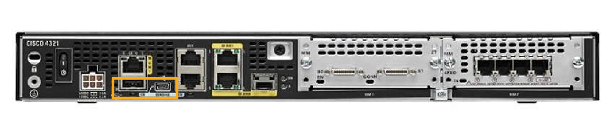

<!-- 10.6.1 -->
## Файловые системы маршрутизаторов

Если вы думаете, что вы не можете вспомнить, как вы настроили каждое устройство в вашей сети, вы не одиноки. В большой сети невозможно вручную настроить каждое устройство. К счастью, существует множество способов скопировать или обновить конфигурации, а затем просто вставить их. Для этого вам нужно знать, как просматривать файловые системы и управлять ими.

Файловая система Cisco IOS (IFS) позволяет администраторам перемещаться по различным каталогам, отображать список файлов в каталоге. Администратор также может создавать подкаталоги во флэш-памяти или на диске. Для различных устройств перечень доступных папок может отличаться.

В примере показан результат выполнения команды **show file systems**, которая в этом примере выводит список всех доступных файловых систем на маршрутизаторе Cisco 4221r.

```
Router# show file systems
File Systems:
       Size(b)       Free(b)      Type  Flags  Prefixes
             -             -    opaque     rw   system:
             -             -    opaque     rw   tmpsys:
*   7194652672    6294822912      disk     rw   bootflash: flash:#
     256589824     256573440      disk     rw   usb0:
    1804468224    1723789312      disk     ro   webui:
             -             -    opaque     rw   null:
             -             -    opaque     ro   tar:
             -             -   network     rw   tftp:
             -             -    opaque     wo   syslog:
      33554432      33539983     nvram     rw   nvram:
             -             -   network     rw   rcp:
             -             -   network     rw   ftp:
             -             -   network     rw   http:
             -             -   network     rw   scp:
             -             -   network     rw   sftp:
             -             -   network     rw   https:
             -             -    opaque     ro   cns:
Router#
```

Данная команда предоставляет полезную информацию, например объем общей и свободной памяти, тип файловой системы и ее разрешения. Доступны следующие разрешения: «только чтение» (ro), «только запись» (wo) и «чтение и запись» (rw). Они отображаются в столбце Flags в выходных данных команды.

Хотя в списке доступно несколько файловых систем, нас интересуют в первую очередь файловые системы TFTP, флеш-память и NVRAM.

Обратите внимание, что перед файловой системой флеш-памяти всегда указывается символ звездочки. Это означает, что флеш-память является текущей файловой системой по умолчанию. Загружаемая IOS размещена во флеш-памяти. Таким образом, к списку флеш-памяти добавляется символ решетки (#), указывая на то, что это загрузочный диск.

**Файловая система Flash**

В примере показаны результаты выполнения команды **dir** (directory).

```
Router# dir
Directory of bootflash:/
   11  drwx            16384   Aug 2 2019 04:15:13 +00:00  lost+found
370945  drwx             4096   Oct 3 2019 15:12:10 +00:00  .installer
338689  drwx             4096   Aug 2 2019 04:15:55 +00:00  .ssh
217729  drwx             4096   Aug 2 2019 04:17:59 +00:00  core
379009  drwx             4096  Sep 26 2019 15:54:10 +00:00  .prst_sync
80641  drwx             4096   Aug 2 2019 04:16:09 +00:00  .rollback_timer
161281  drwx             4096   Aug 2 2019 04:16:11 +00:00  gs_script
112897  drwx           102400   Oct 3 2019 15:23:07 +00:00  tracelogs
362881  drwx             4096  Aug 23 2019 17:19:54 +00:00  .dbpersist
298369  drwx             4096   Aug 2 2019 04:16:41 +00:00  virtual-instance
   12  -rw-               30   Oct 3 2019 15:14:11 +00:00  throughput_monitor_params
 8065  drwx             4096   Aug 2 2019 04:17:55 +00:00  onep
   13  -rw-               34   Oct 3 2019 15:19:30 +00:00  pnp-tech-time
249985  drwx             4096  Aug 20 2019 17:40:11 +00:00  Archives
   14  -rw-            65037   Oct 3 2019 15:19:42 +00:00  pnp-tech-discovery-summary
   17  -rw-          5032908  Sep 19 2019 14:16:23 +00:00  isr4200_4300_rommon_1612_1r_SPA.pkg
   18  -rw-        517153193  Sep 21 2019 04:24:04 +00:00  isr4200-universalk9_ias.16.09.04.SPA.bin
7194652672 bytes total (6294822912 bytes free)
Router#
```

Поскольку флеш-память является файловой системой по умолчанию, то в результатах выполнения команды **dir** указывается содержимое флеш-памяти. Во флеш-памяти размещено несколько файлов, однако в первую очередь нас интересует последняя запись. Это имя текущего образа файла Cisco IOS, запущенного в ОЗУ.

**Файловая система NVRAM**

Чтобы просмотреть содержимое NVRAM, необходимо изменить текущую файловую систему по умолчанию, используя команду **cd** (изменить каталог), как показано в примере.

```
Router#
Router# cd nvram: 
Router# pwd
nvram:/
Router# dir
Directory of nvram:/
32769  -rw-             1024                    <no date>  startup-config
32770  ----               61                    <no date>  private-config
32771  -rw-             1024                    <no date>  underlying-config
    1  ----                4                    <no date>  private-KS1
    2  -rw-             2945                    <no date>  cwmp_inventory
    5  ----              447                    <no date>  persistent-data
    6  -rw-             1237                    <no date>  ISR4221-2x1GE_0_0_0
    8  -rw-               17                    <no date>  ecfm_ieee_mib
    9  -rw-                0                    <no date>  ifIndex-table
   10  -rw-             1431                    <no date>  NIM-2T_0_1_0
   12  -rw-              820                    <no date>  IOS-Self-Sig#1.cer
   13  -rw-              820                    <no date>  IOS-Self-Sig#2.cer
33554432 bytes total (33539983 bytes free)
Router#
```

Нынешняя команда рабочего каталога: **pwd**. Эта команда подтверждает, что просматривается именно каталог NVRAM. И наконец, команда **dir** создает список содержимого энергонезависимой памяти. Хотя в списке представлено несколько файлов конфигурации, в первую очередь нас интересует файл конфигурации начальной загрузки.

<!-- 10.6.2 -->
## Файловые системы коммутатора

Используя файловую систему флеш-памяти коммутатора Cisco 2960, можно скопировать файлы конфигурации и архивировать (скачивать и закачивать) образы ОС.

Для просмотра файловых систем на коммутаторе Catalyst используется та же команда, что и для маршрутизатора Cisco: **show file systems**, как показано в примере.

```
Switch# show file systems
File Systems:
       Size(b)     Free(b)     Type  Flags  Prefixes
*    32514048    20887552     flash     rw    flash:#
          -           -      opaque     rw       vb:
          -           -      opaque     ro       bs:
          -           -      opaque     rw   system:
          -           -      opaque     rw   tmpsys:
        65536       48897     nvram     rw    nvram:
          -           -      opaque     ro   xmodem:
          -           -      opaque     ro   ymodem:
          -           -      opaque     rw     null:
          -           -      opaque     ro      tar:
          -           -     network     rw     tftp:
          -           -     network     rw      rcp:
          -           -     network     rw     http:
          -           -     network     rw      ftp:
          -           -     network     rw      scp:
          -           -     network     rw    https:
          -           -     opaque      ro      cns:
Switch#
```

<!-- 10.6.3 -->
## Использование текстового файла для создания резервной копии конфигурации

Файлы конфигурации можно сохранить в текстовом файле, используя программу Tera Term, как показано на рисунке.


<!-- /courses/ensa-dl/ae8eb392-34fd-11eb-ba19-f1886492e0e4/aeb5eaa8-34fd-11eb-ba19-f1886492e0e4/assets/c6bb6602-1c46-11ea-af56-e368b99e9723.svg -->

**Шаг 1**. В меню File (Файл) выберите **Log**.   
**Шаг 2**. Выберите путь для сохранения файла. Программа Tera Term запустит процесс захвата текста.   
**Шаг 3**. После начала данного процесса в командной строке привилегированного режима EXEC выполните команду **show running-config** или **show startup-config**. Текст, отображаемый в окне терминала, будет отправлен в выбранный файл.   
**Шаг 4**. When the capture is complete, select **Close** in the Tera Term: Окно журнала.   
**Шаг 5**. Просмотрите файл, чтобы убедиться в том, что он не поврежден.  

<!-- 10.6.4 -->
## Использование текстового файла для восстановления конфигурации

Конфигурацию можно скопировать из файла, а затем напрямую вставить на устройство. IOS выполняет каждую строку текста конфигурации в виде команды. Это означает, что файл необходимо будет отредактировать, чтобы зашифрованные пароли имели текстовый формат. Также необходимо удалить сообщения операционной среды IOS и весь не относящийся к командам текст типа **\--More--**. Кроме того, перед вставкой конфигурации вы можете добавить **enable** и **configure terminal** в начало файла или перейти в режим глобальной конфигурации. Этот процесс рассматривается в рамках лабораторной работы после этой главы.

Вместо копирования и вставки конфигурацию можно восстановить из текстового файла с помощью Tera Term, как показано на рисунке.


<!-- /courses/ensa-dl/ae8eb392-34fd-11eb-ba19-f1886492e0e4/aeb5eaa8-34fd-11eb-ba19-f1886492e0e4/assets/c6bc2950-1c46-11ea-af56-e368b99e9723.svg -->

При использовании программы Tera Term необходимо выполнить следующие действия.

**Шаг 1**. В меню File (Файл) выберите пункт **Send file** (Отправить файл).  
**Шаг 2**. Укажите путь к файлу, который необходимо скопировать на данное устройство, и нажмите **Open** (Открыть).  
**Шаг 3**. После этого программа Tera Term вставит этот файл в память устройства.  

В интерфейсе CLI текстовое содержимое этого файла будет использоваться в качестве команд и станет текущей конфигурацией устройства.

<!-- 10.6.5 -->
## Использование TFTP для резервного копирования и восстановления конфигурации

**Использование TFTP для сохранения резвервной копии конфигруации**

Копии файлов конфигурации необходимо хранить как файлы резервных копий на случай возникновения проблем. Файлы конфигурации можно хранить на сервере простого протокола передачи файлов (TFTP) или на USB-накопителе. Файл конфигурации также необходимо включить в сетевую документацию.

Чтобы сохранить текущую конфигурацию или конфигурацию начальной загрузки на TFTP-сервер, используйте команду **copy running-config tftp** или **copy startup-config tftp**, как показано в примере.

```
R1# copy running-config tftp
Remote host []?192.168.10.254
Name of the configuration file to write[R1-config]? R1-Jan-2019
Write file R1-Jan-2019 to 192.168.10.254? [confirm]
Writing R1-Jan-2019 !!!!!! [OK]
```

Для резервного копирования текущей конфигурации на TFTP-сервер выполните указанные ниже действия.

**Шаг 1**. Введите следующую команду: **copy running-config tftp**.  
**Шаг 2**. Введите IP-адрес узла, куда следует сохранить файл конфигурации.  
**Шаг 3**. Введите имя, которое следует присвоить файлу конфигурации.  
**Шаг 4**. Нажмите клавишу Enter для подтверждения каждого последующего действия.

**Использование TFTP для восстановления резервной копии конфигурации**

Чтобы восстановить текущую конфигурацию или конфигурацию начальной загрузки с TFTP-сервера, используйте команду **copy tftp running-config** или **copy tftp startup-config**. Для восстановления текущей конфигурации с TFTP-сервера выполните указанные ниже действия.

**Шаг 1**. Введите следующую команду: **copy tftp running-config**.  
**Шаг 2**. Введите IP-адрес узла, на котором хранится файл конфигурации.  
**Шаг 3**. Введите имя, которое следует присвоить файлу конфигурации.  
**Шаг 4**. Нажмите клавишу **Enter** для подтверждения каждого последующего действия.

<!-- 10.6.6 -->
## USB-порты на маршрутизаторе Cisco

Функция хранения с использованием универсальной последовательной шины (USB) обеспечивает поддержку USB-накопителей отдельными моделями маршрутизаторов Cisco. Поддержка USB-накопителей обеспечивает дополнительные функции хранения и возможность использования дополнительного загрузочного устройства. Образы, конфигурации и другие файлы можно копировать с USB-накопителя Cisco и на него, и это так же надежно, как хранение и получение файлов с помощью карты Compact Flash. Кроме того, модульные маршрутизаторы с интегрированными сетевыми сервисами могут загружать любой образ программного обеспечения Cisco IOS, сохраненный на USB-накопитель. Теоретически на USB-накопителе может храниться несколько копий Cisco IOS и несколько конфигураций маршрутизатора. На рисунке показаны порты USB маршрутизатора Cisco 4321.


<!-- /courses/ensa-dl/ae8eb392-34fd-11eb-ba19-f1886492e0e4/aeb5eaa8-34fd-11eb-ba19-f1886492e0e4/assets/c6bcc590-1c46-11ea-af56-e368b99e9723.svg -->

Используйте команду **dir** для отображения содержимого USB-накопителя, как это показано в примере

```
Router# dir usbflash0: 
Directory of usbflash0:/ 
1 -rw- 30125020 Dec 22 2032 05:31:32 +00:00 c3825-entservicesk9-mz.123-14.T 
63158272 bytes total (33033216 bytes free)
```

<!-- 10.6.7 -->
## Использование USB для резервного копирования и восстановления конфигурации

Во время резервного копирования через USB-порт рекомендуется запустить команду **show file systems**, чтобы проверить наличие USB-накопителя и подтвердить его имя, как показано в примере.

```
R1# show file systems
File Systems:
		Size(b)       Free(b)      Type  Flags  Prefixes
             -             -    opaque     rw   archive:
             -             -    opaque     rw   system:
             -             -    opaque     rw   tmpsys:
             -             -    opaque     rw   null:
             -             -   network     rw   tftp:
*    256487424     184819712      disk     rw   flash0: flash:#
             -             -      disk     rw   flash1:
        262136        249270     nvram     rw   nvram:
             -             -    opaque     wo   syslog:
             -             -    opaque     rw   xmodem:
             -             -    opaque     rw   ymodem:
             -             -   network     rw   rcp:
             -             -   network     rw   http:
             -             -   network     rw   ftp:
             -             -   network     rw   scp:
             -             -    opaque     ro   tar:
             -             -   network     rw   https:
             -             -    opaque     ro   cns:
    4050042880    3774152704  usbflash     rw   usbflash0:
R1#
```

Обратите внимание, что последняя строка вывода показывает порт USB и имя: «usbflash0:».

Далее используйте команду **copy run usbflash0:** _/_, чтобы скопировать файл конфигурации на USB-накопитель. Обязательно используйте то имя флеш-накопителя, которое указано в файловой системе. Косую черту вводить необязательно (она обозначает корневой каталог USB-накопителя).

IOS запросит имя файла. Если файл уже существует на USB-накопителе, маршрутизатор запросит операцию записи, как показано в примере.

При копировании на USB-устройство флэш-памяти, без ранее существующего файла будет отображаться следующий вывод.

```
R1# copy running-config usbflash0: 
Destination filename [running-config]? R1-Config
5024 bytes copied in 0.736 secs (6826 bytes/sec)
```

При копировании на USB-устройство флэш-памяти, с тем же файлом конфигурации уже на диске будет отображаться следующий вывод.

```
R1# copy running-config usbflash0: 
Destination filename [running-config]? R1-Config
%Warning:There is a file already existing with this name
Do you want to over write? [confirm]
5024 bytes copied in 1.796 secs (2797 bytes/sec)
R1#
```

Используйте команду **dir** для просмотра файла на USB-накопителе, а также команду **more** для просмотра содержимого, как показано в примере.

```
R1# dir usbflash0:/ 
Directory of usbflash0:/
    1  drw-     0  Oct 15 2010 16:28:30 +00:00  Cisco
   16  -rw-  5024   Jan 7 2013 20:26:50 +00:00  R1-Config
4050042880 bytes total (3774144512 bytes free)
R1#
R1# more usbflash0:/R1-Config
!
! Last configuration change at 20:19:54 UTC Mon Jan 7 2013 by
admin version 15.2
service timestamps debug datetime msec
service timestamps log datetime msec
no service password-encryption
!
hostname R1
!
boot-start-marker
boot-end-marker
!
logging buffered 51200 warnings
!
no aaa new-model
!
no ipv6 cef
R1#
```

**Восстановление конфигураций с USB-накопителя**

Чтобы скопировать файл обратно на устройство, потребуется внести изменения в файл R1-Config на USB-носителе с помощью текстового редактора. Если предположить, что именем файла будет **R1-Config**, используйте команду **copy usbflash0:/R1-Config** _running-config_, чтобы восстановить текущую конфигурацию.

<!-- 10.6.8 -->
## Процедура восстановления пароля

Пароли на устройствах служат для защиты от несанкционированного доступа. Если пароль зашифрован (как, например, секретные пароли для входа в режим настройки), то после восстановления его необходимо заменить. В зависимости от устройства, детали процедуры восстановления пароля варьируются. Однако все процедуры восстановления пароля основаны на том же принципе:

**Шаг 1**. Войдите в режим ROMMON.  
**Шаг 2**. Измените значение регистра конфигурации.  
**Шаг 3**. Скопируйте startup-config в running-config.  
**Шаг 4**. Изменить пароль  
**Шаг 5**. Сохраните running-config как новый startup-config.  
**Шаг 6**. Перезагрузите устройство.  

Для восстановления пароля необходим доступ с консоли к устройству через терминал или ПО эмуляции терминала на ПК. Для доступа к устройству используются следующие настройки терминала:

* Скорость передачи данных 9600 бод
* Без бита четности
* 8 бит данных;
* 1 стоповый бит;
* Без управления потоком

<!-- 10.6.9 -->
## Пример восстановление пароля

**Шаг 1. Войдите в режим ROMMON.**

При наличии консольного доступа пользователь может войти в режим ROMMON, используя специальную комбинацию клавиш во время процесса загрузки или вынув внешнюю флеш-память, когда устройство отключено. При успешном выполнении отображается подсказка **rommon 1 >**, как показано в примере.

**Примечание:** В терминале PuTTY используется комбинация клавиш Ctrl+Break. Список стандартных комбинаций клавиш для других эмуляторов терминалов и операционных систем можно найти в интернете.

```
Readonly ROMMON initialized
 
monitor: command "boot" aborted due to user interrupt
rommon 1 > 
```

**Шаг 2. Измените значение регистра конфигурации.**

Программное обеспечение ROMMON поддерживает ряд основных команд, например **confreg**. Команда **confreg 0x2142** позволяет установить для регистра конфигурации значение 0x2142. Если значение регистра конфигурации равно 0x2142, устройство будет игнорировать файл загрузочной конфигурации во время запуска. В файле загрузочной конфигурации хранятся забытые пароли. Изменив значение регистра конфигурации на 0x2142, введите **reset** в командной строке, чтобы перезапустить устройство. Во время перезапуска устройства и распаковки IOS введите комбинацию клавиш прерывания текущего процесса. В примере показан экран терминала маршрутизатора 1941, который вошел в режим ROMMON после отправки сигнала "break" во время процесса загрузки.

```
rommon 1 > confreg 0x2142
rommon 2 > reset
 
System Bootstrap, Version 15.0(1r)M9, RELEASE SOFTWARE (fc1)
Technical Support: http://www.cisco.com/techsupport
Copyright (c) 2010 by cisco Systems, Inc.
(дальше выходные данные опущены)
```

**Шаг 3. Скопируйте startup-config в running-config.**

После перезагрузки устройства скопируйте текущую конфигурацию в загрузочную конфигурацию, используя команду **copy startup-config running-config**, как показано в примере. Обратите внимание, что приглашение маршрутизатора изменилось на **R1#** так как имя хоста установлено в R1 в startup-config.

ВНИМАНИЕ! Не вводите **copy running-config startup-config**. Эта команда удалит исходную загрузочную конфигурацию.

```
Router# copy startup-config running-config
Destination filename [running-config]?
 
1450 bytes copied in 0.156 secs (9295 bytes/sec)
R1#
```

**Шаг 4. Измените пароль.**

Поскольку вы находитесь в привилегированном режиме EXEC, вы можете настроить все необходимые пароли, как показано в примере.

**Примечание:** Пароль **cisco**  является ненадежным и используется здесь только для примера.

```
R1# configure terminal
Введите построчно команды настройки.  В конце нажмите CNTL/Z.
R1(config)# enable secret cisco
```

**Шаг 5. Сохраните running-config как новый startup-config.**

После настройки новых паролей измените значение регистра конфигурации обратно на 0x2102 с помощью команды **config-register 0x2102** в режиме глобальной конфигурации. Сохраните текущую конфигурацию в файле загрузочной конфигурации, как показано в примере.

```
R1(config)# config-register 0x2102
R1(config)# end
R1# copy running-config startup-config
Destination filename [startup-config]?
Building configuration...
[OK]
R1#
```

**Шаг 6. Перезагрузите устройство.**

Перезагрузите устройство, как показано в примере. Теперь для аутентификации на устройстве используется новый пароль. С помощью команд  **show** убедитесь, что все конфигурации сохранены. Например, убедитесь, что после восстановления пароля не отключены необходимые интерфейсы.

Подробные инструкции по восстановлению пароля на конкретном устройстве можно найти в интернете.

```
R1# reload
```

<!-- 10.6.10 -->
## Работа в симуляторе: Резервное копирование файлов конфигурации

В этом упражнении вы можете продемонстрировать способы восстановления файлов конфигурации из резервной копии для последующего резервного копирования. Из-за отказа оборудования был установлен новый маршрутизатор. К счастью, резервные копии файлов конфигурации были сохранены на сервере простого протокола передачи данных (TFTP). Вам необходимо восстановить эти файлы с TFTP-сервера, чтобы маршрутизатор вернулся в режим онлайн как можно скорее.

[Резервное копирование файлов конфигурации (pdf)](./assets/10.6.10-packet-tracer---back-up-configuration-files_ru-RU.pdf)

[Резервное копирование файлов конфигурации (pka)](./assets/10.6.10-packet-tracer---back-up-configuration-files_ru-RU.pka)

<!-- 10.6.11 -->

<!-- 10.6.12 -->
## Работа в симуляторе: Управление файлами конфигурации устройств с использованием TFTP-сервера, флеш-памяти и USB-накопителя

В этой лабораторной работе вы выполните следующие задачи.

* Часть 1: Создание сети и настройка основных параметров устройства
* Часть 2: Загрузка ПО сервера TFTP (дополнительно)
* Часть 3: Использование TFTP для резервного копирования и восстановления текущей конфигурации коммутатора
* Часть 4: Использование TFTP для резервного копирования и восстановления текущей конфигурации маршрутизатора
* Часть 5: Резервное копирование и восстановление текущих конфигураций с помощью флеш-памяти маршрутизатора
* Часть 6: Использование USB-накопителя для резервного копирования и восстановления текущей конфигурации (дополнительно)

[Управление файлами конфигурации устройств с использованием TFTP-сервера, флеш-памяти и USB-накопителя - режим симуляции физического оборудования (pdf)](./assets/10.6.12-packet-tracer---use-tftp-and-flash-to-manage-configuration-files---physical-mode_ru-RU.pdf)

[Управление файлами конфигурации устройств с использованием TFTP-сервера, флеш-памяти и USB-накопителя -режим симуляции физического оборудования (pka)](./assets/10.6.12-packet-tracer---use-tftp-and-flash-to-manage-configuration-files---physical-mode_ru-RU.pka)


<!-- 10.6.13 -->
## Работа в симуляторе: Изучение процедур восстановления паролей

У вас есть возможность попрактиковаться в следующих навыках:
 
* Часть 1: Изучение регистра конфигурации
* Часть 2: Описание процедуры восстановления пароля для отдельного маршрутизатора Cisco

Вы можете практиковать эти навыки, используя Packet Tracer или лабораторное оборудование, если таковое имеется.

[Исследование и выполнение процедур восстановления пароля - режим симуляции физического оборудования (pdf)](./assets/10.6.13-packet-tracer---research-and-execute-password-recovery-procedures---physical-mode_ru-RU.pdf)

[Исследование и выполнение процедур восстановления пароля - режим симуляции физического оборудования (pka)](./assets/10.6.13-packet-tracer---research-and-execute-password-recovery-procedures---physical-mode_ru-RU.pka)
