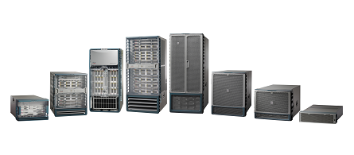
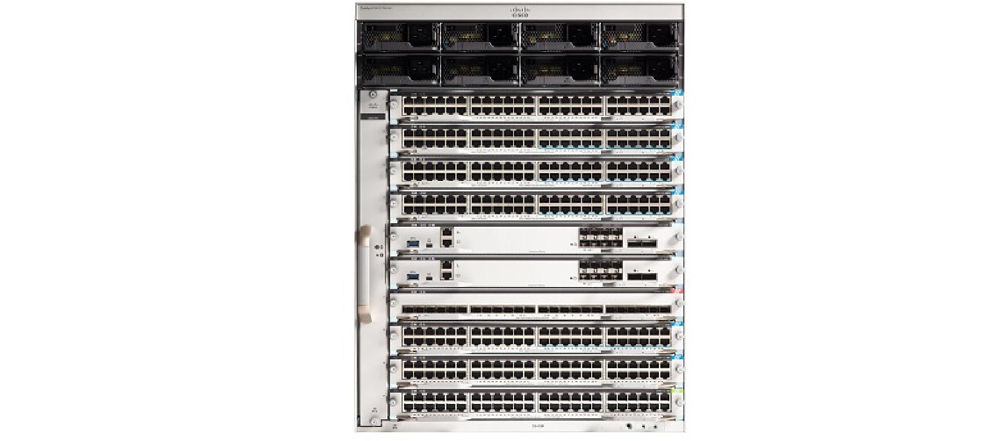
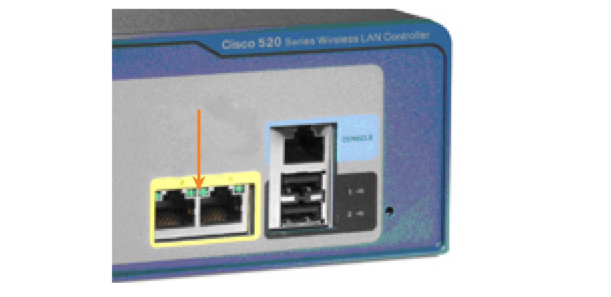

<!-- 11.3.1 -->
## Платформы коммутации

Один из простых способов создания иерархических и масштабируемых сетей — использовать подходящее оборудование для выполнения задания. Перед выбором коммутатора следует учитывать множество платформ коммутаторов, форм-факторов и других функций.

При проектировании сети важно выбрать соответствующее требованиям аппаратное обеспечение и предусмотреть возможность расширения. В корпоративной сети коммутаторы и маршрутизаторы играют критически важную роль в обмене данными.

**Кампусные коммутаторы локальной сети**

Чтобы масштабировать производительность корпоративной локальной сети, используют коммутаторы уровней ядра, распределения, доступа, а также компактные коммутаторы. Эти платформы коммутации могут иметь разную конструкцию: от безвентиляторных коммутаторов с восемью фиксированными портами до коммутаторов с 13 платами, поддерживающих несколько сотен портов. К платформам коммутации для кампусных локальных сетей относятся коммутаторы Cisco серий 2960, 3560, 3650, 3850, 4500, 6500 и 6800.

<!--
The figure displays four switches stacked on top of one another.
-->

**Коммутаторы с облачным управлением**

Коммутаторы доступа с управлением в облачной среде Cisco Meraki обеспечивают возможность виртуального стекирования коммутаторов. Они отслеживают и настраивают тысячу портов коммутации через Интернет без вмешательства локальных IT-специалистов.

<!--
The figure displays a Meraki switch.
-->

**Коммутаторы для центров обработки данных**

Центр обработки данных создают на базе коммутаторов, обеспечивающих расширенные возможности масштабирования инфраструктуры, бесперебойную работу и гибкость транспортных решений. К платформам коммутации ЦОД относятся коммутаторы серий Cisco Nexus.

<!--
The figure displays eight data center switches.
-->

**Коммутаторы операторов связи**

Коммутаторы операторов связи разделяются на две категории: коммутаторы агрегации и коммутаторы доступа по Ethernet. Коммутаторы агрегации — это коммутаторы Ethernet операторского класса, которые обеспечивают агрегацию трафика на границе сети. Коммутаторы доступа по Ethernet операторов связи предоставляют интеллектуальные функции приложений, унифицированные сервисы, возможности виртуализации, встроенные функции обеспечения безопасности и упрощенные возможности управления.

<!--
The figure displays six enterprise switches.
-->

**Виртуальные сети**

Сети становятся все более виртуальными. Платформы коммутации виртуальных сетей Cisco Nexus обеспечивают безопасные многопользовательские сервисы благодаря внедрению в сеть ЦОД интеллектуальной технологии виртуализации.

<!--
The figure displays the back of a switch.
-->

<!-- 11.3.2 -->
## Форм-факторы коммутаторов

При выборе коммутаторов сетевой администратор должен определить формфактор. К ним относятся конфигурации: фиксированная, модульная, со стеком и без стека.

**Коммутаторы с фиксированной конфигурацией**

Функции и опции коммутаторов с фиксированной конфигурацией ограничены теми, которые изначально поставляются с коммутатором.

<!--
The figure displays four fixed configuration switches stacked on top of one another.
-->

**Коммутаторы с модульной конфигурацией**

Шасси модульных коммутаторов принимает линейные платы, заменяемые в полевых условиях.

<!--
The figure displays six different modular switches from enterprise to small business.
-->

**Коммутаторы со стекируемой конфигурацией**

Для подключения установленных в стек коммутаторов используют специальные кабели, которые позволяют им эффективно работать как один большой коммутатор.

<!--
The figure displays the back of eight switches stacked on top of one another and connected with cables.
-->

**Толщина**

Толщина коммутатора измеряется количеством стоечных модулей. Она также важна для устанавленных в стойку коммутаторов. Например, все переключатели фиксированной конфигурации, показанные на рисунке, имеют высоту в одну стойку (1U) или 1,75 дюйма (44,45 мм).

<!--
The figure displays four switches stacked on top of one another.
-->

<!-- 11.3.3 -->
## Плотность портов

Плотностью портов коммутатора называют количество портов, доступных на одном коммутаторе. На рисунке показана плотность портов трех различных коммутаторов.

Коммутаторы с фиксированной конфигурацией поддерживают различные варианты плотности портов. Cisco Catalyst 3850 поставляются в конфигурациях 12, 24, 48 портов, как показано на рисунке. 48-портовый коммутатор предусматривает поддержку дополнительных портов для устройств малого формфактора (SFP).

**Коммутаторы Cisco Catalyst серии 3850**

<!--
The figure displays four Cisco Catalyst 3850 switches stacked on top of one another.
-->

Модульные коммутаторы поддерживают очень высокую плотность портов за счет добавления нескольких линейных плат портов коммутатора. Модульный коммутатор Catalyst 9400, показанный на следующем рисунке, поддерживает 384 коммутационных порта.

**Коммутаторы Catalyst серии 9400**

<!-- /courses/ensa-dl/ae8eb394-34fd-11eb-ba19-f1886492e0e4/aeb638c2-34fd-11eb-ba19-f1886492e0e4/assets/c6d44531-1c46-11ea-af56-e368b99e9723.svg -->

<!--
На рисунке показан модульный коммутатор Catalyst 9400.
-->

Чтобы оптимально использовать физическое пространство и потреблять электроэнергию, в крупных сетях с несколькими тысячами сетевых устройств используют модульные коммутаторы высокой плотности. Без них для работы сети потребуется множество коммутаторов с фиксированной конфигурацией, чтобы поддерживать доступ к сети для всех устройств. При таком подходе необходимо большое количество розеток и много места в коммутационном шкафу.

Проектировщик сети также должен учитывать проблему «узких мест» восходящего канала. При большом числе коммутаторов с фиксированной конфигурацией достигнуть заданной производительности можно с большим количеством дополнительных портов для агрегации пропускной способности. Это проблема решается использованием одного модульного коммутатора, поскольку объединительная плата шасси обеспечивает пропускную способность, необходимую для поддержки устройств, подключенных к линейным платам портов.

<!-- 11.3.4 -->
## Скорость передачи трафика

Скорость передачи трафика определяет возможную производительность коммутатора, оценивая объем данных, которые за секунду может обработать коммутатор. Есть несколько классов скорости пересылки. Коммутаторы начального уровня передают трафик межденнее, чем коммутаторы корпоративного уровня. При выборе коммутатора крайне важно учитывать скорость передачи трафика. Если скорость слишком низкая, коммутатор не сможет обеспечить на всех своих портах обмен данными с полной скоростью, на которую рассчитана среда передачи данных. Номинальная скорость среды передачи данных — скорость, которую способен обеспечить каждый Ethernet-порт на коммутаторе. Она может составлять 100 Мбит/с, 1 Гбит/с, 10 Гбит/с или 100 Гбит/с.

Например, стандартный 48-портовый гигабитный коммутатор, работающий при полной скорости, соответствующей среде передачи данных, генерирует трафик со скоростью 48 Гбит/с. Если коммутатор поддерживает максимальную скорость передачи данных 32 Гбит/с, он не может работать с полной скоростью, соответствующей среде передачи данных, на всех своих портах одновременно. К счастью, от коммутаторов уровня доступа обычно не требуется работа на полной скорости среды передачи данных, поскольку они физически ограничены восходящими каналами уровня распределения. Значит, на уровне доступа можно использовать менее дорогие коммутаторы с более низкой производительностью, а более дорогие и мощные коммутаторы использовать на уровнях распределения и ядра, где скорость передачи данных в большей степени влияет на производительность сети.

<!-- 11.3.5 -->
## Питание по сети Ethernet

Технология PoE позволяет коммутатору осуществлять подачу питания на устройство по кабелю Ethernet. Эта функция может использоваться IP-телефонами и некоторыми беспроводными точками доступа, что позволяет устанавливать их везде, где есть кабель Ethernet. Сетевой администратор должен убедиться, что функции PoE действительно необходимы, поскольку коммутаторы с поддержкой PoE стоят недешево.

**Коммутатор**

Порты PoE выглядят, как любой другой порт коммутатора. Выберите модель коммутатора, чтобы определить, поддерживает ли порт питание через Ethernet.

<!-- /courses/ensa-dl/ae8eb394-34fd-11eb-ba19-f1886492e0e4/aeb638c2-34fd-11eb-ba19-f1886492e0e4/assets/c6d50881-1c46-11ea-af56-e368b99e9723.svg -->

<!--
На рисунке указывается порт PoE на контроллере беспроводной локальной сети Cisco 520.
-->

**IP-телефон**

<!-- /courses/ensa-dl/ae8eb394-34fd-11eb-ba19-f1886492e0e4/aeb638c2-34fd-11eb-ba19-f1886492e0e4/assets/c6d556a1-1c46-11ea-af56-e368b99e9723.svg -->

<!--
На рисунке указывается внешний источник питания и порты PoE на задней панели IP-телефона.
-->

**WAP**

Порты PoE на точке беспроводного доступа выглядят, как любой другой порт коммутатора. Выберите модель точки беспроводного доступа, чтобы определить, поддерживает ли порт питание через Ethernet.

<!-- /courses/ensa-dl/ae8eb394-34fd-11eb-ba19-f1886492e0e4/aeb638c2-34fd-11eb-ba19-f1886492e0e4/assets/c6d5cbd2-1c46-11ea-af56-e368b99e9723.svg -->

<!--
Рисунок указывает на порт PoE на задней стороне точки беспроводного доступа.
-->

**Cisco Catalyst 2960-C**

Компактные коммутаторы Cisco Catalyst серий 2960-C и 3560-C поддерживают сквозное питание по кабелю Ethernet (PoE). Сквозное питание PoE позволяет сетевому администратору подавать питание на устройства PoE, подключенные к коммутатору, а также на сам коммутатор, отводя питание от отдельных вышестоящих коммутаторов.

<!-- /courses/ensa-dl/ae8eb394-34fd-11eb-ba19-f1886492e0e4/aeb638c2-34fd-11eb-ba19-f1886492e0e4/assets/c6d64100-1c46-11ea-af56-e368b99e9723.svg -->

<!--
На рисунке показаны порты с поддержкой PoE на коммутаторе Cisco Catalyst 2960-C.
-->

<!-- 11.3.6 -->
## Многоуровневая коммутация

Многоуровневые коммутаторы, как правило, развертываются на уровнях ядра и распределения коммутируемой сети предприятия. Многоуровневые коммутаторы отличаются способностью создавать таблицу маршрутизации, поддерживать несколько протоколов маршрутизации и передавать IP-пакеты со скоростью, приближенной к уровню 2. Многоуровневые коммутаторы часто поддерживают особое аппаратное обеспечение (специализированные интегральные микросхемы (ASIC)). Наряду со специализированными структурами данных ПО, ASIC способны оптимизировать передачу IP-пакетов без обращения к ЦП.

В сетях все популярнее становятся простые коммутируемые среды уровня 3. Когда коммутаторы только начинали использоваться в сетях, ни один из них не поддерживал маршрутизацию. Теперь же ее поддерживают практически все коммутаторы. Вполне возможно, что скоро все коммутаторы будут оснащены процессорами маршрутизации, ведь это значительно повышает их рентабельность.

На рисунке показан Catalyst 2960. Коммутаторы Catalyst 2960 демонстрируют переход к простым средам уровня 3. В версиях IOS, предшествующих версии 15.x, эти коммутаторы поддерживали только один активный коммутируемый виртуальный интерфейс (SVI). Начиная с версии IOS 15.x, такие коммутаторы поддерживают несколько активных SVI. Иными словами, доступ к коммутатору может осуществляться удаленно через несколько IP-адресов в отдельных сетях.

<!--
The figure displays five Cisco Catalyst 2960 switches stacked on top of each other.
-->

<!-- 11.3.7 -->
## Бизнес подход для выбора коммутатора

В таблице представлены распространенные факторы, имеющие немаловажное значение при выборе коммутаторов для корпоративной сети.
 
| **Фактор** | **Описание** |
| --- | --- |
| Стоимость | Стоимость коммутатора будет зависеть от количества и скорости интерфейсов, поддерживаемых функции и возможности расширения. |
| Плотность портов | Сетевые коммутаторы должны поддерживать соответствующее количество устройств в сети. |
| Питание | Теперь точки доступа, IP-телефоны и даже компактные коммутаторы получают питание через Ethernet (PoE). Кроме PoE, некоторые коммутаторы на основе шасси поддерживают резервные источники питания. |
| Надежность | Коммутатор должен обеспечивать непрерывный доступ к сети. |
| Скорость порта | Скорость подключения к сети является основным фактором выбора для всех конечных пользователей. |
| Буферы кадров | Способность коммутатора хранить кадры важна в сети, где могут быть перегружены порты на сервере или другие области сети. |
| Масштабируемость | Количество пользователей в сети, как правило, растет с течением времени; поэтому коммутатор должен обеспечить возможность для роста сети. |

<!-- 11.3.8 -->
<!-- quiz -->

