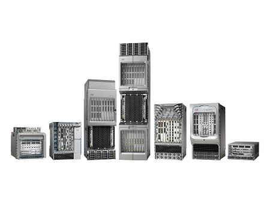

<!-- 11.4.1 -->
## Требования к маршрутизатору

Коммутаторы — не единственный компонент сети, обладающий различными функциями. Выбор маршрутизатора — еще одно очень важное решение. Маршрутизаторы играют важную роль в организации сети, обеспечивая доступ к Интернету из домов и офисов, связывая несколько сайтов в корпоративной сети, предоставляя резервные пути и соединяя интернет-провайдеров. Кроме того, маршрутизаторы могут служить преобразователями между средами и протоколами разного типа. Например, маршрутизатор может принимать пакеты из Ethernet-сети и повторно инкапсулировать их для транспортировки по последовательной сети.

Маршрутизаторы используют сетевую часть (префикс) IP-адреса назначения, чтобы направить пакеты адресатом. Они выбирают альтернативный путь, если канал не работает. IP-адрес интерфейса локального маршрутизатора задается в IP-конфигурации для всех узлов локальной сети. Интерфейс маршрутизатора — это шлюз по умолчанию. Эффективная маршрутизация и восстановление после отказов сетевых каналов исключительно важны для доставки пакетов по месту назначения.

Маршрутизаторы выполняют и другие полезные функции:

* сдерживают широковещательные рассылки, ограничивая их до локальной сети;
* соединяют географически удаленные места;
* логически группируют пользователей с общими потребностями и необходимостью в доступе к одним и тем же ресурсам;
* обеспечивают повышенную безопасность, фильтруя нежелательный трафик через списки контроля доступа.

<!-- 11.4.2 -->
## Маршрутизаторы Cisco

По мере расширения сети важно выбирать маршрутизаторы, соответствующие ее требованиям. Существуют различные категории маршрутизаторов Cisco.

**Маршрутизаторы филиала**

Маршрутизаторы для филиалов, как показано на рисунке, оптимизируют сервисы на базе единой платформы, обеспечивая оптимальное взаимодействие с приложениями в инфраструктурах филиала и глобальной сети. Круглосуточная работоспособность сетей обеспечивает максимальную доступность сервисов для филиала. Сети с высоким уровнем доступности должны обеспечивать быстрое восстановление после типичных сбоев, одновременно с этим минимизируя или полностью устраняя влияние на работу сервисов, и предоставлять простые средства для настройки и администрирования сети. Показаны маршрутизаторы Cisco Integrated Services Router (ISR) серии 4000.

<!--
The figure displays seven branch routers.
-->

**Граничные маршрутизаторы сети**

Граничные маршрутизаторы сети позволяют организовать на периметре работу высокопроизводительных, безопасных и надежных сервисов для объединения кампусных сетей, сетей ЦОД и сетей филиалов. Современные клиенты рассчитывают на безупречное качество работы технологий мультимедиа и хотят использовать самые разные типы контента. Клиенты хотят интерактивности, персонализации, возможности использовать мобильные устройства и контроля над содержанием. Кроме того, им нужен доступ к контенту в любое время, в любом месте и с любого устройства — дома, на работе или в дороге. Граничные маршрутизаторы сети должны обеспечивать высокое качество сервисов, бесперебойную видеосвязь и работу мобильных приложений. На рисунке показаны маршрутизаторы Cisco Aggregation Services Routers (ASR) серии 9000.

<!--
The figure displays seven network edge routers.
-->

**Маршрутизаторы операторов связи**

Маршрутизаторы провайдеров, показанные на рисунке, предоставляют комплексные масштабируемые решения и услуги, поддерживаемые абонентами. Операторы должны оптимизировать свою работу, сократить расходы и повысить масштабируемость и гибкость, чтобы обеспечить доступ к интернет-технологиям нового поколения для всех устройств, независимо от местоположения. Такие системы призваны упростить и улучшить работу и развертывание сетей предоставления услуг. На рисунке показаны маршрутизаторы Cisco Network Convergence System серии 6000.

<!-- /courses/ensa-dl/ae8eb394-34fd-11eb-ba19-f1886492e0e4/aeb638c4-34fd-11eb-ba19-f1886492e0e4/assets/c6da1190-1c46-11ea-af56-e368b99e9723.svg -->

<!--
На рисунке показан маршрутизатор поставщика услуг с открытой и закрытой дверью.
-->

**Промышленные решения**

Промышленные маршрутизаторы обеспечивают функции корпоративного класса в жестких и суровых условиях. Их компактная, модульная, прочная конструкция отлично подходит для критически важных приложений. На рисунке показаны маршрутизаторы промышленного класса с интегрированными сервисами Cisco серии 1100.

<!--
The figure displays Cisco 1100 Series Industrial Integrated Services routers.
-->

<!-- 11.4.3 -->
## Формфакторы маршрутизатора

Как и коммутаторы, маршрутизаторы доступны в различных формфакторах. Сетевые администраторы в корпоративной среде должны уметь работать с различными типами маршрутизаторов — от небольших настольных моделей до стоечных устройств и блейд-моделей.

**Cisco серии 900**
Это маршрутизатор небольшого филиала. Он сочетает в себе WAN, коммутацию, безопасность и расширенные возможности подключения в компактной платформе для малого и среднего бизнеса.

<!--
The figure displays a Cisco 900 series router.
-->

**ASR серии 9000 и 1000**

Эти маршрутизаторы обеспечивают плотность и отказоустойчивость с возможностью программирования для масштабируемой периферии сети.

<!--
The figure displays seven Cisco ASR 9000 and 1000 series aggregation service routers.
-->

**Серия 5500**

Эти маршрутизаторы предназначены для эффективного масштабирования между крупными центрами обработки данных и крупными корпоративными сетями, веб-сетями и сетями поставщиков услуг WAN и агрегации.

<!--
The figure displays Cisco Network Convergence System 5500 Series routers.
-->

**Cisco 800**

Компактный маршрутизатор, предназначенный для суровых условий эксплуатации.

<!--
The figure displays a Cisco 800 Industrial Integrated Services router.
-->

Маршрутизаторы также могут иметь фиксированную или модульную конфигурацию. Маршрутизаторы фиксированной конфигурации поставляются со встроенными интерфейсами. Модульные маршрутизаторы предлагаются с несколькими слотами, которые позволяют администратору менять интерфейсы маршрутизатора. Маршрутизаторы поставляются с разными интерфейсами, такими как Fast Ethernet, Gigabit Ethernet, последовательный и оптоволоконный.

Полный список маршрутизаторов Cisco можно найти на веб-сайте Cisco [www.cisco.com](http://www.cisco.com).

<!-- 11.4.4 -->
<!-- quiz -->

