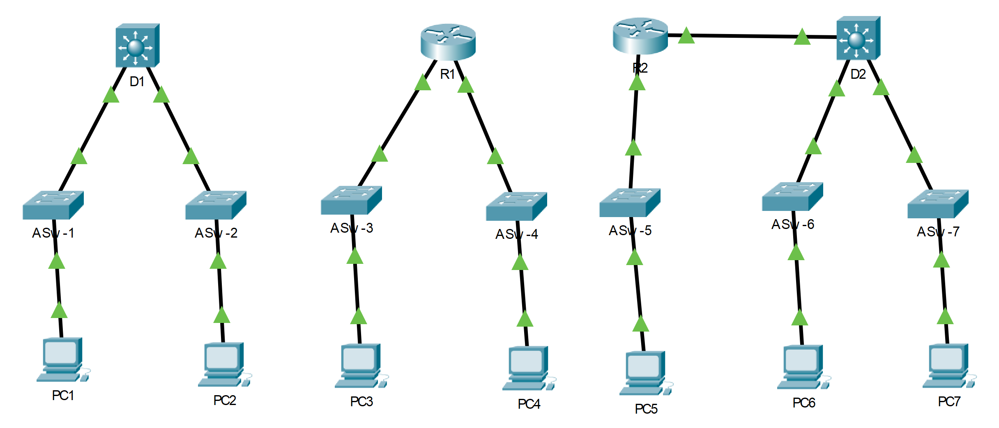

## Топология

## Задача

Часть 1. Сравнение коммутаторов 2-го и 3-го уровней

Часть 2. Сравнение коммутатора 3-го уровня и маршрутизатора

## Общие сведения

В рамках этого интерактивного задания вам предстоит использовать различные команды для проверки трех различных топологий коммутации, а также сравнить сходства и различия между коммутаторами 2960 и 3650. Помимо этого, вам предстоит сравнить таблицу маршрутизации маршрутизатора 4321 с аналогичной таблицей коммутатора 3650.

**Примечание** . Для получения дополнительных сведений о *коммутаторе уровня 3 WS-C3650-24PS-L* и маршрутизаторе *ISR 4321/K9* выполните поиск в Интернете.

## Инструкции

### Шаг 1. Сравните коммутаторы 2-го и 3-го уровней

1.  Изучите физические характеристики устройств **D1** и **ASw-1**.

    Вопросы:

    Сколько физических портов установлено в каждом отдельном коммутаторе?

    **Введите ваш ответ здесь.**

    Сколько портов Fast Ethernet и Gigabit Ethernet имеет каждый из коммутаторов?

    **Введите ваш ответ здесь.**

    Укажите скорость передачи данных на интерфейсах Fast Ethernet и Gigabit Ethernet каждого коммутатора.

    **Введите ваш ответ здесь.**

    Является ли какой-либо из коммутаторов модульным?

    **Введите ваш ответ здесь.**

2.  Порт коммутатора 3650 можно настроить в качестве интерфейса 3-го уровня посредством ввода команды **no switchport** в режиме конфигурации интерфейса. Это дает возможность специалистам назначать IP-адрес и маску подсети интерфейсу коммутатора аналогично настройке данных параметров на маршрутизаторе.

    Вопросы:

    В чем заключается различие между коммутатором 2-го уровня и коммутатором 3-го уровня?

    **Введите ваш ответ здесь.**

    В чем заключается различие между физическим интерфейсом коммутатора и интерфейсом VLAN?

    **Введите ваш ответ здесь.**

    На каких уровнях действуют коммутаторы 2960 и 3650?

    **Введите ваш ответ здесь.**

    Выполните команду **show run,** чтобы проверить настройки коммутаторов **D1** и **ASw-1.** Заметили ли вы между ними какие-либо различия?

    **Введите ваш ответ здесь.**

    Попробуйте отобразить таблицу маршрутизации на D1 и ASw-1 с помощью **show ip route**. Как вы думаете, почему команда не работает на **ASw-1** , но работает на **D1** ?

    **Введите ваш ответ здесь.**

### Шаг 2. Сравните коммутатор 3-го уровня с маршрутизатором

До недавнего времени коммутаторы и маршрутизаторы представляли собой устройства с разным набором функций. Термин «коммутатор» был зарезервирован за аппаратным устройством, которое функционирует на 2-м уровне. С другой стороны, маршрутизаторы представляют собой устройства, которые принимают решения о пересылке с учетом информации 3-го уровня. В них используются протоколы маршрутизации для обмена данными маршрутизации и связи с другими маршрутизаторами. Коммутаторы 3-го уровня, например 3650, могут быть настроены для пересылки пакетов на 3 уровне. Выполнение команды **ip routing** в режиме глобальной конфигурации позволяет использовать протоколы маршрутизации на коммутаторах 3-го уровня, что дает им некоторые возможности маршрутизатора. Хотя коммутаторы уровня 3 в некоторой степени похожи, они отличаются от маршрутизаторов во многих других аспектах.

1.  Откройте вкладку Physical на D1 и R1.

    Вопросы:

    Заметили ли вы какие-либо различия или сходства в этих таблицах? Замечаете ли вы какие-либо различия между этими двумя устройствами?

    **Введите ваш ответ здесь.**

    Выполните команду **show run,** чтобы проверить настройки R1 и D1. Заметили ли вы какие-либо различия или сходства в настройках этих коммутаторов?

    **Введите ваш ответ здесь.**

    С помощью какой команды можно назначить IP-адрес на одном из физических интерфейсов D1?

    **Введите ваш ответ здесь.**

    Выполните команду **show ip route** на обоих устройствах. Заметили ли вы какие-либо различия или сходства в этих таблицах?

    **Введите ваш ответ здесь.**

    Теперь проанализируйте таблицы маршрутизации R2 и D2. Что присутствует сейчас, чего не было в конфигурации R1 и D1?

    **Введите ваш ответ здесь.**

    Какая сеть находится в таблице маршрутизации D2, которая была извлечена из R2?

    **Введите ваш ответ здесь.**

2.  Проверьте, является ли каждая топология полностью связанной, выполнив следующие тесты:

    -   Отправьте эхо-запрос с **PC1** на **PC2**

    -   Отправьте эхо-запрос с **PC3** на **PC4**

    -   Эхо-запрос с **PC5** на **PC6** и **PC7**

    В каждом из трех примеров компьютеры находятся в разных сетях.

    Вопросы:

    Какое устройство используется для обеспечения связи между сетями?

    **Введите ваш ответ здесь.**

    Почему отправка эхо-запросов через сети была успешной, несмотря на отсутствие маршрутизаторов в сетях?

    **Введите ваш ответ здесь.**

    **Бонусный вопрос:** Мы говорим, что маршрутизаторы - это устройства уровня 3, а обычные (не уровня 3) коммутаторы - устройства уровня 2. Однако мы можем назначить IP-адрес интерфейсу управления (SVI) коммутатора уровня 2. Как это возможно, если коммутаторы являются устройствами уровня 2?

    **Введите ваш ответ здесь.**

[Скачать файл Packet Tracer для локального запуска](./assets/11.5.1-packet-tracer---compare-layer-2-and-layer-3-devices_ru-RU.pka)
