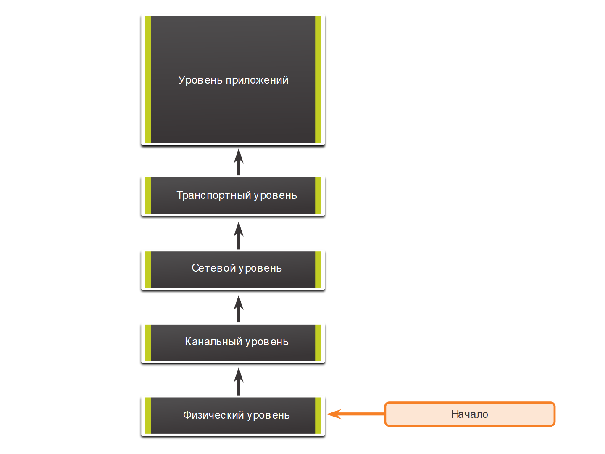
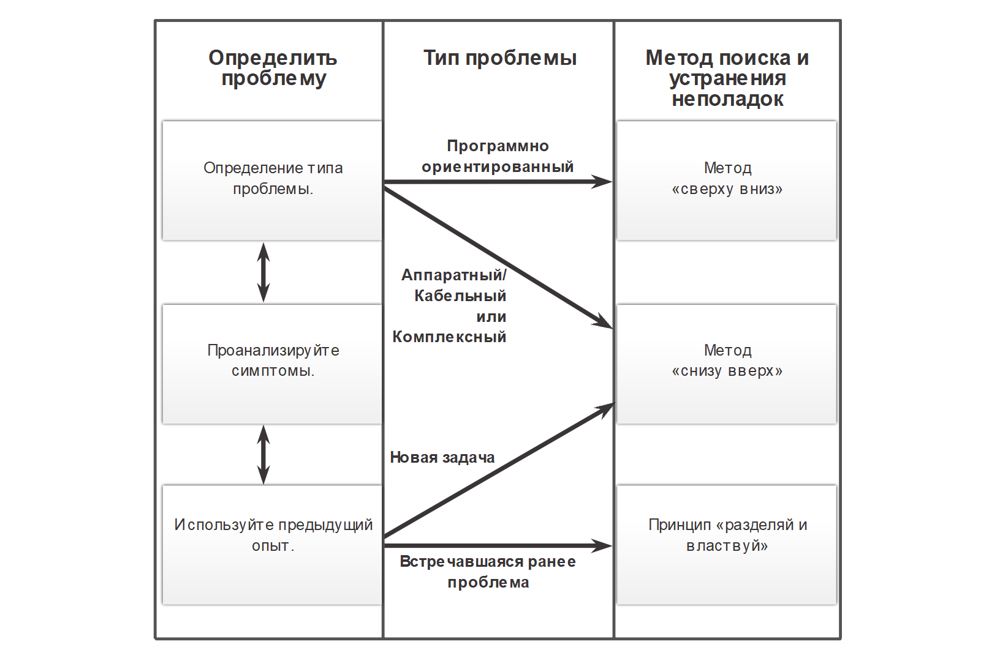

<!-- 12.2.1 -->
## Общие процедуры поиска и устранения неполадок

Устранение неполадок может занять много времени, поскольку сети, проблемы и опыт устранения неполадок бывают разными. Однако опытные администраторы знают, что  структурированный метод сократит общее время устранения неполадок.

Поэтому процесс должен быть ориентирован на структурированные методы. Это требует четко определенных и документированных процедур устранения неполадок, чтобы свести к минимуму траты времени, связанные с нерегулярным поиском и устранением ошибок. Однако эти методы не статичны. Действия, предпринятые для решения проблемы, не всегда одинаковые и выполняются в разном порядке.

Существует несколько процессов устранения неполадок, которые могут решить проблему. На рисунке показана логическая схема упрощенного трехэтапного процесса устранения неполадок. Тем не менее более подробный процесс может быть полезнее для решения сетевой проблемы.

<!-- /courses/ensa-dl/ae8eb396-34fd-11eb-ba19-f1886492e0e4/aeb638cc-34fd-11eb-ba19-f1886492e0e4/assets/c6eab362-1c46-11ea-af56-e368b99e9723.svg -->

<!-- 12.2.2 -->
## Семиэтапный процесс устранения неисправностей

На рисунке показан более подробный семиэтапный процесс устранения неполадок. Обратите внимание, как некоторые шаги взаимосвязаны. Это связано с тем, что некоторые технические специалисты могут переходить между этапами в зависимости от их уровня опыта.

<!-- /courses/ensa-dl/ae8eb396-34fd-11eb-ba19-f1886492e0e4/aeb638cc-34fd-11eb-ba19-f1886492e0e4/assets/c6eb2890-1c46-11ea-af56-e368b99e9723.svg -->

**Определить проблему**

Цель этого этапа — убедиться в наличии проблемы и правильно ее определить. Проблемы обычно определяются симптомом (например, сеть работает медленно или перестала работать). Симптомы могут отображаться в разном виде (предупреждения из системы управления сетями, консольные сообщения и жалобы пользователей).

В ходе сбора данных о симптомах важно, чтобы сетевой администратор задавал вопросы и расследовал проблему, чтобы ее локализовать до более узкого круга возможных причин появления. Например, распространяется ли проблема на одно устройство, группу, подсеть или всю сеть устройств?

В организациях проблемы обычно назначаются сетевым специалистам в качестве заявок на устранение неполадки. Их создают с помощью ПО для регистрации неисправностей, которое отслеживает ход выполнения каждой заявки. Программное обеспечение для устранения неполадок может также включать портал самообслуживания для отправки заявок, доступ к базе знаний о неисправностях с возможностью поиска, возможности удаленного управления для решения проблем конечных пользователей и многое другое.

**Сбор информации**

На этом этапе необходимо определить цели (т.е. хосты, устройства), подлежащие исследованию, получить доступ к оконечным устройствам и собрать информацию. Технический специалист может собирать и документировать больше симптомов в зависимости от выявленных характеристик.

Если проблема выходит за границы области контроля организации (например потеря связи через Интернет за пределами автономной системы), обратитесь к администратору внешней системы до сбора информации о других симптомах.

**Анализ информации**

Нужно определить возможные причины. Собранная информация интерпретируется и анализируется с помощью сетевой документации, базовых показателей сети, поиска организационных баз знаний, поиска в Интернете и общения с другими техниками.

**Устранение возможных причин**

Если выявлено несколько причин, то перечень нужно сократить, постепенного устраняя возможные причины, чтобы в конечном итоге определить наиболее вероятную. Опыт устранения неполадок чрезвычайно важен, чтобы быстро устранить причины и выявить наиболее вероятные.

**Предложить гипотезу**

Когда выявлена наиболее вероятная причина, необходимо сформулировать решение. На этом этапе опыт устранения неполадок очень полезен при разработке плана.

**Проверка гипотезы**

Перед тестированием решения важно оценить влияние и актуальность проблемы. Например, может ли решение оказать негативное воздействие на другие системы или процессы? Уровень серьезности проблемы всегда следует соотносить со степенью влияния решения. Например, если критически важный сервер или маршрутизатор необходимо выключить на длительное время, то реализацию исправления лучше отложить на конец рабочего дня. В ряде случаев до разрешения фактической проблемы можно применить обходное или временное решение.

Создайте план отката, определяющий, как быстро можно отменить решение. Это может оказаться необходимым в случае если решение не привело к успеху.

Реализовать решение и убедиться, что оно решило проблему. Иногда решение создает неожиданную проблему. Поэтому важно, чтобы решение было тщательно проверено, прежде чем перейти к следующему шагу.

Если решить проблему не удается, попытка документируется, а изменения удаляются. Специалист должен вернуться к этапу сбора информации и изолировать проблему.

**Решение проблемы**

Для устранения проблем следует общаться с пользователями и любыми сотрудниками, принимающими участие в процессе поиска и устранения неполадок. Информацию о разрабатываемом решении должны получить другие сотрудники отдела IT. Оформленная документация о причине проблемы и способе ее устранения позволит другим техническим специалистам предотвращать либо устранять похожие проблемы в будущем.

<!-- 12.2.3 -->
## Опрос конечных пользователей.

Многие проблемы в сети изначально сообщаются конечным пользователем. Однако представленная информация зачастую расплывчатая или вводящая в заблуждение. Например, пользователи часто сообщают о проблемах, таких как «сеть упала», «я не могу получить доступ к электронной почте» или «мой компьютер работает медленно».

В большинстве случаев для полного понимания проблемы требуется дополнительная информация. Обычно это предполагает взаимодействие с затронутым пользователем, чтобы ответить на вопросы «кто», «что» и «когда».

При общении с пользователем следует использовать следующие рекомендации:

* говорите с пользователями на понятном ему языке;
* всегда слушайте или внимательно читайте, что говорит пользователь, заметки могут быть полезны при документировании сложной проблемы;
* всегда будьте внимательны и сопереживайте пользователям, давая им знать, что вы поможете решить проблему. Пользователи, сообщающие о проблеме, могут быть в стрессе и стремиться решить проблему как можно быстрее.

Во время общения с пользователем, направляйте разговор и используйте эффективные методы опроса, чтобы быстро выяснить проблему. Например, используйте открытые вопросы (т.е. требующие подробного ответа) и закрытые вопросы (т.е. да, нет или ответы на одно слово), чтобы обнаружить важные факты о сетевой проблеме.

В таблице на рисунке приведены несколько рекомендаций, а также примеры вопросов для конечных пользователей.

После общения с пользователем, повторите свое понимание проблемы пользователю, чтобы убедиться, что вы оба согласны с проблемой, о которой сообщается.

| **Рекомендации** | **Примеры вопросов конечному пользователю** |
| --- | --- |
| Задайте усемтные вопросы. | <ul><li>Что не работает?</li><li>В чем именно проблема?</li><li>Чего вы пытаетесь добиться? </li></ul> |
| Определите масштаб проблемы. | <ul><li>На кого влияет эта проблема? Это только вы или другие?</li><li>Какое устройство повержено?</li></ul> |
| Определите, когда возникла проблема. | <ul><li>Когда именно возникает проблема?</li><li>Когда впервые была обнаружена проблема? </li><li>Были ли выведены сообщения об ошибках?</li></ul> |
| Определите, является ли проблема постоянной или прерывистой. | <ul><li>Можете ли вы воспроизвести проблему? </li><li>Можете ли вы отправить мне скриншот или видео проблемы?</li></ul> |
| Определите, менялось ли что-то. | Что изменилось с тех пор, когда все еще нормально работало? |
| Используйте каждый вопрос в качестве средства исключения или обнаружения возможных проблем. | <ul><li>Что работает?</li><li>Что не работает?</li></ul> |

<!-- 12.2.4 -->
## Сбор информации

Чтобы собрать симптомы от подозрительного сетевого устройства, используйте команды Cisco IOS и другие инструменты, такие как захват пакетов и журналы устройства.

В таблице  указаны наиболее распространенные команды ОС IOS Cisco, используемые для сбора данных о симптомах сетевых проблем.

| **Команда** | **Описание** |
| --- | --- |
| `ping {host \| ip-address}` | <ul><li>Позволяет послать пакет ping-запроса по адресу и ожидать ответ.</li><li>Переменная _host_ или _ip-address_ — это IP-псевдоним или IP-адрес целевой системы. IP-адрес целевой системы</li></ul> |
| `traceroute destination` | <ul><li>Позволяет определить путь передачи пакета по сетям.</li><li>Переменная _destination_ — это имя хоста или IP-адрес целевой системы. целевая система</li></ul> |
| `telnet {host \| ip-address}` | <ul><li>Позволяет подключиться к IP-адресу с помощью приложения Telnet.</li><li>По возможности используйте SSH вместо Telnet</li></ul> |
| `ssh -l user-id ip-address` | <ul><li>Подключение к IP-адресу по протоколу SSH.</li><li>SSH более безопасное, чем Telnet</li></ul> |
| `show ip interface brief ` `show ipv6 interface brief` | <ul><li>Отображает сводный статус всех интерфейсов на устройстве</li><li>Полезно для быстрой идентификации IP-адресации на всех интерфейсах.</li></ul> |
| `show ip route` `show ipv6 route` | Позволяет отобразить текущие таблицы маршрутизации IPv4 и IPv6, в которых указаны маршруты ко всем известным сетевым пунктам назначения. |
| `show protocols` | Отображает настроенные протоколы и показывает общее и специфичное для интерфейса состояние любого настроенного протокола уровня 3 |
| `debug` | Отображает список параметров для включения или отключения событий отладки. |

**Примечание:** Несмотря на то что команда **debug** — важное средство сбора данных о симптомах, она создает большой объем трафика консольных сообщений, существенно снижая производительность сетевого устройства. Если команду **debug** необходимо выполнить в обычное рабочее время, предупредите пользователей сети о планируемых процедурах по поиску и устранению неполадок, а также о возможном снижении производительности сети. По окончании процедуры не забудьте отключить режим отладки.

<!-- 12.2.5 -->
## Устранение неполадок с использованием Уровневой модели

Такие многоуровневые модели можно применять к физической сети для изоляции сетевых проблем при поиске и устранении неполадок. Например, если все признаки указывают на проблему с физическим подключением, то сетевой специалист может сосредоточиться на устранении неполадок на канале, который работает на физическом уровне.

На рисунке показаны некоторые общие устройства и уровни модели OSI, которые необходимо анализировать при поиске и устранении неполадок для устройства.

<!-- /courses/ensa-dl/ae8eb396-34fd-11eb-ba19-f1886492e0e4/aeb638cc-34fd-11eb-ba19-f1886492e0e4/assets/c6ec8820-1c46-11ea-af56-e368b99e9723.svg -->

Следует отметить, что маршрутизаторы и многоуровневые коммутаторы показаны на уровне 4 (транспортный уровень). Хотя маршрутизаторы и многоуровневые коммутаторы обычно принимают решения о перенаправлении данных на уровне 3, списки контроля доступа на этих устройствах можно использовать для принятия решений о фильтрации с помощью информации уровня 4.

<!-- 12.2.6 -->
## Структурированные методы устранения неполадок

Существует несколько структурированных подходов к устранению неполадок, которые могут быть использованы. Их выбор зависит от ситуации. У каждого свои достоинства и недостатки. В этом разделе описываются три метода и содержатся рекомендации по выбору наилучшего для конкретной ситуации.

**Снизу вверх**

При поиске и устранении неполадок с помощью метода «снизу вверх» следует начинать с физических компонентов сети и перемещаться вверх через уровни модели OSI, пока не определится причина проблемы, как показано на рисунке.

Метод «снизу вверх» хорошо подходит, когда предполагается, что проблема находится на физическом уровне. Большинство сетевых проблем находятся на нижних уровнях, поэтому реализация метода «снизу вверх» во многих случаях довольно эффективна.

Недостаток метода «снизу вверх» в необходимости проверять каждое устройство и интерфейс в сети, пока не найдется возможная причина проблемы. Следует помнить, что каждое заключение и каждую возможность необходимо документировать, поэтому при выполнении этого метода может появиться много работы с бумажными документами. Другой потенциальный недостаток — необходимость определять устройства, с которых нужно начать анализ.

<!-- /courses/ensa-dl/ae8eb396-34fd-11eb-ba19-f1886492e0e4/aeb638cc-34fd-11eb-ba19-f1886492e0e4/assets/c6ed2465-1c46-11ea-af56-e368b99e9723.svg -->

**Сверху вниз**

На рисунке поиск и устранение неполадок «сверху вниз» начинается с приложений для конечных пользователей и перемещается вниз через уровни модели OSI, пока не определится причина проблемы.

Сперва тестируются приложения конечных пользователей в оконечных системах, затем процесс затрагивает более конкретные участки сети. Этот метод можно использовать для устранения простых проблем или когда предполагается, что проблема связана с некоторым элементом программного обеспечения.

Недостаток метода «сверху вниз» в необходимости проверять каждое сетевое приложение, пока не найдется причина проблемы. Каждое заключение и возможность необходимо документировать Другой потенциальный недостаток — необходимость определения приложения, с которогонужно начать анализ.

<!-- /courses/ensa-dl/ae8eb396-34fd-11eb-ba19-f1886492e0e4/aeb638cc-34fd-11eb-ba19-f1886492e0e4/assets/c6ed7283-1c46-11ea-af56-e368b99e9723.svg -->

**Принцип «разделяй и властвуй»**

На рисунке показан метод «деления пополам» для поиска и устранения сетевых проблем.

Сетевой администратор выбирает уровень и начинает тестирование в обоих направлениях от него.

В случае применения метода «деления пополам» сначала следует ознакомиться с накопленным опытом устранения аналогичных проблем, затем задокументировать симптомы, а потом на основе полученной информации сделать квалифицированное предположение об уровне OSI, с которого нужно начать свой анализ. Когда будет установлено, что этот уровень функционирует нормально, можно будет предположить, что уровни, расположенные ниже, также функционируют нормально. Администратор может перемещаться вверх по уровням OSI. Если уровень взаимодействия открытых систем (OSI) функционирует неправильно, администратор может перемещаться вниз по уровням OSI.

Например, если пользователи не могут получить доступ к веб-серверу, но могут отправлять эхо-запросы на сервер, проблема находится выше уровня 3. Если попытка отправки эхо-запроса на сервер завершается сбоем, проблема предположительно находится на более низком уровне OSI.

<!-- /courses/ensa-dl/ae8eb396-34fd-11eb-ba19-f1886492e0e4/aeb638cc-34fd-11eb-ba19-f1886492e0e4/assets/c6edc0a2-1c46-11ea-af56-e368b99e9723.svg -->

**Последовательный путь (Follow-the-Path)**

Это один из основных методов устранения неполадок. Подход сначала обнаруживает фактический путь трафика на всем пути от источника к месту назначения. Область устранения неполадок сводится только к каналам и устройствам, которые находятся на пути пересылки. Цель — устранить каналы и устройства, которые не имеют отношения к задаче устранения неполадок. Этот подход обычно дополняет один из других подходов.

**Замена**

Этот подход также называется замена компонентов (swap-the-component), потому что вы физически заменяете проблемное устройство на гарантированное рабочее. Если проблема исправляется, администратор сети убеждается, что причина внутри извлеченного устройства. Если проблема сохраняется, причину следует искать в другом месте.

В некоторых случаях это может быть идеальным способом быстрого устранения проблем, например, если наиболее важный компонент (единая точка отказа), предположим,  пограничный маршрутизатор, выходит из строя. В данном случае важнее просто заменить устройство и восстановить нормальную работу, чем устранить неполадки в работе устройства.

Если проблема находится в нескольких устройствах, возможно, не удастся правильно изолировать проблему.

**Сравнение**

Этот подход также называется подходом, основанным на различиях. Он заключается в замене нерабочих элементов, чтобы они соответствовали рабочим. Вы сравниваете конфигурации, версии программного обеспечения, оборудование или другие свойства устройства, связи или процессы между рабочими и нерабочими ситуациями и обнаруживаете существенные различия между ними.

Применение данного метода может дать нужное решение, но без четкого выявления причины проблемы.

**Угадай если умный**

Этот подход также называется подходом к поиску и устранению неисправностей от бедра. Это менее структурированный метод устранения неполадок, который использует  предположение, основанное на симптомах проблемы. Успех этого метода зависит от опыта и возможностей устранения неполадок. Опытные специалисты добиваются большего успеха, поскольку они могут полагаться на свои обширные знания и опыт для решительной изоляции и решения сетевых проблем. Если у сетевого администратора не хватает опыта, этот метод превращается в метод проб и ошибок и походит на случайный поиск неполадок.

<!-- 12.2.7 -->
## Указания по выбору метода для поиска и устранения неполадок

Для быстрого устранения сетевых проблем найдите время, чтобы выбрать наиболее эффективный метод отладки сети.

На рисунке показано, какой метод может быть использован при обнаружении определенного типа проблемы.

<!-- /courses/ensa-dl/ae8eb396-34fd-11eb-ba19-f1886492e0e4/aeb638cc-34fd-11eb-ba19-f1886492e0e4/assets/c6ee83f2-1c46-11ea-af56-e368b99e9723.svg -->

Например, проблемы программного обеспечения часто решаются с помощью подхода «сверху вниз», а аппаратные проблемы решаются «снизу вверх». Новые проблемы может решить опытный технический специалист по методу «разделяй и властвуй». В противном случае можно использовать подход «снизу вверх».

Устранение неполадок — это навык, который развивается в процессе. Каждая сетевая проблема, которую вы идентифицируете и решаете, добавляется в ваш набор навыков.

<!-- 12.2.8 -->
<!-- quiz -->

