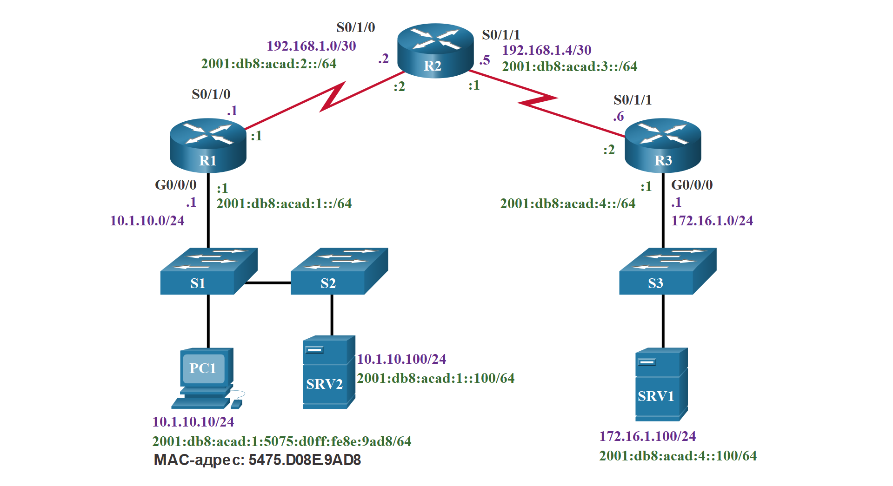
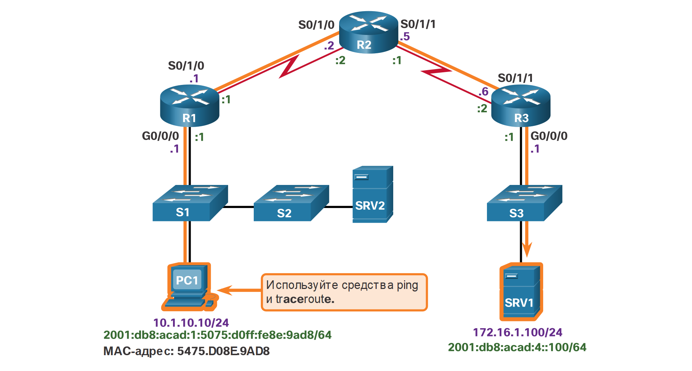
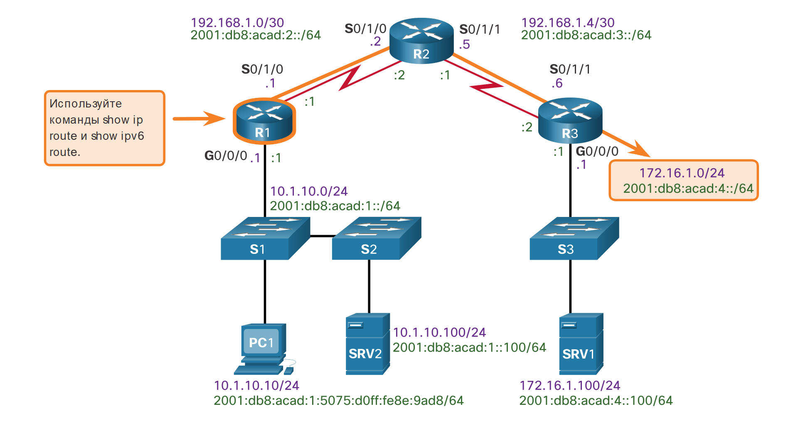
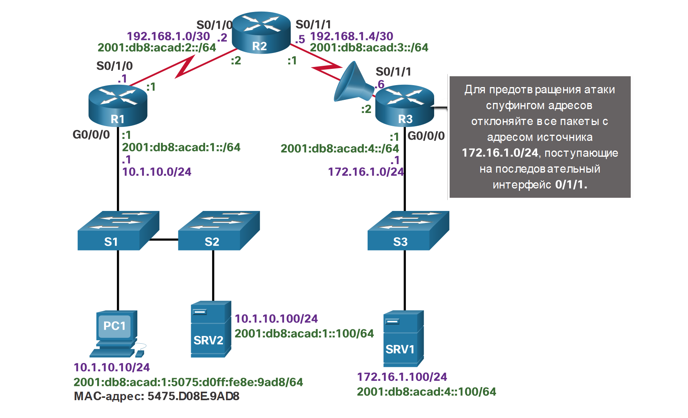

<!-- 12.5.1 -->
## Компоненты сквозного поиска и устранения неполадок

В этом разделе представлена единая топология и инструменты для диагностики и в некоторых случаях решения проблем сквозного подключения. Диагностика и устранение проблем — одна из главных задач сетевых администраторов. Единого рецепта устранения неполадок не существует, для диагностики конкретной проблемы можно использовать различные способы. Однако благодаря структурированному подходу к устранению неполадок администратор может быстрее справиться с задачей.

В рамках этой темы используется следующая ситуация. Клиентский компьютер ПК 1 не может осуществить доступ к приложениям на сервере SRV1 или SRV2. На рисунке показана топология этой сети. ПК 1 использует SLAAC с EUI-64 для создания собственного глобального индивидуального IPv6-адреса. Для создания идентификатора интерфейса EUI-64 использует MAC-адрес Ethernet, вставляет значение FFFE в среднюю часть и переключает седьмой бит.


<!-- /courses/ensa-dl/ae8eb396-34fd-11eb-ba19-f1886492e0e4/aeb65fd2-34fd-11eb-ba19-f1886492e0e4/assets/c6fe8981-1c46-11ea-af56-e368b99e9723.svg -->

Если отсутствует сквозная связь, и администратор выбирает для отладки способ «снизу вверх», он может выполнить следующие шаги:

**Шаг 1.** Проверить физическую связь в точке, где прекращается обмен данными. Проблема может быть связана с неисправным кабелем или интерфейсом, либо с неправильно настроенным или неисправным оборудованием.  
**Шаг 2.** Проверить наличие несогласованных параметров дуплексной связи.  
**Шаг 3.** Проверить адресацию на канальном и сетевом уровне в локальной сети. Сюда относятся таблицы ARP IPv4, таблицы соседних устройств IPv6, таблицы MAC-адресов и назначения VLAN.  
**Шаг 4.** Убедиться, что выбран правильный шлюз по умолчанию.  
**Шаг 5.** Убедиться, что устройства определяют правильный путь от источника к пункту назначения. При необходимости можно изменить информацию о маршрутизации.   
**Шаг 6.** Убедиться, что транспортный уровень работает правильно. Для проверки подключений на транспортном уровне с помощью командной строки также можно использовать Telnet.  
**Шаг 7.** Убедиться, что ни один из списков ACL не блокирует трафик.  
**Шаг 8.** Убедиться, что параметры DNS правильные. Сервер DNS должен быть доступен.

В результате установится работающая связь между конечными устройствами. Если проблему устранить не удалось, администратор сети может повторить указанные выше шаги или передать проблему старшему администратору.

<!-- 12.5.2 -->
## Проблема со связью между конечными устройствами приводит к поиску и устранению неполадок

Обычно работа по поиску и устранению неполадок инициируется фактом обнаружения проблемы со связью между конечными устройствами. Две наиболее распространенные служебные программы для проверки наличия таких неполадок — **ping** и **traceroute**, как показано на рисунке.


<!-- /courses/ensa-dl/ae8eb396-34fd-11eb-ba19-f1886492e0e4/aeb65fd2-34fd-11eb-ba19-f1886492e0e4/assets/c6ff25c0-1c46-11ea-af56-e368b99e9723.svg -->

**IPv4 ping**

Ping — самая известная служебная программа для проверки связи в сетях. Она всегда входит в состав ПО IOS Cisco. Команда позволяет отправлять запросы для получения отклика с указанного адреса компьютера. **Ping** использует протокол уровня 3 (ICMP), который входит в стек протоколов TCP/IP. Ping использует пакеты эхо-запроса ICMP и эхо-ответа ICMP. Если хост с указанным адресом получает эхо-запрос ICMP, он отправляет в виде отклика пакет эхо-ответа ICMP. ICMP можно использовать для проверки связи как для IPv4, так и для IPv6. На выводе показано успешное выполнение команды ping с ПК1 на SRV1 по адресу 172.16.1.100.

```
C:\ > ping  172.16.1.100
Pinging 172.16.1.100 with 32 bytes of data: 
Reply from 172.16.1.100: bytes=32 time=199ms TTL=128
Reply from 172.16.1.100: bytes=32 time=199ms TTL=128
Reply from 172.16.1.100: bytes=32 time=199ms TTL=128
Reply from 172.16.1.100: bytes=32 time=199ms TTL=128
Ping statistics for 172.16.1.100:
    Packets: Sent = 4, Received = 4, Lost = 0 (0 % loss),
Approximate round trip times in milli-seconds:
    Minimum = 193ms, Maximum = 199ms, Average = 195ms 
C:\ >
```

**IPv4 traceroute**

Как и **ping** команда, команда Cisco IOS **traceroute** может использоваться как для IPv4, так и для IPv6. Команда **tracert** используется в среде операционной системы Windows. При трассировке создается список переходов, IP-адреса маршрутизаторов и IP-адрес конечного пункта назначения, которые были успешно достигнуты при прохождении пути. Этот список предоставляет важные данные для проверки и устранения неисправностей. Если данные достигают адресата, то в результате трассировки будет выведен список интерфейсов каждого маршрутизатора на пути. Если при передаче данных произошел сбой на любом из переходов пути, то становится известен адрес последнего маршрутизатора, от которого был получен отклик трассировки. Этот адрес указывает местоположение проблемы или ограничений безопасности.

Команда **tracert** показывает путь следования пакетов IPv4 к каждому пункту назначения.

```
C:\ > tracert  172.16.1.100
Tracing route to 172.16.1.100 over a maximum of 30 hops: 
  1 1 ms <1 ms <1 ms 10.1.10.1 
  2 2 ms 2 ms 1 ms 192.168.1.2 
  3 2 ms 2 ms 1 ms 192.168.1.6 
  4 2 ms 2 ms 1 ms 172.16.1.100 
Trace complete.
C:\ >
```

**IPv6 ping и traceroute**

При использовании этих служебных программ ПО IOS Cisco определяет тип адреса (IPv4 или IPv6) и использует соответствующий протокол для проверки связи. Выходные данные команды показывают **ping** и **traceroute** на маршрутизаторе R1, используемые для проверки подключения IPv6. 

```
R1# ping 2001:db8:acad:4::100 
Type escape sequence to abort.
Sending 5, 100-byte ICMP Echos to 2001:DB8:ACAD:4::100, timeout is 2 seconds: 
!!!!!
Success rate is 100 percent (5/5), round-trip min/avg/max = 56/56/56 ms 
R1#
R1# traceroute 2001:db8:acad:4::100 
Type escape sequence to abort.
Tracing the route to 2001:DB8:ACAD:4::100
1.   2001:DB8:ACAD:2::2 20 msec 20 msec 20 msec 
2.   2001:DB8:ACAD:3::2 44 msec 40 msec 40 msec  
R1#
```

**Примечание:** Команду **traceroute** обычно выполняют, когда команда **ping** терпит неудачу. Если команда **ping** выполняется успешно, команда **traceroute** обычно не требуется, потому что уже ясно, что подключение работает.

<!-- 12.5.3 -->
## Шаг 1. Проверка физического уровня

Все сетевые устройства представляют собой специальные компьютерные системы. Они содержат как минимум ЦП, ОЗУ и область памяти для хранения данных, которые позволяют загружать и обеспечивать функционирование операционной системы и интерфейсов. Это позволяет получать и передавать трафик. Если администратор обнаруживает проблему в определенном устройстве и устанавливает, что проблема может быть связана с оборудованием, в первую очередь рекомендуется проверить работу стандартных компонентов. Наиболее часто используемые команды Cisco IOS: **show processes cpu**, **show memory** и **show interfaces**. В этом разделе рассматривается команда **show interfaces**.

Если при поиске и устранении неполадок производительности предположительно неисправными оказывается оборудование, то для проверки интерфейсов, через которые проходит трафик, можно использовать команду **show interfaces**.

См. выходные данные команды **show interfaces**.

```
R1# show interfaces GigabitEthernet 0/0/0
GigabitEthernet0/0/0 is up, line protocol is up 
Hardware is CN Gigabit Ethernet, address is d48c.b5ce.a0c0(bia d48c.b5ce.a0c0) 
Internet address is 10.1.10.1/24 
(Output omitted)
Input queue: 0/75/0/0 (size/max/drops/flushes); Total output drops: 0
Queueing strategy: fifo 
 Output queue: 0/40 (size/max) 
5 minute input rate 0 bits/sec, 0 packets/sec 
5 minute output rate 0 bits/sec, 0 packets/sec 
85 packets input, 7711 bytes, 0 no buffer 
Received 25 broadcasts (0 IP multicasts)
0 runts, 0 giants, 0 throttles
0 input errors, 0 CRC, 0 frame, 0 overrun, 0 ignored 
0 watchdog, 5 multicast, 0 pause input 
10112 packets output, 922864 bytes, 0 underruns 
0 output errors, 0 collisions, l interface resets 
11 unknown protocol drops 
0 babbles, 0 late collision, 0 deferred 
0 lost carrier, 0 no carrier, 0 pause output 
0 output buffer failures, 0 output buffers swapped out 
R1#
```

**Пакеты, удаленные из входной очереди**

Потери во входных очередях (и соответствующие счетчики проигнорированных и пропущенных пакетов) означают, что в когда-то на маршрутизатор поступило больше трафика, чем он способен обработать. Это не обязательно указывает на наличие проблемы. Ситуация может быть нормальной во время пиков трафика. Однако это может значить, что ЦП не может своевременно обрабатывать пакеты, поэтому, если это значение довольно большое, рекомендуется определить интервалы времени, когда эти счетчики увеличивают свои показания, а также каким образом это влияет на коэффициент использования ЦП.

**Пакеты, удаленные из выходной очереди**

Потери в выходных очередях показывают, что потеря пакетов произошла из-за затора на интерфейсе. Потери на выходе — нормальная ситуация для любой точки, где агрегированный входной трафик превышает выходной трафик. Во время пикового трафика пакеты удалятся, если трафик поступает на интерфейс быстрее, чем он может быть отправлен далее. Однако, даже если такая ситуация считается нормальной, она приведет к потере пакетов и к задержкам в очередях. Поэтому для приложений, зависящих от таких эффектов (например VoIP), могут возникать проблемы в виде снижения производительности. Постоянная ситуация с отбрасыванием исходящих пакетов может указывать на необходимость внедрения усовершенствованного механизма очередей, который сможет обеспечить реализацию или изменение качества обслуживания.

**Ошибки ввода**

Входные ошибки происходят при приеме кадра (например ошибки CRC). Большинство из них указывают на проблемы с кабелями, на интерфейсах или на ошибки дуплексного режима (в сетях на базе Ethernet).

**Ошибки вывода**

Выходные ошибки, например коллизии во время передачи кадров. В большинстве современных сетей на базе Ethernet полнодуплексная передача — норма, а режим полудуплексной передачи применяется крайне редко. В полнодуплексном режиме передачи коллизии операций происходить не могут. Поэтому сами коллизии, особенно поздние, часто указывают на проблемы несогласованности режима дуплекса.

<!-- 12.5.4 -->
## Шаг 2. Проверка несоответствия параметров дуплексного режима

Другая распространенная причина ошибок интерфейса — несогласованный режим дуплекса между обоими концами канала Ethernet. Во многих сетях на базе Ethernet соединения «точка-точка» — норма, а концентраторы и связанный с ними полудуплексный режим применяются редко. Значит, большинство каналов Ethernet работают в полнодуплексном режиме, и хотя раньше коллизии считались нормальным явлением в каналах Ethernet, теперь они часто указывают на сбой согласования параметров дуплекса, в результате чего канал работает в неправильном режиме.

В стандарте IEEE 802.3ab Gigabit Ethernet говорится об обязательном применении автоматического согласования скорости передачи данных и режима дуплекса. Хотя это не обязательно, практически все сетевые платы Fast Ethernet также используют автоматическое согласование по умолчанию. На практике рекомендуется использовать автоматическое согласование скорости передачи и режима дуплекса.

Однако если согласование режима дуплекса по какой-либо причине не выполняется, необходимо выбрать вручную скорость передачи данных и режим дуплекса на обоих концах канала. Обычно это означает установку полнодуплексного режима на обоих концах подключения. Если при этом связь не устанавливается, лучше установить полудуплексный режим на обоих концах, чем оставить несогласованный дуплексный режим.

Инструкции по настройке режима дуплекса:

* рекомендуется применять функцию автоматического согласования скорости и режима дуплекса;
* если автосогласование не работает, вручную установите скорость передачи и режим дуплекса на обоих концах канала;
* каналы Ethernet «точка-точка» всегда должны работать в полнодуплексном режиме;
* полудуплексный режим применяется редко, обычно только при использовании устаревших концентраторов.

**Пример устранения неисправностей**

В предыдущей ситуации администратору было необходимо добавить дополнительных пользователей в сеть. Для этого он установил второй коммутатор (S2) и подключил к нему первого пользователя. После добавления S2 в сеть пользователи, подключенные к обоим коммутаторам, начали испытывать существенные проблемы с производительностью с точки зрения связи с устройствами в другом коммутаторе, как показано на рисунке.


<!-- /courses/ensa-dl/ae8eb396-34fd-11eb-ba19-f1886492e0e4/aeb65fd2-34fd-11eb-ba19-f1886492e0e4/assets/c7003731-1c46-11ea-af56-e368b99e9723.svg -->

Сетевой администратор получает консольное сообщение на коммутаторе S2:

```
*Mar 1 00:45:08.756: %CDP-4-DUPLEX_MISMATCH: duplex mismatch discovered on FastEthernet0/20 (not half duplex), with Switch FastEthernet0/20 (half duplex).
```

С помощью команды **show interfaces fa 0/20** администратор проверяет интерфейс на S1, используемый для подключения к S2, и убеждается, что в нем установлен полнодуплексный режим, как показано на рисунке.

```
S1# show interface fa 0/20
FastEthernet0/20 is up, line protocol is up (connected) 
Hardware is Fast Ethernet, address is 0cd9.96e8.8a01 (bia 0cd9.96e8.8a01)
MTU 1500 bytes, BW 10000 Kbit/sec, DLY 1000 usec, reliability 255/255, txload 1/255, rxload 1/255 
Encapsulation ARPA, loopback not set Keepalive set (10 sec)
Full-duplex, Auto-speed, media type is 10/100BaseTX 
  
(Output omitted)
  
S1#
```

Затем администратор проверяет другую сторону подключения (порт на S2). На выводе показано, что на этой стороне установлен полудуплексный режим.

```
S2# show interface fa 0/20
FastEthernet0/20 is up, line protocol is up (connected) 
Hardware is Fast Ethernet, address is 0cd9.96d2.4001 (bia 0cd9.96d2.4001)
MTU 1500 bytes, BW 100000 Kbit/sec, DLY 100 usec, reliability 255/255, txload 1/255, rxload 1/255 
Encapsulation ARPA, loopback not set Keepalive set (10 sec)
Half-duplex, Auto-speed, media type is 10/100BaseTX 
  
(Output omitted)
  
S2(config)# interface fa 0/20 
S2(config-if)# duplex auto 
S2(config-if)#
```

Администратор выбирает для этого параметра значение **duplex auto** для автоматического согласования режима дуплекса. Так как для порта на коммутаторе S1 установлен полнодуплексный режим, на S2 используется он же.

Пользователи сообщают, что проблем с производительностью больше нет.

<!-- 12.5.5 -->
## Шаг 3. Проверка адресации в локальной сети

При диагностике проблем со сквозной связью полезно проверить сопоставления между IP-адресами назначения и адресами Ethernet на уровне 2 в отдельных сегментах. В IPv4 эту функцию выполняет протокол ARP. В IPv6 применяется процесс обнаружения соседних устройств и ICMPv6. Таблица соседних устройств кэширует IPv6-адреса и их разрешенные физические адреса Ethernet (MAC).

**Таблица ARP IPv4 для Windows**

Команда **arp** в Windows позволяет отображать и изменять записи в кэше ARP, используемые для хранения IPv4-адресов и их разрешенных физических адресов Ethernet (MAC). Как показано на рисунке, Windows-команда **arp** позволяет вывести список всех устройств, информация о которых находится в кэше ARP.

В состав сведений, отображаемых для каждого устройства, входят IPv4-адрес, физический адрес (MAC), а также тип адресации (статическая или динамическая).

Если сетевому администратору необходимо повторно заполнить кэш обновленными данными, его можно очистить с помощью команды **arp -d** консоли Windows, .

**Примечание:** Команды **arp** в Linux и MAC OS X имеют похожий синтаксис.

```
C:\> arp -a
Interface: 10.1.10.100 --- 0xd
  Internet Address      Physical Address      Type
  10.1.10.1             d4-8c-b5-ce-a0-c0    dynamic
  224.0.0.22            01-00-5e-00-00-16     static
  224.0.0.251           01-00-5e-00-00-fb     static
  239.255.255.250       01-00-5e-7f-ff-fa     static
  255.255.255.255       ff-ff-ff-ff-ff-ff     static
C:\>
```

**Таблица IPV6  соседей Windows**

Команда Windows **netsh interface ipv6 show neighbor** позволяет вывести список всех устройств, информация о которых находится в таблице соседей.

В состав сведений, отображаемых для каждого устройства, входят IPv6-адрес, физический адрес (MAC), а также тип адресации. Благодаря анализу таблицы соседних устройств администратор может проверить, соответствуют ли IPv6-адреса требуемым адресам Ethernet. Для link-local IPv6-адресов на всех интерфейсах маршрутизатора R1 вручную установлено значение FE80::1. Аналогично, для интерфейсов на R2 установлен link-local адрес FE80::2, а на R3 — link-local адрес FE80::3. Следует помнить, что link-local адреса должны быть уникальными только в пределах канала или сети.

**Примечание:** Для отображения таблицы соседних устройств для Linux и MAC OS X можно использовать команду **ip neigh show**.

```
C:\> netsh interface ipv6 show neighbor 
Internet Address                              Physical Address   Type
--------------------------------------------  -----------------  -----------
fe80::9657:a5ff:fe0c:5b02                     94-57-a5-0c-5b-02  Stale
fe80::1                                       d4-8c-b5-ce-a0-c0  Reachable (Router)
ff02::1                                       33-33-00-00-00-01  Permanent
ff02::2                                       33-33-00-00-00-02  Permanent
ff02::16                                      33-33-00-00-00-16  Permanent
ff02::1:2                                     33-33-00-01-00-02  Permanent
ff02::1:3                                     33-33-00-01-00-03  Permanent
ff02::1:ff0c:5b02                             33-33-ff-0c-5b-02  Permanent
ff02::1:ff2d:a75e                             33-33-ff-2d-a7-5e  Permanent
```

**Таблица IPv6 соседей IOS**

В выходных данных команды **show ipv6 neighbors** отображается пример таблицы соседей на маршрутизаторе Cisco IOS.

**Примечание:** Состояния соседних устройств для IPv6 более сложные, чем в таблице ARP для IPv4. Дополнительные сведения приведены в документе RFC 4861.

```
R1# show ipv6 neighbors 
IPv6 Address                        Age  Link-layer Addr   State  Interface
FE80::21E:7AFF:FE79:7A81              8  001e.7a79.7a81    STALE  Gi0/0
2001:DB8:ACAD:1:5075:D0FF:FE8E:9AD8   0  5475.d08e.9ad8    REACH  Gi0/0
```

**Таблица MAC-адресов коммутатора**

Если MAC-адрес назначения присутствует в таблице MAC-адресов коммутатора, коммутатор пересылает кадр только на порт устройства c этим MAC-адресом. Для этого коммутатор просматривает свою таблицу MAC-адресов, подключенных к портам. Для отображения таблицы MAC-адресов на коммутаторе используйте команду **show mac address-table**. Пример таблицы MAC-адресов коммутатора показан на выводе.

Обратите внимание, что MAC-адрес ПК1 устройства в VLAN 10 был обнаружен вместе с коммутационным портом S1, к которому подключен ПК1. Следует помнить, что таблица MAC-адресов на коммутаторе содержит только информацию 2 уровня, включая MAC-адрес Ethernet и номер порта. Информация об IP-адресе отсутствует.

```
S1# show mac address-table
              Mac Address Table
--------------------------------------------
Vlan      Mac Address         Type     Ports
All       0100.0ccc.cccc      STATIC   CPU
All       0100.0ccc.cccd      STATIC   CPU
10        d48c.b5ce.a0c0      DYNAMIC  Fa0/4
10        000f.34f9.9201      DYNAMIC  Fa0/5
10        5475.d08e.9ad8      DYNAMIC  Fa0/13
Total Mac Addresses for this criterion: 5
```

<!-- 12.5.6 -->
## Пример устранения неполадок, связанных с назначением VLAN

При диагностике связи между конечными узлами следует учитывать ещё одну проблему — назначение VLAN. В коммутируемой сети каждый порт коммутатора относится к VLAN. Каждая VLAN считается отдельной логической сетью, и пакеты, адресованные не принадлежащим ей станциям, должны пересылаться через устройство, поддерживающее маршрутизацию. Если компьютер в одной сети VLAN передает широковещательный кадр Ethernet (например, ARP-запрос), то этот кадр получают все компьютеры только в пределах этой сети. Даже если два компьютера находятся в одной и той же IP-сети, они не смогут взаимодействовать друг с другом, если подключены к портам двух разных сетей VLAN. Кроме того, если удалить сеть VLAN, к которой относится порт, он станет неактивным. Все компьютеры, подключенные к таким портам, не смогут взаимодействовать с остальными устройствами. Для проверки назначений сетей VLAN на коммутаторе можно использовать команду **show vlan**.

Предположим, что в попытке улучшить управление проводами в электропроводном шкафу ваша компания реорганизовала кабели, подключенные к коммутатору S1. Практически сразу после этого пользователи начали звонить в службу поддержки и жаловаться, что больше не могут установить связь с устройствами за пределами собственной сети.

**Анализ ARP-таблицы**

Анализ таблицы ARP на ПК1 с помощью команды Windows **arp** показывает, что в таблице ARP отсутствует запись для шлюза по умолчанию 10.1.10.1, как показано на рис. 6.

```
C:\> arp -a
Interface: 10.1.10.100 --- 0xd
  Internet Address Physical Address Type
  224.0.0.22 01-00-5e-00-00-16 static
  224.0.0.251 01-00-5e-00-00-00-fb static
  239.255.255.250 01-00-5e-7f-ff-fa static
  255.255.255.255 ff-ff-ff-ff-ff static
C:\ >
```

**Анализ таблицы MAC коммутатора**

Настройка маршрутизатора не изменялась, поэтому следует проверить сам коммутатор S1.

Из таблицы MAC-адресов для S1 видно, что MAC-адрес для маршрутизатора R1 относится к сети VLAN, отличной от остальных устройств 10.1.10.0/24 (в том числе, ПК1).

```
S1# show mac address-table
              Mac Address Table
--------------------------------------------
Vlan Mac Address Type Ports
All 0100.0ccc.cccc STATIC CPU
All 0100.0ccc.cccd STATIC CPU
 1 d48c.b5ce.a0c0 DYNAMIC Fa0/1 
10 000f.34f9.9201 DYNAMIC Fa0/5
10 5475.d08e.9ad8 DYNAMIC Fa0/13
Total Mac Addresses for this criterion: 5
S1#
```

**Исправление назначения VLAN**

В ходе изменения соединительный кабель для R1 был перемещен из порта Fa 0/4 в сети VLAN 10 в порт Fa 0/1 в сети VLAN 1. Когда администратор переключил порт Fa 0/1 коммутатора S1 на сеть VLAN 10, проблема была устранена. В таблице MAC-адресов теперь указана сеть VLAN 10 для MAC-адреса маршрутизатора R1 на порту Fa 0/1.

```
S1(config)# interface fa0/1
S1(config-if)# switchport mode access
S1(config-if)# switchport access vlan 10
S1(config-if)# exit
S1# 
S1# show mac address-table 
              Mac Address Table
--------------------------------------------
Vlan Mac Address Type Ports
All 0100.0ccc.cccc STATIC CPU
All 0100.0ccc.cccd STATIC CPU
10 d48c.b5ce.a0c0 DYNAMIC Fa0/1
10 000f.34f9.9201 DYNAMIC Fa0/5
10 5475.d08e.9ad8 DYNAMIC Fa0/13
Total Mac Addresses for this criterion: 5
S1#
```

<!-- 12.5.7 -->
## Шаг 4. Проверка шлюза по умолчанию

Если на роутере нет более точного маршрута или если компьютер настроен с неправильным шлюзом по умолчанию, то связь между двумя оконечными устройствами в разных сетях не работает.

На рисунке видно, что на ПК1 в качестве шлюза по умолчанию используется роутер R1. Аналогичным образом, R2 указан на R1 в качестве шлюза по умолчанию или шлюза «последней надежды». Если компьютеру необходим доступ к ресурсам за пределами локальной сети, то необходимо настроить шлюз по умолчанию. Это первый маршрутизатор на пути к пунктам назначения за пределами локальной сети.


<!-- /courses/ensa-dl/ae8eb396-34fd-11eb-ba19-f1886492e0e4/aeb65fd2-34fd-11eb-ba19-f1886492e0e4/assets/c701e4e2-1c46-11ea-af56-e368b99e9723.svg -->

**Пример устранения неполадок с Ipv4 шлюзом по умолчанию**

В этом примере у R1 правильный шлюз по умолчанию, который является IPv4 адресом R2. Однако для ПК 1 он указан неверно. Там должен быть указан маршрутизатор R1 10.1.10.1. Его необходимо настроить вручную (если информация об адресации IPv4 была настроена на ПК1 вручную). Если данные об адресации IPv4 были получены с сервера DHCPv4 автоматически, необходимо проверить настройки сервера DHCP. Проблема настройки на сервере DHCP обычно затрагивает нескольких клиентов.

**Таблица маршрутизации R1**

Выходные данные команды Cisco IOS **show ip route** используются для проверки шлюза по умолчанию R1

```
R1# show ip route | include Gateway|0.0.0.0
  
Gateway of last resort is 192.168.1.2 to network 0.0.0.0 
S* 0.0.0.0/0 [1/0] via 192.168.1.2 
  
R1#
```

**Таблица маршрутизации R1**

На узле Windows команда **route print** используется для проверки наличия шлюза IPv4 по умолчанию, как показано в выходных данных команды.

```
C:\> route print
(Output omitted)
  
IPv4 Route Table
===========================================================================
Active Routes:
Network Destination        Netmask          Gateway       Interface  Metric
          0.0.0.0          0.0.0.0        10.1.10.1      10.1.10.10      11
(Output omitted)
```

<!-- 12.5.8 -->
## Пример устранения неполадок шлюза IPv6 по умолчанию

В IPv6 шлюз по умолчанию можно настроить вручную либо с помощью автоматической настройки без сохранения состояния (SLAAC), либо с помощью DHCPv6. При использовании SLAAC маршрутизатор указывает компьютерам на шлюз по умолчанию с помощью специальных сообщений ICMPv6 Router Advertisement (RA). Указанный шлюз RA представляет собой link-local IPv6-адрес для интерфейса маршрутизатора. Если шлюз по умолчанию на компьютере настроен вручную, что очень маловероятно, то в качестве него может быть указан глобальный IPv6-адрес или link-local IPv6-адрес.

**Таблица маршрутизации R1**

Как показано в выходных данных, команда Cisco IOS **show ipv6 route** используется для проверки маршрута IPv6 по умолчанию на R1. R1 имеет маршрут по умолчанию через R2.

```
R1# show ipv6 route
  
< output omitted>
  
S ::/0 [1/0]
via 2001:DB8:ACAD:2::2
R1#
```

**Адресация PC1**

Команда Windows **ipconfig** используется для проверки того, что PC1 имеет шлюз IPv6 по умолчанию. В выходных данных команды PC1 отсутствует глобальный одноадресный адрес IPv6 и шлюз IPv6 по умолчанию. На ПК 1 активирован IPv6, так как он имеет link-local IPv6-адрес. Link-local адрес автоматически создается устройством. С помощью документации администратор убеждается, что компьютеры в этой локальной сети должны получать информацию об IPv6-адресах от маршрутизатора с помощью SLAAC.

**Примечание:** В этом примере другие устройства в той же локальной сети, где применяется SLAAC, также будут испытывать проблему с получением информации об IPv6-адресах.

```
C:\> ipconfig  
Windows IP Configuration
   Connection-specific DNS Suffix . :
   Link-local IPv6 Address . . . . : fe80::5075:d0ff:fe8e:9ad8%13
   IPv4 Address .  . . . . . . . . . : 10.1.10.10  
   Subnet Mask . . . . . . . . . . : 255.255.255.0
   Default Gateway.  . . . . . . . . : 10.1.10.1 
C:\ >
```

**Проверка параметров интерфейса R1**

Выходные данные команды **show ipv6 interface GigabitEthernet 0/0/0** на R1 показывают, что, хотя интерфейс имеет адрес IPv6, он не член группы многоадресной рассылки All-IPv6-Routers FF02::2. Значит, маршрутизатор не настроен как роутер IPv6. Следовательно, он не отправляет сообщения RA ICMPv6 с этого интерфейса.

```
R1# show ipv6 interface GigabitEthernet 0/0/0 
GigabitEthernet0/0/0 is up, line protocol is up 
  IPv6 is enabled, link-local address is FE80::1 
  No Virtual link-local address(es):
  Global unicast address(es):
    2001:DB8:ACAD:1::1, subnet is 2001:DB8:ACAD:1::/64 
  Joined group address(es):
      FF02:: 1
      FF02::1:FF00:1
  
< output omitted>
R1#
```

**Правильная маршрутизация R1 IPv6**

R1 включен как маршрутизатор IPv6 с помощью команды **ipv6 unicast-routing**. Теперь команда **show ipv6 interface GigabitEthernet 0/0/0**show ipv6 interface GigabitEthernet 0/0 **show ipv6 interface GigabitEthernet 0/0/0** показывает, что R1 — член группы многоадресной рассылки All-IPv6-Routers (FF02::2).

```
R1(config)# ipv6 unicast-routing
R1(config)# exit
R1# show ipv6 interface GigabitEthernet 0/0/0   
GigabitEthernet0/0/0 is up, line protocol is up 
  IPv6 is enabled, link-local address is FE80::1 
  No Virtual link-local address(es):
  Global unicast address(es):
    2001:DB8:ACAD:1::1, subnet is 2001:DB8:ACAD:1::/64
  Joined group address(es): 
      FF02:: 1
      FF02:: 2
      FF02::1:FF00:1
< output omitted> 
R1#
```

**Проверьте шлюз по умолчанию IPv6**

Для проверки правильной настройки шлюза по умолчанию для ПК1 используйте команду **ipconfig** на ПК с ОС Microsoft Windows или команду **netstat -r** или **ip route** на ПК с Linux и MAC OS X. На рис. 6 у ПК1 есть глобальный индивидуальный IPv6-адрес и шлюз по умолчанию IPv6. Он соответствует link-local адресу маршрутизатора R1 (FE80::1).

```
C:\> ipconfig 
Windows IP Configuration
   Connection-specific DNS Suffix . :
   IPv6 Address. . . . . . . . . .  : 2001:db8:acad:1:5075:d0ff:fe8e:9ad8 
   Link-local IPv6 Address . . . . : fe80::5075:d0ff:fe8e:9ad8%13
   IPv4 Address .   . . . . . . . . . : 10.1.10.10  
   Subnet Mask . . . . . . . . . . : 255.255.255.0
   Default Gateway. . . . . . . . . : fe80::1
                                      10.1.10.1
C:\ >
```

<!-- 12.5.9 -->
## Шаг 5. Проверка правильного пути

При диагностике неполадок часто приходится проверять путь до сети назначения. На рисунке показана типичная топология с путем передачи пакетов от ПК1 на SRV1.


<!-- /courses/ensa-dl/ae8eb396-34fd-11eb-ba19-f1886492e0e4/aeb65fd2-34fd-11eb-ba19-f1886492e0e4/assets/c70407c1-1c46-11ea-af56-e368b99e9723.svg -->

**Таблица IPv4-маршрутизации R1**

```
R1# show ip route | begin Gateway
Gateway of last resort is 192.168.1.2 to network 0.0.0.0
O*E2 0.0.0.0/0 [110/1] via 192.168.1.2, 00:00:13, Serial0/1/0 
      10.0.0.0/8 is variably subnetted, 2 subnets, 2 masks
C 10.1.10.0/24 is directly connected, GigabitEthernet0/0/0 
L 10.1.10.1/32 is directly connected, GigabitEthernet0/0/0  
      172.16.0.0/24 is subnetted, 1 subnets
O 172.16.1.0 [110/100] via 192.168.1.2, 00:01:59, Serial0/1/0
      192.168.1.0/24 is variably subnetted, 3 subnets, 2 masks 
C 192.168.1.0/30 is directly connected, Serial0/1/0 
L 192.168.1.1/32 is directly connected, Serial0/1/0 
O 192.168.1.4/30 [110/99] via 192.168.1.2, 00:06:25, Serial0/1/0 
R1#
```

**Таблица IPv6-маршрутизации R1**

```
R1# show ipv6 route
IPv6 Routing Table - default - 8 entries
Codes: C - Connected, L - Local, S - Static, U - Per-user Static route
       B - BGP, R - RIP, H - NHRP, I1 - ISIS L1
       I2 - ISIS L2, IA - ISIS interarea, IS - ISIS summary, D - EIGRP
       EX - EIGRP external, ND - ND Default, NDp - ND Prefix, DCE - Destination
       NDr - Redirect, O - OSPF Intra, OI - OSPF Inter, OE1 - OSPF ext 1
       OE2 - OSPF ext 2, ON1 - OSPF NSSA ext 1, ON2 - OSPF NSSA ext 2
       a - Application
OE2 ::/0 [110/1], tag 1
     via FE80::2, Serial0/1/0 
C 2001:DB8:ACAD:1::/64 [0/0]
     via FE80::2, Serial0/1/0 
L 2001:DB8:ACAD:1::1/128 [0/0]
     via GigabitEthernet0/0/0, receive 
C 2001:DB8:ACAD:2::/64 [0/0]
     via Serial0/1/0, directly connected 
L 2001:DB8:ACAD:2::1/128 [0/0]
     via Serial0/1/0, receive 
O 2001:DB8:ACAD:3::/64 [110/99] 
     via FE80::2, Serial0/1/0
O 2001:DB8:ACAD:4::/64 [110/100] 
     via FE80::2, Serial0/1/0
L FF00::/8 [0/0]
     via Null0, receive
R1# 
```

Заполнить таблицы маршрутизации IPv4 и IPv6 можно следующими методами:

* непосредственно подключенные сети;
* локальный узел или локальные маршруты;
* статические маршруты;
* динамические маршруты;
* маршруты по умолчанию.

Процесс перенаправления пакетов IPv4 и IPv6 основан на наибольшем совпадении битов или наибольшем совпадении префиксов. Процесс в таблице маршрутизации будет пытаться перенаправить пакет с помощью записи с максимально большим числом битов, совпавших слева. Их количество указывается длиной префикса маршрута.

В следующем списке и на рисунке описывается процедура для таблиц маршрутизации IPv4 и IPv6.


<!-- /courses/ensa-dl/ae8eb396-34fd-11eb-ba19-f1886492e0e4/aeb65fd2-34fd-11eb-ba19-f1886492e0e4/assets/c7047cf3-1c46-11ea-af56-e368b99e9723.svg -->

Изучите следующие сценарии на основе диаграммы выше. Если адрес назначения в пакете:

* не соответствует записи в таблице, то применяются маршруты по умолчанию. Если они не настроены, пакет отбрасывается;
* соответствует одной записи в таблице маршрутизации, то пакет перенаправляется через определенный в маршруте интерфейс;
* соответствует нескольким записям в таблице маршрутизации, и у них префикс одинаковой длины, пакеты к этому пункту назначения могут распределяться среди указанных маршрутов;
* соответствует нескольким записям в таблице маршрутизации, у которых префикс разной длины, то пакеты к этому пункту назначения перенаправляются из интерфейса, связанного с маршрутом с наиболее длинным совпадением префикса.

**Пример устранения неисправностей**

Устройства не могут подключиться к серверу SRV1 по адресу 172.16.1.100. С помощью команды **show ip route** администратор должен проверить, существует ли запись маршрутизации до сети 172.16.1.0/24. Если в таблице нет конкретного маршрута до сети сервера SRV1, то администратор должен проверить наличие записи о пути по умолчанию или суммарном маршруте в направлении к сети 172.16.1.0/24. Если таких записей нет, то проблема может быть связана с маршрутизацией, и администратор должен убедиться, что сеть включена в настройку динамического протокола, или добавить статический маршрут.

<!-- 12.5.10 -->
## Шаг 6. Проверка транспортного уровня

Если кажется, что сетевой уровень работает правильно, но пользователи по-прежнему не могут получить доступ к ресурсам, то администратор должен начать диагностику верхних уровней. На связь на транспортном уровне влияют две самые распространенные проблемы — настройки списков ACL и настройки NAT. Общее средство для тестирования функций транспортного уровня — служебная программа Telnet.

**Внимание:** Хотя Telnet можно использовать для проверки транспортного уровня, по соображениям безопасности для удаленного управления устройствами и их настройки следует применять SSH.

**Пример устранения неисправностей**

Сетевой администратор устраняет проблему, когда не получается подключиться к маршрутизатору по протоколу HTTP. Администратор выполняет команду R2, как показано в выходных данных команды.

```
R1# ping 2001:db8:acad:2::2
Type escape sequence to abort.
Sending 5, 100-byte ICMP Echos to 2001:DB8:ACAD:2::2, timeout is 2 seconds:
!!!!!
Success rate is 100 percent (5/5), round-trip min/avg/max = 2/2/3 ms
R1#
```

R2 отвечает и подтверждает, что сетевой уровень и все уровни ниже в рабочем состоянии. Администратору известно, что проблема связана с уровнем 4 или выше, и он должен приступить к диагностике этих уровней.

Затем администратор проверяет, может ли он подключиться к маршрутизатору R2 по протоколу Telnet, как показано в выходных данных команды.

```
R1# telnet 2001:db8:acad:2::2
Trying 2001:DB8:ACAD:2::2 ... Open
User Access Verification
Password:
R2> exit
[Connection to 2001:db8:acad:2::2 closed by foreign host]
R1#
```

Администратор подтвердил, что службы Telnet работают на R2. Хотя приложение сервера telnet работает через свой общеизвестный номер порта 23 и клиенты подключаются к нему по умолчанию, на клиенте можно выбрать другой номер порта для подключения к любому порту TCP, который нужно проверить. Использование другого порта, отличного от TCP-порта 23, указывает, принято ли соединение (как указано словом «Open» на выходе), отклонено или истекло время ожидания. На основе любого из этих ответов можно сделать дальнейшие выводы о возможности связи. Некоторые приложения (если они используют сеансовый протокол на базе ASCII) могут даже отображать баннер приложения. С сервера можно вызывать некоторые отклики путем ввода определенных ключевых слов, например при использовании протоколов SMTP, FTP и HTTP.

Например, администратор пытается установить Telnet на R2 с помощью порта 80.

```
R1# telnet 2001:db8:acad:2::2 80
Trying 2001:DB8:ACAD:2::2, 80 ... Open
^C
HTTP/1.1 400 Bad Request
Date: Mon, 04 Nov 2019 12:34:23 GMT
Server: cisco-IOS
Accept-Ranges: none
400 Bad Request
[Connection to 2001:db8:acad:2::2 closed by foreign host]
R1#
```

Выходные данные проверяют успешное соединение транспортного уровня, но R2 отклоняет соединение, используя порт 80.

<!-- 12.5.11 -->
## Шаг 7. Проверка ACL

На маршрутизаторах могут быть настроены ACL, не позволяющие протоколам передавать информацию через интерфейс во входящем или исходящем направлении.

Для отображения содержимого всех списков контроля доступа для IPv4 используйте команду **show ip access-lists**, а для содержимого всех ACL для IPv6, настроенных на маршрутизаторе, — команду **show ipv6 access-list**. Для отображения содержимого конкретного списка контроля доступа введите название или номер списка в качестве параметра для команды. Команды **show ip interfaces** и **show ipv6 interfaces** позволяют отобразить информацию об интерфейсах IPv4 и IPv6, указывающую, настроены ли  на нем какие-либо IP ACL.

**Пример устранения неисправностей**

Для предотвращения атак спуфинга администратор решил создать ACL, благодаря которому трафик от устройств с сетевым адресом источника 172.16.1.0/24 не может входить на интерфейс S0/0/1 на маршрутизаторе R3, как показано на рисунке. Весь остальной трафик IP должен быть разрешен.


<!-- /courses/ensa-dl/ae8eb396-34fd-11eb-ba19-f1886492e0e4/aeb65fd2-34fd-11eb-ba19-f1886492e0e4/assets/c705dc80-1c46-11ea-af56-e368b99e9723.svg -->

Однако вскоре после создания списка контроля доступа пользователи в сети 10.1.10.0/24 обнаруживают, что не могут подключиться к устройствам в сети 172.16.1.0/24, включая сервер SRV1.

**show ip access-lists**

Команда **show ip access-lists** показывает, что ACL настроен правильно, как показано в выходных данных команды.

```
R3# show ip access-lists
Extended IP access list 100
    10 deny ip 172.16.1.0 0.0.0.255 any (108 matches)
    20 permit ip any any (28 matches) 
R3#
```

**show ip interfaces**

Мы можем проверить, какой интерфейс имеет ACL применяется с помощью команды **show ip interfaces serial 0/1/1** и команды **show ip interfaces gig 0/0/0**. Выходные данные показывают, что ACL никогда не применялся к входящему интерфейсу на Serial 0/0/1, но он был случайно применен к интерфейсу G0/0/0, блокируя весь исходящий трафик из сети 172.16.1.0/24.

```
R3# show ip interface serial 0/1/1 | include access list  
  Outgoing Common access list is not set
  Outgoing access list is not set
  Inbound Common access list is not set
  Inbound access list is not set
R3#
R3#show ip interface gig 0/0/0 | include access list
  Outgoing Common access list is not set
  Outgoing access list is not set
  Inbound Common access list is not set
  Inbound access list is 100
R3# 
```

**По возможности устраните неполадки.**

После правильного размещения ACL IPv4 на входящем интерфейсе Serial 0/1/1, как показано в выводе команды, устройства могут успешно подключиться к серверу.

```
R3(config)# interface GigabitEthernet 0/0/0 
R3(config-if)# no ip access-group 100 in 
R3(config-if)# exit
R3(config)#
R3(config)# interface serial 0/1/1
R3(config-if)# ip access-group 100 in
R3(config-if)# end
R3#
```

<!-- 12.5.12 -->
## Шаг 8. Проверка DNS

Протокол DNS позволяет управлять системой DNS — распределенной базой данных, с помощью которой можно сопоставлять имена компьютеров с IP-адресами. После настройки DNS на устройстве IP-адрес можно заменить на имя компьютера для всех команд IP, например **ping** или **telnet**.

Для отображения информации о настройке DNS на коммутаторе или маршрутизаторе используйте команду **show running-config**. Если сервер DNS отсутствует, то соответствия между именами и IP-адресами можно ввести прямо в настройку коммутатора или маршрутизатора. Используйте  команду **ip host**, чтобы ввести имя, которое будет использоваться вместо IPv4-адреса коммутатора или маршрутизатора, как показано в выходных данных команды.

```
R1(config)# ip host ipv4-server 172.16.1.100
R1(config)# exit
R1#
```

Теперь назначенное имя можно использовать вместо IP-адреса, как показано в выходных данных команды.

```
R1# ping ipv4-server
Type escape sequence to abort.
Sending 5, 100-byte ICMP Echos to 172.16.1.100, timeout is 2 seconds:
!!!!!
Success rate is 100 percent (5/5), round-trip min/avg/max = 4/5/7 ms
R1#
```

Для отображения информации о сопоставлении имен и IP-адресов на ПК с ОС Windows используйте команду **nslookup**.


