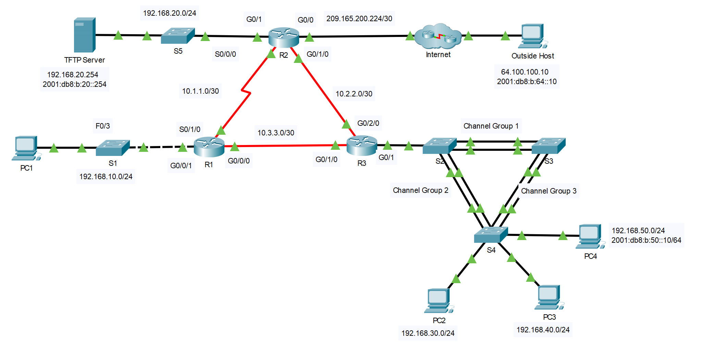

## Топология



## Задачи

Часть 1. Проверка технологий коммутации

Часть 2. Проверка DHCP

Часть 3. Проверка маршрутизации

Часть 4: Проверка технологий глобальной сети

Часть 5. Проверка связи

## Сценарий

В этом задании используются различные технологии, с которыми вы столкнулись в ходе изучения CCNA, включая IPv4 и IPv6 маршрутизацию, безопасность портов, EtherChannel, DHCP и NAT. Ваша задача — изучить требования, найти и устранить все неполадки, а затем задокументировать выполненные действия для проверки соответствия указанным требованиям.

Компания заменила маршрутизаторы R1 и R3 для размещения волоконного соединения между локациями. Конфигурации предыдущих маршрутизаторов с последовательными подключениями были изменены и применены в качестве начальной конфигурации. IPv6 тестируется на небольшой части сети и нуждается в проверке.

**Примечание.** Пароли были удалены для облегчения устранения неполадок в этом упражнении. Типичные средства защиты паролем должны быть повторно применены; однако в задании не будут оцениваться эти элементы.

## Таблица адресации

| Устройство  | Интерфейс | IP адрес/префикс      | Шлюз по умолчанию     |
|-------------|-----------|-----------------------|-----------------------|
| R1          | G0/0/1    | 192.168.10.1 /24      | —                     |
| R1          | S0/1/0    | 10.1.1.1 /30          | —                     |
| R1          | G0/0/0    | 10.3.3.1 /30          | —                     |
| R2          | G0/0      | 209.165.200.225 /27   | —                     |
| R2          | G0/0      | 2001:db8:b:209::1/64  | —                     |
| R2          | G0/1      | 192.168.20.1 /30      | —                     |
| R2          | G0/1      | 2001:db8:b:20::1/64   | —                     |
| R2          | S0/0/0    | 10.1.1.2 /30          | —                     |
| R2          | G0/1/0    | 10.2.2.1 /30          | —                     |
| R2          | G0/1/0    | 2001:db8:b:10:2::1/64 | —                     |
| R3          | G0/1.30   | 192.168.30.1 /24      | —                     |
| R3          | G0/1.40   | 192.168.40.1 /24      | —                     |
| R3          | G0/1.50   | 192.168.50.1 /24      | —                     |
| R3          | G0/1.50   | 2001:db8:b:50::1/64   | —                     |
| R3          | G0/1.99   | —                     | —                     |
| R3          | G0/1/0    | 10.3.3.2 /30          | —                     |
| R3          | G0/2/0    | 10.2.2.2 /30          | —                     |
| R3          | G0/2/0    | 2001:db8:b:10:2::2/64 | —                     |
| S1          | VLAN10    | 192.168.10.2 /24      | 192.168.10.1          |
| S2          | VLAN11    | 192.168.99.2 /24      | Н/Д (недоступно)      |
| S3          | VLAN30    | 192.168.99.3 /24      | Нет                   |
| S4          | VLAN30    | 192.168.99.4 /24      | —                     |
| PC1         | NIC       | IPv4 назначенный DHCP | IPv4 назначенный DHCP |
| PC2         | NIC       | IPv4 назначенный DHCP | IPv4 назначенный DHCP |
| PC3         | NIC       | IPv4 назначенный DHCP | IPv4 назначенный DHCP |
| PC4         | NIC       | IPv4 назначенный DHCP | IPv4 назначенный DHCP |
| PC4         | NIC       | 2001:db8:b:50::10/64  | fe80::3               |
| TFTP Server | NIC       | 192.168.20.254 /24    | 192.168.20.1          |
| TFTP Server | NIC       | 2001:db8:b:20::254/64 | fe80::2               |

## Инструкции

### Часть 1. Проверка технологий коммутации

1.  Безопасность портов настраивается таким образом, чтобы только компьютеру **PC1** был разрешён доступ к интерфейсу F0/3 коммутатора **S1**. При любых нарушениях интерфейс должен деактивироваться.

    Выполните команду на S1, чтобы отобразить текущее состояние безопасности порта.

    ```
    S1# show port-security
    ```

2.  Войдите в режим конфигурации интерфейса для интерфейса F0/3 и настройте безопасность порта.

    ```
    S1(config-if)# switchport port-security
    S1(config-if)# switchport port-security mac-address sticky
    ```

3.  Устройства в локальной сети на S1 должны находиться в VLAN 10. Отобразите текущие конфигурации сети VLAN.

    - ответьте на вопрос №1

4.  PC1 должен получать IP-адрес от маршрутизатора R1.

    - ответьте на вопрос №2

5.  Обратите внимание, что интерфейс G0/1 на R1 не находится в той же VLAN, что и PC1. Измените интерфейс G0/1, чтобы он был членом VLAN 10, и установите portfast на интерфейсе.

    ```
    S1 (config-if) # int G0/1
    S1(config-if)# switchport access vlan 10
    S1(config-if)# spanning-tree portfast
    ```

6.  Сброс адреса интерфейса на PC1 из графического интерфейса пользователя или с помощью командной строки и команды **ipconfig /renew** . Есть ли у PC1 адрес? Если нет, проверьте сделанные инструкции. Проверьте связь с TFTP-сервером. На эти ping-запросы должны приходить ответы.

7.  В локальной сети, подключенной к R3, был добавлен дополнительный коммутатор в топологию. На коммутаторах **S2**, **S3** и **S4** настроено агрегирование каналов с помощью EtherChannel. Каналы EtherChannel должны быть установлены на магистраль. Каналы EtherChannel должны быть настроены на формирование канала без использования протокола согласования. Выполните команду на каждом коммутаторе, чтобы определить, работает ли канал правильно.

    ```
    S2# show etherchannel summary
    <output omitted>
    1 Po1(SU) - Fa0/1(P) Fa0/2(P)
    2 Po2(SU) - Fa0/3(P) Fa0/4(P)
    ```

    - ответьте на вопрос №3

8.  Измените S3, чтобы включить порты F0/1 и F0/2 в качестве канала порта 1.

    ```
    S3(config)# interface range f0/1-2
    S3(config-if-range)# channel-group 1 mode on
    ```

    Проверьте состояние EtherChannel на S3. Теперь он должен быть стабильным. Если это не так, проверьте предыдущие шаги.

9.  Проверьте состояние магистрали на всех коммутаторах.

    ```
    S3#show int trunk
    ```

    - ответьте на вопрос №4

10. Исправьте проблемы магистрали на S2.

    ```
    S1 (config) # int G0/1
    S2(config-if)# switchport trunk native vlan 99
    ```

11. STP должно быть установлено как PVST+ на **S2**, **S3**и **S4**. **S2** должен быть настроен на корневой мост для всех VLAN. Выполните команду, чтобы отобразить состояние STP на S2.

    ```
    S2# show spanning-tree summary totals
    Switch is in pvst mode
    Root bridge for:
    ```

12. Выходные данные команды показывают, что S2 не является корневым мостом для любых VLAN. Исправьте состояние STP на S2.

    ```
    S2(config)# spanning-tree vlan 1-1005 root primary
    ```

13. Проверьте состояние связующего дерева на S2, чтобы проверить изменения.

    ```
    S2# show spanning-tree summary totals
    Switch is in pvst mode
    Root bridge for: default V30 V40 V50 Native
    ```

### Часть 2. Проверка DHCP

-   Маршрутизатор R1 служит сервером DHCP для локальной сети маршрутизатора R1.

-   R3 — это DHCP-сервер для всех трех локальных сетей, подключенных к R3.

1.  Проверьте адресацию на ПК.

    - ответьте на вопрос №5

2.  Проверьте параметры DHCP на R3. Отфильтровать выходные данные команды **show run** , чтобы начать с конфигурации DHCP.

    ```
    R3# sh run| begin dhcp
    ip dhcp excluded-address 192.168.30.1 192.168.30.9
    ip dhcp excluded-address 192.168.40.1 192.168.40.9
    ip dhcp excluded-address 192.168.50.1 192.168.50.9
    !
    ip dhcp pool LAN30
     network 192.168.30.0 255.255.255.0
     default-router 192.168.30.1
    ip dhcp pool LAN40
     network 192.168.40.0 255.255.255.0
     default-router 192.168.30.1
    ip dhcp pool LAN50
     network 192.168.50.0 255.255.255.0
     default-router 192.168.30.1
    ```

    - ответьте на вопрос №6

3.  Внесите необходимые исправления и сбросьте IP-адреса на ПК. Проверьте подключение ко всем устройствам.

    - ответьте на вопрос №7

### Часть 3. Проверка маршрутизации.

Убедитесь, что все требования по настройкам выполнены. Если нет, завершите настройку.

-   Все маршрутизаторы настроены с идентификатором процесса OSPF, равным 1, и никакие обновления маршрутизации не должны передаваться через интерфейсы, к которым не подключены маршрутизаторы.

-   R2 настроен с маршрутом по умолчанию IPv4, указывающим на ISP, и перераспределяет маршрут по умолчанию в домене OSPFv2.

-   R2 настроен с использованием полной точки маршрута IPv6 по умолчанию по умолчанию для интернет-провайдера и перераспределяет маршрут по умолчанию в домене OSPFv3.

-   На маршрутизаторе R2 настроено преобразование NAT, и для всех непреобразованных адресов запрещён доступ к Интернету.

1.  Проверьте таблицы маршрутизации на всех маршрутизаторах.

    ```
    R3# show ip route ospf
    <output omitted>
         10.0.0.0/8 is variably subnetted, 5 subnets, 2 masks
    O 10.1.1.0 [110/649] via 10.2.2.1, 01:15:53, GigabitEthernet0/2/0
    O 192.168.10.0 [110/649] via 10.3.3.1, 01:15:53, GigabitEthernet0/1/0
    192.168.20.0 [110/2] via 10.2.2.1, 01:15:53, GigabitEthernet0/2/0
    <output omitted>
    ```

    - ответьте на вопрос №8

2.  Пинг внешнего хоста от R2.

    - ответьте на вопрос №9

3.  Исправьте распространение маршрута по умолчанию.

    ```
    R2(config)# router ospf 1
    R2(config-router)# default-information originate
    ```

4.  Проверьте таблицы маршрутизации на R1 и R3, чтобы убедиться в наличии маршрута по умолчанию.

5.  Проверьте подключение IPv6 от R2 к внешнему узлу и TFTP-серверу. Проверка связи должна быть успешной. Устранение неполадок, если это не так.

6.  Тестирование подключения IPv6 от R2 до PC4. Если эхо-запрос не удался, убедитесь, что адресация IPv6 соответствует таблице адресации.

7.  Проверьте подключение IPv6 от R3 к внешнему хосту. Если эхо-запрос не удается, проверьте маршруты IPv6 на R3. Обязательно проверьте маршрут по умолчанию, исходящий из R2. Если маршрут не отображается, измените конфигурацию IPv6 OSPF на R2.

    ```
    R2(config)# ipv6 router ospf 1
    R2(config-rtr)# default-information originate
    ```

8.  Проверьте подключение от R2 к внешнему узлу. На эти ping-запросы должны приходить ответы.

### Часть 4. Проверка технологий глобальной сети

-   Последовательный канал между R1 и R2 используется в качестве резервного канала в случае сбоя и должен нести трафик только в том случае, если волоконный канал недоступен.

-   Канал Ethernet между R2 и R3 является волоконным соединением.

-   Канал Ethernet между R1 и R3 является волоконным соединением и должен использоваться для пересылки трафика от R1.

1.  Посмотрите внимательно на таблицу маршрутизации на R1.

    - ответьте на вопрос №10

    Используйте команду traceroute для проверки подозрительных путей.

    ```
    R1 # traceroute 192.168.20.254
    Type escape sequence to abort.
    Tracing the route to 192.168.20.254

      1 10.1.1.2 1 msec 1 msec 1 msec
      2 192.168.20.254 1 msec 9 msec 0 msec
    ```

    Обратите внимание, что трафик отправляется через интерфейс S0/1/0 в отличие от интерфейса G0/0/0.

2.  Исходные конфигурации, полученные из предыдущих последовательных подключений WAN, были перенесены на новые устройства. Сравните параметры интерфейса G0/0/0 и интерфейса Serial0/1/0. Обратите внимание, что они оба имеют значение стоимости OSPF. Удалите параметр стоимости OSPF из интерфейса G0/0/0. Также необходимо будет удалить настройку на канале R3, который подключается к R1.

    ```
    R1(config)# int g0/0/0
    R1(config-if)# no ip ospf cost 648
    R1(config)# int g0/1/0
    R3 (config-if) # no ip ospf cost 648
    ```

3.  Перезапустите команду traceroute от R1, чтобы убедиться, что путь изменился.

4.  Изменение было сделано для направления трафика по более быстрому каналу, однако резервный маршрут должен быть протестирован. Выключите интерфейс G0/2/0 на R3 и проверьте подключение к TFTP-серверу и внешнему узлу.

    - ответьте на вопрос №11

5.  R2 требуется для выполнения NAT для всех внутренних сетей. Проверьте преобразование NAT на R2.

    ```
    R2# show ip nat translations
    ```

6.  Обратите внимание, что список пуст, если вы пытались выполнить эхо-запрос только из R1. Попытайтесь послать эхо-запрос с R3 на внешний хост и перепроверьте преобразования NAT на R2. Выполните команду для отображения текущей статистики NAT, которая также предоставляет интерфейсы, участвующие в NAT.

    ```
    R2# show ip nat statistics
    < выход может отличаться >
    Total translations: 0 (0 static, 0 dynamic, 0 extended)
    Outside Interfaces: GigabitEthernet0/0
    Inside Interfaces: GigabitEthernet0/1 , GigabitEthernet0/1/0
    Hits: 17 Misses: 27
    Expired translations: 17
    Dynamic mappings:
    ```

7.  Установите интерфейс Serial 0/0/0 в качестве внутреннего интерфейса для преобразования адресов.

    ```
    R2(config)# int s0/0/0
    R2(config-if)# ip nat inside
    ```

8.  Проверьте подключение к внешнему узлу от R1. Теперь эхо-запрос должен пройти успешно. Снова включите интерфейс G0 / 2/0 на R3.

### Часть 5. Проверка подключения

-   Устройства необходимо настроить согласно таблице адресации.

-   Теперь каждое устройство должно иметь возможность отправлять эхо-запрос на любое другое внутреннее устройство. Внутренние ПК должны иметь возможность осуществлять эхо-запрос на внешний хост.

-   PC4 должен иметь возможность выполнять эхо-запрос на TFTP-сервер и внешний хост с использованием протокола IPv6.

[Скачать файл Packet Tracer для локального запуска](./assets/12.5.13-lab.pka)
