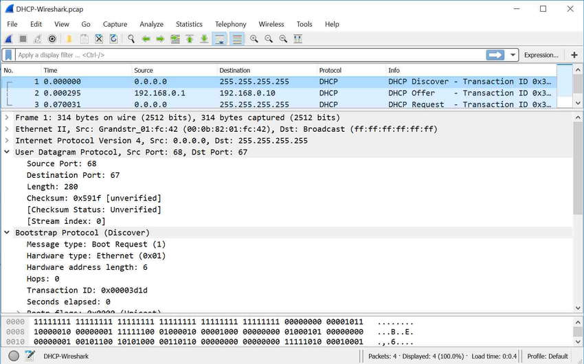

<!-- 12.3.1 -->
## Программные средства для устранения неполадок

Как известно, сети состоят из программной и аппаратной части. Таким образом, как программная, так и аппаратная часть имеют свои соответствующие инструменты для устранения неполадок. В этом разделе рассматриваются средства устранения неполадок, доступные для обоих.

Благодаря разнообразному программному и аппаратному инструментарию процесс поиска и устранения неполадок удается упростить. Этот инструментарий можно использовать для сбора и анализа симптомов проблем в работе сети. Данные средства часто выполняют функции наблюдения и создания отчетов, которые можно использовать для формирования базовых показателей сети.

**Инструментарий системы управления сетью**

Система управления сетями (NMS) включает в себя средства наблюдения на уровне устройств, настройки и средства для устранения неисправностей. Эти средства можно использовать для анализа и устранения сетевых проблем. ПО для наблюдения за сетью позволяет графически отображать физический вид сетевых устройств, благодаря чему диспетчеры сети могут отслеживать удаленные устройства постоянно и в автоматическом режиме. ПО для управления устройствами позволяет формировать динамическую информацию о состоянии устройств, статистику, а также информацию о настройке для ключевых сетевых устройств. Поищите в Интернете «NMS Tools» для получения дополнительной информации.

**Базы знаний**

Базы знаний поставщиков сетевых устройств, доступные в оперативном режиме, стали незаменимыми источниками информации. Объединив возможности баз знаний поставщиков с поисковыми системами Интернета, сетевой администратор получает доступ ко множеству ресурсов с описанием практического опыта.

Например, **Cisco Tools & Resources** эту страницу можно найти по адресу [http://www.cisco.com](http://www.cisco.com/) **Support** меню. На этой странице представлены средства, которые можно использовать для аппаратного и программного обеспечения Cisco.

**Средства формирования базовых показателей**

Существует много средств для автоматизации процесса документирования сети и формирования базовых показателей Средства формирования базовых показателей позволяют выполнять распространенные задачи документирования. Например, они позволяют рисовать схемы сетей, обеспечивать актуальность документации по программному обеспечению и оборудованию сети, а также экономно измерять использование базовой пропускной способности сети. Поиск в Интернете по «Инструменты мониторинга производительности сети» для получения дополнительных сведений.

<!-- 12.3.2 -->
## Анализаторы протоколов

Анализаторы протоколов полезны для анализа содержимого пакета при его прохождении через сеть. Анализатор протоколов декодирует различные уровни протоколов в записанном кадре и представляет полученные сведения в формате, более удобном для восприятия. На рисунке показан снимок экрана для анализатора протоколов Wireshark.



<!--
The figure shows a screen capture of the Wireshark protocol analyzer. The figure shows a capture of DHCP packets being sent between a device and DHCP server. The packets in the example are DHCP Discover, DHCP Offer and DHCP Request.
-->

Анализатор протоколов позволяет отображать различную информацию, в том числе физическую среду передачи, канал передачи данных, протокол и описание для каждого кадра. Большинство анализаторов протоколов могут фильтровать трафик, соответствующий определенным критериям, что позволяет записывать и собирать, например, весь трафик, поступающий на конкретное устройство или из него. Такие анализаторы протоколов, как Wireshark, позволяют упрощать процессы отладки, связанные с производительностью сети. Очень важно иметь хорошее представление о TCP/IP и о том, как использовать анализатор протоколов для проверки информации на каждом уровне TCP/IP.

<!-- 12.3.3 -->
## Средства поиска и устранения неполадок аппаратного обеспечения

Существует несколько типов средств поиска и устранения неполадок с аппаратным обеспечением.

**Цифровой мультиметр**

Цифровые мультиметры — универсальные цифровые измерительные приборы (DMM), например Fluke 179, показанный на рис. 1, представляют собой приборы, позволяющие непосредственно измерять электрические значения напряжения, тока и сопротивления.

При отладке сети большинство тестов с мультиметром — это измерение напряжения питания и проверка наличия питания на сетевых устройствах.

**Кабельные тестеры**

Кабельные тестеры — это специализированные портативные устройства, предназначенные для проверки различных кабелей передачи данных. На рисунке показан сетевой автоматический тестер Fluke LinkRunner AT.

Тестеры можно использовать для обнаружения оборванных жил, неправильной разводки, коротких замыканий и жил, неправильно собранных в пары. Эти устройства могут представлять собой недорогие тестеры обрывов, умеренно дорогие тестеры кабелей или дорогие рефлектометры для кабельных линий (time-domain reflectometer, TDR). Рефлектометры TDR используются для определения расстояния до места обрыва жилы в кабеле. Они посылают сигналы по кабелю и ждут отраженный сигнал. Время между моментом отправки сигнала и моментом его приема можно преобразовать в расстояние. Приборы для проверки кабелей данных обычно включают функцию TDR. TDR, используемые для тестирования оптоволоконных кабелей, называются оптическими рефлектометрами (OTDR).

**Анализатор кабельных линий**

Анализаторы кабелей. Анализаторы кабелей, например Fluke DTX, представляют собой многофункциональные портативные устройства, которые используются для тестирования и сертификации медных и оптоволоконных кабелей на соответствие различным применениям и стандартам.

Более сложные средства позволяют выполнять более продвинутый поиск и устранение неполадок, например: определять расстояние до дефекта, который ухудшает уровень производительности на ближнем конце (NEXT) или создает возвратные потери (RL), определять действия по исправлению, графически отображать поведение перекрестных помех и импеданса. К анализаторам кабелей обычно прилагается специальное ПО для ПК. После сбора рабочих данных данные с портативного устройства могут быть выгружены, чтобы сетевой администратор смог создать обновленные отчеты.

**Портативный сетевой анализатор**

Портативные анализаторы сетей — это портативные устройства, например Fluke OptiView, применяемые для поиска и устранения отказов в коммутируемых сетях и сетях VLAN.

Подключив анализатор сети в любой точке сети, технический специалист может определить порт коммутатора, к которому подключено устройство, а также среднюю и пиковую нагрузку на данный порт. Анализатор также можно использовать для обнаружения настройки сети VLAN, определения основных источников трафика, анализа сетевого трафика и просмотра сведений об интерфейсах. Как правило, такое устройство может выводить данные на ПК, где установлено ПО для наблюдения за сетью, с целью последующего анализа и устранения неполадок.

**Модуль Cisco Prime NAM**

Cisco Prime Network Analysis Module (NAM), показанный на рисунке, включает аппаратное и программное обеспечение для анализа производительности в средах коммутации и маршрутизации. NAM представляет собой встроенный интерфейс на основе браузера, создающий отчеты о трафике, потребляющем наиболее важные сетевые ресурсы. Кроме того, NAM может записывать и декодировать пакеты, а также отслеживать время отклика, чтобы определить, какая сеть или сервер приводит к неправильной работе приложения.


<!-- /courses/ensa-dl/ae8eb396-34fd-11eb-ba19-f1886492e0e4/aeb638ce-34fd-11eb-ba19-f1886492e0e4/assets/c6f22d73-1c46-11ea-af56-e368b99e9723.svg -->

<!--
На рисунке показаны варианты модуля сетевого анализа Cisco Prime Network Analysis Module (NAM). На рисунке показаны NAM серии Cisco Nexus 7000, Cisco Catalyst серии 65xx NAM, Cisco Prime NAM серии 2300, Cisco Prime Virtual NAM (vNAM), Cisco Prime NAM для Cisco Nexus 1110 и Cisco Prime NAM для ISR G2 SRE.
-->

<!-- 12.3.4 -->
## Syslog Server как средство устранения неполадок 

Syslog — это простой протокол, используемый устройством IP (клиентом Syslog) и позволяющий отправлять текстовые журнальные сообщения на другое устройство IP (сервер Syslog). В настоящее время Syslog определен в RFC 5424.

Функция регистрации крайне важна для обеспечения безопасности сети, а также для отладки сети. Устройства Cisco могут регистрировать информацию об изменении настройки, нарушениях списков контроля доступа, состоянии интерфейсов и разнообразных событиях другого типа. Устройства Cisco могут отправлять журнальные сообщения на различные объекты. Сообщения о событиях могут отправляться в одно или несколько следующих мест:

* **Консоль**  — режим журналирования на консоли включен по умолчанию. Сообщения регистрируются на консоли. Их можно просматривать при изменении или тестировании маршрутизатора либо коммутатора с помощью ПО эмуляции терминала (при наличии подключения к консольному порту сетевого устройства).
* **Линии терминала**  — включенные сеансы EXEC (привилегированный режим) можно настроить на получение журнальных сообщений на любые линии терминала. По аналогии с регистрацией на консоли режим регистрации этого типа не сохраняется сетевым устройством, поэтому может применяться только пользователем на данной линии.
* **Запись в буфер** - Запись в буфер является немного более полезным средством поиска и устранения неполадок, так как записи журналов некоторое время хранятся в памяти. Однако после перезагрузки устройства журнальные сообщения удаляются.
* **Ловушки SNMP**  — на маршрутизаторах и других устройствах можно предварительно настроить несколько пороговых значений. События маршрутизатора (например, превышение порогового значения) могут обрабатываться маршрутизатором и перенаправляться в виде SNMP-ловушек на внешнюю станцию управления SNMP. Ловушки SNMP представляют собой эффективное средство регистрации событий безопасности, для которого, однако, требуется настраивать и технически сопровождать систему SNMP.
* **Syslog**  — маршрутизаторы и коммутаторы Cisco можно настроить на перенаправление журнальных сообщений на внешнюю службу syslog. Данная служба может находиться на любом количестве серверов или рабочих станций, включая системы под управлением ОС Microsoft Windows и Linux. Syslog представляет собой наиболее популярное средство регистрации сообщений, так как он обеспечивает долговременное хранение журнальных сообщений и является централизованным местом хранения сообщений от всех маршрутизаторов.

Журнальные сообщения Cisco IOS могут быть отнесены к одному из 8 уровней как показано в таблице.

<table>
  <tr>
    <td></th>
    <td><b>Уровень</b></th>
    <td><b>Ключевое слово</b></th>
    <td><b>Описание</b></th>
    <td><b>Определение</b></th>
  </tr>
  <tr>
    <td rowspan="5"><b>Наивысший уровень</b></td>
    <td>0</td>
    <td>Emergencies</td>
    <td>Систему нельзя использовать</td>
    <td>LOG_EMERG</td>
  </tr>
  <tr>
    <td>1</td>
    <td>Alerts</td>
    <td>Требуется немедленное действие</td>
    <td>LOG_ALERT</td>
  </tr>
  <tr>
    <td>2</td>
    <td>Critical</td>
    <td>Существуют критические состояния</td>
    <td>LOG_CRIT</td>
  </tr>
  <tr>
    <td>3</td>
    <td>Error</td>
    <td>Существуют состояния ошибки</td>
    <td>LOG_ERR</td>
  </tr>
  <tr>
    <td>4</td>
    <td>Warnings</td>
    <td>Существуют состояния предупреждения</td>
    <td>LOG_WARNING</td>
  </tr>
  <tr>
    <td rowspan="3"><b>Самый низкий уровень</b></td>
    <td>5</td>
    <td>Notifications</td>
    <td>Нормальное состояние, но требующее внимания</td>
    <td>LOG_NOTICE</td>
  </tr>
  <tr>
    <td>6</td>
    <td>Informational</td>
    <td>Только информационные сообщения</td>
    <td>LOG_INFO </td>
  </tr>
  <tr>
    <td>7</td>
    <td>Debugging</td>
    <td>Сообщения отладки</td>
    <td>LOG_DEBUG</td>
  </tr>
</table>

Чем меньше номер уровня, тем выше уровень серьезности. По умолчанию все сообщения с уровней 0–7 регистрируются на консоли. Хотя возможность просмотра журналов на центральном сервере Syslog довольно полезна при поиске и устранении неполадок, поиск в большом объеме данных может потребовать значительных усилий. Команда **logging trap** _level_ позволяет ограничивать сообщения, отправляемые на сервер Syslog, на основе уровня важности. Уровень - это имя или номер уровня серьезности. Регистрируются только сообщения, равные или численно ниже указанного уровня.

В выводе команды системные сообщения с уровня 0 (чрезвычайные ситуации) по 5 (уведомления) отправляются на сервер Syslog по адресу 209.165.200.225.

```
R1(config)# logging host 209.165.200.225 
R1(config)# logging trap notifications 
R1(config)# logging on
R1(config)#
```

<!-- 12.3.5 -->
<!-- quiz -->

