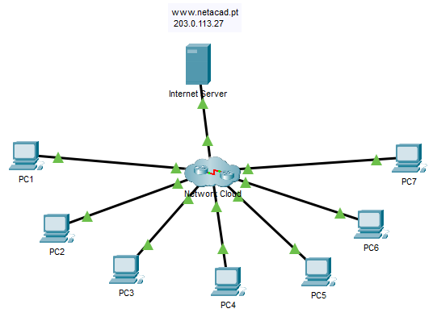

## Топология



## Таблица адресации

| Устройство | Интерфейс | Тип устройства<br>(Маршрутизатор, Коммутатор, хост) | IP-адрес | Маска подсети | Шлюз по умолчанию |
|--------|-----|------|---|---|---|
| PC 1   | NIC | Узел |   |   |   |
| PC 2   |     |      |   |   |   |
| PC 3   |     |      |   |   |   |
| PC 4   |     |      |   |   |   |
| PC 5   |     |      |   |   |   |
| PC 6   |     |      |   |   |   |
| PC 7   |     |      |   |   |   |
| &nbsp; |     |      |   |   |   |
| &nbsp; |     |      |   |   |   |
| &nbsp; |     |      |   |   |   |
| &nbsp; |     |      |   |   |   |
| &nbsp; |     |      |   |   |   |
| &nbsp; |     |      |   |   |   |
| &nbsp; |     |      |   |   |   |
| &nbsp; |     |      |   |   |   |
| &nbsp; |     |      |   |   |   |
| &nbsp; |     |      |   |   |   |
| &nbsp; |     |      |   |   |   |
| &nbsp; |     |      |   |   |   |
| &nbsp; |     |      |   |   |   |
| &nbsp; |     |      |   |   |   |
| &nbsp; |     |      |   |   |   |
| &nbsp; |     |      |   |   |   |
| &nbsp; |     |      |   |   |   |
| &nbsp; |     |      |   |   |   |
| &nbsp; |     |      |   |   |   |
| &nbsp; |     |      |   |   |   |
| &nbsp; |     |      |   |   |   |
| &nbsp; |     |      |   |   |   |
| &nbsp; |     |      |   |   |   |

## Цели

В этой лабораторной работе вы задокументируете неизвестную вам сеть.

Тестирование и проверка подключения к сети

-   Компиляция информации об адресации узла.

-   Удаленный доступ к устройствам шлюза по умолчанию.

-   Документирование конфигураций шлюзовых устройств по умолчанию.

-   Обнаружение сетевых устройств

-   Графическое представление топологии сети

## Исходные данные/ сценарий

Ваш работодатель был нанят, чтобы взять на себя управление корпоративной сетью, потому что предыдущий администратор сети покинул компанию. Сетевая документация отсутствует и должна быть воссоздана. Ваша задача состоит в том, чтобы документировать хосты и сетевые устройства, включая все устройства адресации и логические соединения. Вы будете получать удаленный доступ к сетевым устройствам и использовать сетевое обнаружение для заполнения таблицы устройств и построения топологии сети.

Это первая часть интерактивного задания, состоящего из двух частей. Вы будете использовать документацию, которую вы создаете в этом действии, чтобы помочь вам в устранении неполадок сети в части II, **Packet Tracer - Поиск и устранение неполадок - Использование документации для решения проблем**.

При изучении и документировании топологии сети обратите внимание на обнаруживаемые проблемы, которые не соответствуют практикам, преподаваемым в учебной программе CCNA.

## Инструкция

### Часть 1. Проверка связи

Ping между ПК и интернет-сервером для тестирования сети. Все ПК должны получать ответы на эхо-запросы друг от друга и от сервера.

### Часть 2. Поиск информации о конфигурации ПК

Перейдите в командную строку каждого ПК и отобразите настройки IP. Запишите эти данные в приведенную ниже таблицу.

### Часть 3. Сведения о шлюзовых устройствах по умолчанию

Подключайтесь к каждому устройству шлюза по умолчанию с помощью протокола Telnet и запишите сведения об используемых интерфейсах в таблице. Пароль VTY — **cisco**, пароль привилегированного режима EXEC — **class**.

```
C:\> telnet IP_address
```

### Часть 4. Восстановление топологии сети

В этой части действия вы продолжите запись информации об устройствах в сети в Таблице адресации. Кроме того, вы начнете создавать схему топологии сети на основе того, что вы можете узнать о соединениях устройств.

**Шаг 1. Доступ к таблицам маршрутизации на каждом устройстве шлюза.**

Для получения дополнительных сведений о сети используйте таблицы маршрутизации в каждом маршрутизаторе. Запишите свои выводы.

**Шаг 2. Обнаружение устройств, не являющихся шлюзами.**

Используйте протокол сетевого обнаружения для документирования соседних устройств. Запишите свои выводы в адресную таблицу. На этом этапе вы также сможете начать документирование соединений устройств.

### Часть 5. Дальнейшее изучение конфигураций устройств и соединений

**Шаг 1: Доступ к конфигурациям устройств.**

Подключитесь к другим устройствам в сети. Сбор информации о конфигурациях устройств.

**Шаг 2. Просмотр информации о соседе.**

Используйте протоколы обнаружения для расширения знаний о сетевых устройствах и топологиях.

**Шаг 3. Подключение к другим устройствам.**

Отображение сведений о конфигурации для других устройств в сети. Запишите свои выводы в таблицу устройств.

Теперь вы должны знать обо всех устройствах и конфигурациях интерфейса в сети. Все строки таблицы должны содержать информацию об устройстве. Используйте информацию для восстановления как можно большей части топологии сети.

## Вопросы для повторения

Возможно, вы заметили, что некоторые методы настройки сетевых устройств устарели, неэффективны или не безопасны. Составьте список как можно большего количества рекомендаций, которые вы имеете в отношении того, как устройства должны быть перенастроены в соответствии с практиками, которые вы изучили в учебном плане CCNA.

**Введите ваш ответ здесь.**

[Скачать файл Packet Tracer для локального запуска](./assets/12.6.1-packet-tracer---troubleshooting-challenge---document-the-network_ru-RU.pka)