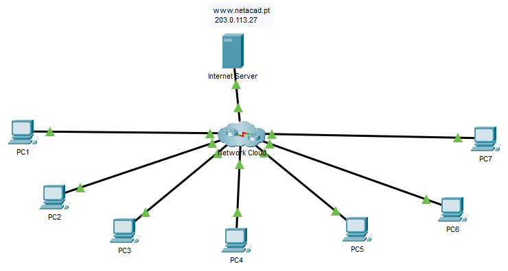

## Топология

## Таблица адресации

| Устройство | Интерфейс | Тип устройства (Маршрутизатор, Коммутатор, хост) | IP-адрес | Маска подсети | Шлюз по умолчанию |
|--------|-----|------|---|---|---|
| PC 1   |     |      |   |   |   |
| PC 2   |     |      |   |   |   |
| PC 3   |     |      |   |   |   |
| PC 4   |     |      |   |   |   |
| PC 5   |     |      |   |   |   |
| PC 6   |     |      |   |   |   |
| PC 7   |     |      |   |   |   |
| &nbsp; |     |      |   |   |   |
| &nbsp; |     |      |   |   |   |
| &nbsp; |     |      |   |   |   |
| &nbsp; |     |      |   |   |   |
| &nbsp; |     |      |   |   |   |
| &nbsp; |     |      |   |   |   |
| &nbsp; |     |      |   |   |   |
| &nbsp; |     |      |   |   |   |
| &nbsp; |     |      |   |   |   |
| &nbsp; |     |      |   |   |   |
| &nbsp; |     |      |   |   |   |
| &nbsp; |     |      |   |   |   |
| &nbsp; |     |      |   |   |   |
| &nbsp; |     |      |   |   |   |
| &nbsp; |     |      |   |   |   |
| &nbsp; |     |      |   |   |   |
| &nbsp; |     |      |   |   |   |
| &nbsp; |     |      |   |   |   |
| &nbsp; |     |      |   |   |   |
| &nbsp; |     |      |   |   |   |
| &nbsp; |     |      |   |   |   |
| &nbsp; |     |      |   |   |   |
| &nbsp; |     |      |   |   |   |

## Цели

В этой лабораторной работе используется сетевая документация для выявления и устранения проблем с сетевыми коммуникациями.

-   Используйте различные методы и инструменты для выявления проблем подключения.

-   Используйте документацию для руководства по поиску и устранению неисправностей.

-   Определение конкретных сетевых проблем.

-   Реализуйте решения проблем сетевой связи.

-   Проверка работы сети.

## Общие сведения и сценарий

В этом задании вы будете использовать документацию, созданную в программе **Packet Tracer - Устранение неполадок - Документирование действия** сети, чтобы руководствоваться при устранении неполадок в сети.

Было обнаружено, что в сети, с которой вы работали в предыдущем действии PT, возникли проблемы связи. Некоторые хосты не могут выполнить команду ping для других хостов и интернет-сервера. Это ваша работа, чтобы определить, что такое проблемы, найти и исправить их.

Проблемы с сетью могут существовать на любом устройстве. Обязательно проверьте наличие полных ошибок:

-   Настройка адресации

-   Активация интерфейса

-   Маршрутизация

-   NAT

## Инструкции

Пароли для всех устройств VTY: **cisco**, Enable secret: **class**

### Часть 1. Проверка связи

Хосты должны иметь возможность пинговать друг друга и интернет-сервер. Determine if this requirement is met. Если нет, укажите, какие узлы и сети следует дополнительно изучить.

### Часть 2. Доступ к сетевым устройствам

На узлах, которые имеют проблемы связи, используйте средства ICMP, чтобы определить, где в сети эти проблемы могут быть расположены. С хост-компьютеров доступ к устройствам в сети и отображение конфигураций и рабочего состояния.

### Часть 3: Восстановление сети

После обнаружения проблем перенастройте устройства для устранения проблемы с подключением. Используйте документацию из предыдущего задания, чтобы помочь вам.

### Часть 4: Документирование проблем

Запишите свои ответы ниже.

| Устройство | Проблема | Действие |
|------------|----------|----------|
| &nbsp;     |          |          |
| &nbsp;     |          |          |
| &nbsp;     |          |          |
| &nbsp;     |          |          |
| &nbsp;     |          |          |

[Скачать файл Packet Tracer для локального запуска](./assets/12.6.2-packet-tracer---troubleshooting-challenge---use-documentation-to-solve-issues_ru-RU.pka)