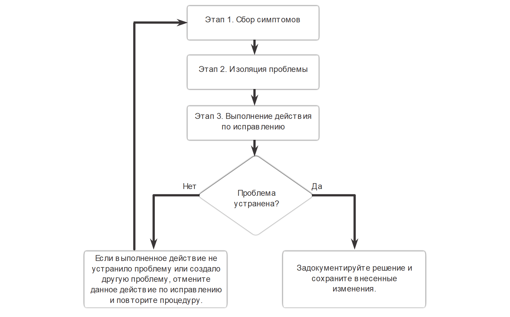
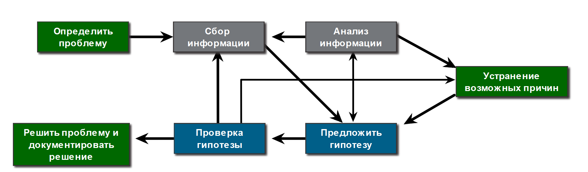
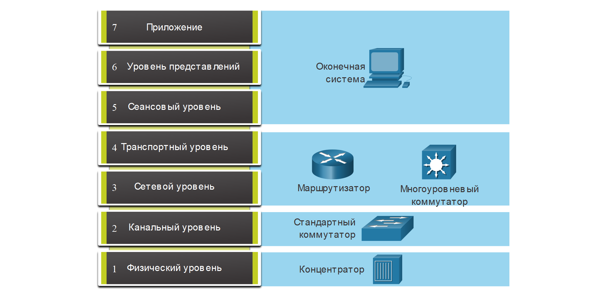

<!-- 12.2.1 -->
## Общие процедуры поиска и устранения неполадок

Устранение неполадок может занять много времени, поскольку сети отличаются друг от друга, проблемы различаются и опыт устранения неполадок различается. Однако опытные администраторы знают, что использование структурированного метода устранения неполадок сократит общее время устранения неполадок.

Поэтому процесс устранения неполадок должен быть ориентирован на структурированные методы. Это требует четко определенных и документированных процедур устранения неполадок, чтобы свести к минимуму затрачиваемое время, связанное с нерегулярным поиском и устранением ошибок. Однако эти методы не являются статичными. Действия по устранению неполадок, предпринятые для решения проблемы, не всегда одинаковы или выполняются в том же порядке.

Существует несколько процессов устранения неполадок, которые можно использовать для решения проблемы. На рисунке показана логическая схема упрощенного трехэтапного процесса устранения неполадок. Тем не менее более подробный процесс может быть более полезным для решения сетевой проблемы.

<!-- /courses/ensa-dl/ae8eb396-34fd-11eb-ba19-f1886492e0e4/aeb638cc-34fd-11eb-ba19-f1886492e0e4/assets/c6eab362-1c46-11ea-af56-e368b99e9723.svg -->

<!--
Диаграмма представляет собой блок-схему упрощенного трехэтапного процесса устранения неполадок. Вверху диаграммы находится этап 1: Сбор симптомов. Стрелка приводит ниже к этапу 2 процесса: Изоляция проблемы. Стрелка приводит ниже к этапу 3 процесса. Выполнение корректирующих действий. Стрелка приводит ниже к точке принятия решения, проблема исправлена? Ответ да имеет стрелку справа, ведущую к процессу; документация решение и сохранение изменений. Если выполненное действие не устранило проблему или создало другую проблему, отмените данное действие по исправлению и повторите процедуру. Стрелка идет отсюда обратно на этап 1.
-->

<!-- 12.2.2 -->
## Семиэтапный процесс устранения неисправностей

На рисунке показан более подробный семиэтапный процесс устранения неполадок. Обратите внимание, как некоторые шаги взаимосвязаны. Это связано с тем, что некоторые технические специалисты могут переходить между этапами в зависимости от их уровня опыта.

<!-- /courses/ensa-dl/ae8eb396-34fd-11eb-ba19-f1886492e0e4/aeb638cc-34fd-11eb-ba19-f1886492e0e4/assets/c6eb2890-1c46-11ea-af56-e368b99e9723.svg -->

<!--
На диаграмме показан подробный семиэтапный процесс устранения неполадок, с некоторыми шагами взаимосвязанными. Слева начальная точка - Определить проблему. У него есть стрелка справа, которая перетекает к «Сбор информации». Это имеет стрелку, указывающую вниз и вправо, чтобы предложить гипотезу. Стрелка слева от предложения гипотезы течет к тестовой гипотезе, которая имеет стрелку слева, которая течет для решения проблемы и решения документа. Проверка гипотезы также имеет стрелку, которая течет обратно до сбора информации. Третья стрелка течет из Проверки гипотезы вверх и влево, чтобы устранить возможные причины, которая имеет стрелку, течет вниз и влево, чтобы предложить гипотезу. Предложенная гипотеза имеет двойную стрелку, идущую вверх для анализа информации, и стрелку слева, указывающую на сбор информации, и стрелку справа, чтобы устранить возможные причины.
-->

**Определить проблему**

Цель этого этапа заключается в том, чтобы убедиться, что есть проблема, а затем правильно определить, что проблема. Проблемы обычно определяются симптомом (например, сеть работает медленно или перестала работать). Симптомы могут отображаться в разном виде (предупреждения из системы управления сетями, консольные сообщения и жалобы пользователей).

В ходе сбора данных о симптомах важно, чтобы сетевой администратор задавал вопросы и расследовал проблему с целью локализации проблемы до более узкого круга возможных причин ее появления. Например, распространяется ли проблема на одно устройство, группу устройств, подсеть или всю сеть устройств?

В организации проблемы обычно назначаются сетевым специалистам в качестве заявок на неполадки. Эти заявки создаются с помощью программного обеспечения для продажи билетов на неполадки, которое отслеживает ход выполнения каждого билета. Программное обеспечение для продажи билетов может также включать портал самообслуживания для отправки билетов, доступ к базе знаний о неисправностях с возможностью поиска, возможности удаленного управления для решения проблем конечных пользователей и многое другое.

**Сбор информации**

На этом этапе необходимо определить цели (т.е. хосты, устройства), подлежащие исследованию, получить доступ к оконечным устройствам и собрать информацию. На этом этапе технический специалист может собирать и документировать больше симптомов в зависимости от выявленных характеристик.

Если проблема выходит за границы области контроля организации (например потеря связи через Интернет за пределами автономной системы), обратитесь к администратору внешней системы до сбора информации о других симптомах.

**Анализ информации**

Должны быть определены возможные причины. Собранная информация интерпретируется и анализируется с помощью сетевой документации, базовых показателей сети, поиска организационных баз знаний, поиска в Интернете и общения с другими техниками.

**Устранение возможных причин**

Если выявлено несколько причин, то перечень должен быть сокращен путем постепенного устранения возможных причин, с тем чтобы в конечном итоге определить наиболее вероятную причину. Опыт устранения неполадок чрезвычайно важен для быстрого устранения причин и выявления наиболее вероятной причины.

**Предложить гипотезу**

Когда выявлена наиболее вероятная причина, необходимо сформулировать решение. На данном этапе опыт устранения неполадок очень полезен при разработке плана.

**Проверка гипотезы**

Перед тестированием решения важно оценить влияние и актуальность проблемы. Например, может ли решение оказать негативное воздействие на другие системы или процессы? Уровень серьезности проблемы всегда следует соотносить со степенью влияния решения. Например, если критически важный сервер или маршрутизатор необходимо выключить на длительное время, то реализацию исправления лучше отложить на конец рабочего дня. В ряде случаев до разрешения фактической проблемы можно применить обходное или временное решение.

Создайте план отката, определяющий, как быстро можно отменить решение. Это может оказаться необходимым в случае если решение не привело к успеху.

Реализовать решение и убедиться, что оно решило проблему. Иногда решение создает неожиданную проблему. Поэтому важно, чтобы решение было тщательно проверено, прежде чем перейти к следующему шагу.

Если решение не удается, попытка решения документируется, и изменения удаляются. Специалист должен вернуться к этапу сбора информации и изолировать проблему.

**Решение проблемы**

Для устранения проблем следует общаться с пользователями и любыми сотрудниками, принимающими участие в процессе поиска и устранения неполадок. Информацию о разрабатываемом решении должны получить другие сотрудники отдела ИТ. Наличие соответствующим образом оформленной документации о причине проблемы и способе ее устранения позволит другим техническим специалистам предотвращать либо устранять похожие проблемы в будущем.

<!-- 12.2.3 -->
## Опрос конечных пользователей.

Многие проблемы в сети изначально сообщаются конечным пользователем. Однако представленная информация зачастую является расплывчатой или вводящей в заблуждение. Например, пользователи часто сообщают о проблемах, таких как «сеть упала», «я не могу получить доступ к электронной почте» или «мой компьютер работает медленно».

В большинстве случаев для полного понимания проблемы требуется дополнительная информация. Обычно это предполагает взаимодействие с затронутым пользователем, чтобы ответить на вопросы «кто», «что» и «когда».

При общении с пользователем следует использовать следующие рекомендации:

* Говорите с пользователями на том техническом языке, который ему понятен.
* Всегда слушайте или внимательно читайте, что говорит пользователь. Заметки могут быть полезны при документировании сложной проблемы.
* Всегда будьте внимательны и сопереживать с пользователями, давая им знать, что вы поможете им решить их проблему. Пользователи, сообщающие о проблеме, могут быть в состоянии стресса и стремиться решить проблему как можно быстрее.

Во время собеседования с пользователем, направляйте разговор и используйте эффективные методы опроса, чтобы быстро выяснить проблему. Например, используйте открытые вопросы (т.е. требующие подробного ответа) и закрытые вопросы (т.е. да, нет или ответы на одно слово), чтобы обнаружить важные факты о сетевой проблеме.

В таблице на рисунке приведены несколько рекомендаций, а также примеры вопросов для конечных пользователей.

После собеседования с пользователем, повторите свое понимание проблемы пользователю, чтобы убедиться, что вы оба согласны с проблемой, о которой сообщается.

| **Рекомендации** | **Примеры вопросов конечному пользователю** |
| --- | --- |
| Задайте соответствующие вопросы. | <ul><li>Что не работает?</li><li>В чем именно проблема?</li><li>Чего вы пытаетесь добиться? </li></ul> |
| Определите масштаб проблемы. | <ul><li>На кого влияет эта проблема? Это только вы или другие?</li><li>Какое устройство повержено проблемы?</li></ul> |
| Определите, когда возникла проблема. | <ul><li>Когда именно возникает проблема?</li><li>Когда впервые была обнаружена проблема? </li><li>Были ли выведены сообщения об ошибках?</li></ul> |
| Определите, является ли проблема постоянной или прерывистой. | <ul><li>Можете ли вы воспроизвести проблему? </li><li>Можете ли вы отправить мне скриншот или видео проблемы?</li></ul> |
| Определите, менялось ли что-то. | Что изменилось с тех пор, когда все еще нормально работало? |
| Используйте каждый вопрос в качестве средства исключения или обнаружения возможных проблем. | <ul><li>Что работает?</li><li>Что не работает?</li></ul> |

<!-- 12.2.4 -->
## Сбор информации

Чтобы собрать симптомы от подозрительного сетевого устройства, используйте команды Cisco IOS и другие инструменты, такие как захват пакетов и журналы устройства.

В таблице  указаны наиболее распространенные команды ОС IOS Cisco, используемые для сбора данных о симптомах сетевых проблем.

| **Команда** | **Описание** |
| --- | --- |
| `ping {host \| ip-address}` | <ul><li>Позволяет послать пакет ping-запроса по адресу и ожидать ответ.</li><li>Переменная _host_ или _ip-address_ — это IP-псевдоним или IP-адрес целевой системы. IP-адрес целевой системы</li></ul> |
| `traceroute destination` | <ul><li>Позволяет определить путь передачи пакета по сетям.</li><li>Переменная _destination_ — это имя хоста или IP-адрес целевой системы. целевая система</li></ul> |
| `telnet {host \| ip-address}` | <ul><li>Позволяет подключиться к IP-адресу с помощью приложения Telnet.</li><li>По возможности используйте SSH вместо Telnet</li></ul> |
| `ssh -l user-id ip-address` | <ul><li>Подключение к IP-адресу по протоколу SSH.</li><li>SSH является более безопасным, чем Telnet</li></ul> |
| `show ip interface brief ` `show ipv6 interface brief` | <ul><li>Отображает сводный статус всех интерфейсов на устройстве</li><li>Полезно для быстрой идентификации IP-адресации на всех интерфейсах.</li></ul> |
| `show ip route` `show ipv6 route` | Позволяет отобразить текущие таблицы маршрутизации IPv4 и IPv6, в которых указаны маршруты ко всем известным сетевым пунктам назначения. |
| `show protocols` | Отображает настроенные протоколы и показывает общее и специфичное для интерфейса состояние любого настроенного протокола уровня 3 |
| `debug` | Отображение списка параметров для включения или отключения событий отладки. |

**Примечание:** Несмотря на то что команда **debug** является важным средством сбора данных о симптомах, она создает большой объем трафика консольных сообщений, существенно снижая производительность сетевого устройства. Если команду **debug** необходимо выполнить в обычное рабочее время, предупредите пользователей сети о планируемых процедурах по поиску и устранению неполадок, а также о возможном снижении производительности сети. По окончании процедуры не забудьте отключить режим отладки.

<!-- 12.2.5 -->
## Устранение неполадок с использованием Уровневой модели

Такие многоуровневые модели можно применять к физической сети для изоляции сетевых проблем при поиске и устранении неполадок. Например, если все признаки указывают на проблему с физическим подключением, то сетевой специалист может сосредоточиться на устранении неполадок на канале, который работает на физическом уровне.

На рисунке показаны некоторые общие устройства и уровни модели OSI, которые необходимо анализировать в процессе поиска и устранения неполадок для данного устройства.

<!-- /courses/ensa-dl/ae8eb396-34fd-11eb-ba19-f1886492e0e4/aeb638cc-34fd-11eb-ba19-f1886492e0e4/assets/c6ec8820-1c46-11ea-af56-e368b99e9723.svg -->

<!--
На диаграмме показаны слои модели OSI и связанные с ними устройства, которые необходимо изучить во время устранения неполадок.  Вверху конечная система связана с уровнем приложения 7, уровнем представления 6 и уровнем сеанса 5. Маршрутизатор и многоуровневый коммутатор связаны с транспортным уровнем 4 и сетевым уровнем 3. Стандартный коммутатор связан с  уровнем 2 (канальным уровнем). Концентратор связан с физическим уровнем 1.
-->

Следует отметить, что маршрутизаторы и многоуровневые коммутаторы показаны на уровне 4 (транспортный уровень). Хотя маршрутизаторы и многоуровневые коммутаторы обычно принимают решения о перенаправлении данных на уровне 3, списки контроля доступа на этих устройствах можно использовать для принятия решений о фильтрации с помощью информации уровня 4.

<!-- 12.2.6 -->
## Структурированные методы устранения неполадок

Существует несколько структурированных подходов к устранению неполадок, которые могут быть использованы. Какой из них выбрать, будет зависеть от ситуации. Каждый метод имеет свои достоинства и недостатки. В этом разделе описываются три метода и содержатся рекомендации по выбору наилучшего метода для конкретной ситуации.

**Снизу вверх**

При поиске и устранении неполадок с помощью метода «снизу вверх» следует начинать с физических компонентов сети и перемещаться вверх через уровни модели OSI до тех пор, пока не будет определена причина проблемы, как показано на рисунке.

Метод «снизу вверх» хорошо подходит в тех случаях, когда предполагается, что проблема находится на физическом уровне. Большинство сетевых проблем находятся на нижних уровнях, поэтому реализация метода «снизу вверх» во многих случаях является довольно эффективной.

Недостаток метода «снизу вверх» заключается в том, что необходимо проверять каждое устройство и интерфейс в сети до тех пор, пока не будет найдена возможная причина проблемы. Следует помнить, что каждое заключение и каждую возможность необходимо документировать, поэтому при выполнении данного метода может быть необходимо выполнять много работы с бумажными документами. Другим потенциальным недостатком является необходимость определения устройств, с которых необходимо начать процесс анализа.

<!-- /courses/ensa-dl/ae8eb396-34fd-11eb-ba19-f1886492e0e4/aeb638cc-34fd-11eb-ba19-f1886492e0e4/assets/c6ed2465-1c46-11ea-af56-e368b99e9723.svg -->

<!--
На рисунке показан подход «снизу вверх» к поиску и устранению неисправностей в модели OSI. На рисунке показана модель OSI с пятью уровнями: физический, канальный, сетевой, транспортный и прикладной со стрелками, направленными вверх между каждым уровнем. Стрелка, указанная на физический уровень, указывает на то, что начать с физического уровня и работать над моделью OSI при устранении неполадок с использованием подхода «снизу вверх».
-->

**Сверху вниз**

На рисунке поиск и устранение неполадок «сверху вниз» начинается с приложений для конечных пользователей и перемещается вниз через уровни модели OSI до тех пор, пока не будет определена причина проблемы.

Сперва тестируются приложения конечных пользователей в оконечных системах, а затем процесс затрагивает более конкретные участки сети. Этот метод можно использовать для устранения простых проблем или когда предполагается, что проблема связана с некоторым элементом программного обеспечения.

Недостаток метода «сверху вниз» заключается в том, что необходимо проверять каждое сетевое приложение до тех пор, пока не будет найдена возможная причина проблемы. Каждое заключение и возможность необходимо документировать Другим потенциальным недостатком является необходимость определения приложения, с которого необходимо начать процесс анализа.

<!-- /courses/ensa-dl/ae8eb396-34fd-11eb-ba19-f1886492e0e4/aeb638cc-34fd-11eb-ba19-f1886492e0e4/assets/c6ed7283-1c46-11ea-af56-e368b99e9723.svg -->

<!--
На рисунке показана модель OSI с пятью уровнями: физический, канальный, сетевой, транспортный и прикладной со стрелками, направленными вниз между каждым уровнем. Стрелка, указанная на уровень приложения, указывает, что начать с уровня приложения и работать вниз по модели OSI при устранении неполадок с использованием нисходящего подхода.
-->

**Принцип «разделяй и властвуй»**

На рисунке  показан метод «деления пополам» для поиска и устранения сетевых проблем.

Сетевой администратор выбирает уровень и начинает тестирование в обоих направлениях от данного уровня.

В случае применения метода «деления пополам» сначала следует ознакомиться с накопленным опытом устранения аналогичных проблем, затем задокументировать симптомы, а потом на основе полученной информации сделать квалифицированное предположение об уровне OSI, с которого нужно начать свой анализ. Когда будет установлено, что данный уровень функционирует нормально, можно будет предположить, что уровни, расположенные ниже, также функционируют нормально. Администратор может перемещаться вверх по уровням OSI. Если уровень взаимодействия открытых систем (OSI) функционирует неправильно, то администратор может перемещаться вниз по уровням OSI.

Например, если пользователи не могут получить доступ к веб-серверу, но могут отправлять эхо-запросы на сервер, это означает, что проблема находится выше уровня 3. Если попытка отправки эхо-запроса на сервер завершается сбоем, то проблема предположительно находится на более низком уровне OSI.

<!-- /courses/ensa-dl/ae8eb396-34fd-11eb-ba19-f1886492e0e4/aeb638cc-34fd-11eb-ba19-f1886492e0e4/assets/c6edc0a2-1c46-11ea-af56-e368b99e9723.svg -->

<!--
На рисунке показан подход «разделяй и властвуй» к поиску и устранению неисправностей с помощью модели OSI. На рисунке показаны пять уровней OSI модели, физический, канал передачи данных, сеть, транспорт и приложение со стрелками, указывающими вверх и вниз между каждым уровнем. Стрелки указывают на транспортный, сетевой или канальный уровни, указывающие, что они должны начинаться на транспортном, сетевом или канальном уровнях и работать вверх или вниз на основе модели OSI на основе информации, собранной при устранении неполадок с использованием подхода «разделяй и властвуй».
-->

**Последовательный путь (Follow-the-Path)**

Это один из самых основных методов устранения неполадок. Подход сначала обнаруживает фактический путь трафика на всем пути от источника к месту назначения. Область устранения неполадок сводится только к каналам и устройствам, которые находятся на пути пересылки. Цель состоит в том, чтобы устранить каналы и устройства, которые не имеют отношения к задаче устранения неполадок. Этот подход обычно дополняет один из других подходов.

**Замена**

Этот подход также называется замена компонентов (swap-the-component), потому что вы физически заменяете проблемное устройство на гарантированное рабочее. Если проблема исправляется, то администратор сети убеждается, что причина этой проблемы находится внутри извлеченного устройства. Если проблема сохраняется, то причину следует искать в другом месте.

В некоторых случаях это может быть идеальным способом быстрого устранения проблем, например, если наиболее важный компонент (единая точка отказа), предположим,  пограничный маршрутизатор, выходит из строя. В данном случае важнее просто заменить устройство и восстановить нормальную работу, чем устранить неполадки в работе устройства.

Если проблема находится в нескольких устройствах, возможно, не удастся правильно изолировать проблему.

**Сравнение**

Этот подход также называется подходом, основанным на различиях, и предпринимаются попытки решить проблему путем изменения не рабочих элементов, с тем чтобы они соответствовали рабочим элементам. Вы сравниваете конфигурации, версии программного обеспечения, оборудование или другие свойства устройства, связи или процессы между рабочими и нерабочими ситуациями и обнаруживаете существенные различия между ними.

Применение данного метода может позволить получить нужное решение, но без четкого выявления причины проблемы.

**Угадай если умный**

Этот подход также называется подходом к поиску и устранению неисправностей от бедра. Это менее структурированный метод устранения неполадок, который использует  предположение, основанное на симптомах проблемы. Успех этого метода зависит от опыта и возможностей устранения неполадок. Опытные специалисты добиваются большего успеха, поскольку они могут полагаться на свои обширные знания и опыт для решительной изоляции и решения сетевых проблем. Если сетевой администратор не обладает большим опытом, то данный метод может превратиться в метод проб и ошибок и часто походит на процесс случайного поиска неполадок.

<!-- 12.2.7 -->
## Указания по выбору метода для поиска и устранения неполадок

Для быстрого устранения сетевых проблем найдите время, чтобы выбрать наиболее эффективный метод отладки сети.

На рисунке показано, какой метод может быть использован при обнаружении определенного типа проблемы.

<!-- /courses/ensa-dl/ae8eb396-34fd-11eb-ba19-f1886492e0e4/aeb638cc-34fd-11eb-ba19-f1886492e0e4/assets/c6ee83f2-1c46-11ea-af56-e368b99e9723.svg -->

<!--
На рисунке показано, какой метод может быть использован при обнаружении определенного типа проблемы. Рисунок состоит из трех разделов: Определение проблемы, Тип проблемы и Метод устранения неполадок. Во втором разделе, Тип проблемы, есть стрелки, указывающие от шагов в первом разделе, Определить проблему, к шагам в третьем разделе, способ устранения неполадок. Первый раздел, Определение проблемы, состоит из трех этапов: Определение проблемы, анализ симптомов и применение предыдущего опыта. Между каждым шагом находятся стрелки, указывающие вверх и вниз. Первый шаг, Определить тип проблемы имеет две стрелки в типе раздела проблемы, которые помечены, программно-ориентированной и аппаратной/кабель-ориентированной или сложной. Программно-ориентированные проблемы указывают на метод «сверху вниз» в разделе «Метод устранения неполадок». Проблемы, связанные с аппаратными, кабельно-ориентированными или сложными, указывают на метод «снизу вверх» в разделе «Поиск и устранение неисправностей». Второй шаг, проанализировать симптомы, не имеет никаких стрелок, указывающих на тип проблемы или методы устранения неполадок разделов. На третьем шаге, применив предыдущий опыт, есть две стрелки в разделе «тип проблемы», помеченные как «новая проблема» и «уже испытанные». Новые проблемы указывают на метод снизу вверх в разделе Метод устранения неполадок. Проблемы, возникшие ранее, указывают на метод "Разделяй и властвуй" в разделе устранения неполадок.
-->

Например, проблемы программного обеспечения часто решаются с помощью нисходящего подхода, в то время как аппаратные проблемы решаются с помощью подхода снизу вверх. Новые проблемы могут быть решены опытным техническим специалистом по методу «разделяй и властвуй». В противном случае можно использовать подход «снизу вверх».

Устранение неполадок - это навык, который развивается в результате этого. Каждая сетевая проблема, которую вы идентифицируете и решаете, добавляется в ваш набор навыков.

<!-- 12.2.8 -->
<!-- quiz -->

