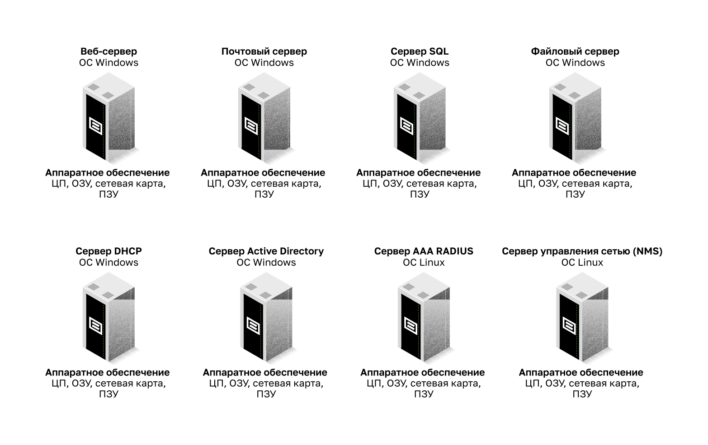
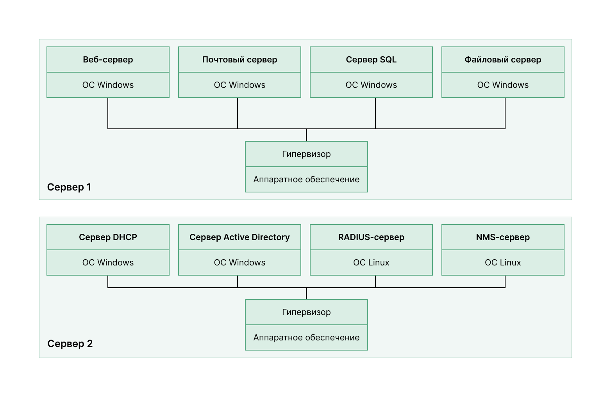
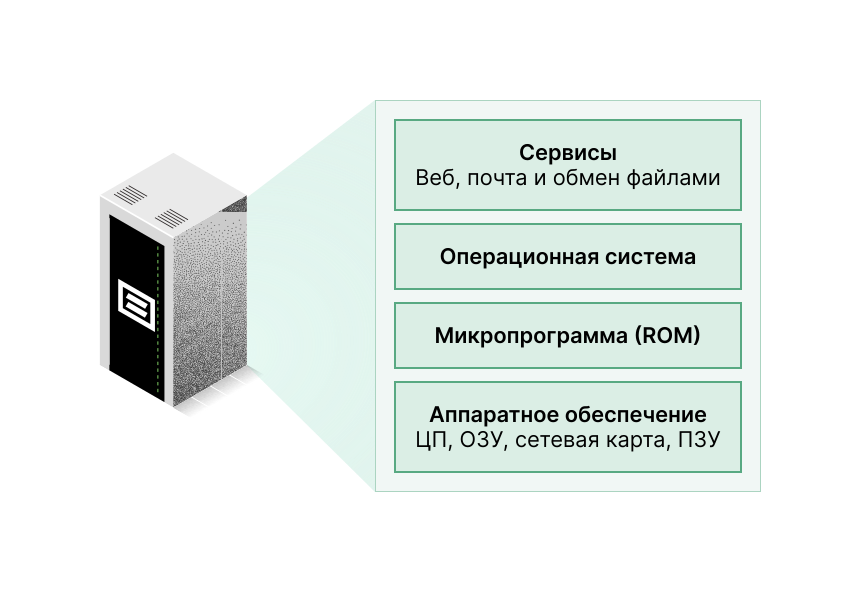
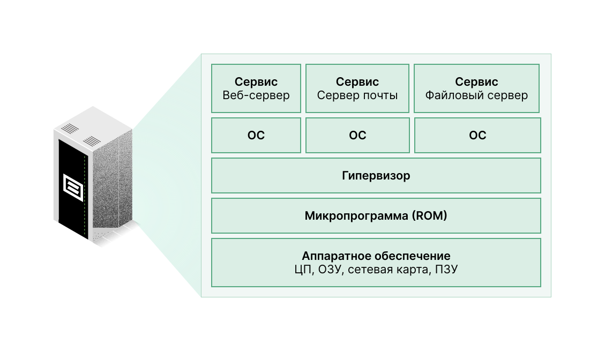
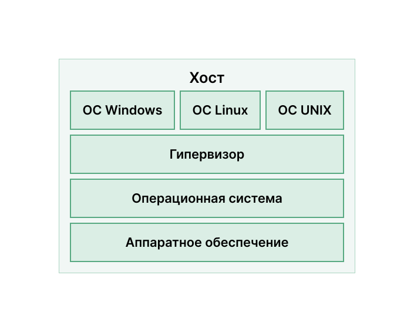

<!-- 13.2.1 -->
## Облачные вычисления и виртуализация

В предыдущем разделе вы узнали об облачных службах и моделях. В этом разделе разберем виртуализацию. Термины «облачные вычисления» и «виртуализация» нередко используются взаимозаменяемо, однако значение у них разное. Виртуализация — это основа облачных вычислений. Без нее невозможно реализовать их самые распространенные варианты.

Виртуализация отделяет операционную систему от аппаратного обеспечения. Поставщики предоставляют облачные виртуальные сервисы, в которых серверы предоставляются динамически, в соответствии с потребностью в них. Например, Amazon Web Services (AWS) дает клиентам простой способ динамически предоставлять необходимые им вычислительные ресурсы. Соответствующие виртуализированные экземпляры серверов создаются по запросу. Как показано на рисунке, администратор сети может развертывать из Консоли управления AWS разные сервисы, включая виртуальные машины, веб-приложения, виртуальные серверы и подключения к устройствам IoT.

<!--
На рисунке показана консоль управления Amazon Web Services. Она состоит из четырех разделов: «Сервисы AWS», «Создание решения», «Доступ на ходу» и «Изучение AWS». В разделе «Сервисы AWS» можно искать сервисы, вводя имена, ключевые слова или сокращения. В разделе «Создать решение» есть варианты запуска виртуальной машины, создания веб-приложения, построения с использованием виртуальных серверов или подключения устройства IoT. В разделе «Доступ на ходу» есть ссылка для загрузки мобильного приложения консоли управления. В разделе «Изучение AWS» можно щелкнуть ссылки, чтобы узнать о глобальных саммитах AWS, Amazon RDS, Open distro for Elasticsearch и Amazon Sagemaster.-->

<!-- 13.2.2 -->
## Выделенные серверы

Чтобы в полной мере оценить возможности виртуализации, сначала необходимо познакомиться с историей серверных технологий. Исторически корпоративные серверы состояли из серверной операционной системы, например Windows Server или серверного варианта Linux, установленных на специфическое аппаратное обеспечение, как показано на рисунке. Оперативная память, процессорная мощность и дисковое пространство выделялись для предоставляемых сервисов (Интернет, электронная почта и пр.).

**Выделенные серверы**

<!-- /courses/ensa-dl/ae8eb398-34fd-11eb-ba19-f1886492e0e4/aeb65fda-34fd-11eb-ba19-f1886492e0e4/assets/c70d7da2-1c46-11ea-af56-e368b99e9723.svg -->

<!--
На рисунке показаны восемь различных серверов: веб-сервер, почтовый сервер, SQL-сервер, файловый сервер, DHCP-сервер, сервер Active Directory, AAA-сервер Radius и сервер управления сетью. Все, кроме AAA Radius и сервера управления сетью, работают под управлением ОС Windows, последняя работает под управлением ОС Linux. У всех серверов следующее оборудование: CPU, Memory, NIC и Disk.
-->

Основная проблема такой конфигурации в том, что во время сбоя на каком-либо компоненте, предоставляемый этим сервером сервис становится недоступным. Это называется конфигурацией с единой точкой отказа. Другая проблема в неполном использовании мощностей выделенных серверов. Часто они подолгу находились в состоянии простоя, ожидая запрос. Эти серверы тратили впустую энергию и занимали больше места, чем было обусловлено количеством предоставляемых услуг. Такая ситуация называется разрастанием числа серверов.

<!-- 13.2.3 -->
## Виртуализация серверов

Виртуализация серверов позволяет использовать незадействованные ресурсы и объединяет несколько необходимых серверов. Она позволяет размещать и запускать несколько операционных систем на одной аппаратной платформе.

Например, восемь ранее выделенных серверов на рисунке объединились в два с помощью гипервизоров, поддерживающих несколько виртуальных экземпляров операционных систем.

**Установка операционной системы гипервизора**

<!-- /courses/ensa-dl/ae8eb398-34fd-11eb-ba19-f1886492e0e4/aeb65fda-34fd-11eb-ba19-f1886492e0e4/assets/c70edd30-1c46-11ea-af56-e368b99e9723.svg -->

<!--
На рисунке используются две ветвящихся диаграммы. Начиная снизу, у сервера 1 аппаратное обеспечение с гипервизором сверху, от которого ветвятся четыре ОС Windows. Поверх первой — веб-сервер. Поверх второй — сервер электронной почты. Поверх третьей — SQL-сервер. Поверх четвертой — файловый сервер. Начиная снизу, у сервера 2 аппаратное обеспечение с гипервизором сверху, от которого ветвятся четыре ОС Windows. Поверх первой ОС Windows — DHCP-сервер. Поверх второй — активный сервер каталогов. Поверх третьей — RADIUS-сервер. Поверх четвертой — сервер управления сетью. 
-->

Для виртуализации обычно используют резервирование, чтобы избежать ситуации с единой точкой отказа. Его реализуют разными способами. В случае сбоя на одном гипервизоре виртуальную машину можно перезапустить на другом. Кроме того, одну виртуальную машину можно запустить на двух гипервизорах одновременно, создав зеркальную копию ОЗУ и ЦП. Сервисы, запущенные на виртуальных машинах, тоже виртуальные, их можно установить или удалить по необходимости.

Гипервизор — это программа, встроенное ПО или аппаратные средства, которые добавляют уровень абстракции поверх реальных физических аппаратных средств. Этот уровень абстракции используется для создания виртуальных машин с доступом ко всем аппаратным средствам физического компьютера, включая ЦП, память, контроллеры дисков и сетевые интерфейсные платы. На каждой из этих машин работает отдельная полноценная операционная система. Теперь с помощью виртуализации предприятия могут объединить необходимое им число серверов. Например, нет ничего необычного в объединении 100 физических серверов в форме виртуальных машин, выполняющихся на 10 физических серверах с помощью гипервизоров.

<!-- 13.2.4 -->
## Преимущества виртуализации

Одно из главных преимуществ виртуализации — общее снижение расходов.

* **Требуется меньше оборудования** — виртуализация обеспечивает консолидацию серверов, при которой требуется меньше физических серверов, сетевых устройств и поддерживающей инфраструктуры. Следовательно, расходы на обслуживание сокращаются.
* **Потребляется меньше энергии**  — консолидация серверов снижает ежемесячные расходы на электроэнергию и охлаждение. Снижение энергопотребления помогает предприятиям уменьшить объем выбросов парниковых газов.
* **Требуется меньше пространства**  — консолидация серверов за счет виртуализации снижает общий объем, занимаемый центром обработки данных. Уменьшение количества серверов, сетевых устройств и стоек сокращает занимаемые площади.

Ниже перечислены дополнительные преимущества виртуализации.

* **Проще разрабатывать прототипы**  — можно быстро создавать автономные лаборатории, действующие в изолированных сетях, чтобы развертывать и тестировать новые сетевые решения. При ошибке администратор может без труда вернуться к предыдущей версии. Тестовые среды могут находиться в сети, но при этом быть изолированными от пользователей. Когда тестирование завершится, серверы и системы можно развертывать для использования конечными пользователями.
* **Быстрее подготовить серверы**  — создать виртуальный сервер намного быстрее, чем выделить и подготовить к работе физический сервер.
* **Серверы дольше работают бесперебойно**  — сейчас большинство платформ виртуализации серверов реализуют усовершенствованные функции отказоустойчивости, такие как перенос работающих систем, перенос систем хранения, высокая доступность и планирование распределения ресурсов.
* **Улучшенное аварийное восстановление**  — виртуализация предоставляет усовершенствованные решения для непрерывности бизнес-процессов. Благодаря аппаратной абстракции на узле восстановления больше не нужно оборудование, как в производственной среде. В большинство корпоративных платформ виртуализации серверов входит программное обеспечение, которое помогает тестировать и автоматизировать переключение при отказе до аварийной ситуации.
* **Поддерживаются устаревшие версии**  — виртуализация может продлить использование устаревших операционных систем и приложений, давая организации больше времени на переход к новым решениям.

<!-- 13.2.5 -->
## Уровни абстракции

Чтобы объяснить, как работает виртуализация, полезно использовать уровни абстракции в компьютерных архитектурах. Как показано на рисунке, компьютерная система состоит из следующих уровней абстракции:

* сервисы;
* ОС;
* микропрограмма;
* аппаратное обеспечение.

<!-- /courses/ensa-dl/ae8eb398-34fd-11eb-ba19-f1886492e0e4/aeb65fda-34fd-11eb-ba19-f1886492e0e4/assets/c70feea2-1c46-11ea-af56-e368b99e9723.svg -->

<!--
На рисунке показаны уровни абстракции в компьютерной системе. Уровнями являются сервисы (веб-серверы, серверы электронной почты и файловые серверы), ОС, микропрограмма (ROM) и аппаратное обеспечение (процессор, память, сетевая плата и диск).
-->

На каждом из этих уровней абстракции используется определенный тип программного кода в качестве интерфейса между уровнем ниже и уровнем выше. Например, язык программирования C часто используют для разработки микропрограммного обеспечения, которое взаимодействует с аппаратным обеспечением.

На рисунке показан пример виртуализации. Между микропрограммой и операционной системой установлен гипервизор. Он поддерживает несколько экземпляров ОС.

<!-- /courses/ensa-dl/ae8eb398-34fd-11eb-ba19-f1886492e0e4/aeb65fda-34fd-11eb-ba19-f1886492e0e4/assets/c71063d0-1c46-11ea-af56-e368b99e9723.svg -->

<!--
На рисунке приведен пример уровней виртуализации и абстракции. Уровни, начинающиеся снизу: аппаратное обеспечение (процессор, память, сетевая плата и диск), микропрограмма (ROM), гипервизор, ОС и сервис. Рисунок разветвляется после гипервизора. Три ветви состоят из ОС и сервисов (веб-сервер, сервер электронной почты и файловый сервер).
-->

<!-- 13.2.6 -->
## Гипервизоры типа 2

Гипервизор типа 2 — ПО, которое создает и обеспечивает работу экземпляров виртуальных машин. Компьютер, в котором гипервизор поддерживает одну или несколько виртуальных машин, называется хостом (хост-компьютером). Гипервизоры типа 2 также называют гипервизорами на основе базовой ОС, потому что их устанавливают поверх имеющейся операционной системы, будь то Mac OS X, Windows или Linux. После этого один или несколько дополнительных экземпляров ОС устанавливают поверх гипервизора, как показано на рисунке.

<!-- /courses/ensa-dl/ae8eb398-34fd-11eb-ba19-f1886492e0e4/aeb65fda-34fd-11eb-ba19-f1886492e0e4/assets/c710d902-1c46-11ea-af56-e368b99e9723.svg -->

<!--
На рисунке показан гипервизор типа 2 на главном компьютере. Начиная снизу, хост имеет аппаратное обеспечение с операционной системой сверху, операционная система имеет гипервизор сверху и ветвящиеся от него три операционные системы: ОС Windows, ОС Linux и ОС Unix. 
-->

Главное преимущество гипервизоров типа 2 в том, что при их использовании не требуется консоль управления.

Гипервизоры типа 2 очень популярны среди заказчиков и организаций, использующих виртуализацию. Распространенные гипервизоры типа 2:

* Virtual PC;
* VMware Workstation;
* Oracle VM VirtualBox;
* VMware Fusion;
* Mac OS X Parallels.

Многие из них — бесплатные. Некоторые гипервизоры предлагают дополнительные функции за отдельную плату.

**Примечание:** Важно гарантировать, что базовая машина достаточно надежна для установки и выполнения виртуальных машин, что ее ресурсов хватит с запасом.

<!-- 13.2.7 -->
<!-- quiz -->

