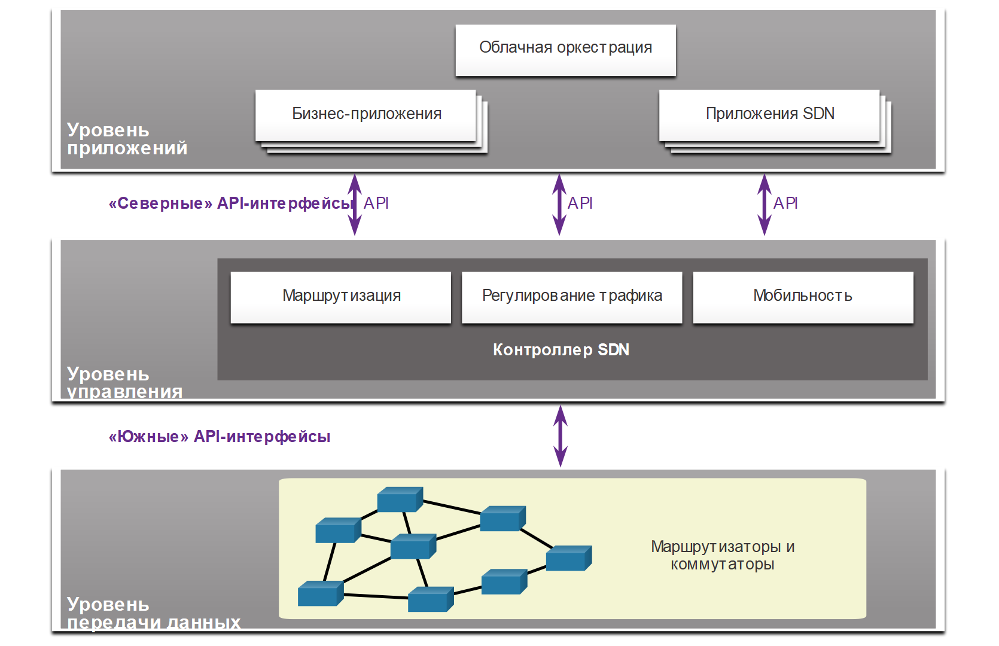

<!-- 13.4.1 -->
## Видео: Программно-определяемые сети

Нажмите кнопку «Воспроизведение», чтобы просмотреть видео о сетевом программировании, программно-определяемой сети (SDN) и контроллерах.

<!-- 13.4.2 -->
## Уровень управления и уровень передачи данных

В предыдущем разделе описывалась инфраструктура виртуальной сети. В этом разделе рассмотрим программно-определяемые сети SDN. Про него рассказывалось в видео. Здесь мы рассмотрим более подробную информацию.

Сетевое устройство содержит:

* **Уровень управления**  — мозг устройства. Он принимает решения о пересылке данных. Уровень содержит механизмы пересылки уровня 2 и 3, например таблицы соседей протокола маршрутизации и таблицы топологии, таблицы маршрутизации IPv4 и IPv6, STP и таблицу ARP. Данные, передаваемые на уровень управления, обрабатываются ЦП.
* **Уровень передачи данных**  — его также называют уровнем пересылки. Обычно он представляет коммутационную структуру, которая связывает разные сетевые порты на устройстве. Уровень передачи данных каждого устройства используется для пересылки потоков трафика. Маршрутизаторы и коммутаторы используют данные уровня управления для пересылки входящего трафика на соответствующий выходной интерфейс. Информация на уровне передачи данных обычно обрабатывается специальным процессором без участия ЦП.

**Коммутатор уровня 3 и CEF**

На рисунке показано, как технология Cisco Express Forwarding (CEF) использует уровни управления и передачи данных для обработки пакетов.

Пересылку пакетов на уровне передачи данных без обращения к уровню управления обеспечивает CEF — технология IP-коммутации уровня 3. В ней с помощью таблицы маршрутизации уровня управления предварительно заполняется база данных пересылки на уровне передачи. Таблица протоколов разрешения адресов уровня управления предварительно заполняется из таблицы отношений смежности. Затем пакеты перенаправляются непосредственно уровнем передачи данных, исходя из информации в таблицах быстрой пересылки (FIB) и отношений смежности, без обращения к данным уровня управления.

**Уровень управления и уровень передачи данных**

<!-- /courses/ensa-dl/ae8eb398-34fd-11eb-ba19-f1886492e0e4/aeb686e0-34fd-11eb-ba19-f1886492e0e4/assets/c715bb00-1c46-11ea-af56-e368b99e9723.svg -->

**SDN и центральный контроллер**

SDN — это в основном разделение уровней управления и передачи данных. Для виртуализации сети с каждого устройства удаляется функция уровня управления, которую начинает исполнять один централизованный контроллер, как показано на рис. 2. Он передает команды каждому устройству. Они в свою очередь могут сосредоточиться на пересылке данных, а централизованный контроллер управляет их потоком, повышает безопасность и предоставляет другие услуги.

**Уровень централизованного управления**

<!-- /courses/ensa-dl/ae8eb398-34fd-11eb-ba19-f1886492e0e4/aeb686e0-34fd-11eb-ba19-f1886492e0e4/assets/c7160922-1c46-11ea-af56-e368b99e9723.svg -->

**Уровень управления**

<!-- 13.4.3 -->
На рисунках не показан уровень, который отвечает за управление устройством через его подключение к сети. Администраторы используют такие приложения, как Secure Shell (SSH), Trivial File Transfer Protocol (TFTP), Secure FTP и Secure Hypertext Transfer Protocol (HTTPS) для доступа к уровню управления и настройки устройства. Уровень управления — это то, как вы обращались к устройствам и настраивали их в своих сетевых исследованиях. Также его используют такие протоколы, как SNMP.

<!-- 13.4.3 -->
## Технологии виртуализации сети

Более 10 лет назад компания VMware разработала технологию виртуализации, которая позволяла ОС хоста поддерживать работу одной или нескольких клиентских. На ней и основано большинство современных технологий виртуализации. Переход от выделенных серверов к виртуализированным освоен и активно внедряется в центрах обработки данных и сетях предприятий.

Для поддержки виртуализации сети разработаны две основные сетевые архитектуры:

* **Программно-определяемая сеть (SDN)**  — виртуализирует сеть, предлагая новый подход к администрированию и управлению, упрощающий и оптимизирующий процесс.
* **Ориентированная на приложения архитектура Cisco (ACI)**  — специализированное аппаратное решение для интеграции облачных вычислений и управления ЦОД.

Компоненты SDN могут включать:

* **OpenFlow**  — подход, разработанный в Стэнфордском университете, для управления трафиком между маршрутизаторами, коммутаторами, точками беспроводного доступа и контроллером. Протокол OpenFlow — базовый элемент в построении решений SDN. Поищите в Интернете OpenFlow и Open Networking Foundation для получения дополнительной информации.
* **OpenStack** — платформа виртуализации и оркестрации, предназначенная для создания масштабируемых облачных сред и предоставления решения IaaS. OpenStack часто используется с Cisco ACI. Оркестрация — автоматизация выделения сетевых компонентов: серверов, хранилищ, коммутаторов, маршрутизаторов и приложений. Поищите в Интернете OpenStack для получения дополнительной информации.
* **Другие компоненты**  — интерфейс с системой маршрутизации (I2RS), прозрачная взаимосвязь с большим числом каналов (TRILL), Cisco FabricPath (FP), а также построение мостов по кратчайшему пути IEEE 802.1aq (SPB).

<!-- /courses/ensa-dl/ae8eb398-34fd-11eb-ba19-f1886492e0e4/aeb686e0-34fd-11eb-ba19-f1886492e0e4/assets/c7167e54-1c46-11ea-af56-e368b99e9723.svg -->

<!-- 13.4.4 -->
## Традиционная архитектура и архитектура SDN

В традиционной маршрутизируемой или коммутируемой архитектуре функции уровня управления и уровня передачи данных объединены на одном устройстве. Решения о маршрутизации и пересылке пакетов принимаются операционной системой устройства. В SDN уровень управления перемещается на централизованный контроллер SDN. На рисунке сравнивается SDN и традиционная архитектура.

<!-- /courses/ensa-dl/ae8eb398-34fd-11eb-ba19-f1886492e0e4/aeb686e0-34fd-11eb-ba19-f1886492e0e4/assets/c716f381-1c46-11ea-af56-e368b99e9723.svg -->

Контроллер SDN — логическая сущность, которая позволяет сетевым администраторам определять, как уровень передачи данных на коммутаторах и маршрутизаторах будет обрабатывать сетевой трафик. Он координирует, служит посредником и организует взаимодействие между приложениями и сетевыми элементами.

Полная структура SDN показана на рисунке. Обратите внимание на использование программных интерфейсов (API) в рамках SDN. API — это набор стандартизованных запросов, которые задают для приложения надлежащий способ запрашивать сервисы из другого приложения. Контроллер SDN использует «северные» API-интерфейсы для обмена данными с вышестоящими приложениями. Они помогают администраторам формировать трафик и разворачивать службы. Контроллер SDN с помощью «южных» API-интерфейсов определяет поведение уровней данных на нисходящих коммутаторах и маршрутизаторах. OpenFlow — это оригинальный и широко используемый «южный» API-интерфейс.

<!-- /courses/ensa-dl/ae8eb398-34fd-11eb-ba19-f1886492e0e4/aeb686e0-34fd-11eb-ba19-f1886492e0e4/assets/c717b6d0-1c46-11ea-af56-e368b99e9723.svg -->

<!-- 13.4.5 -->
<!-- quiz -->

