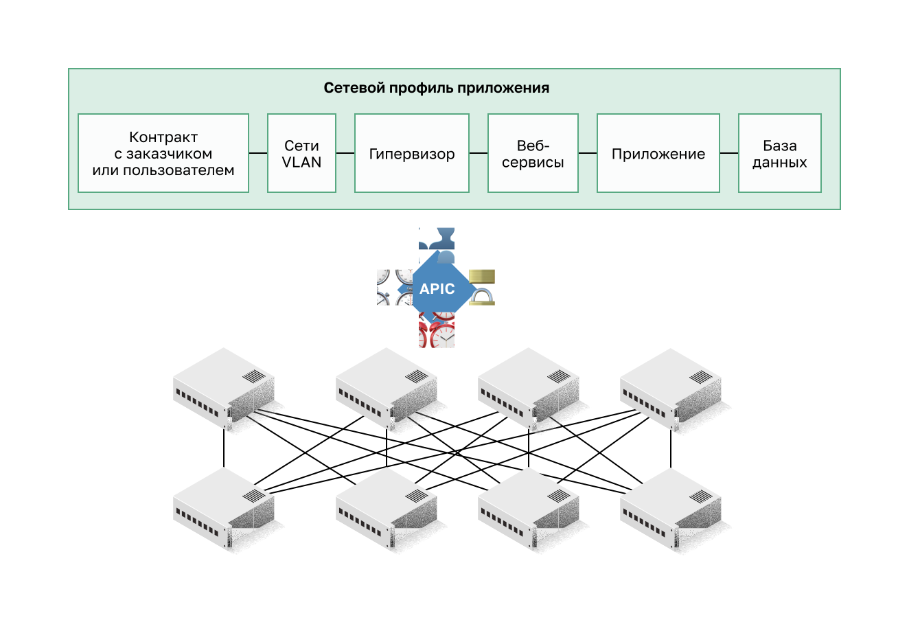
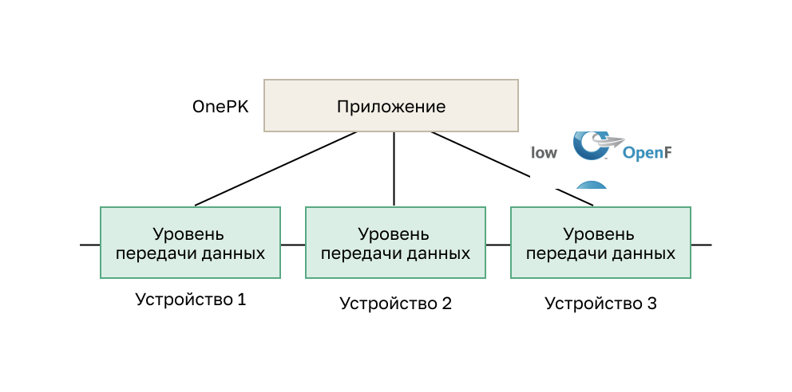
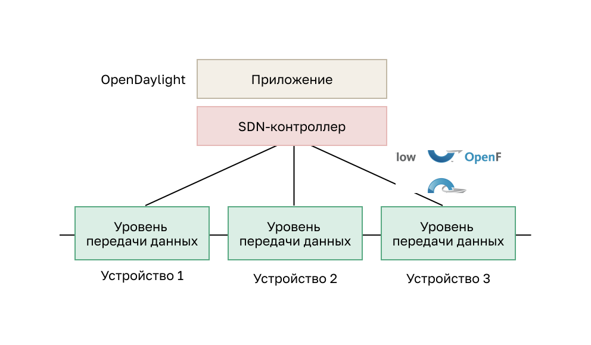
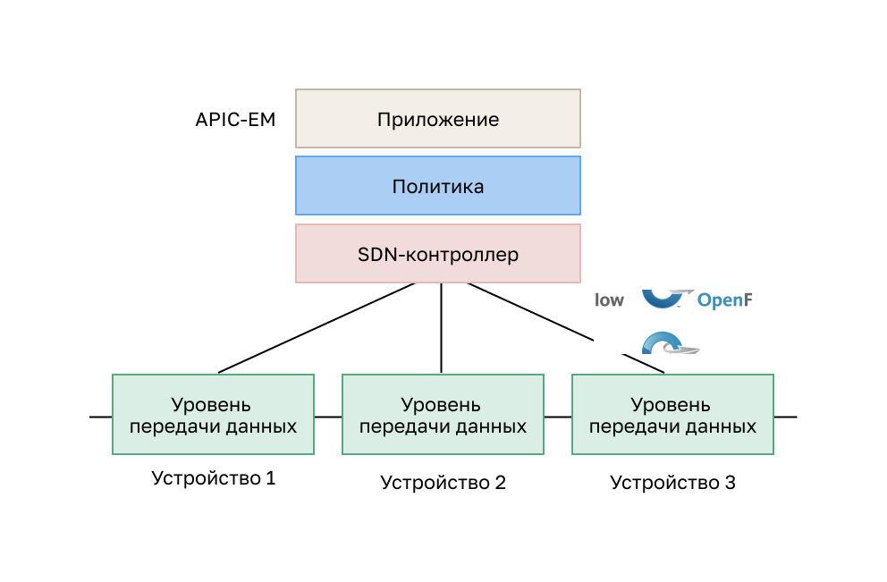

<!-- 13.5.1 -->
## Контроллер и операции SDN

Предыдущая тема охватывала компоненты SDN. В этом разделе будут описаны контроллеры.

Контроллер SDN определяет потоки данных между централизованным уровнем управления и уровнями передачи данных на отдельных маршрутизаторах и коммутаторах.

Каждый из потоков, проходящих по сети, сначала должен получить разрешение от контроллера SDN, который проверяет, разрешен ли такой обмен данными в соответствии с сетевыми политиками. Если контроллер разрешает поток, он рассчитывает для него маршрут и добавляет запись в каждом из коммутаторов на пути.

Контроллер выполняет все сложные функции. Он заполняет таблицы потоков, которыми управляют коммутаторы. На рисунке контроллер SDN обменивается данными с коммутаторами, совместимыми с OpenFlow, используя этот протокол. В нем с помощью TLS можно безопасно отправить сообщения уровня управления. Все коммутаторы OpenFlow подключаются друг к другу. Они также могут подключаться к оконечным устройствам, которые являются частью потока пакетов.

<!-- /courses/ensa-dl/ae8eb398-34fd-11eb-ba19-f1886492e0e4/aeb686e2-34fd-11eb-ba19-f1886492e0e4/assets/c71a27d0-1c46-11ea-af56-e368b99e9723.svg -->

<!--
На рисунке контроллер SDN взаимодействует с поддерживающими OpenFlow коммутаторами. У них есть таблицы счетчиков, групп и потоков, которые реализованы в аппаратном обеспечении. У коммутаторов OpenFlow также есть защищенный канал, реализованный программным обеспечением. Контроллер SDN связывается с двумя из них по протоколу OpenFlow по защищенному каналу TLS. Переключатели подключены к трем конечным устройствам.
-->

В каждом коммутаторе есть набор таблиц, реализованных на уровне аппаратных средств, или микропрограммы для управления потоками пакетов. Поток представляет собой последовательность пакетов, которая соответствует определенной записи в соответствующей таблице.

Три типа таблиц:

* **Таблица потоков.**  Для сопоставления входящих пакетов с конкретным потоком и определения вполняемых для них функций. Несколько таких таблиц могут работать как конвейер.
* **Таблица групп.**  Таблица потоков может направлять поток в таблицу групп, которая запускает действия, влияющие на них.
* **Таблица счетчиков.**  Запускает связанные с производительностью операции в потоке, включая возможность ограничения скорости трафика.

<!-- 13.5.2 -->
## Видео: Cisco ACI

На деле немногие организации хотят или обладают достаточной квалификацией, чтобы программировать сети с помощью средств SDN. Однако большинство хочет автоматизировать сеть, ускорить развертывание приложений и привести свою IT-инфраструктуру в соответствие с бизнес-требованиями. Компания Cisco разработала ориентированную на приложения инфраструктуру (ACI), чтобы решать эти задачи более современными и инновационными способами, чем основаные на SDN.

Архитектура Cisco ACI — специализированное аппаратное решение для интеграции облачных вычислений и управления ЦОД. На верхнем уровне элемент управления политиками сети удаляется из уровня передачи данных. Это упрощает создание сетей центра обработки данных.

Нажмите кнопку «Воспроизведение», чтобы просмотреть видео об эволюции SDN и ACI.

<!-- 13.5.3 -->
## Основные компоненты архитектуры ACI

* **Сетевой профиль приложения (ANP)**  — набор групп оконечных устройств (EPG), их подключений, а также политик, определяющих эти подключения. Группы EPG, показанные на рисунке, такие как сети VLAN, веб-сервисы и приложения, приведены в качестве примера. Часто ANP гораздо сложнее.
* **Контроллер Cisco APIC (Application Policy Infrastructure Controller)**  — мозг архитектуры ACI. APIC — это централизованный программный контроллер, который управляет масштабируемой кластеризованной структурой ACI. Его разработали, чтобы обеспечить возможности программирования и централизованного управления. Он преобразует политики приложений в сетевой программный код.
* **Коммутаторы Cisco Nexus серии 9000**  — реализуют коммутационную структуру с учетом работы приложений и работают совместно с контроллером Cisco APIC, обеспечивая управление инфраструктурой виртуальной и физической сети.

Контроллер APIC располагается между ANP и сетевой инфраструктурой ACI. На рисунке APIC преобразует требования приложений в настройке сети, соответствующей этим требованиям.

<!-- /courses/ensa-dl/ae8eb398-34fd-11eb-ba19-f1886492e0e4/aeb686e2-34fd-11eb-ba19-f1886492e0e4/assets/c71b3943-1c46-11ea-af56-e368b99e9723.svg -->

<!--
APIC преобразует требования приложений в настройке сети, соответствующей этим требованиям. Вверху находится профиль сети приложений, который состоит из контракта клиента или арендатора, VLAN, VMWare, веб-служб, приложений и базы данных. Ниже него находится APIC, а еще ниже — четыре коммутатора Cisco Nexus 9000 с избыточными связями с четырьмя другими коммутаторами.
-->

<!-- 13.5.4 -->
## Топология «ствол-листья» (Spine-Leaf)

Структура Cisco ACI состоит из контроллера APIC и коммутаторов Cisco Nexus серии 9000, использующих двухуровневую топологию «ствол и листья», как показано на рисунке. Листовые коммутаторы всегда соединяются со стволовыми, но никогда не соединяются друг с другом. Аналогично стволовые коммутаторы соединяются только с листовыми и базовыми коммутаторами (не показано). В этой двухъярусной топологии любой узел находится в одном переходе от любого другого узла.

Cisco APIC и все остальные устройства в сети физически соединены с листовыми коммутаторами.

В отличие от SDN, контроллер APIC напрямую не управляет каналом данных. Вместо этого он обеспечивает централизованное хранение определений политик и программирует листовые коммутаторы на пересылку трафика с учетом определенных политик.

<!-- /courses/ensa-dl/ae8eb398-34fd-11eb-ba19-f1886492e0e4/aeb686e2-34fd-11eb-ba19-f1886492e0e4/assets/c71bae72-1c46-11ea-af56-e368b99e9723.svg -->

<!--
На рисунке показана двухуровневая топология «ствол-листья». В верхней части находится Spine (ствол) с двумя коммутаторами Cisco Nexus 9500. У них избыточные соединения с листом, состоящим из четырех коммутаторов Cisco Nexus 9300. Они в свою очередь имеют избыточные связи с APIC и всеми другими сетевыми устройствами. 
-->

<!-- 13.5.5 -->
## Типы SDN

Модуль контроллера Cisco Application Policy Infrastructure Controller — Enterprise Module (APIC-EM) расширяет ACI функционалом, рассчитанным на развертывание в корпоративных средах и средах комплексов зданий. Чтобы лучше понять суть APIC-EM, полезно в общих чертах ознакомиться с тремя типами SDN.

**SDN на базе устройств**

В этом типе SDN устройства могут программироваться приложениями, работающими на самих устройствах или на сервере в сети, как показано на рисунке. Пример SDN на базе устройств — Cisco OnePK. Он позволяет программистам создавать приложения с помощью языков C и Java с Python для интеграции и взаимодействия с устройствами Cisco.

<!-- /courses/ensa-dl/ae8eb398-34fd-11eb-ba19-f1886492e0e4/aeb686e2-34fd-11eb-ba19-f1886492e0e4/assets/c71c4ab2-1c46-11ea-af56-e368b99e9723.svg -->

<!--
На рисунке приведен пример устройства SDN. В верхней части фигуры находится квадрат с надписью «Приложение» с тремя строками вниз до отдельных плоскостей данных. Cisco OnePK используется в качестве приложения и между приложением и плоскостями данных OpenFlow.
-->

**SDN на базе контроллера**

Этот тип SDN использует централизованный контроллер, который знает обо всех устройствах в сети, как показано на рисунке. Приложения могут взаимодействовать с контроллером, отвечающим за управление устройствами и обработку потоков трафика в сети. Контроллер Cisco Open SDN — коммерческий дистрибутив OpenDaylight.

<!-- /courses/ensa-dl/ae8eb398-34fd-11eb-ba19-f1886492e0e4/aeb686e2-34fd-11eb-ba19-f1886492e0e4/assets/c71cbfe3-1c46-11ea-af56-e368b99e9723.svg -->

<!--
На рисунке приведен пример SDN на основе контроллера. В верхней части рисунка находится квадрат с надписью «Приложение» с контроллером SDN под ним. У контроллера три линии до отдельных плоскостей данных. OpenDaylight используется в качестве контроллера SDN и между ним и плоскостями данных OpenFlow.
-->

**SDN на базе политик**

Этот тип SDN аналогичен SDN на базе контроллера, где централизованный контроллер знает обо всех устройствах в сети, как показано на рисунке. SDN на базе политик включает дополнительный уровень политик, который работает на более высоком уровне абстракции. Он использует встроенные приложения, которые автоматизируют задачи настройки с помощью управляемого рабочего процесса и удобного графического интерфейса пользователя. Навыки программирования не требуются. Пример такого типа SDN — Cisco APIC-EM.

<!-- /courses/ensa-dl/ae8eb398-34fd-11eb-ba19-f1886492e0e4/aeb686e2-34fd-11eb-ba19-f1886492e0e4/assets/c71d8330-1c46-11ea-af56-e368b99e9723.svg -->

<!--
На рисунке приведен пример SDN на основе политики. В верхней части рисунка находится квадрат с надписью «Приложение» с политикой между ним и контроллером SDN. От контроллера идут три линии до отдельных плоскостей данных. APIC-EM используется в качестве SDN и между контроллером и уровнями передачи данных OpenFlow.
-->

<!-- 13.5.6 -->
## Функции APIC-EM

У каждого из типов SDN есть свои особенности и преимущества. SDN на базе политик — наиболее надежный тип, предоставляющий простой механизм контроля и управления политиками во всей сети.

Cisco APIC-EM — пример SDN на базе политик. Cisco APIC-EM предоставляет единый интерфейс для управления сетью, включая:

* обнаружение и доступ к списку данных устройств и хоста;
* просмотр топологии (как показано на рисунке);
* трассировка пути между конечными точками и политики настройки.

<!--
На рисунке показана вкладка топологии на Cisco APIC-EM. Она начинается с облачного узла вверху. У облака ссылки на три маршрутизатора. Первый подключен к коммутаторам в сети кампуса. Она состоит из трех коммутаторов и узлов, соединенных с точкой доступа, подключенной к третьему коммутатору. К точке доступа подключено беспроводное устройство. Хост также подключен к третьему коммутатору. Второй роутер подключен к коммутатору. Третий подключен к коммутатору доступа филиала. Коммутатор подключен к хосту.
-->

<!-- 13.5.7 -->
## APIC-EM: Path Trace

APIC-EM Path Trace позволяют администратору легко визуализировать потоки трафика и обнаруживать любые конфликтующие, дублированные или теневые записи ACL. Этот инструмент исследует конкретные ACL-списки на пути между двумя конечными узлами и показывает все возможные неполадки. На рисунке вы можете видеть, как любые ACL вдоль пути разрешают или запрещают трафик, как показано на рисунке. Обратите внимание, как Branch-Router2 разрешает весь трафик. Теперь администратор сети может вносить коррективы, если это необходимо, для лучшей фильтрации трафика.

<!--
На рисунке показан инструмент трассировки пути APIC-EM и места, где ACL разрешают или запрещают трафик. Он показывает топологию трассировки и информацию об этих устройствах, такую как имя хоста, входящие и исходящие интерфейсы и VLAN. В примере топология начинается с источника, хост-устройство со стрелкой, помеченной переключателем, указывает от источника к коммутатору доступа к филиалу. Коммутатор имеет стрелку, помеченную как переключение между ним и маршрутизатором филиала. Маршрутизатор филиала имеет стрелку с надписью OSPF между ним и облаком. Стрелка Netflow указывает от облака к маршрутизатору кампуса. От него идет стрелка с надписью ECMP до коммутатора ядра кампуса. От основного коммутатора идет стрелка до распределительного коммутатора кампуса, обозначенного OSPF. От коммутатора-распределителя идет стрелка с надписью Inter VLAN routing до коммутатора доступа. От него идет стрелка до хоста назначения, помеченная как Switch.-->

<!-- 13.5.8 -->
<!-- quiz -->

