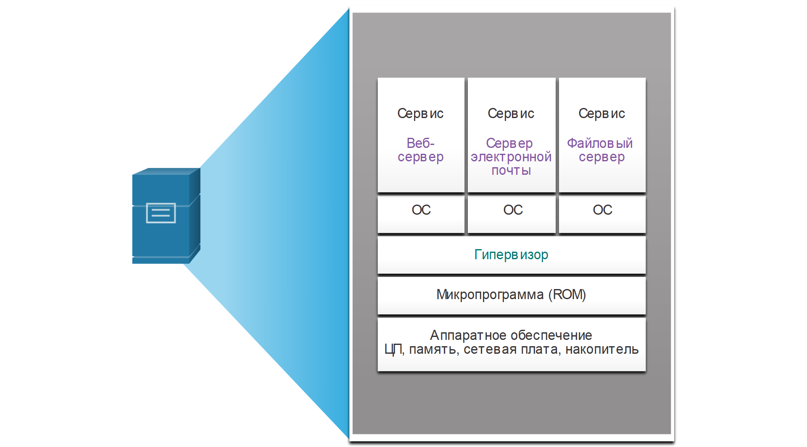

<!-- 13.2.1 -->
## Облачные вычисления и виртуализация

В предыдущем разделе вы узнали о облачных службах и облачных моделях. В этом разделе будет объяснено виртуализация. Термины «облачные вычисления» и «виртуализация» нередко используются взаимозаменяемо, однако значение у них разное. Виртуализация — это основа облачных вычислений. Без нее облачные вычисления в наиболее распространенных сегодня вариантах реализации были бы попросту невозможны.

Виртуализация отделяет операционную систему от аппаратного обеспечения. Различные поставщики предоставляют облачные виртуальные сервисы, в которых серверы могут предоставляться динамически, в соответствии с потребностью в них. Например, Amazon Web Services (AWS) предоставляет клиентам простой способ динамического предоставления необходимых им вычислительных ресурсов. Соответствующие виртуализированные экземпляры серверов создаются по запросу. Как показано на рисунке, администратор сети может развертывать различные сервисы из Консоли управления AWS, включая виртуальные машины, веб-приложения, виртуальные серверы и подключения к устройствам IoT.

<!--
The figure shows the Amazon Web Services Management Console. There are four sections on the AWS Management Console: AWS Services, Build a solution, Access on the go, and Explore AWS. Under AWS services is the option to search services by entering names, keywords or acronyms. Under Build a solution are options to launch a virtual machine, build a web app, build using virtual servers, or connect an IoT device. Under access on the go is a link to download the management console mobile app. Under Explore AWS are options to click on links to learn about AWS global summits, Amazon RDS, Open distro for Elasticsearch, and Amazon Sagemaster. 
-->

<!-- 13.2.2 -->
## Выделенные серверы

Чтобы в полной мере оценить возможности виртуализации, сначала необходимо познакомиться с историей серверных технологий. Исторически сложилось так, что корпоративные серверы состояли из серверной операционной системы, например Windows Server или серверного варианта Linux, установленных на специфическое аппаратное обеспечение, как показано на рисунке. Оперативная память, процессорная мощность и дисковое пространство выделялись для предоставляемых сервисов (например, Интернет, электронная почта и пр.).

**Выделенные серверы**

<!-- /courses/ensa-dl/ae8eb398-34fd-11eb-ba19-f1886492e0e4/aeb65fda-34fd-11eb-ba19-f1886492e0e4/assets/c70d7da2-1c46-11ea-af56-e368b99e9723.svg -->

<!--
На рисунке показаны различные выделенные серверы и их аппаратные и операционные системы. На рисунке показаны восемь различных серверов: веб-сервер, почтовый сервер, SQL-сервер, файловый сервер, DHCP-сервер, сервер Active Directory, AAA-сервер Radius и сервер управления сетью. Все, кроме сервера AAA Radius и сервера управления сетью, работают под управлением ОС Windows, последняя работает под управлением ОС Linux. Все серверы имеют следующее оборудование: CPU, Memory, NIC и Disk.
-->

Основная проблема такой конфигурации состоит в том, что, когда на каком-либо компоненте возникает сбой, сервис, предоставляемый этим сервером, становится недоступным. Такая конфигурация называется конфигурацией с единой точкой отказа. Другая проблема состояла в неполном использовании мощностей выделенных серверов. Выделенные серверы часто находились в течение долгого времени в состоянии простоя, ожидая запроса на предоставление соответствующего сервиса. Эти серверы тратили впустую энергию и занимали больше места, чем было обусловлено количеством предоставляемых услуг. Такая ситуация называется разрастанием числа серверов.

<!-- 13.2.3 -->
## Виртуализация серверов

Виртуализация серверов позволяет использовать незадействованные ресурсы и объединяет несколько необходимых серверов. Она позволяет размещать и запускать несколько операционных систем на одной аппаратной платформе.

Например, восемь ранее выделенных серверов на рисунке были консолидированы в два сервера с помощью гипервизоров, поддерживающих несколько виртуальных экземпляров операционных систем.

**Установка операционной системы гипервизора**

<!-- /courses/ensa-dl/ae8eb398-34fd-11eb-ba19-f1886492e0e4/aeb65fda-34fd-11eb-ba19-f1886492e0e4/assets/c70edd30-1c46-11ea-af56-e368b99e9723.svg -->

<!--
На рисунке приведен пример объединения восьми различных выделенных серверов в два сервера. На рисунке используются две ветвящихся диаграммы. Начиная снизу, сервер 1 имеет аппаратное обеспечение с гипервизором сверху, ветвящихся от гипервизора четыре операционных системы Windows. В верхней части первой ОС Windows является веб-сервер. Поверх второй ОС Windows является сервер электронной почты. Поверх третьей ОС Windows является SQL-сервер. В верхней части четвертой ОС Windows является файловый сервер. Начиная снизу, сервер 2 имеет аппаратное обеспечение с гипервизором сверху, ветвящихся от гипервизора четыре операционных системы Windows. Поверх первой ОС Windows является DHCP-сервер. В верхней части второй ОС Windows находится активный сервер каталогов. Поверх третьей ОС Windows является RADIUS-сервер. В верхней части четвертой ОС Windows является сервер управления сетью. 
-->

Использование виртуализации обычно предусматривает резервирование, чтобы избежать ситуации с единой точкой отказа. Резервирование можно реализовывать разными способами. В случае сбоя на гипервизоре виртуальную машину можно перезапустить на другом гипервизоре. Кроме того, одну виртуальную машину можно запустить на двух гипервизорах одновременно, создав зеркальную копию ОЗУ и ЦП. В случае сбоя на одном гипервизоре виртуальная машина продолжит работать на другом гипервизоре. Сервисы, запущенные на виртуальных машинах, также являются виртуальными и могут устанавливаться или удаляться по необходимости.

Гипервизор — это программа, встроенное ПО или аппаратные средства, которые добавляют уровень абстракции поверх реальных физических аппаратных средств. Этот уровень абстракции используется для создания виртуальных машин, которые имеют доступ ко всем аппаратным средствам физического компьютера, включая ЦП, память, контроллеры дисков и сетевые интерфейсные платы. На каждой из этих виртуальных машин работает отдельная полноценная операционная система. Теперь с помощью виртуализации предприятия могут консолидировать необходимое им число серверов. Например, нет ничего необычного в консолидации 100 физических серверов в форме виртуальных машин, выполняющихся на 10 физических серверах с помощью гипервизоров.

<!-- 13.2.4 -->
## Преимущества виртуализации

Одним из главных преимуществ виртуализации является общее снижение расходов.

* **Требуется меньше оборудования** — виртуализация обеспечивает консолидацию серверов, при которой требуется меньше физических серверов, меньше сетевых устройств и меньше поддерживающей инфраструктуры. Следовательно, расходы на обслуживание сокращаются.
* **Потребляется меньше энергии**  — консолидация серверов снижает ежемесячные расходы на электроэнергию и охлаждение. Снижение энергопотребления помогает предприятиям снизить объем выбросов парниковых газов.
* **Требуется меньше пространства**  — консолидация серверов за счет виртуализации снижает общий объем, занимаемый центром обработки данных. Уменьшение количества серверов, сетевых устройств и стоек сокращает занимаемые площади.

Ниже перечислены дополнительные преимущества виртуализации.

* **Упрощение разработки прототипов**  — можно быстро создавать автономные лаборатории, действующие в изолированных сетях, для развертывания и тестирования новых сетевых решений. В случае ошибки администратор может без труда вернуться к предыдущей версии. Тестовые среды могут находиться в сети, но при этом быть изолированными от пользователей. Когда тестирование будет завершено, серверы и системы можно развертывать для использования конечными пользователями.
* **Ускоренная подготовка серверов**  — создание виртуального сервера происходит намного быстрее, чем выделение и подготовка к работе физического сервера.
* **Увеличение времени бесперебойной работы серверов**  — сейчас большинство платформ виртуализации серверов реализуют усовершенствованные функции отказоустойчивости, такие как перенос работающих систем, перенос систем хранения, высокая доступность и планирование распределения ресурсов.
* **Улучшенное аварийное восстановление**  — виртуализация предоставляет усовершенствованные решения для обеспечения непрерывности бизнес-процессов. Она поддерживает аппаратную абстракцию, благодаря которой на узле восстановления больше не нужно иметь оборудование, идентичное оборудованию в производственной среде. В большинство корпоративных платформ виртуализации серверов входит программное обеспечение, которое помогает тестировать и автоматизировать переключение при отказе до того, как возникнет аварийная ситуация.
* **Поддержка устаревших версий**  — виртуализация может продлить использование устаревших операционных систем и приложений, давая организации больше времени на переход к новым решениям.

<!-- 13.2.5 -->
## Уровни абстракции

Чтобы объяснить, как работает виртуализация, полезно использовать уровни абстракции в компьютерных архитектурах. Как показано на рисунке, компьютерная система состоит из следующих уровней абстракции:

* Услуги
* ОС
* Микропрограмма
* Аппаратное обеспечение

<!-- /courses/ensa-dl/ae8eb398-34fd-11eb-ba19-f1886492e0e4/aeb65fda-34fd-11eb-ba19-f1886492e0e4/assets/c70feea2-1c46-11ea-af56-e368b99e9723.svg -->

<!--
На рисунке показаны уровни абстракции в компьютерной системе. Уровнями являются службы (веб-серверы, серверы электронной почты и файловые серверы. ), Операционная система, прошивка (ROM) и аппаратное обеспечение (процессор, память, сетевая плата и диск).
-->

На каждом из этих уровней абстракции используется определенный тип программного кода в качестве интерфейса между уровнем ниже и уровнем выше. Например, язык программирования C часто используется для программирования микропрограммного обеспечения, которое взаимодействует с аппаратным обеспечением.

На рисунке показан пример виртуализации. Между микропрограммой и операционной системой установлен гипервизор. Гипервизор поддерживает несколько экземпляров ОС.

<!-- /courses/ensa-dl/ae8eb398-34fd-11eb-ba19-f1886492e0e4/aeb65fda-34fd-11eb-ba19-f1886492e0e4/assets/c71063d0-1c46-11ea-af56-e368b99e9723.svg -->

<!--
На рисунке приведен пример уровней виртуализации и абстракции. Уровни, начинающиеся снизу: Оборудование (CPU, Memory, NIC и Disk), прошивка (ROM), гипервизор, ОС и сервис. Рисунок разветвляется на 3 ветви после гипервизора. Три ветви состоят из операционной системы и сервисов. Сервисами являются веб-сервер, сервер электронной почты и файловый сервер.
-->

<!-- 13.2.6 -->
## Гипервизоры типа 2

Гипервизор типа 2 — это программное обеспечение, которое создает и обеспечивает работу экземпляров виртуальных машин. Компьютер, в котором гипервизор поддерживает одну или несколько виртуальных машин, называется хостом (хост-компьютером). Гипервизоры типа 2 также называются гипервизорами на основе базовой ОС. Такое название используется потому, что эти гипервизоры устанавливаются поверх имеющейся ОС, будь то Mac OS X, Windows или Linux. После этого один или несколько дополнительных экземпляров ОС устанавливаются поверх гипервизора, как показано на рисунке.

<!-- /courses/ensa-dl/ae8eb398-34fd-11eb-ba19-f1886492e0e4/aeb65fda-34fd-11eb-ba19-f1886492e0e4/assets/c710d902-1c46-11ea-af56-e368b99e9723.svg -->

<!--
На рисунке показан гипервизор типа 2 на главном компьютере. Начиная снизу, хост имеет аппаратное обеспечение с операционной системой сверху, операционная система имеет гипервизор сверху, ветвящихся от гипервизора 3 операционные системы: ОС Windows, ОС Linux и ОС Unix. 
-->

Главное преимущество гипервизоров типа 2 состоит в том, что при их использовании не требуется консоль управления.

Гипервизоры типа 2 очень популярны среди заказчиков и организаций, использующих виртуализацию. Распространенные гипервизоры типа 2:

* Virtual PC
* VMware Workstation
* Oracle VM VirtualBox
* VMware Fusion
* Mac OS X Parallels

Многие из этих гипервизоров типа 2 являются бесплатными. Но некоторые гипервизоры предлагают дополнительные функции за отдельную плату.

**Примечание:** Важно гарантировать, что базовая машина достаточно надежна для установки и выполнения виртуальных машин, что ее ресурсов хватит с запасом.

<!-- 13.2.7 -->
<!-- quiz -->

