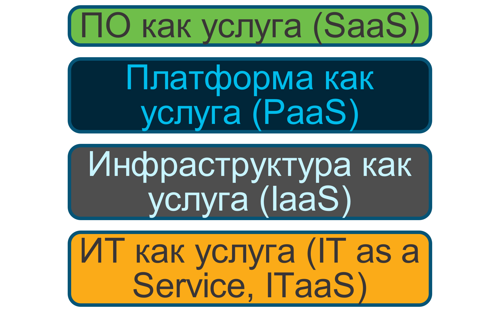
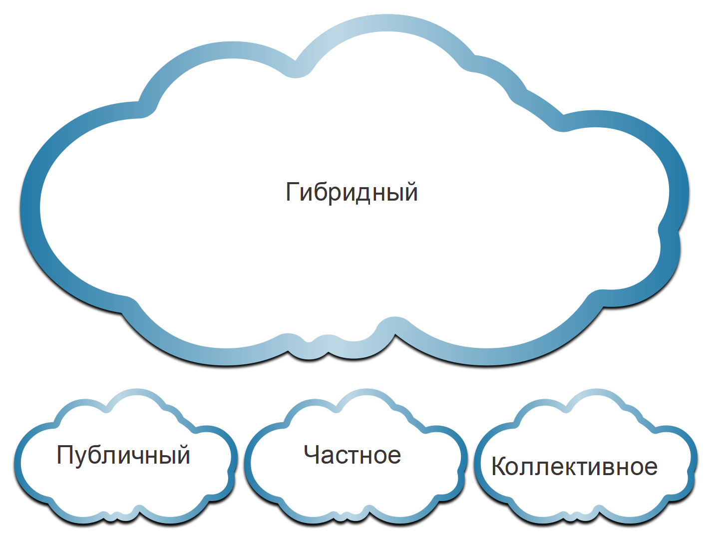

<!-- 13.1.1 -->
## Видео: Облако и виртуализация

Нажмите кнопку «Воспроизведение», чтобы ознакомиться с обзором облачных вычислений и виртуализации.

<!-- 13.1.2 -->
## Обзор облачных вычислений

В предыдущем видео был описан обзор облачных вычислений. Облачные вычисления предполагают наличие большого числа подключенных через сеть компьютеров, которые физически могут размещаться в любой точке земного шара. Поставщики услуг в большой мере полагаются на виртуализацию при предоставлении услуг облачных вычислений. Облачные вычисления помогают сократить операционные расходы за счет более эффективного использования ресурсов. Облачные вычисления решают различные проблемы управления данными:

* повсеместный доступ к данным организации в любое время;
* оптимизацию ИТ-инфраструктуры в организации за счет подписки только на необходимые сервисы;
* исключение или снижение необходимости развертывания и поддержки оборудования на площадках;
* сокращение затрат на оборудование и электроэнергию, уменьшение требований к материальной части и потребности в обучении персонала;
* оперативное реагирование на растущие требования к объему данных.

Облачные вычисления с моделью оплаты «по мере использования» позволяют организациям относиться к вычислениям и хранению как к коммунальной услуге и не инвестировать в инфраструктуру. В результате капиталовложения преобразуются в эксплуатационные расходы.

<!-- 13.1.3 -->
## Облачные сервисы

Существует множество разновидностей облачных сервисов, ориентированных на разные требования клиентов. Три основных типа услуг облачных вычислений, согласно определению Национального института по стандартам и технологиям (США) из особой публикации 800-145, следующие:

* **ПО как услуга (SaaS).**  Поставщик облачных сервисов отвечает за доступ к приложениям и услугам, таким как электронная почта, обмен данными или Office 365, предоставляемым через Интернет. Пользователь не управляет ни одним аспектом облачных служб, за исключением ограниченных пользовательских настроек приложения. От пользователя требуется только предоставить свои данные.
* **Платформа как услуга (PaaS).**  Поставщик облачных сервисов отвечает за доступ к средствам разработки и сервисам, используемым для предоставления приложений. Эти пользователи обычно являются программистами и могут контролировать параметры конфигурации среды размещения приложений облачного провайдера.
* **Инфраструктура как услуга (IaaS).**  Облачный поставщик отвечает за предоставление ИТ-менеджерам доступа к сетевому оборудованию, виртуализированным сетевым сервисам и поддержке сетевой инфраструктуры. Использование этого облачного сервиса позволяет ИТ-менеджерам развертывать и запускать программный код, который может включать операционные системы и приложения.

Как видно из рисунка, поставщики облачных услуг расширили эту модель также и на предоставление ИТ-поддержки для каждого из сервисов облачных вычислений (ИТ как услуга). Для предприятий модель ITaaS может расширить возможности сети без инвестиций в новую инфраструктуру, обучения нового персонала или лицензирований нового программного обеспечения. Эти экономичные сервисы доступны по запросу на любом устройстве в любой точке мира и обеспечивают должный уровень безопасности и функциональности.

<!-- /courses/ensa-dl/ae8eb398-34fd-11eb-ba19-f1886492e0e4/aeb65fd8-34fd-11eb-ba19-f1886492e0e4/assets/c70b5ac3-1c46-11ea-af56-e368b99e9723.svg -->

<!--
The figure shows 4 stacked text blocks. From top to bottom are SaaS, PaaS, IaaS, and ITaaS.
-->

<!-- 13.1.4 -->
## Облачные модели

Существует четыре основные модели облаков, показанные на рисунке.

* **Общедоступные облака.**  Облачные приложения и службы, предоставляемые в общедоступном облаке, доступны практически всем пользователям. Услуги могут быть бесплатными или могут предлагаться по схеме «оплата по факту использования», например, в случае оплаты интернет-хранилища. Общедоступное облако использует Интернет для предоставления услуг.
* **Частные облака.**  Облачные приложения и службы, предоставляемые в частном облаке, предназначены для определенной организации или юридического лица, например для государственного учреждения. Частное облако можно организовать, используя частную сеть компании. Однако создание и обслуживание такого облака может быть затратным. Управление частным облаком можно поручить внешней организации, которая способна обеспечить максимальную безопасность доступа.
* **Гибридные облака** - Гибридное облако состоит из двух или более облаков (например: частного и общедоступного), причем каждая из частей остается отдельным объектом, но они связаны между собой в рамках единой архитектуры. Пользователи, подключенные к гибридному облаку, могут иметь разные уровни доступа к услугам в зависимости от своих прав доступа.
* **Среды распределенных сетевых вычислений сообщества.**  Они создаются для исключительного использования определенным сообществом. Различия между общедоступным облаком и коллективным облаком заключаются в функциональных потребностях, настроенных для сообщества. Например, медицинские учреждения должны соблюдать политики и законы (например, HIPAA, закон об ответственности и переносе данных о страховании здоровья граждан), которые требуют особой аутентификации и конфиденциальности.

<!-- /courses/ensa-dl/ae8eb398-34fd-11eb-ba19-f1886492e0e4/aeb65fd8-34fd-11eb-ba19-f1886492e0e4/assets/c70ba8e3-1c46-11ea-af56-e368b99e9723.svg -->

<!--
На рисунке показаны 4 облака с надписью «Гибрид», «Публичный», «Частный» и «Сообщество».
-->

<!-- 13.1.5 -->
## Облачные вычисления и центр обработки данных

Термины «центр обработки данных» и «облачные вычисления» часто используются неправильно. Вот правильные определения центра обработки данных и облачных вычислений.

* **Центр обработки данных**: Обычно это специализированная система для хранения и обработки данных, принадлежащая ИТ-отделу компании или арендуемая у третьих сторон.
* **Облачные вычисления**: Как правило, размещенный не на территории заказчика сервис, который предоставляет доступ по запросу к совместно используемому пулу настраиваемых вычислительных ресурсов. Эти ресурсы можно быстро выделять и освобождать с минимальными усилиями по управлению.

Центры обработки данных — это физические средства, которые обеспечивают вычислительные, сетевые и складские потребности облачных вычислений. Поставщики облачных сервисов используют центры обработки данных для размещения своих облачных сервисов и облачных ресурсов.

ЦОД может занимать одно помещение в здании, один или несколько этажей или все здание. ЦОД обычно дорого создавать и обслуживать. По этой причине только крупные организации используют собственные ЦОД, чтобы размещать корпоративные данные и предоставлять услуги пользователям. Организации меньших размеров, которые не могут себе позволить содержание собственного частного ЦОД, могут сократить общие расходы на владение, взяв серверные мощности и сервисы хранения данных в облаке в лизинг у более крупной организации с ЦОД.

<!-- 13.1.6 -->
<!-- quiz -->

