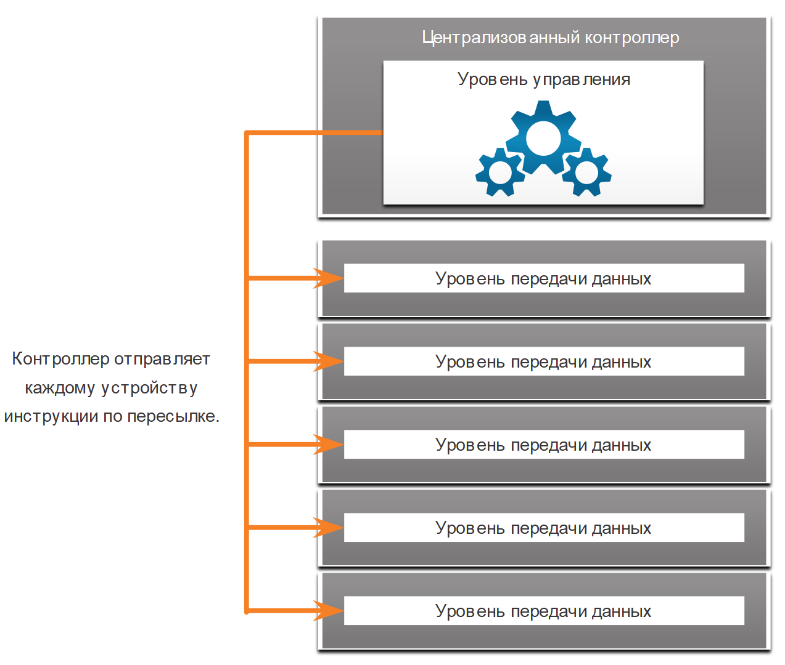
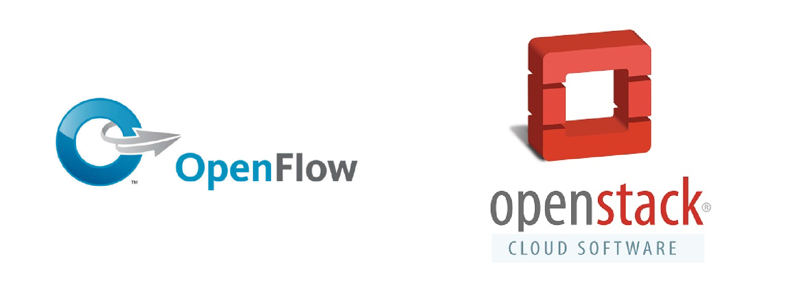

<!-- 13.4.1 -->
## Видео - Программно-определяемые сети

Нажмите «Воспроизвести», чтобы просмотреть видео о сетевом программировании, программно-определяемой сети (SDN) и контроллерах.

<!-- 13.4.2 -->
## Уровень управления и уровень передачи данных

В предыдущем разделе описывалась инфраструктура виртуальной сети. В этом разделе рассмотрим программно-определяемые сети SDN SDN объяснялось в предыдущем видео. Мы рассмотрим более подробную информацию здесь.

Сетевое устройство содержит следующие уровни:

* **Уровень управления**  — обычно считается мозгом устройства. Он принимает решения о пересылке данных. Уровень управления содержит механизмы пересылки уровня 2 и уровня 3, например таблицы соседей протокола маршрутизации и таблицы топологии, таблицы маршрутизации IPv4 и IPv6, STP и таблицу ARP. Данные, передаваемые на уровень управления, обрабатываются ЦП.
* **Уровень передачи данных**  — этот уровень, также называемый уровнем пересылки, обычно представляет коммутационную структуру, которая связывает разные сетевые порты на устройстве. Уровень передачи данных каждого устройства используется для пересылки потоков трафика. Маршрутизаторы и коммутаторы используют данные уровня управления для пересылки входящего трафика на соответствующий выходной интерфейс. Информация в плоскости данных обычно обрабатывается специальным процессором плоскости данных без участия ЦП.

**Коммутатор уровня 3 и CEF**

В на рисунке показано, как технология Cisco Express Forwarding (CEF) использует уровень управления и уровень передачи данных для обработки пакетов.

Пересылку пакетов на уровне передачи данных без обращения к уровню управления обеспечивает CEF — технология IP-коммутации уровня 3. В CEF с помощью таблицы маршрутизации уровня управления осуществляется предварительное заполнение таблицы базы данных пересылки CEF на уровне передачи данных. Таблица протоколов разрешения адресов уровня управления предварительно заполняется из таблицы отношений смежности. Затем пакеты перенаправляются непосредственно уровнем передачи данных, исходя из информации, содержащейся в таблице быстрой пересылки (FIB) и таблице отношений смежности, без необходимости в обращении к данным уровня управления.

**Уровень управления и уровень передачи данных**

<!-- /courses/ensa-dl/ae8eb398-34fd-11eb-ba19-f1886492e0e4/aeb686e0-34fd-11eb-ba19-f1886492e0e4/assets/c715bb00-1c46-11ea-af56-e368b99e9723.svg -->

<!--
В на рисунке показано, как технология Cisco Express Forwarding (CEF) использует уровень управления и уровень передачи данных для обработки пакетов. На рисунке изображены пять пакетов, входящих во входной интерфейс коммутатора уровня 3. Пакеты затем пересылаются уровнем передачи данных на выходной интерфейс на основе информации о FIB и таблице смежности. Контрольная плоскость находится над плоскостью данных на рисунке.
-->

**SDN и центральный контроллер**

SDN - это в основном разделение плоскости управления и плоскости данных. Для виртуализации сети с каждого устройства удаляется функция уровня управления, которую начинает исполнять один централизованный контроллер, как показано на рис. 2. Централизованный контроллер передает команды уровня управления каждому устройству. Теперь каждое устройство может сосредоточиться на пересылке данных, а централизованный контроллер управляет потоком данных, повышает безопасность и предоставляет другие услуги.

**Уровень централизованного управления**

<!-- /courses/ensa-dl/ae8eb398-34fd-11eb-ba19-f1886492e0e4/aeb686e0-34fd-11eb-ba19-f1886492e0e4/assets/c7160922-1c46-11ea-af56-e368b99e9723.svg -->

<!--
Централизованный контроллер передает команды уровня управления каждому устройству, как показано на рисунке. В верхней части рисунка находится централизованный контроллер уровня управления. Есть стрелки, указывающие от уровня управления на пять уровней данных. Контроллер отправляет каждому устройству инструкции по пересылке. 
-->

**Уровень управления**

На рисунках не показан уровень управления, который отвечает за управление устройством через его подключение к сети. Сетевые администраторы используют такие приложения, как Secure Shell (SSH), Trivial File Transfer Protocol (TFTP), Secure FTP и Secure Hypertext Transfer Protocol (HTTPS) для доступа к уровню управления и настройки устройства. Уровень управления - это то, как вы обращались к устройствам и настраивали их в своих сетевых исследованиях. Кроме того, такие протоколы, как протокол SNMP, используют уровень управления.

<!-- 13.4.3 -->
## Технологии виртуализации сети

Более 10 лет назад компания VMware разработала технологию виртуализации, которая позволяла ОС хоста поддерживать работу одной или нескольких клиентских ОС. На этой технологии и основано большинство современных технологий виртуализации. Переход от выделенных серверов к виртуализированным освоен и активно внедряется в центрах обработки данных и сетях предприятий.

Для поддержки виртуализации сети разработаны две основные сетевые архитектуры:

* **Программно-определяемая сеть (SDN)** — сетевая архитектура, которая виртуализирует сеть, предлагая новый подход к сетевому администрированию и управлению, направленный на упрощение и оптимизацию процесса администрирования.
* **Ориентированная на приложения архитектура Cisco (ACI)**  — специализированное аппаратное решение для интеграции облачных вычислений и управления ЦОД.

Компоненты SDN могут включать следующее:

* **OpenFlow**  — этот подход был разработан в Стэнфордском университете для управления трафиком между маршрутизаторами, коммутаторами, точками беспроводного доступа и контроллером. Протокол OpenFlow — это базовый элемент в построении решений SDN. Задайте поиск в интернете по OpenFlow и Open Networking Foundation для получения дополнительной информации.
* **OpenStack** - Этот подход представляет собой платформу виртуализации и оркестровки, предназначенную для создания масштабируемых облачных сред и предоставления решения IaaS. OpenStack часто используется с Cisco ACI. Оркестрации в сети — это процесс автоматизации выделения сетевых компонентов, таких как серверы, хранилища, коммутаторы, маршрутизаторы и приложения. Задайте поиск в интернете по OpenStack для получения дополнительной информации.
* **Другие компоненты**  — включают интерфейс с системой маршрутизации (I2RS), прозрачную взаимосвязь с большим числом каналов (TRILL), Cisco FabricPath (FP), а также построение мостов по кратчайшему пути IEEE 802.1aq (SPB).

<!-- /courses/ensa-dl/ae8eb398-34fd-11eb-ba19-f1886492e0e4/aeb686e0-34fd-11eb-ba19-f1886492e0e4/assets/c7167e54-1c46-11ea-af56-e368b99e9723.svg -->

<!-- 13.4.4 -->
## Традиционная архитектура и архитектура SDN

В традиционной маршрутизируемой или коммутируемой архитектуре функции уровня управления и уровня передачи данных объединены на одном устройстве. Решения о маршрутизации и пересылке пакетов принимаются операционной системой устройства. В SDN управление уровнем управления перемещается на централизованный контроллер SDN. На рисунке сравнивается традиционная и SDN архитектуры.

<!-- /courses/ensa-dl/ae8eb398-34fd-11eb-ba19-f1886492e0e4/aeb686e0-34fd-11eb-ba19-f1886492e0e4/assets/c716f381-1c46-11ea-af56-e368b99e9723.svg -->

<!--
На рисунке сравнивается традиционная и SDN архитектуры. Традиционная архитектура имеет три устройства с отдельными уровнями данных и уровнями управления. Архитектура SDN имеет централизованный уровень управления SDN, управляющую уровнями данных трех устройств. 
-->

Контроллер SDN — это логическая сущность, которая позволяет сетевым администраторам определять, как уровень передачи данных на коммутаторах и маршрутизаторах будет обрабатывать сетевой трафик. Он координирует, служит посредником и организует взаимодействие между приложениями и сетевыми элементами.

Полная структура SDN показана на рисунке. Обратите внимание на использование программных интерфейсов (API) в рамках SDN. API — это набор стандартизованных запросов, которые задают для приложения надлежащий способ запрашивать сервисы из другого приложения. Контроллер SDN использует «северные» API-интерфейсы для обмена данными с вышестоящими приложениями. Эти API-интерфейсы помогают сетевым администраторам формировать трафик и разворачивать службы. Контроллер SDN также использует «южные» API-интерфейсы для определения поведения уровней данных на нисходящих коммутаторах и маршрутизаторах. OpenFlow — это оригинальный и широко используемый «южный» API-интерфейс.

<!-- /courses/ensa-dl/ae8eb398-34fd-11eb-ba19-f1886492e0e4/aeb686e0-34fd-11eb-ba19-f1886492e0e4/assets/c717b6d0-1c46-11ea-af56-e368b99e9723.svg -->

<!--
На рисунке показана полная структура SDN. Рисунок имеет три раздела: слой приложения, уровень управления и уровень данных. На уровне приложений есть бизнес-приложения, облачная оркестрация и приложения SDN. На уровне управления находится контроллер SDN. Контроллер SDN обеспечивает маршрутизацию, проектирование трафика и мобильность. Между уровнем приложения и элементом управления находятся стрелки, указывающие на интерфейсы API, используемые для связи между SDN и приложениями. Уровень данных имеет топологию звезда из восьми маршрутизаторов и коммутаторов. Между уровнем управления и уровнем данных находится стрелка, указывающая API-интерфейсы, используемые между SDN и маршрутизаторами и коммутаторами.
-->

<!-- 13.4.5 -->
<!-- quiz -->

