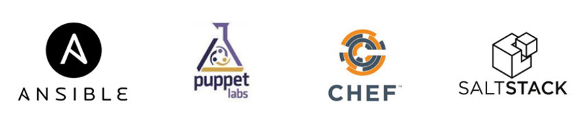

<!-- 14.5.1 -->
## Видео: Инструменты управления конфигурацией

Как упоминалось во введении к этому модулю, настройка сети может занять очень много времени. Инструменты управления конфигурацией могут помочь вам автоматизировать настройку маршрутизаторов, коммутаторов, брандмауэров и многих других аспектов вашей сети.

<!-- 14.5.2 -->
## Традиционная конфигурация сети

Сетевые устройства, такие как маршрутизатор, коммутаторы и брандмауэры, традиционно настраиваются сетевым администратором с помощью интерфейса командной строки, как показано на рисунке. Всякий раз, когда есть изменение или новая функция, необходимые команды конфигурации нужно вводить вручную на всех соответствующих устройствах. Во многих случаях это не только отнимает много времени, но и приводит к ошибкам. Это серьезная проблема для больших сетей или в сетей со сложными конфигурациями.

<!-- /courses/ensa-dl/ae8eb39a-34fd-11eb-ba19-f1886492e0e4/aeb686f0-34fd-11eb-ba19-f1886492e0e4/assets/c7392183-1c46-11ea-af56-e368b99e9723.svg -->

<!--
На рисунке показан сетевой администратор, использующий интерфейс командной строки для настройки сетевых устройств. Сетевой администратор сидит за компьютерным столом. Двухсторонние стрелки, помеченные как CLI, указывают от него на маршрутизатор, коммутатор ATM и коммутатор.
-->

Протокол SNMP разработали, чтобы администраторы могли управлять узлами: серверами, рабочими станциями, маршрутизаторами, коммутаторами и устройствами информационной безопасности в сети IP. Используя станцию управления сетью (NMS), показанную на следующем рисунке, SNMP позволяет сетевым администраторам отслеживать и управлять производительностью сети, находить и решать сетевые проблемы, а также выполнять запросы для получения статистики. SNMP работает достаточно хорошо для мониторинга устройств. Тем не менее, его обычно не используют для конфигурации из-за проблем безопасности и сложности в реализации. Хотя SNMP широко доступен, он не может служить инструментом автоматизации для современных сетей.

<!-- /courses/ensa-dl/ae8eb39a-34fd-11eb-ba19-f1886492e0e4/aeb686f0-34fd-11eb-ba19-f1886492e0e4/assets/c7396fa1-1c46-11ea-af56-e368b99e9723.svg -->

<!--
На рисунке показана станция управления сетью (NMS), использующая SNMP для управления устройствами. Двухсторонние стрелки, обозначенные SNMP, идут от NMS к маршрутизатору, коммутатору ATM и коммутатору.
-->

Вы также можете использовать API-интерфейсы для автоматизации развертывания и управления сетевыми ресурсами. Сетевой администратор может сделать это вместо ручной настройки портов, списков доступа, качества обслуживания (QoS) и политики балансировки нагрузки. Эти инструменты подключаются к сетевым API-интерфейсам для автоматизации рутинных задач обеспечения сети, позволяя администратору выбирать и развертывать необходимые им сетевые службы. Это может значительно сократить количество повторяющихся и обыденных задач, чтобы освободить время для работы над более важными вещами.

<!-- 14.5.3 -->
## Автоматизация сети

Мы быстро уходим от мира, в котором сетевой администратор управляет несколькими десятками сетевых устройств, к миру, в котором они разворачивают и управляют сотнями, тысячами и даже десятками тысяч сложных сетевых устройств (физических и виртуальных) с помощью программного обеспечения. Это преобразование быстро распространяется начиная с центра обработки данных и заканчивая всей сетью. Для операторов сети существуют новые различные методы для автоматического мониторинга, управления и настройки сети. Как показано на рисунке, к ним относятся такие протоколы и технологии, как REST, Ansible, Puppet, Chef, Python, JSON, XML и другие.

<!-- /courses/ensa-dl/ae8eb39a-34fd-11eb-ba19-f1886492e0e4/aeb686f0-34fd-11eb-ba19-f1886492e0e4/assets/c739bdc0-1c46-11ea-af56-e368b99e9723.svg -->

<!--
На рисунке показаны протоколы и технологии автоматизации сети. В верхней части показаны облачные и веб-приложения с протоколами и технологиями: Puppet, Ansible, Python, REST, NETCONF, Chef, Saltstack, JSON/XML, JSON/RPC и OpenStack. Двухсторонние стрелки указывают из облака, веб-приложений, протоколов и технологий на маршрутизатор, коммутатор и коммутатор ATM.
-->

<!-- 14.5.4 -->
## Инструменты управления конфигурацией

Инструменты управления конфигурацией используют запросы API RESTful для автоматизации задач и могут масштабироваться на тысячи устройств. Инструменты управления конфигурацией поддерживают согласованность характеристик системы или сети. Вот некоторые характеристики сети, которые администраторы могут автоматизировать:

* программное обеспечение и контроль версий;
* атрибуты устройства, такие как имена, адресация и безопасность;
* конфигурации протокола;
* настройки ACL-списков.

Инструменты управления конфигурацией обычно включают в себя автоматизацию и оркестрацию. Автоматизация — это когда инструмент автоматически выполняет задачу в системе. Это может быть настройка интерфейса или развертывание VLAN. Оркестрация — это процесс того, как должны выполняться все эти автоматизированные действия, порядок их выполнения, предварительные действия и т. д. Оркестрация — это организация автоматизированных задач, которая приводит к координированию рабочего процесса.

Существует несколько инструментов, облегчающих управление конфигурацией:

* Ansible,
* Chef,
* Puppet,
* Saltstack.

Цель всех этих инструментов — сделать быстрее и проще настройку и поддержку крупной сетевой инфраструктуры с сотнями, даже тысячами устройств. Эти же инструменты могут быть полезны и для небольших сетей.

<!-- 14.5.5 -->
## Compare Ansible, Chef, Puppet, и SaltStack

Ansible, Chef, Puppet и SaltStack поставляются с документацией по API для настройки запросов RESTful API. Все они поддерживают JSON и YAML, а также другие форматы данных. В следующей таблице приведено краткое изложение основных характеристик инструментов управления конфигурациями Ansible, Puppet, Chef и SaltStack.

| Характеристика | Ansible | Chef | Puppet | Saltstack |
| --- | --- | --- | --- | --- |
| **Язык программирования** | Python + YAML | Ruby | Ruby | Python |
| **На основе агента или без его использования?** | Без использования агентов | На уровне агента | Поддерживает оба | Поддерживает оба |
| **Как управляются устройства?** | Любое устройство может быть “контроллером” | Chef мастер | Puppet мастер | Salt мастер |
| **Что создано инструментом?** | Playbook (сборник сценариев) | Cookbook (сборник рецептов) | Manifest (манифест) | Pillar (базовый компонент) |

*   **Язык программирования** — Ansible и SaltStack построены на Python, а Puppet и Chef — на Ruby. Как и Python, Ruby — кроссплатформенный язык программирования с открытым исходным кодом. Считается, что изучить Ruby сложнее, чем Python.
*   **На основе агента или без его использования?** — Управление конфигурацией на основе агента — использование метода извлечения («pull-based»), который значит, что агент на управляемом устройстве периодически соединяется с ведущим устройством для получения информации о конфигурации. Сначала изменения выполняются на главном устройстве, затем разворачиваются и выполняются остальными. Безагентное управление конфигурацией на основе push («push-based») — скрипт конфигурации запускается на главном устройстве (мастере). Мастер подключается к устройству и выполняет задачи в скрипте. Из четырех инструментов конфигурации в таблице только Ansible не имеет агентов.
*   **Как управляются устройства?** — Это относится к устройству под названием Мастер в Puppet, Chef и SaltStack. Однако, поскольку Ansible не имеет агентов, контроллером может быть любой компьютер.
*   **Что создано инструментом?** — Сетевые администраторы используют инструменты управления конфигурацией, чтобы создать набор инструкций для выполнения. У каждого инструмента собственное название для этих инструкций: Playbook (сборник сценариев), Cookbook (сборник рецептов), Manifest (манифест) и Pillar (базовый компонент). Их объединяет спецификация политики или конфигурации, которая должна применяться к устройствам. У каждого типа устройства может быть своя собственная политика. Например, все серверы Linux могут иметь одинаковую базовую конфигурацию и политику безопасности.

<!-- 14.5.6 -->
<!-- quiz -->

