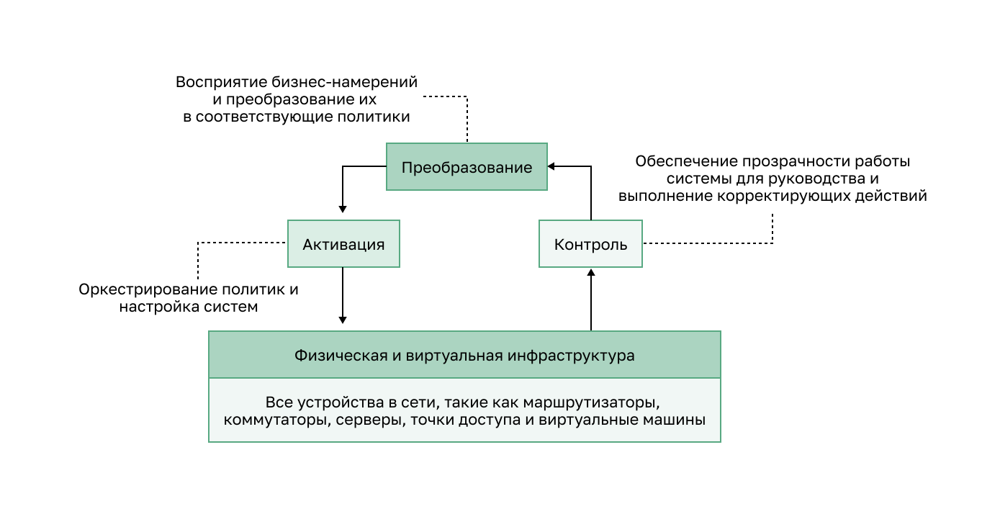

<!-- 14.6.1 -->
## Видео: Сети, управляемые на основе намерений

Центр архитектуры цифровой сети (Digital Network Architecture — DNA), разработанный компанией Cisco как реализация концепции "сети на основе намерений" является примером инструмента управления сетью на основе искуственного интеллекта.

Посмотрите видео Джона Апостолопулоса и Ананда Освала из Cisco, объясняющее, как искусственный интеллект и IBN могут улучшить сети.

<!-- 14.6.2 -->
## Обзор сетей на основе намерения

IBN — это развивающаяся отраслевая модель для следующего поколения сетей. IBN основывается на программно-определяемой сети (Software-Defined Networking — SDN), преобразуя аппаратно-ориентированный и ручной подход к проектированию и эксплуатации сетей в программно-ориентированный и полностью автоматизированный.

Бизнес-цели для сети выражены как намерения. IBN фиксирует бизнес-намерения и использует аналитику, машинное обучение и автоматизацию для непрерывного и динамического выравнивания сети по мере изменения потребностей бизнеса.

IBN фиксирует и преобразует деловые намерения в сетевые политики, которые можно автоматизировать и применять последовательно в сети.

Cisco рассматривает в IBN три основные функции: перевод, активация и контроль. Эти функции взаимодействуют с базовой физической и виртуальной инфраструктурой, как показано на рисунке.

<!-- /courses/ensa-dl/ae8eb39a-34fd-11eb-ba19-f1886492e0e4/aeb6adf0-34fd-11eb-ba19-f1886492e0e4/assets/c73c2ec0-1c46-11ea-af56-e368b99e9723.svg -->

* **Преобразование** — позволяет сетевому администратору выразить ожидаемое сетевое поведение, которое лучше всего соответствует деловым намерениям;
* **Активация** — внедряет намерения, интерпретированные в политики, в физическую и виртуальную сетевую инфраструктуру с помощью общесетевой автоматизации;
* **Контроль** — непрерывно проверяет и верифицирует намерения, чтобы удостовериться в их реализации в сети на постоянной основе.

<!--
На рисунке показаны три основные функции IB: преобразование, активация и контроль. На блок-схеме внизу находится Ыизическая и виртуальная сетевая инфраструктура. Это все устройства в сети: маршрутизаторы, коммутаторы, серверы, точки доступа и виртуальные машины. Из Физической и виртуальной сетевой инфраструктуры направлена стрелка  на Контроль. Он обеспечивает постоянное понимание руководства и выполнения корректирующих действий. Еще одна стрелка указывает от Контроля к Преобразованию. Оно фиксирует деловые намерения и переводит их в политики. Еще одна стрелка указывает от Преобразования к Активации. Она активирует политики оркестрации и настраивает системы. Последняя стрелка указывает от Активации до Физической и виртуальной сетевой инфраструктуры.
-->

<!-- 14.6.3 -->
## Сетевая инфраструктура как Фабрика

С точки зрения IN физическая и виртуальная сетевая инфраструктура — это фабрика. Фабрика (Fabric) — описает наложение, представляющее логическую топологию, используемую для виртуального подключения к устройствам, как показано на рисунке. Наложение (Overlay) ограничивает количество устройств, которые должен запрограммировать администратор сети. Он также предоставляет услуги и альтернативные методы пересылки, не контролируемые базовыми физическими устройствами. Например, наложение — это место, где происходят протоколы инкапсуляции, такие как IP security (IPsec) и Control and Provisioning of Wireless Access Points (CAPWAP). Используя решение IBN, сетевой администратор может указать через политики именно то, что происходит в плоскости управления наложением. Обратите внимание, что физическое подключение коммутаторов — не проблема наложения.

**Пример наложенной сети (Overlay network)**

<!-- /courses/ensa-dl/ae8eb39a-34fd-11eb-ba19-f1886492e0e4/aeb6adf0-34fd-11eb-ba19-f1886492e0e4/assets/c73ca3f2-1c46-11ea-af56-e368b99e9723.svg -->

<!--
На рисунке показан пример наложенной сети. Одно устройство доступа уровня 2 для конечных точек слева и еще два справа. Линия идет от одноуровневого устройства 2 к двухуровневым устройствам справа. Она изображает протоколы инкапсуляции. Пунктирная двухсторонняя стрелка указывает от одноуровневого устройства 2 к двухуровневым устройствам справа. Стрелка изображает плоскость управления наложением. 
-->

Подложенная сеть (underlay network) — это физическая топология, которая включает в себя все оборудование для достижения бизнес-целей. На рисунке подложенная сеть, которая показывает дополнительные устройства и указывает, как они подключены. Конечные точки, такие как серверы на рисунке, получают доступ к сети через устройства уровня 2. Плоскость управления подложкой отвечает за простые задачи пересылки.

**Пример подложенной сети (underlay network)**

<!-- /courses/ensa-dl/ae8eb39a-34fd-11eb-ba19-f1886492e0e4/aeb6adf0-34fd-11eb-ba19-f1886492e0e4/assets/c73cf213-1c46-11ea-af56-e368b99e9723.svg -->

<!--
На рисунке показан пример подложенной сети. Приведена топология. Сервер соединен с устройством уровня 2 для доступа к конечной точке. Устройство соединено с двумя устройствами маршрутизации уровня, связаными между собой. У каждого из них избыточные каналы связи с двумя другими устройствами уровня 2. Остальные коммутаторы уровня 2 связаны с сервером.
-->

<!-- 14.6.4 -->
## Архитектура цифровых сетей Cisco (DNA)

Cisco внедряет структуру IBN, используя DNA. Как показано на рисунке, бизнес-намерение безопасно развертывается в сетевой инфраструктуре (фабрике). Затем Cisco DNA непрерывно собирает данные из множества источников (устройств и приложений), чтобы предоставить обширный контекст информации. Затем эту информацию можно проанализировать, чтобы убедиться, что сеть работает безопасно на своем оптимальном уровне и в соответствии с бизнес-намерениями и сетевыми политиками.

**Cisco DNA: постоянное выполнение бизнес-намерений**

<!--
На рисунке изображена непрерывная реализация бизнес-целей Cisco DNA. На рисунке показана непрерывная блок-схема. Наверху — обучение, намерение, безопасность и контекст. Cisco DNA непрерывно собирает данные. Затем эту информацию можно проанализировать, чтобы убедиться, что сеть работает безопасно, на оптимальном уровне и в соответствии с бизнес-целями и политиками. В верхней части рисунка центр DNA имеет политику, автоматизацию и аналитику, а в нижней — сетевая инфраструктура на основе намерений включает коммутацию, маршрутизаторы и беспроводную связь.
-->

Cisco DNA — система, которая постоянно обучается и адаптируется к потребностям бизнеса. В таблице перечислены некоторые продукты и решения Cisco DNA.

| **Решения Cisco DNA** | **Описание** | **Преимущества** |
| --- | --- | --- |
| **Программно-определяемый доступ** | <ul><li>Первое основанное на намерениях корпоративное сетевое решение, построенное с использованием Cisco DNA.</li><li>Используется единая сетевая структура в локальной сети и в сети WLAN, чтобы создать согласованный и надежный пользовательский интерфейс.</li><li>Сегментирует трафик пользователей, устройств и приложений и автоматизирует политики доступа пользователей, чтобы установить правильную политику для любого пользователя или устройства с любым приложением в сети. </li></ul> | Предоставляет доступ к сети за считанные минуты любому пользователю или устройству для любого приложения без ущерба безопасности. |
| **SD-WAN** | <ul><li>Использует безопасную облачную архитектуру для централизованного управления WAN-соединениями.</li><li>Это упрощает и ускоряет доставку безопасных, гибких и многофункциональных услуг WAN для подключения центров обработки данных, филиалов, кампусов и средств размещения.</li></ul> | <ul><li>Обеспечивает удобство работы пользователей с приложениями запущенными локально и в облаке </li><li>Добивается большей гибкости и экономии затрат за счет упрощения развертывания и независимости транспорта.</li></ul> |
| **Cisco DNA Assurance** | <ul><li>Используется для устранения неполадок и повышения производительности IT.</li><li>Применяет расширенную аналитику и машинное обучение для повышения производительности и разрешения проблем, а также прогнозирование для гарантии производительности сети.</li><li>Делает уведомления в режиме реального времени для условий сети, которые требуют внимания.</li></ul> | <ul><li>Позволяет идентифицировать основные причины и предлагает варианты исправлений для более быстрого устранения неполадок. </li><li>Cisco DNA Center предоставляет простую в использовании единую панель мониторинга с возможностями анализа и детализации. </li><li>Машинное обучение постоянно улучшает сетевой интеллект для прогнозирования проблем до их возникновения.</li></ul> |
| **Безопасность Cisco DNA**  | <ul><li>Обеспечивает эффективный мониторинг, используя сеть в качестве датчика для получения сведений и анализа в реальном времени. </li><li>Это обеспечивает расширенный детальный контроль для реализации политики и сдерживания угроз по всей сети.</li></ul> | <ul><li>Уменьшение риска и защита организации от угроз — даже в зашифрованном трафике. </li><li>Обеспечивает эффективный мониторинг с 360-градусным обзором благодаря аналитике в реальном времени для глубокой разведки в сети. </li><li>Снижение сложности благодаря сквозной безопасности.</li></ul> |

Это не взаимоисключающие решения. Например, все четыре решения могут быть развернуты организацией.

Многие из них реализованы с использованием Cisco DNA Center, который предоставляет программную панель мониторинга для управления корпоративной сетью.

<!-- 14.6.5 -->
## Cisco DNA Center

Cisco DNA Center — это базовый контроллер и аналитическая платформа, на которых основано решение Cisco DNA. Он поддерживает выражение намерения для нескольких вариантов использования, включая базовые возможности автоматизации, предоставление структуры и сегментацию на основе политик в сети предприятия. Cisco DNA Center — это центр управления сетями и командный центр для подготовки и настройки сетевых устройств. Это аппаратная и программная платформа, обеспечивающая «единый интерфейс», ориентированный на обеспечение достоверности, аналитику и автоматизацию.

Страница запуска интерфейса DNA Center предоставляет общую сводку состояния и снимок сети, как показано на рисунке. Отсюда администратор сети может быстро перейти к интересующим областям.

<!--
На рисунке показана страница запуска интерфейса DNA Center. На стартовой странице DNA представлена общая сводка о работоспособности и снимок сети. Вкладки меню: «Дизайн», «Политика», «Предоставление», «Гарантия» и «Платформа». Сводка работоспособности показывает, что за последние 24 часа 87 % сетевых устройств исправны, 90 % беспроводных клиентов исправны и 98 % проводных клиентов исправны. Она также дает снимок сети. На нем все сайты, сетевые устройства, политики приложений, сетевые профили, образы и устройства с лицензией DNA.
-->

Вверху меню обеспечивает доступ к пяти основным областям DNA-центра:

* **Проект** — моделирует всю сеть, от сайтов и зданий до устройств и каналов связи, как физических, так и виртуальных, в пределах кампуса, филиала, глобальной сети и облака;
* **политики** — автоматизируют и упрощают управление сетью, снижают затраты и риски, а также ускоряют развертывание новых и улучшенных услуг;
* **обеспечение** — предоставление пользователям новых услуг с легкостью, скоростью и безопасностью в корпоративной сети, независимо от ее размера и сложности;
* **контроль** — упреждающий мониторинг и информация из сети, устройств и приложений для быстрого прогнозирования проблемы и гарантии, что изменения политики и конфигурации соответствуют бизнес-целям и пожеланиям пользователей;
* **платформа** — API-интерфейсы для интеграции с предпочитаемыми IT-системами, чтобы создавать комплексные решения и добавлять поддержку устройств разных производителей.

<!-- 14.6.6 -->
## Видео: Обзор DNA Центра и API платформы 

Это первая часть серии из четырех статей, демонстрирующих DNA-центр Cisco.

Часть первая — обзор графического интерфейса Cisco DNA Center. Он включает в себя инструменты проектирования, политики, контроля и обеспечения, используемые для управления несколькими сайтами и несколькими устройствами.

<!-- 14.6.7 -->
## Видео: Проектирование DNA Center и обеспечение

Это вторая часть серии из четырех статей, демонстрирующих DNA-центр Cisco.

Часть вторая — обзор областей проектирования и обеспечения Cisco DNA Center.

<!-- 14.6.8 -->
## Видео: Политики DNA Center и контроль

Это третья часть серии из четырех статей, демонстрирующих DNA-центр Cisco.

Часть третья — области политики и гарантии Cisco DNA Center.

<!-- 14.6.9 -->
## Видео: DNA Center Устранение неполадок при подключении пользователя

Это четвертая часть серии из четырех статей, демонстрирующих DNA-центр Cisco.

Часть четвертая — как использовать Cisco DNA Center для устранения неполадок в устройствах.

<!-- 14.6.10 -->
<!-- quiz -->

