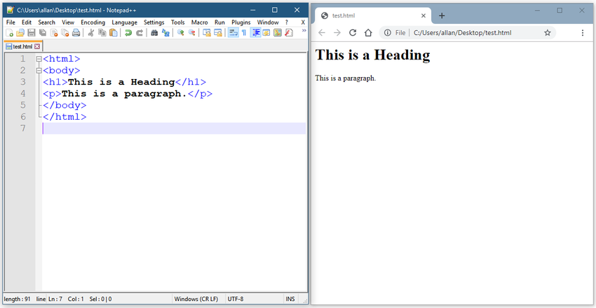

<!-- 14.2.1 -->
## Видео: Форматы данных

Умные устройства - это, по сути, крошечные компьютеры. Чтобы интеллектуальное устройство, например исполнительный механизм, реагировало на изменяющиеся условия, оно должно иметь возможность принимать и интерпретировать информацию, отправляемую ему другим интеллектуальным устройством, таким как датчик. Эти два интеллектуальных устройства должны иметь общий «язык», который называется форматом данных. Общие форматы данных также используются другими устройствами в сети.

Нажмите кнопку Воспроизведения в видео, чтобы узнать о форматах данных.


<!-- 14.2.2 -->
## Концепция форматов данных

При обмене данными с людьми возможности отображения этой информации практически безграничны. Например, подумайте, как ресторан может представить свое меню. Это может быть только текст, маркированный список, или фотографии с подписями, или просто фотографии.  Это все разные способы, ресторан может форматировать данные, из которых составляют меню. Чем лучше продуманна форма представления информации, тем она наиболее понятна целевой аудитории. Этот же принцип применяется к общим данным между компьютерами. Компьютер должен поместить данные в формат, понятный другому компьютеру.

Форматы данных - это просто способ хранения и обмена данными в структурированном формате. Один из таких форматов Hypertext Markup Language (HTML). HTML является стандартным языком разметки для описания структуры веб-страниц, как показано на рисунке.



<!--
The figure show an example of HTML code and the output on a webpage. On the left there is HTML code beginning with &lt;html&gt; and &lt;&lt;body&gt; then a heading using &lt;h1&gt; with the text This is a Heading and closing with &lt;/h1&gt;. Below the heading is a paragraph using &lt;p&gt; the text This is a paragraph and closing with &lt;/p&gt;. The code is then closed with &lt;/body&gt; and &lt;/html&gt;. On the right the figure shows the HTML output on a webpage. The webpage has the text This is a Heading and This is a paragraph. 
-->

Вот некоторые распространенные форматы данных, которые используются во многих приложениях, включая автоматизацию сети и программируемость:

* JavaScript Object Notation (JSON) 
* eXtensible Markup Language (XML) 
* YAML Ain’t Markup Language (YAML) 

Выбранный формат данных будет зависеть от формата, используемого приложением, инструментом или скриптом, которые вы используете. Многие системы смогут поддерживать более одного формата данных, что позволяет пользователю выбирать формат.

<!-- 14.2.3 -->
## Правила формата данных

Форматы данных имеют правила и структуру, аналогичные тем, которые мы имеем в программировании и письменных языках. Каждый формат данных будет иметь определенные характеристики:

* Синтаксис, который включает типы используемых скобок, такие как [\], (), {}, использование пробелов или отступов, кавычек, запятых и т. д.
* Как должны быть представлены объекты, такие как символы, строки, списки и массивы.
* Как должны быть представлены пары ключ/значение. Ключ обычно находится слева, и он идентифицирует или описывает данные. Значение справа представляет собой сами данные и может быть символом, строкой, числом, списком или данными другого типа.

Поищите в Интернете «найти местоположение МКС в настоящее время», чтобы найти веб-сайт, который отслеживает текущее местоположение Международной космической станции. На этом веб-сайте вы можете увидеть, как используются форматы данных и некоторые сходства между ними. Этот веб-сайт содержит ссылку для простого обращения интерфейса прикладного программирования (API) к серверу, который возвращает текущую широту и долготу космической станции вместе с меткой времени UNIX. В следующем примере показана информация, возвращаемая сервером с использованием JavaScript Object Notation (JSON). Информация отображается в необработанном формате. Это может затруднить понимание структуры данных.

```
{"message": "success", "timestamp": 1560789216, "iss_position": {"latitude": "25.9990", "longitude": "-132.6992"}}
```

Выполните поиск в Интернете, чтобы найти расширение для браузера «JSONView» или любое другое расширение, которое позволит вам просматривать JSON в более удобочитаемом формате. Объекты данных отображаются в парах ключ/значение. Следующий вывод показывает тот же вывод с использованием JSONView. Пары ключ/значение гораздо проще интерпретировать. В приведенном ниже примере вы можете увидеть ключ - **широту**  и его значение **25.9990**.

```
{
	"message": "success",
	"timestamp": 1560789260,
	"iss_position": {
		"latitude": "25.9990",
		"longitude": "-132.6992"
	}
}
```

**Примечание:** JSONView может удалить кавычки с ключа. Кавычки необходимы при кодировании в формате JSON пар ключ/значение.

<!-- 14.2.4 -->
## Сравнение форматов данных

Чтобы увидеть те же данные в формате XML или YAML, поищите в Интернете инструмент преобразования JSON. На этом этапе не так важно понимать детали каждого формата данных, но обратите внимание, как каждый формат данных использует синтаксис и как представлены пары ключ/значение.

**Формат JSON**

```
{
	"message": "success",
	"timestamp": 1560789260,
	"iss_position": {
		"latitude": "25.9990",
		"longitude": "-132.6992"
	}
}
```

**Формат YAML**

```
message: success
timestamp: 1560789260
iss_position:
    latitude: '25.9990'
    longitude: '-132.6992'
```

**Формат XML**

```
<?xml version="1.0" encoding="UTF-8" ?>
<root>
  <message>success</message>
  <timestamp>1560789260</timestamp>
  <iss_position>
    <latitude>25.9990</latitude>
    <longitude>-132.6992</longitude>
  </iss_position>
</root>
```

<!-- 14.2.5 -->
## Формат данных JSON

JSON - это читаемый человеком формат данных, используемый приложениями для хранения, передачи и чтения данных. JSON - очень популярный формат, используемый веб-сервисами и API для предоставления общедоступных данных. Это потому, что его легко анализировать, и его можно использовать с большинством современных языков программирования, включая Python.

Следующий вывод показывает пример частичного вывода в IOS команды **show interface GigabitEthernet0/0/0** на маршрутизаторе.

**Вывод маршрутизатора**

```
GigabitEthernet0/0/0 is up, line protocol is up (connected)
  Description: Wide Area Network
  Internet address is 172.16.0.2/24
```

Эта же информация может быть представлена в формате JSON. Обратите внимание, что каждый объект (каждая пара ключ/значение) представляет собой отдельный фрагмент данных об интерфейсе, включая его имя, описание и то, включен ли интерфейс.

**Вывод JSON**

```
{
    "ietf-interfaces:interface": {
         "name": "GigabitEthernet0/0/0",
         "description": "Wide Area Network",
         "enabled": true,
         "ietf-ip:ipv4": {
             "address": [
                 {
                     "ip": "172.16.0.2",
                     "netmask": "255.255.255.0"
                 }
             ]
          }
    }
}
```

<!-- 14.2.6 -->
## Правила синтаксиса JSON

Вот некоторые из характеристик JSON:

* Он использует иерархическую структуру и содержит вложенные значения.
* Он использует фигурные скобки { } для хранения объектов и квадратные скобки \[ \] для хранения массивов.
* Его данные записываются в виде пар ключ/значение.

В JSON данные, известные как объект, представляют собой одну или несколько пар ключ/значение, заключенных в фигурные скобки { }. Синтаксис для объекта JSON включает в себя:

* Ключи должны быть строками в двойных кавычках " ".
* Значения должны быть допустимым типом данных JSON (строка, число, массив, логический, нулевой или другой объект).
* Ключи и значения разделяются двоеточием.
* Несколько пар ключ/значение внутри объекта разделяются запятыми.
* Пробел не имеет значения.

Иногда ключ может содержать более одного значения. Это массив. Массив в JSON представляет собой упорядоченный список значений. Характеристики массивов в JSON включают в себя:

* За ключом следует двоеточие и список значений в квадратных скобках  \[ \].
* Массив представляет собой упорядоченный список значений.
* Массив может содержать несколько типов значений, включая строку, число, логическое значение, объект или другой массив внутри массива.
* Каждое значение в массиве отделяется запятой.

Например, список адресов IPv4 может выглядеть следующим образом. Ключ - “addresses”. Каждый элемент в списке является отдельным объектом, разделенным фигурными скобками { }. Объектами являются две пары ключ/значение: адрес IPv4 («ip») и маска подсети («netmask»), разделенные запятой. Массив объектов в списке также разделяется запятой после закрывающей скобки для каждого объекта.

**Список адресов IPv4 в формате JSON**

```
{
  "addresses": [
    {
      "ip": "172.16.0.2",
      "netmask": "255.255.255.0"
    },
    {
      "ip": "172.16.0.3",
      "netmask": "255.255.255.0"
    },
    {
      "ip": "172.16.0.4",
      "netmask": "255.255.255.0"
    }
  ]
}
```

<!-- 14.2.7 -->
## Формат данных YAML

YAML - это другой тип читаемого человеком формата данных, используемый приложениями для хранения, передачи и чтения данных. Некоторые характеристики YAML:

* Похож на JSON и считается надмножеством JSON.
* YAML имеет минималистский формат, облегчающий чтение и запись.
* Он использует отступ для определения своей структуры, без использования скобок или запятых.

Например, посмотрите на этот вывод JSON для интерфейса Gigabit Ethernet 2.

**JSON для GigabitEthernet2**

```
{
   "ietf-interfaces:interface": {
      "name": "GigabitEthernet2",
      "description": "Wide Area Network",
      "enabled": true,
      "ietf-ip:ipv4": {
         "address": [
            {
               "ip": "172.16.0.2",
               "netmask": "255.255.255.0"
            },
            {
               "ip": "172.16.0.3",
               "netmask": "255.255.255.0"
            },
            {
               "ip": "172.16.0.4",
               "netmask": "255.255.255.0"
            }
         ]
      }
   }
}
```

Эти же данные в формате YAML легче читать. Подобно JSON, объект YAML представляет собой одну или несколько пар ключ-значение. Пары ключ-значение отделяются двоеточием без использования кавычек. В YAML дефис используется для разделения каждого элемента в списке. Это показано для трех адресов IPv4 в следующем выводе.

**YAML для GigabitEthernet2**

```
ietf-interfaces:interface:
  name: GigabitEthernet2
  description: Wide Area Network
  enabled: true
  ietf-ip:ipv4:
    address:
    - ip: 172.16.0.2
      netmask: 255.255.255.0
    - ip: 172.16.0.3
      netmask: 255.255.255.0
    - ip: 172.16.0.4
      netmask: 255.255.255.0
```

<!-- 14.2.8 -->
## Формат данных XML

XML - это еще один тип читаемого человеком формата данных, который используется для хранения, передачи и чтения данных приложениями. Некоторые из характеристик XML:

* Это похоже на HTML, который является стандартизированным языком разметки для создания веб-страниц и веб-приложений.
* XML самоописательный. Он заключает данные в связанный набор тегов: **\<tag>data\</tag>**
* В отличие от HTML, XML не использует предопределенные теги или структуру документа.

Объекты XML - это одна или несколько пар ключ/значение, в качестве имени ключа используется начальный тег: **\<key>value\</key>**

Следующий вывод показывает те же данные для GigabitEthernet2, отформатированные как структура данных XML. Обратите внимание, как значения заключены в теги объекта. В этом примере каждая пара ключ/значение находится на отдельной строке, а некоторые строки имеют отступ. Это не обязательно, но сделано для удобства чтения. Список использует повторяющиеся экземпляры **\<tag>\</tag>** для каждого элемента в списке.  Элементы в этих повторяющихся экземплярах представляют одну или несколько пар ключ/значение.

**XML для GigabitEthernet2**

```
<?xml version="1.0" encoding="UTF-8" ?>
<ietf-interfaces:interface>
  <name>GigabitEthernet2</name>
  <description>Wide Area Network</description>
  <enabled>true</enabled>
  <ietf-ip:ipv4>
    <address>
      <ip>172.16.0.2</ip>
      <netmask>255.255.255.0</netmask>
    </address>
    <address>
      <ip>172.16.0.3</ip>
      <netmask>255.255.255.0</netmask>
    </address>
    <address>
      <ip>172.16.0.4</ip>
      <netmask>255.255.255.0</netmask>
    </address>
  </ietf-ip:ipv4>
</ietf-interfaces:interface>
```

<!-- 14.2.9 -->
<!-- quiz -->

